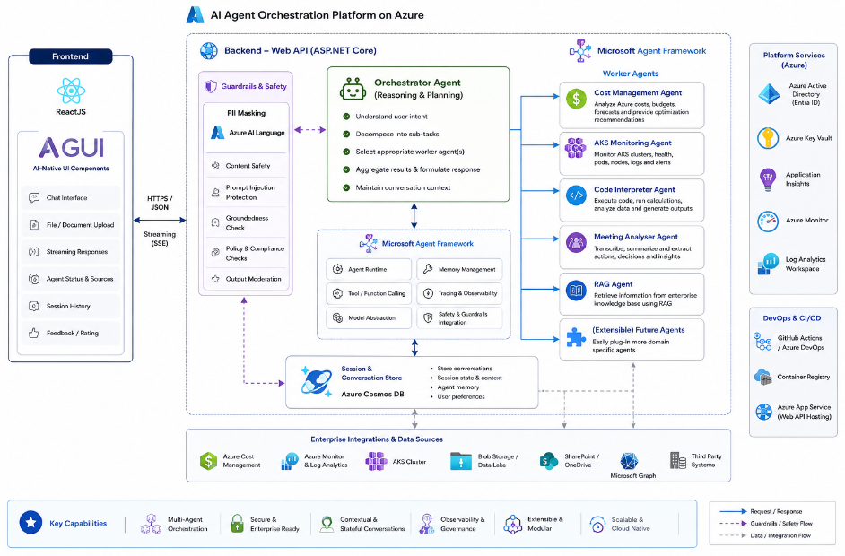

## All-In-All

It is a web application that showcase capabilities like

- Multi-agent
- Multiturn conversation

## Project Structure

```bash
all-in-all/
│
├── frontend/ # Frontend Application in ReactJS, Bootstrap, CSS Grid, NodeJS, Axios
│
├── ai_agent/ # AI Agent in C#
│
├── backendexpress/ # Backend API in NodeJS, Express, TypeScript
│
├── backendpyton/ # AI Agent in Python
│
├── infrastructure_terraform/ # Terraform Menifests
│
├── infrastructure_cdk/ # CDK Menifests
│
├── helm/ # Helm Chart
│
├── gitops/ # GitOps using ArgoCD
```

## Architecture



## Local Setup

**Prerequisites**

You need to have docker desktop running on local machine

**Setup Steps**

- cd all-in-all

**Build images**

```
$ cd all-in-all
$ docker compose down
$ docker compose build OR %module% --no-cache
$ docker compose up


$ docker images
$ docker rmi %image%
```

## IAM Roles

Service Principal Roles required for (add details in .env for local setup)

- Orchestrator.Api
  - CosmosDB Data Reader
  - CosmosDB Operator
  - Cosmos DB Built-in Data Contributor (Not available Azure UI : Ref. CosmosDB Document)
  - Reader

- CostManagement.MCP
  - Cost Management Reader
  - Advisor Reader
