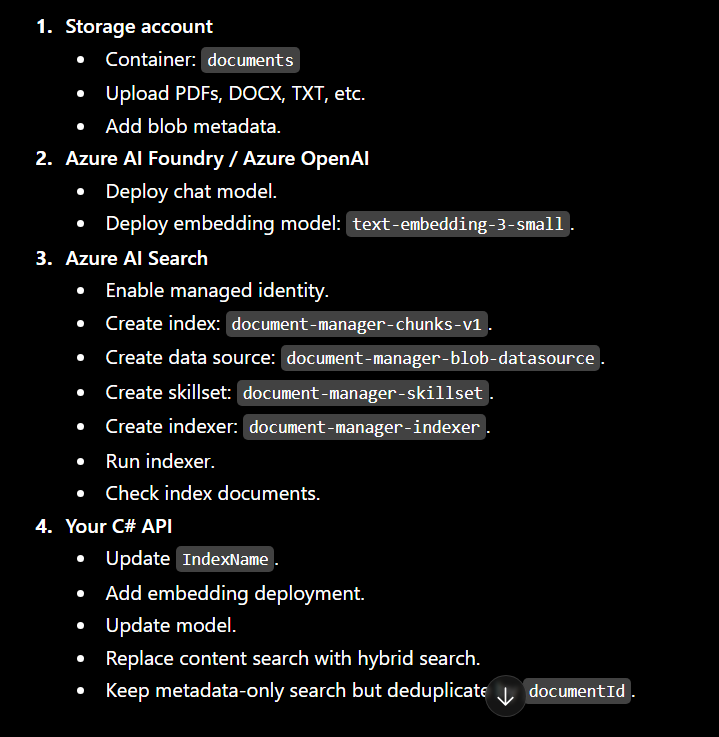

## Overview

A metadata-driven Retrieval Augmented Generation (RAG) Agent. Here metadata is often more valuable than the document content itself because it allows the AI to retrieve the right documents before asking the LLM to generate an answer.

The agent uses Azure AI Search as a vector database and returns both metadata and a content snippet to the LLM.

## Tools Used

- Azure AI Search
- Azure Data Lake storage
- Azure Foundry
- Text-embedding-ada-003 LLM Model
- GPT-5-Mini LLM Model

## RAG Flow

```
Question
      │
      ▼
Azure AI Search
      │
Find Relevant Documents
      │
      ▼
     LLM
      │
Grounded Answer
```

Azure AI Search is responsible for retrieval.

The LLM is responsible for reasoning and generation.

## Why Meta-data based RAG not Content based RAG

Content based search is expensive and often inaccurate.

Meta-data based search reduce the search space, dramatically faster and more accurate.

## IAM roles assigned to Managed Identity for access to Azure AI Search

| Role                          | Purpose                                          |
| ----------------------------- | ------------------------------------------------ |
| Search Index Data Reader      | Query/search documents only                      |
| Search Index Data Contributor | Read, write, upload, delete documents            |
| Search Service Contributor    | Manage indexes, indexers, skillsets, datasources |
| Contributor                   | Full resource management (broader Azure role)    |

## IAM roles for Storage Account

- Storage Blob Data Reader
- Reader

## For uploads/downloads:

- Storage Blob Data Contributor

#

For your current app, I’d implement this as one chunk-level Azure AI Search index with parent document metadata repeated on every chunk. Your current C# app already searches Azure AI Search through SearchClient, selects metadata fields, and exposes two tools: content search and metadata-only search . We will upgrade that to metadata + text + vector hybrid search.

## Target architecture

```
Azure Blob / Data Lake container
        ↓
Azure AI Search Data Source
        ↓
Indexer
        ↓
Skillset
   - document cracking
   - chunking
   - embedding generation
        ↓
Chunk-level Search Index
   - metadata fields
   - chunk text
   - vector field
        ↓
Your C# agent
   - metadata search
   - text search
   - hybrid search
```

Azure AI Search index projections are designed for parent-child scenarios where one source document becomes many chunk documents in the target index. They map enriched chunk data and parent metadata into the search index

## 1. Recommended index design

Create a new index, not modify the old one:

```
document-manager-chunks-v1
```

Each row/document in this index represents one chunk, not one original file.

**Fields**

| Field            | Purpose                          |
| ---------------- | -------------------------------- |
| `id`             | Unique chunk key                 |
| `documentId`     | Parent document id               |
| `chunkId`        | Chunk identifier                 |
| `content`        | Chunk text                       |
| `contentVector`  | Embedding vector                 |
| `fileName`       | Parent file name                 |
| `documentType`   | Contract, policy, invoice, etc.  |
| `customer`       | Customer metadata                |
| `project`        | Project metadata                 |
| `department`     | Department metadata              |
| `owner`          | Owner metadata                   |
| `status`         | Approved, Draft, Archived        |
| `workflowState`  | Draft, In Review, Approved, etc. |
| `retentionClass` | Compliance/retention class       |
| `blobPath`       | Source blob path                 |
| `createdDate`    | Created date                     |
| `modifiedDate`   | Modified date                    |
| `expiryDate`     | Expiry date                      |
| `pageNumber`     | Optional                         |
| `chunkNumber`    | Chunk order                      |

Hybrid search needs both a searchable text field and a vector field in the same index. Azure AI Search executes keyword and vector queries together and merges results using Reciprocal Rank Fusion.

## 2. Portal steps

2. Portal steps

**A. Create Azure AI Search resource**

In Azure Portal:

Create or open Azure AI Search.

- Use at least a tier that supports vector search.
- Enable managed identity:
- Search service → Identity
- System assigned → On

**B. Create or confirm Azure AI Foundry / Azure OpenAI embedding deployment**

You need an embedding model deployment, for example:

text-embedding-3-small

Recommended deployment name:

text-embedding-3-small

The Azure OpenAI Embedding skill can generate embeddings during indexing from a model deployed in Azure OpenAI in Foundry Models or a Microsoft Foundry project.

**C. Grant permissions**

Grant the Azure AI Search managed identity access to:

Storage account:

- Role: Storage Blob Data Reader

Azure OpenAI / Foundry model resource:

- Role: Cognitive Services OpenAI User

This lets the indexer read files and call the embedding model.

## 3. Create the chunk index

Use REST from VS Code, Postman, or Azure CLI.

Set variables:

```
@searchService = YOUR_SEARCH_SERVICE_NAME
@apiKey = YOUR_SEARCH_ADMIN_KEY
@indexName = document-manager-chunks-v1
@apiVersion = 2025-09-01
```

## Create index

```
PUT https://{{searchService}}.search.windows.net/indexes/{{indexName}}?api-version={{apiVersion}}
Content-Type: application/json
api-key: {{apiKey}}

{
  "name": "document-manager-chunks-v1",
  "fields": [
    { "name": "id", "type": "Edm.String", "key": true, "filterable": true, "analyzer": "keyword" },
    { "name": "documentId", "type": "Edm.String", "filterable": true, "searchable": false },
    { "name": "chunkId", "type": "Edm.String", "filterable": true, "searchable": false },

    { "name": "content", "type": "Edm.String", "searchable": true, "retrievable": true },

    {
      "name": "contentVector",
      "type": "Collection(Edm.Single)",
      "searchable": true,
      "retrievable": false,
      "dimensions": 1536,
      "vectorSearchProfile": "vector-profile"
    },

    { "name": "fileName", "type": "Edm.String", "searchable": true, "filterable": true, "sortable": true },
    { "name": "documentType", "type": "Edm.String", "filterable": true, "facetable": true },
    { "name": "customer", "type": "Edm.String", "filterable": true, "facetable": true },
    { "name": "project", "type": "Edm.String", "filterable": true, "facetable": true },
    { "name": "department", "type": "Edm.String", "filterable": true, "facetable": true },
    { "name": "owner", "type": "Edm.String", "filterable": true, "facetable": true },
    { "name": "status", "type": "Edm.String", "filterable": true, "facetable": true },
    { "name": "workflowState", "type": "Edm.String", "filterable": true, "facetable": true },
    { "name": "retentionClass", "type": "Edm.String", "filterable": true, "facetable": true },

    { "name": "blobPath", "type": "Edm.String", "filterable": true, "retrievable": true },

    { "name": "createdDate", "type": "Edm.DateTimeOffset", "filterable": true, "sortable": true },
    { "name": "modifiedDate", "type": "Edm.DateTimeOffset", "filterable": true, "sortable": true },
    { "name": "expiryDate", "type": "Edm.DateTimeOffset", "filterable": true, "sortable": true },

    { "name": "pageNumber", "type": "Edm.Int32", "filterable": true, "sortable": true },
    { "name": "chunkNumber", "type": "Edm.Int32", "filterable": true, "sortable": true }
  ],
  "vectorSearch": {
    "algorithms": [
      {
        "name": "hnsw-config",
        "kind": "hnsw",
        "hnswParameters": {
          "metric": "cosine",
          "m": 4,
          "efConstruction": 400,
          "efSearch": 500
        }
      }
    ],
    "profiles": [
    {
      "name": "vector-profile",
      "algorithm": "hnsw-config",
      "vectorizer": "azure-openai-vectorizer"
    }
  ],
      "vectorizers": [
      {
            "name": "azure-openai-vectorizer",
            "kind": "azureOpenAI",
            "azureOpenAIParameters": {
            "resourceUri": "https://foundryallinalldev007.services.ai.azure.com",
            "deploymentId": "text-embedding-3-small",
            "modelName": "text-embedding-3-small",
            "apiKey": "ENTER_KEY"
            }
      }
      ],
      "compressions": []
  },
  "semantic": {
    "configurations": [
      {
        "name": "semantic-config",
        "prioritizedFields": {
        "titleField": {
            "fieldName": "fileName"
        },
        "prioritizedContentFields": [
            {
            "fieldName": "content"
            }
        ],
        "prioritizedKeywordsFields": [
            {
            "fieldName": "customer"
            },
            {
            "fieldName": "project"
            },
            {
            "fieldName": "documentType"
            }
        ]
        }
      }
    ]
  }
}
```

1536 is correct for text-embedding-3-small. If you use text-embedding-3-large, use the dimension configured for that deployment.

## 4. Metadata storage strategy

For portal/indexer-based ingestion, metadata should ideally be stored as blob metadata.

Example blob metadata:

```
documentId = contract-001
documentType = Contract
customer = Contoso
project = ERP Migration
department = Legal
owner = Sarah
status = Approved
workflowState = Approved
retentionClass = SevenYears
createdDate = 2025-01-10T00:00:00Z
expiryDate = 2032-01-10T00:00:00Z
```

Azure AI Search indexers can map blob metadata fields into index fields.

## 5. Create data source

```
PUT https://{{searchService}}.search.windows.net/datasources/document-manager-blob-datasource?api-version={{apiVersion}}
Content-Type: application/json
api-key: {{apiKey}}

{
  "name": "document-manager-blob-datasource",
  "type": "azureblob",
  "credentials": {
    "connectionString": "ResourceId=/subscriptions/YOUR_SUBSCRIPTION_ID/resourceGroups/YOUR_RG/providers/Microsoft.Storage/storageAccounts/YOUR_STORAGE_ACCOUNT;"
  },
  "container": {
    "name": "documents"
  },
  "dataChangeDetectionPolicy": {
    "@odata.type": "#Microsoft.Azure.Search.HighWaterMarkChangeDetectionPolicy",
    "highWaterMarkColumnName": "metadata_storage_last_modified"
  },
  "dataDeletionDetectionPolicy": {
    "@odata.type": "#Microsoft.Azure.Search.NativeBlobSoftDeleteDeletionDetectionPolicy"
  }
}
```

When your source supports change tracking and deletion detection, indexers can pick up source changes and update projected chunks during the next run

## 6. Create skillset with chunking + embeddings + index projection

This is the key part.

```
PUT https://{{searchService}}.search.windows.net/skillsets/document-manager-skillset?api-version={{apiVersion}}
Content-Type: application/json
api-key: {{apiKey}}

{
  "name": "document-manager-skillset",
  "description": "Chunk documents, generate embeddings, and project chunk documents with parent metadata.",
  "skills": [
    {
      "@odata.type": "#Microsoft.Skills.Text.SplitSkill",
      "name": "split-content",
      "description": "Split document content into chunks.",
      "context": "/document",
      "textSplitMode": "pages",
      "maximumPageLength": 2000,
      "pageOverlapLength": 300,
      "maximumPagesToTake": 0,
      "inputs": [
        {
          "name": "text",
          "source": "/document/content"
        }
      ],
      "outputs": [
        {
          "name": "textItems",
          "targetName": "pages"
        }
      ]
    },
    {
      "@odata.type": "#Microsoft.Skills.Text.AzureOpenAIEmbeddingSkill",
      "name": "generate-content-embeddings",
      "description": "Generate vector embeddings for each chunk.",
      "context": "/document/pages/*",
      "resourceUri": "https://foundryallinalldev007.services.ai.azure.com",
      "deploymentId": "text-embedding-3-small",
      "modelName": "text-embedding-3-small",
      "dimensions": 1536,
      "apiKey": "ENTER_KEY",
      "inputs": [
        {
          "name": "text",
          "source": "/document/pages/*"
        }
      ],
      "outputs": [
        {
          "name": "embedding",
          "targetName": "contentVector"
        }
      ]
    }
  ],
  "indexProjections": {
    "selectors": [
      {
        "targetIndexName": "document-manager-chunks-v1",
        "parentKeyFieldName": "documentId",
        "sourceContext": "/document/pages/*",
        "mappings": [
          {
            "name": "content",
            "source": "/document/pages/*"
          },
          {
            "name": "contentVector",
            "source": "/document/pages/*/contentVector"
          },
          {
            "name": "fileName",
            "source": "/document/metadata_storage_name"
          },
          {
            "name": "blobPath",
            "source": "/document/metadata_storage_path"
          },
          {
            "name": "documentType",
            "source": "/document/documentType"
          },
          {
            "name": "customer",
            "source": "/document/customer"
          },
          {
            "name": "project",
            "source": "/document/project"
          },
          {
            "name": "department",
            "source": "/document/department"
          },
          {
            "name": "owner",
            "source": "/document/owner"
          },
          {
            "name": "status",
            "source": "/document/status"
          },
          {
            "name": "workflowState",
            "source": "/document/workflowState"
          },
          {
            "name": "retentionClass",
            "source": "/document/retentionClass"
          },
          {
            "name": "createdDate",
            "source": "/document/createdDate"
          },
          {
            "name": "expiryDate",
            "source": "/document/expiryDate"
          },
          {
            "name": "modifiedDate",
            "source": "/document/metadata_storage_last_modified"
          }
        ]
      }
    ],
    "parameters": {
      "projectionMode": "skipIndexingParentDocuments"
    }
  }
}
```

Index projections map enriched data to chunk-level documents. The sourceContext controls the granularity, and mappings copy both chunk data and parent metadata into each indexed chunk

## 7. Create indexer

```
PUT https://{{searchService}}.search.windows.net/indexers/document-manager-indexer-v1?api-version={{apiVersion}}
Content-Type: application/json
api-key: {{apiKey}}

{
  "name": "document-manager-indexer-v1",
  "dataSourceName": "document-manager-blob-datasource",
  "targetIndexName": "document-manager-chunks-v1",
  "skillsetName": "document-manager-skillset",
  "schedule": {
    "interval": "PT1H"
  },
  "parameters": {
    "configuration": {
      "dataToExtract": "contentAndMetadata",
      "parsingMode": "default",
      "failOnUnsupportedContentType": false,
      "failOnUnprocessableDocument": false
    }
  },
  "fieldMappings": [
    {
      "sourceFieldName": "metadata_storage_path",
      "targetFieldName": "id",
      "mappingFunction": {
        "name": "base64Encode"
      }
    }
  ]
}

```

**Run it:**

```
POST https://{{searchService}}.search.windows.net/indexers/document-manager-indexer/run?api-version={{apiVersion}}
api-key: {{apiKey}}
```

**Check Status**

```
GET https://{{searchService}}.search.windows.net/indexers/document-manager-indexer/status?api-version={{apiVersion}}
api-key: {{apiKey}}
```

## 8. Important note about id

For chunked projections, you usually want each chunk to have a unique key. Azure AI Search projections can generate child keys, but if your key setup causes duplicate ids, use a custom ingestion pipeline or include chunk number in the generated key.

Recommended chunk id pattern:

```
{documentId}-{chunkNumber}
```

If the portal/indexer approach becomes limiting, switch to custom ingestion for key generation.

## 9. Update your appsettings

```
{
  "AzureOpenAI": {
    "Endpoint": "https://YOUR_OPENAI_OR_FOUNDRY_RESOURCE.openai.azure.com/",
    "DeploymentName": "gpt-4o-mini",
    "EmbeddingDeploymentName": "text-embedding-3-small"
  },
  "AzureSearch": {
    "Endpoint": "https://YOUR_SEARCH_SERVICE.search.windows.net",
    "IndexName": "document-manager-chunks-v1"
  },
  "Storage": {
    "AccountName": "YOUR_STORAGE_ACCOUNT"
  }
}
```

## 10. Update your C# model

Your current code uses fields like Content, DocumentId, FileName, Customer, Status, etc. Update your model to match the new chunk index.

```
using System.Text.Json.Serialization;

namespace DocumentManager.Api.Models;

public class SearchDocument
{
    [JsonPropertyName("id")]
    public string? Id { get; set; }

    [JsonPropertyName("documentId")]
    public string? DocumentId { get; set; }

    [JsonPropertyName("chunkId")]
    public string? ChunkId { get; set; }

    [JsonPropertyName("content")]
    public string? Content { get; set; }

    [JsonPropertyName("fileName")]
    public string? FileName { get; set; }

    [JsonPropertyName("documentType")]
    public string? DocumentType { get; set; }

    [JsonPropertyName("customer")]
    public string? Customer { get; set; }

    [JsonPropertyName("project")]
    public string? Project { get; set; }

    [JsonPropertyName("department")]
    public string? Department { get; set; }

    [JsonPropertyName("owner")]
    public string? Owner { get; set; }

    [JsonPropertyName("status")]
    public string? Status { get; set; }

    [JsonPropertyName("workflowState")]
    public string? WorkflowState { get; set; }

    [JsonPropertyName("retentionClass")]
    public string? RetentionClass { get; set; }

    [JsonPropertyName("blobPath")]
    public string? BlobPath { get; set; }

    [JsonPropertyName("createdDate")]
    public DateTimeOffset? CreatedDate { get; set; }

    [JsonPropertyName("modifiedDate")]
    public DateTimeOffset? ModifiedDate { get; set; }

    [JsonPropertyName("expiryDate")]
    public DateTimeOffset? ExpiryDate { get; set; }

    [JsonPropertyName("pageNumber")]
    public int? PageNumber { get; set; }

    [JsonPropertyName("chunkNumber")]
    public int? ChunkNumber { get; set; }
}
```

## 11. Add embedding client to your current app

Your current app creates a chat client and SearchClient . Add an embedding deployment config:

```
var embeddingDeploymentName =
    Environment.GetEnvironmentVariable("AZURE_OPENAI_EMBEDDING_DEPLOYMENT_NAME")
    ?? builder.Configuration["AzureOpenAI:EmbeddingDeploymentName"]
    ?? throw new InvalidOperationException("AzureOpenAI embedding deployment missing.");
```

Register an AzureOpenAIClient:

```
builder.Services.AddSingleton(new AzureOpenAIClient(
    new Uri(endpoint),
    credential));
```

## 12. Replace content search with hybrid search

Your current SearchDocumentsAsync performs text search only. Replace it with hybrid search.

You will need:

```
using Azure.Search.Documents.Models;
using Azure.AI.OpenAI;
```

Hybrid search uses a text query plus vector query in one request. Azure AI Search supports this pattern directly.

Example:

```
[Description("Searches enterprise documents using hybrid metadata, text, and vector search.")]
async Task<string> SearchDocumentsAsync(
    [Description("Natural language search text, for example: payment obligations for Contoso contracts")] string query,
    [Description("Optional OData filter, for example: customer eq 'Contoso' and status eq 'Approved'")] string? filter = null)
{
    var searchClient = app.Services.GetRequiredService<SearchClient>();
    var openAIClient = app.Services.GetRequiredService<AzureOpenAIClient>();

    var embeddingClient = openAIClient.GetEmbeddingClient(embeddingDeploymentName);

    var embeddingResponse = await embeddingClient.GenerateEmbeddingAsync(query);
    var queryVector = embeddingResponse.Value.Vector.ToArray();

    async Task<string> RunSearchAsync(string? safeFilter)
    {
        var options = new SearchOptions
        {
            Size = 8,
            Filter = string.IsNullOrWhiteSpace(safeFilter) ? null : safeFilter,
            QueryType = SearchQueryType.Semantic,
            SemanticSearch = new SemanticSearchOptions
            {
                SemanticConfigurationName = "semantic-config"
            }
        };

        options.Select.Add("id");
        options.Select.Add("documentId");
        options.Select.Add("chunkId");
        options.Select.Add("fileName");
        options.Select.Add("content");
        options.Select.Add("documentType");
        options.Select.Add("customer");
        options.Select.Add("project");
        options.Select.Add("department");
        options.Select.Add("owner");
        options.Select.Add("status");
        options.Select.Add("workflowState");
        options.Select.Add("retentionClass");
        options.Select.Add("blobPath");
        options.Select.Add("createdDate");
        options.Select.Add("modifiedDate");
        options.Select.Add("expiryDate");
        options.Select.Add("pageNumber");
        options.Select.Add("chunkNumber");

        options.VectorSearch = new VectorSearchOptions
        {
            Queries =
            {
                new VectorizedQuery(queryVector)
                {
                    KNearestNeighborsCount = 20,
                    Fields = { "contentVector" }
                }
            }
        };

        var response = await searchClient.SearchAsync<SearchDocument>(query, options);

        var results = new List<object>();

        await foreach (var item in response.Value.GetResultsAsync())
        {
            var content = item.Document.Content ?? "";

            results.Add(new
            {
                item.Score,
                item.Document.Id,
                item.Document.DocumentId,
                item.Document.ChunkId,
                item.Document.FileName,
                item.Document.DocumentType,
                item.Document.Customer,
                item.Document.Project,
                item.Document.Department,
                item.Document.Owner,
                item.Document.Status,
                item.Document.WorkflowState,
                item.Document.RetentionClass,
                item.Document.BlobPath,
                item.Document.CreatedDate,
                item.Document.ModifiedDate,
                item.Document.ExpiryDate,
                item.Document.PageNumber,
                item.Document.ChunkNumber,
                Snippet = content.Length > 900 ? content[..900] : content
            });
        }

        return JsonSerializer.Serialize(results, new JsonSerializerOptions
        {
            WriteIndented = true
        });
    }

    try
    {
        if (!string.IsNullOrWhiteSpace(filter) &&
            filter.Contains("contains", StringComparison.OrdinalIgnoreCase))
        {
            filter = null;
        }

        return await RunSearchAsync(filter);
    }
    catch (RequestFailedException ex) when (
        ex.Status == 400 &&
        ex.Message.Contains("$filter", StringComparison.OrdinalIgnoreCase))
    {
        return await RunSearchAsync(null);
    }
    catch (Exception ex)
    {
        return JsonSerializer.Serialize(new
        {
            error = "Azure AI Search hybrid search failed.",
            message = ex.Message
        });
    }
}
```

## 13. Keep metadata-only search

Your SearchDocumentsByMetadataAsync can remain mostly the same, but update:

```
var response = await searchClient.SearchAsync<SearchDocument>("*", options);
```

and select content only if needed. For metadata-only results, you can avoid returning chunk text.

Because this is now a chunk index, metadata-only search may return multiple chunks for the same document. To avoid duplicate documents, group by documentId in code:

```
var documents = new Dictionary<string, object>();

await foreach (var item in response.Value.GetResultsAsync())
{
    var key = item.Document.DocumentId ?? item.Document.Id ?? "";

    if (!documents.ContainsKey(key))
    {
        documents[key] = new
        {
            item.Score,
            item.Document.Id,
            item.Document.DocumentId,
            item.Document.FileName,
            item.Document.DocumentType,
            item.Document.Customer,
            item.Document.Project,
            item.Document.Department,
            item.Document.Owner,
            item.Document.Status,
            item.Document.WorkflowState,
            item.Document.RetentionClass,
            item.Document.BlobPath,
            item.Document.CreatedDate,
            item.Document.ModifiedDate,
            item.Document.ExpiryDate
        };
    }
}

return JsonSerializer.Serialize(documents.Values, new JsonSerializerOptions
{
    WriteIndented = true
});
```

## 14. Update agent instructions

Replace your content-search instruction with this:

```
Use SearchDocumentsAsync when the user asks about document content, clauses, obligations, risks, summaries, payment terms, renewal terms, termination, compliance, or anything inside the document.

SearchDocumentsAsync performs hybrid search using metadata filters, keyword search, semantic ranking, and vector similarity.

Use SearchDocumentsByMetadataAsync only when the user asks for documents by metadata fields such as customer, project, status, workflowState, owner, department, documentType, retentionClass, createdDate, or expiryDate.

When using filters:
- Use exact OData filters only.
- Examples:
  customer eq 'Contoso'
  status eq 'Approved'
  workflowState eq 'In Review'
  department eq 'Legal'
  expiryDate lt 2026-12-31T00:00:00Z
- Do not use contains().
- Do not invent metadata values.
```

## 15. Upload metadata with blobs from C#

When uploading files, set metadata like this:

```
var blobClient = containerClient.GetBlobClient(fileName);

var metadata = new Dictionary<string, string>
{
    ["documentId"] = documentId,
    ["documentType"] = documentType,
    ["customer"] = customer,
    ["project"] = project,
    ["department"] = department,
    ["owner"] = owner,
    ["status"] = status,
    ["workflowState"] = workflowState,
    ["retentionClass"] = retentionClass,
    ["createdDate"] = createdDate.UtcDateTime.ToString("O"),
    ["expiryDate"] = expiryDate.UtcDateTime.ToString("O")
};

await blobClient.UploadAsync(stream, overwrite: true);
await blobClient.SetMetadataAsync(metadata);
```

## 16. Reindex behavior

With this setup:

```
New blob uploaded
    ↓
Indexer detects it on next schedule/run
    ↓
Extracts text
    ↓
Chunks content
    ↓
Generates embeddings
    ↓
Projects chunks into document-manager-chunks-v1
```

For Changed blobs

```
Blob modified
    ↓
Indexer sees metadata_storage_last_modified changed
    ↓
Reprocesses document
    ↓
Updates affected projected chunks
```

For deleted blobs, configure soft delete detection properly; otherwise deleted source documents may remain in the index.

17. Portal creation summary
    In Azure Portal, create these in order:

Storage account
Container: documents
Upload PDFs, DOCX, TXT, etc.
Add blob metadata.
Azure AI Foundry / Azure OpenAI
Deploy chat model.
Deploy embedding model: text-embedding-3-small.
Azure AI Search
Enable managed identity.
Create index: document-manager-chunks-v1.
Create data source: document-manager-blob-datasource.
Create skillset: document-manager-skillset.
Create indexer: document-manager-indexer.
Run indexer.
Check index documents.
Your C# API
Update IndexName.
Add embedding deployment.
Update model.
Replace content search with hybrid search.
Keep metadata-only search but deduplicate by documentId.



## 18. My recommendation for your current implementation

Use this approach:

Portal/indexer approach for ingestion

- C# custom hybrid query for retrieval

That gives you:

automatic scheduled indexing
automatic chunking
automatic embeddings
metadata filtering
text search
vector search
semantic ranking
minimal custom ingestion code

Your current agent structure is already good. The main missing parts are:

Create a chunk-level vector index.
Add skillset with split + embedding.
Add index projection.
Change SearchDocumentsAsync from text-only to hybrid.
Deduplicate metadata-only results by document
