## Overview

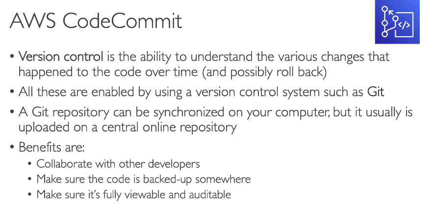

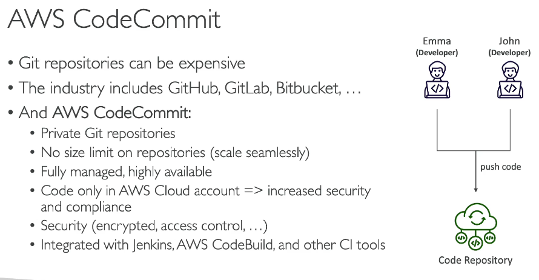

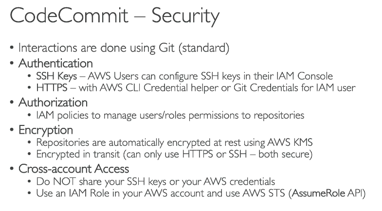

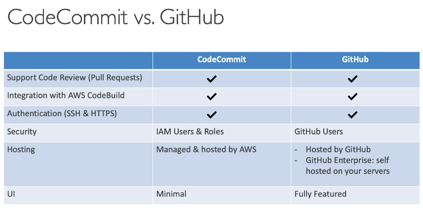

## How to access AWS CodeCommit

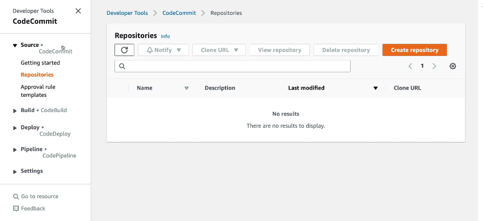

## Create an new repository inside AWS CodeCommit

- Repository Name
- Description
- Tags

  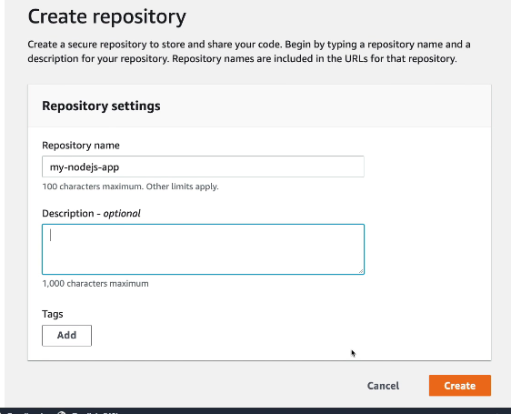

## How to connect to AWS CodeCommit Repository

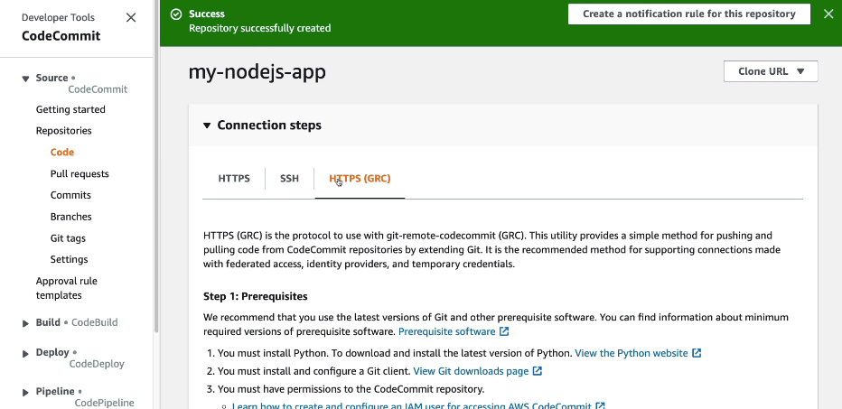

- If you are logged in with Root User Account, you will not see SSH tab. Only visible to IAM Users

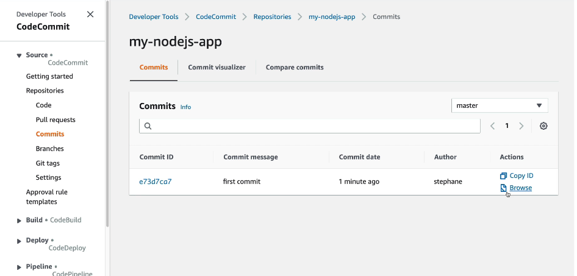

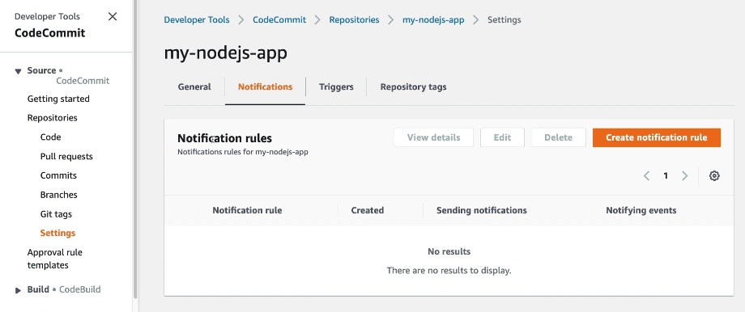

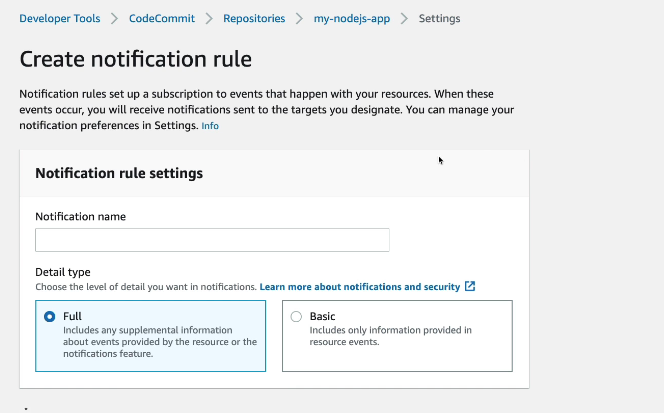

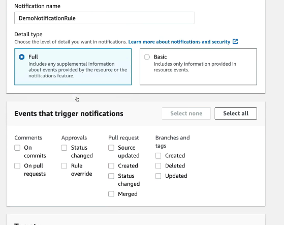

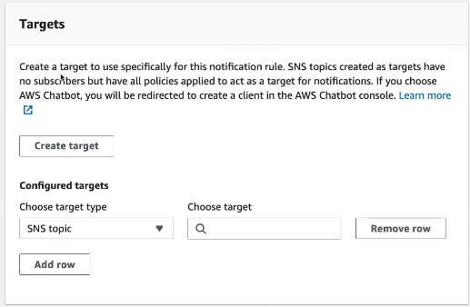

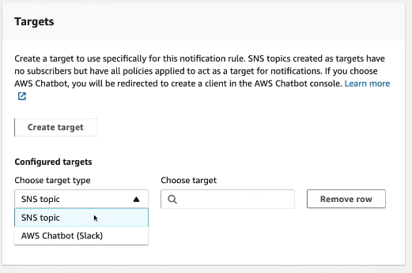

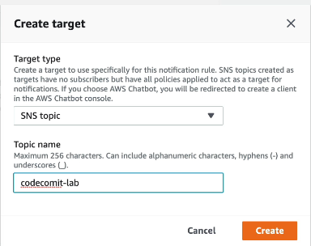

| AWS SNS Feature                      | Azure Equivalent                         | Notes                                    |
| ------------------------------------ | ---------------------------------------- | ---------------------------------------- |
| Pub/Sub messaging                    | Azure Service Bus Topics & Subscriptions | Closest architectural match              |
| Event distribution                   | Azure Event Grid                         | Preferred for event-driven architectures |
| Push notifications to mobile devices | Azure Notification Hubs                  | Similar to SNS mobile push               |
| Fan-out events to multiple consumers | Azure Event Grid or Azure Service Bus    | Depends on reliability requirements      |

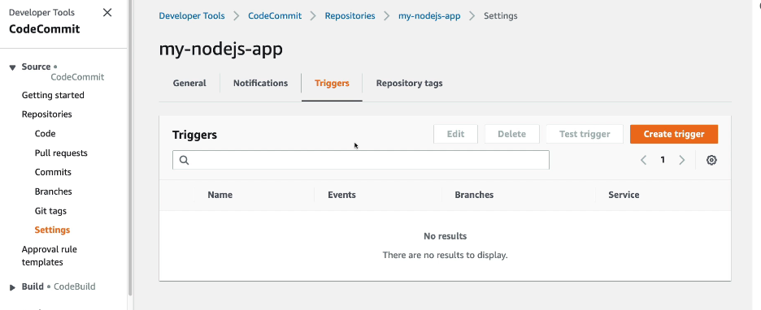
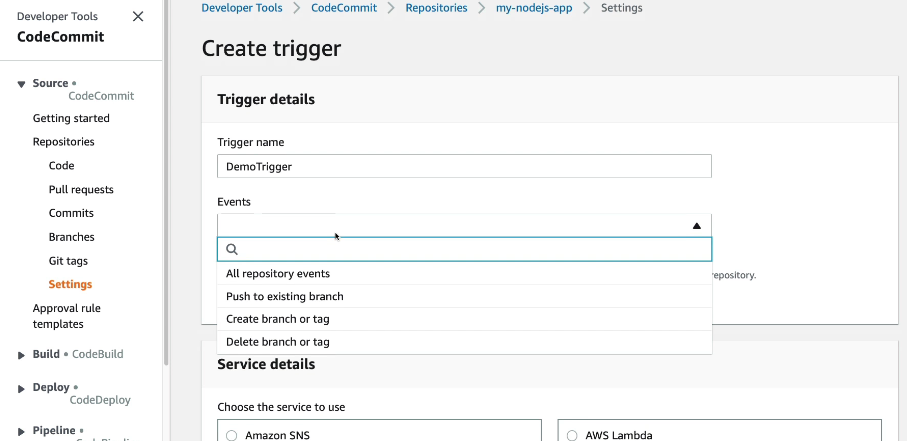
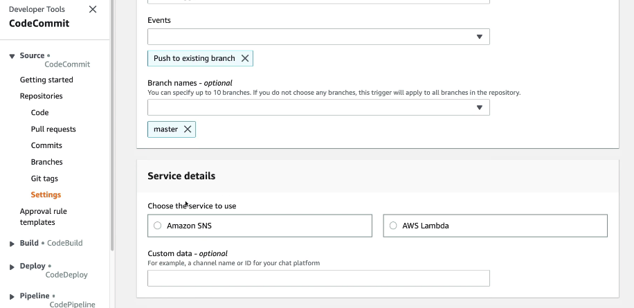

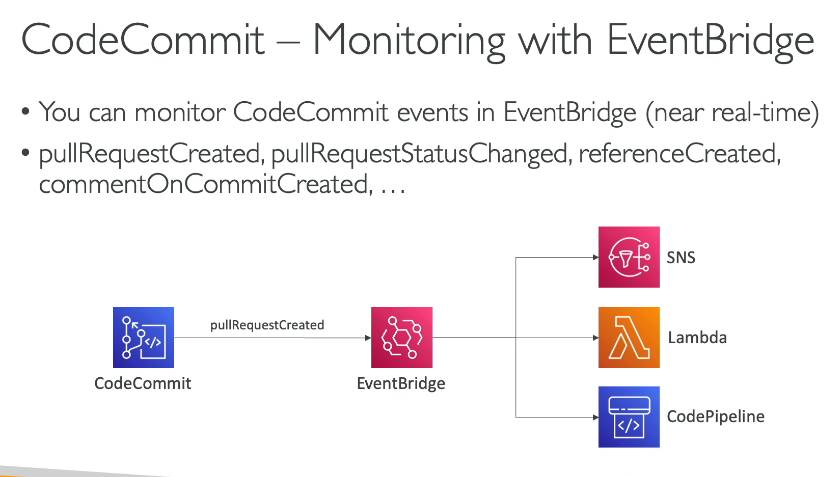

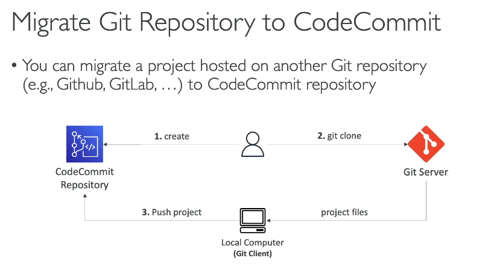

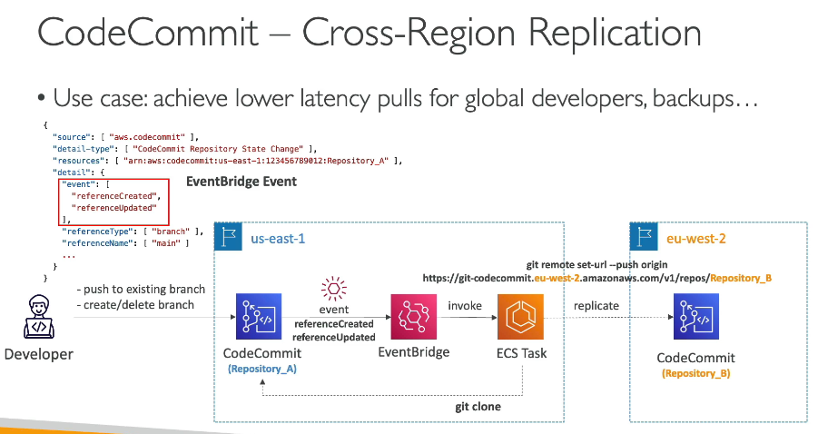

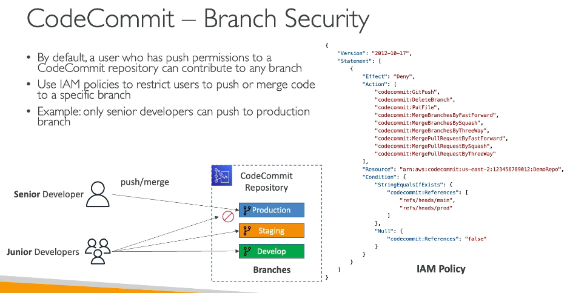

This policy can be attached to "Junior Developer" Group.

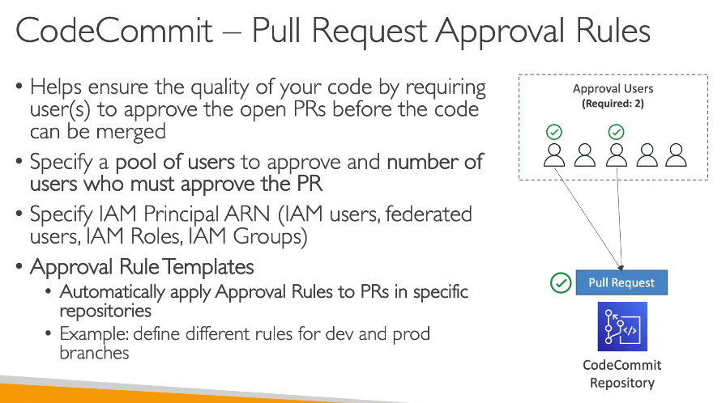
