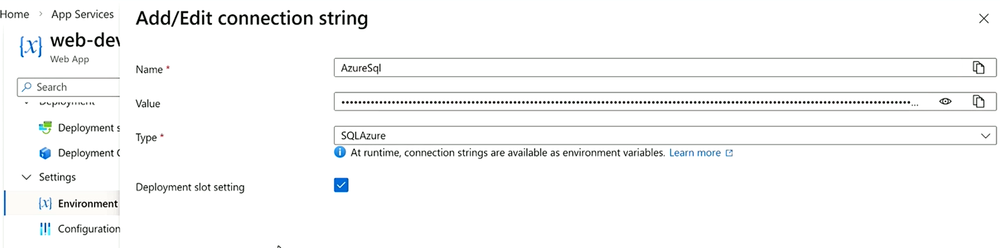
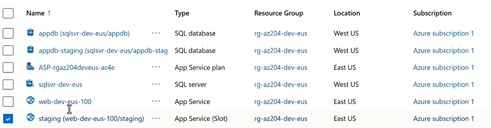

## Type

PaaS

We don't have access to underlying infrastructure.

No need to patch and upgrade server

## For Application Types

- Web API
- Web Apps
- Batch

## Support Runtime

- NodeJS
-

## Configuration

- Subscription : subscription Id
- Resource Group : Resource group name
- Region : Sweden Central
- Name : DNS name
  - < unique name > .azurewebsites.net
- Publish
  - Code
    - Runtime stack : NodeJS 10/ Java 25 / PHP 8.5 / Python 3.14
  - Container
- Operating System :
  - Linux
    - Cheap as no Licensing cost
  - Windows
- Pricing Plans
  - Name : Name of Pricing Plan
  - Plan :
    - Hardware View : vCPU/Memory (RAM)/Remote Storage/Scale (Instance)
    - Feature View : Custom Domain/Auto Scale/Daily Backup/Deployment Slots/Zone Redundancy/vNet Integration/
      - Free F1 - No feature
      - Basic B1
        - custom domain : choose custom domain
        - Manual Scaling : upto 3 instance
        - vNet Integration : select/create Virtual Network
      - Standard (Legacy) - No Zone Redundancy feature
        - custom domain : choose custom domain
        - vNet Integration : select/create Virtual Network
        - Automated Scaling :
          - Scale Condition
            - Scale mode : Based on metric
            - Scale rule :
              - matrix name : Avg. CPU Usage
              - operation : greater than
              - Threashold : 70
              - Duration : 10 min
              - Operation : increase instance by
              - Instance Count : 1
              - Cool Down Period : 5 min.
            - Scale rule :
              - matrix name : Avg. CPU Usage
              - operation : less than
              - Threashold : 70
              - Duration : 10 min
              - Operation : decrease instance by
              - Instance Count : 1
              - Cool Down Period : 5 min.
            - instance limits :
              - Default : 2
              - Min: 1
              - Max : 3
        - Deployment Slots :
          - Easy rollback
          - An environemtn with own configuration within an app service instance for deployment and testing before deploying it to production slot via Swap operation
          - When using deployment slots, make sure you check "Deployment slot setting" in Environment settings > connection string (Passwordless)
            

            To stick to slot during swap.

      - Premium (V2/V3) - All features
      - Isolated

| Environment  | Recommended Plan           | Why                                           |
| ------------ | -------------------------- | --------------------------------------------- |
| Dev          | Basic B1                   | Cheap, enough for developers                  |
| QA/Test      | Standard S1/S2             | Supports staging slots + autoscale testing    |
| Pre-Prod/UAT | Premium V3 (or Premium V2) | Mirrors production behavior                   |
| Prod         | Premium V3 (or Premium V2) | High availability, autoscale, networking, SLA |

- Zone Redundancy : For Premium Plans only
  - Enabled : Your App Service Plan and Apps will be zone redundant, Minimum App Service plan instance count will be 2
  - Disabled
- Enable Public Access :
  - On
  - Off : Will block all incoming traffic except coming from private endpoint
- Enable vNet Integration : Required for your app to access resources secured behind a vNet using resource's private IP like Database.
  - On
    - Select or create a virtual network that is in the same region as your new app
  - Off
- Application Insights : Azure Monitor application insights is an Application Performance Management (APM) service for developers and DevOps professionals. Enable it below to automatically monitor your application. It will detect performance anomalies, and includes powerful analytics tools to help you diagnose issues and to understand what users actually do with your app. Your bill is based on amount of data used by Application Insights and your data retention settings.
  - Enabled
    - Application Insight : Select or create a Application Insight that is in the same region as your new app, if create we need to pass name and Log Analytics workspace.
  - Disabled
- Microsoft Defender for Cloud : When you add the Defender for App Service plan to your Azure subscription, you get a cloud-native security solution that monitors logs, requests, VM instance, and more—detecting threats and ongoing attacks to your resources
  https://azure.microsoft.com/en-us/pricing/details/defender-for-cloud/
  [Microsoft Defender for App Service €12.477/Instance/month]

      - Enabled
      - Disabled

- Tags : Will be applied to all the related resources created with App Service like App Service Plan / Application Insight / App Service

## Public Endpoint

### When Public Access = ON

Your app is reachable publicly:

Internet Users --> https://myapp.azurewebsites.net

Anyone who has: the URL DNS entry allowed authentication can access the app over the internet.

You can still restrict access using:

- IP restrictions
- Authentication
- WAF
- Front Door
- API Management

But the app still has a public endpoint.

### What is a Private Endpoint?

A Private Endpoint gives your App Service:

- a private IP address inside your Azure VNet

Example:

App Service
Private IP: 10.1.2.4

Now access happens privately over:

- Azure VNets
- VPN
- ExpressRoute
- peered networks

—not through the public internet.

Enterprise Use Case

This is common for:

- internal enterprise APIs
- banking systems
- healthcare apps
- backend services
- zero-trust architectures

Example architecture:

User --> VPN --> Corporate Network --> Azure VNet --> App Service (Private Endpoint)

No public exposure.

| Feature              | Purpose                                | Traffic Direction |
| -------------------- | -------------------------------------- | ----------------- |
| **VNet Integration** | App Service accesses private resources | Outbound          |
| **Private Endpoint** | Private access _to_ App Service        | Inbound           |

### App Service is NOT deployed inside your VNet

Important architectural detail:

- App Service = Microsoft-managed PaaS
- It lives outside your VNet infrastructure.

But:

- it can integrate WITH your VNet via VNet Integration and/or Private Endpoint

Fully Private Enterprise App
Needed:

✅ VNet Integration
✅ Private Endpoint
✅ Public Access OFF

```
Corporate Network
       |
Private Endpoint
       |
App Service
       |
VNet Integration
       |
Private Database
```

| Requirement                    | Needed Feature                     |
| ------------------------------ | ---------------------------------- |
| App accesses private DB        | VNet Integration                   |
| Users privately access app     | Private Endpoint                   |
| Disable public internet access | Public Access OFF                  |
| App inside VNet                | Not possible directly (PaaS model) |

### Key Takeaway

VNet Integration = App Service can REACH INTO the VNet

Private Endpoint = Network can REACH the App Service privately

### Public Frontend App

| Setting          | Value |
| ---------------- | ----- |
| Public Access    | ON    |
| VNet Integration | ON    |
| Private Endpoint | OFF   |

### Private/internal API

| Setting          | Value |
| ---------------- | ----- |
| Public Access    | OFF   |
| VNet Integration | ON    |
| Private Endpoint | ON    |

### Multiple App Services can share App Service Plan

# Best way to connect app service to a database

Use App Service Managed Identity to connect to Azure SQL using Microsoft Entra authentication. This avoids storing DB usernames/passwords in config. Microsoft recommends this pattern because managed identity removes secrets from connection strings

Steps

1. Enable Managed Identity on App Service
2. Configure Microsoft Entra admin on Azure SQL Server, Important: SQL authentication admin alone cannot create Entra users in Azure SQL.
3. Connect to the database as Entra admin, Use Azure Data Studio
4. Create DB user for the App Service identity

```
CREATE USER [app-service-managed-identity] FROM EXTERNAL PROVIDER;

ALTER ROLE db_datareader ADD MEMBER [your-app-service-name];
ALTER ROLE db_datawriter ADD MEMBER [your-app-service-name];

For stored procedures
GRANT EXECUTE TO [app-service-managed-identity];
```

5. Use passwordless connection string with For .NET, Microsoft.Data.SqlClient

```
Server=tcp:<sql-server-name>.database.windows.net,1433;
Database=<database-name>;
Authentication=Active Directory Managed Identity;
Encrypt=True;
TrustServerCertificate=False;
Connection Timeout=30;

Final Architecture
App Service
  → Managed Identity
  → Azure SQL Entra user
  → DB roles/permissions
```



## Enterprise Best Practice Architecture

### Recommended Production Setup

**App Service**

- Managed Identity ON
- VNet Integration ON

**Azure SQL**

- Private Endpoint ON
- Public Network Access OFF

**Authentication**

- Entra ID / Managed IdentityEnterprise Best Practice Architecture

**Architecture**

```
App Service
   |
Managed Identity (AUTH)
   |
VNet Integration
   |
Private Endpoint (NETWORK)
   |
Azure SQL
```
