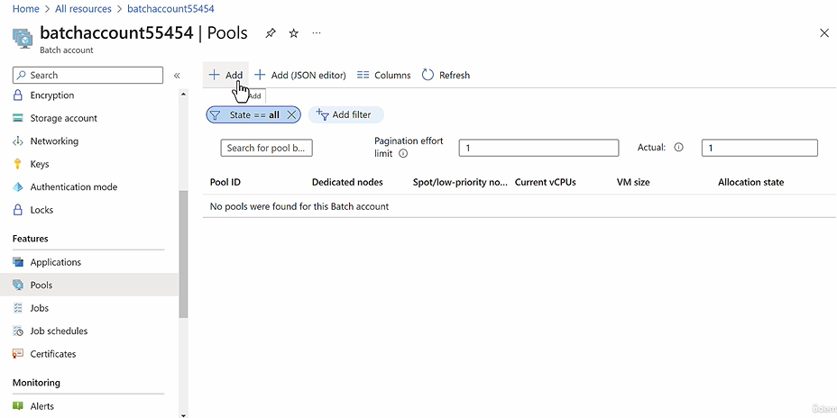

## Azure Batch

- Used to run Large Scale batch jobs
- It will managed the pool of VMs used for the batch job processing
- It will ensure the application is installed on the VMs
- We use Azure Storage Account for input files, output files and the application itself.

## How to create a batch account

**Project Details**

- Subscription
  - Resrouce Group

**Instance Details**

- Region
- Account name : < Unique >.< Region >.batch.azure.com

**Strorage**

- Storage Account

**Advanced**

- Identity Type
  - None
  - System Assigned
  - User Assigned

- Pool Allocation Mode
  - Batch Service (Default)
  - User Subscription

- Authentication Mode
  - Sharted Key (Default)
  - MS Entra ID (Default)

**Networking**

- Public Network Access
  - Enable (Default)
  - Disable
    - Private Endpoint
      - vNet
      - Subnet

**Tags**

- Name/Value

## Create a Pool in Azure Batch Account

1. Create Pool
2. Create Application and import the zip of the Console Application for batch processing
3. Create Job to run the batch
   
