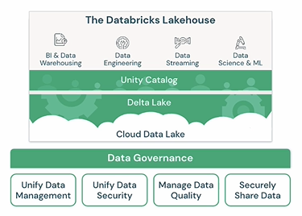

## Overview

Azure Databricks is a cloud-based data and AI platform that helps organizations store, process, analyze, and build AI solutions from large amounts of data.

It is build on top of apache spark.

Imagine a company has data scattered across:

- Databases
- CSV files
- Applications
- Websites
- APIs
- IoT devices

Azure Databricks provides one place where teams can:

- Bring all the data together.
- Clean and transform it.
- Analyze it.
- Build dashboards and reports.
- Train AI and machine learning models.

| Requirement                     | Azure Databricks        | Azure Synapse Analytics               |
| ------------------------------- | ----------------------- | ------------------------------------- |
| Large-scale data engineering    | ✅ Excellent            | ✅ Good                               |
| Advanced Spark workloads        | ✅ Best choice          | ⚠️ Limited compared to Databricks     |
| Machine Learning & AI           | ✅ Excellent            | ⚠️ Basic integration                  |
| Data Lakehouse architecture     | ✅ Industry-leading     | ⚠️ Less mature                        |
| SQL Data Warehouse              | ⚠️ Not primary focus    | ✅ Excellent                          |
| Business Intelligence reporting | ⚠️ Requires other tools | ✅ Integrated                         |
| Citizen analysts                | ⚠️ More technical       | ✅ Easier                             |
| Multi-cloud portability         | ✅ Strong               | ❌ Azure-centric                      |
| Delta Lake support              | ✅ Native creator       | ✅ Supports Delta but not as advanced |

Choose Azure Databricks when:

- Processing large volumes of data
- Building Lakehouse architectures
- Implementing streaming solutions
- Supporting data science and AI teams
- Requiring complex ETL/ELT pipelines



## How to create Azure Databricks workspace

**Project details**

- Subscription
  - Resource Group

**Instance Detail**

- Workspace name
- Region
- Pricing Tier
  - Premium (RBAC support)
  - Trial (14 days)
- Workspace Type
  - Serverless : Enabled (Default)
  - Hybrid
    - Managed Resource Group name : < MG_RG_NAME >

**Networking**

- Deploy in a Virtual Network (VNet) : Disabled (Default)
- Deploy with Secure Cluster Connectivity (No Public IP) : Enabled (Default)

**Data Encryption**

- Use your own key for disk : Disabled (Default)
- Use your own key for services : Disabled (Default)
- Enable Infrastructure Encryption : Disabled (Default)

**Enhanced Security & Compliance**

- Enable compliance security profile : Disabled (Default)
- Enable enhanced security monitoring : Disabled (Default)
- Enable automatic cluster update : Disabled (Default)

**Tags**

- Name/Value

## How to create Azure Databrick Cluster inside a workspace

- Azure Databricks workspace is free, but not cluster
- Cluster provide the compute infrastructure where the Notebooks will run (written in python)

**Steps**

- Cluster Type
  - Multi node
  - Single node (Default)
- Databricks runtime version : < Choose latest version >
- Node Type
  - Standard DS3_v2 (4 vCores and 14 GB RAM)
- Terminate after \_\_\_ min. of inactivity
- Tags
  - name/value

## How to create a Notebook to run on the cluster

**Steps**

1. Have a .csv file with data points
2. Upload this file into Azure Data lake Gen2 storage
3. Create a notebook
4. Notebook support below languages
   - Python
   - Scala
   - R
   - SQL
5. Inside the notebook, read the csv file and look the data into dataframe

```
Raw Data
(JSON, CSV, SQL, APIs, Files)
        |
        v
Azure Data Lake
        |
        v
Azure Databricks
(Ingest, Clean, Transform)
        |
        v
Curated Data
        |
   +----+----+
   |         |
   v         v
Power BI   Synapse SQL
```
