## Overview

It is a data integration and orchestration platform.

- You can connect to variety of data sources and destinations.

- Here you have Pipelines, consist of activities
  - Clean Data
  - Transform data

For modern Azure data platforms, that is one of the most common and recommended architectures.

```
Source Systems
(SQL, SAP, APIs, SFTP)
        |
        v
Azure Data Factory
        |
        v
Azure Data Lake Storage
        |
        v
Azure Databricks
        |
        v
Power BI / Synapse / Other Systems
```

1. Data Lake Becomes the Central Storage

   **Benefits:**

- Cheap storage
- Scalable
- Keeps raw data for auditing and reprocessing
- Supports structured, semi-structured, and unstructured data

2. Databricks Handles All Processing

   **Benefits:**

- Cleans data
- Validates data
- Applies business rules
- Joins datasets
- Creates curated datasets

A common Lakehouse structure is:

```
Raw Data (Bronze)
      |
      v
Clean Data (Silver)
      |
      v
Business Data (Gold)
```

This pattern is extremely common in Databricks environments.

3. Consumption Layer

   After transformation, data is consumed by:

- Microsoft Power BI dashboards
- Azure Synapse Analytics SQL analytics
- APIs
- Machine learning models
- Operational applications

## Linked Services

Used to connect to differnt data sources and destination

## How to create Azure Data Factory

**Project Details**

- Subscription
  - Resource Group

**Instance Details**

- Name
- Region

**Git Configuration**

- Repository Type
  - Azure Repo (Default)
    - Azure DevOps Account :
    - Project Name :
    - Repo Name :
    - Branch Name :
    - Root Folder :
  - Github

**Networking**

- Public Endpoint (Default)
- Private Endpoint

**Encryption**

- Use encryption with Customer Manager Key : Disabled

**Tags**

- Name/Value

## How to copy data from Azure SQL Database to Azure Synapse using Azure Data Factory.

**Steps**

1. Go to Azure Data Factory resouorce
2. Go to Azure Data Factory Studio
   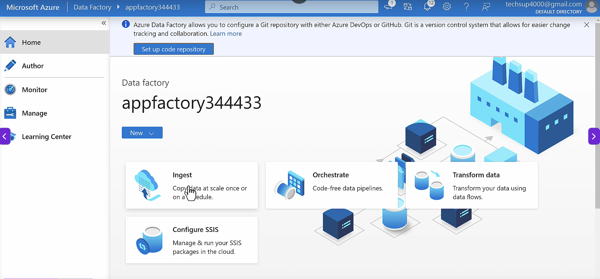
3. Go to Ingest > Build-in Copy Task
   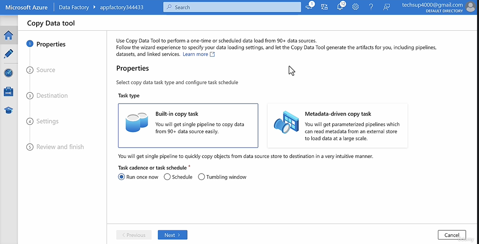
4. Specify the sources, as SQL Database
   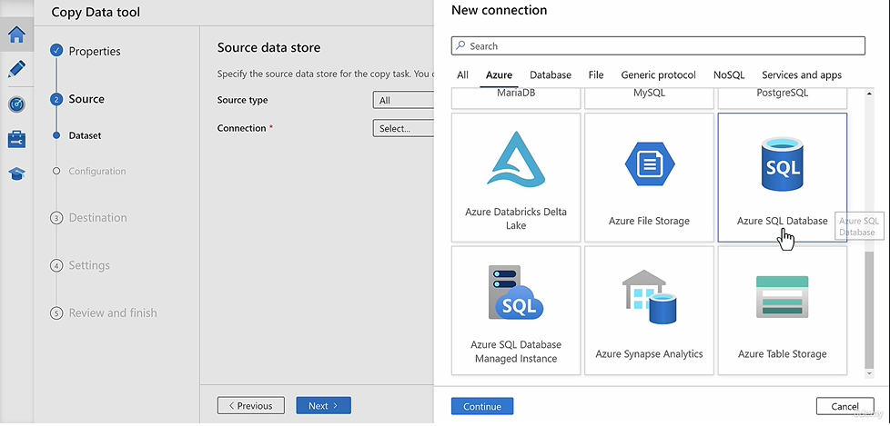
   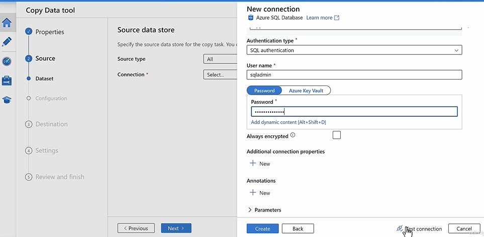
5. Once connection is established, choose tables as dataset
   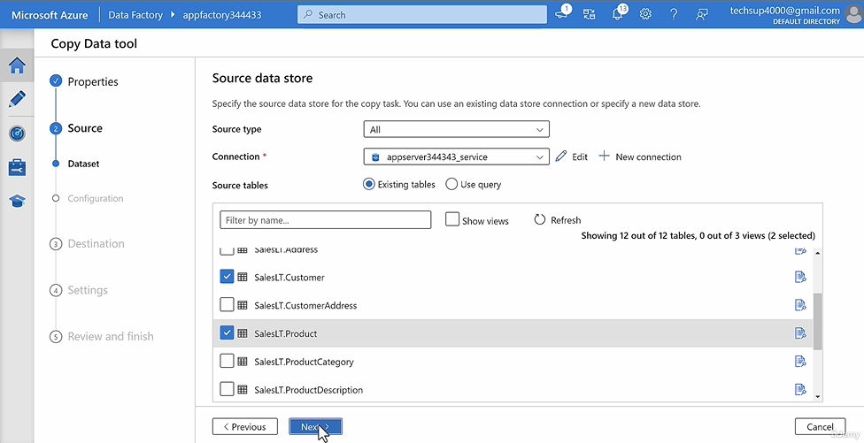
6. Choose Destination as Azure Synapse, SQL Pool
   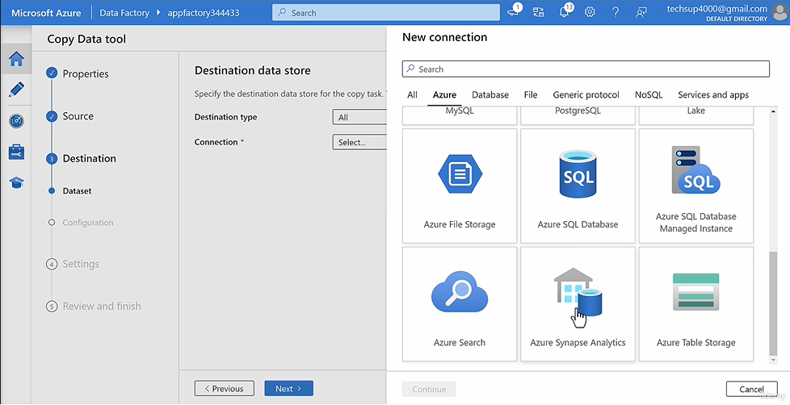
   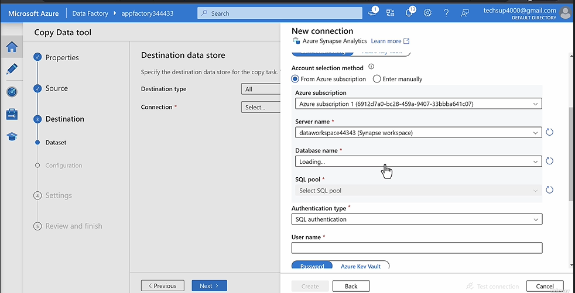
7. As destination dataset, It will map the tables in the destination datawarehouseDB to create them automatically
   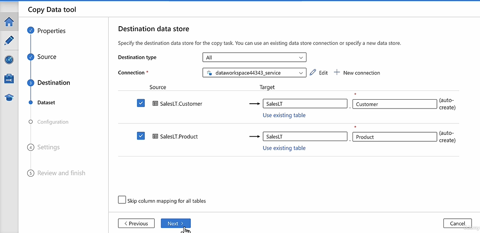
8. Under settings, choose "bulk insert"
   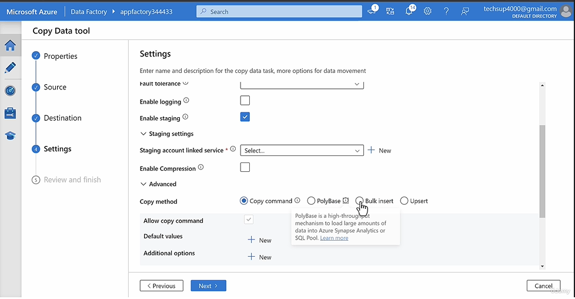
9. Skip staging link
10. Done, This will create and run the pipeline to ingest data from SQL Database to Azure Synapse.
    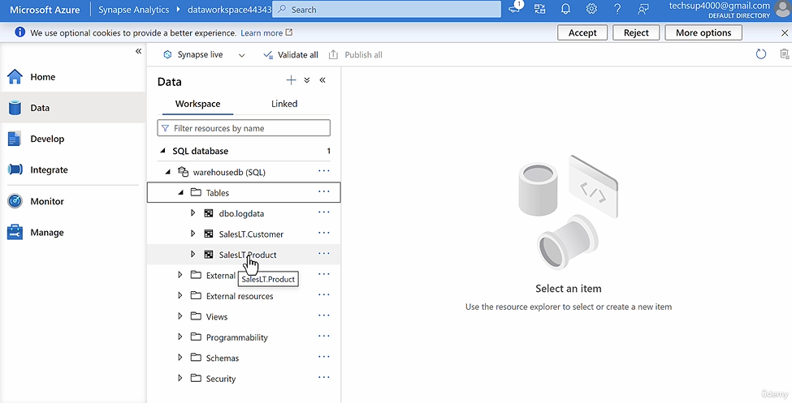

## Azure Data Factory - Mapping Data Flow

Useful when you want to create few additional columns in the dataset while migrating the data from Azure SQL Database to Azure Synapse SQL Pool.

- It helps you visualize the entire transformation process

## Polybase

Under settings, instead of "bulk insert", we can choose "Polybase". More afficient approach for large data sets.

- Useful in transfering data from Azure data lake Gen2 storage account
  

## Azure Data Factory - Self Hosted Runtime

- Useful while loading data from Azure VM like log data or data files onto the VM
  **Steps**

1. Integrate the VM to the Azure Data Factory usign Self Hosted Runtime

- Go to Azure Data Factory Studio > Integration Runtime
  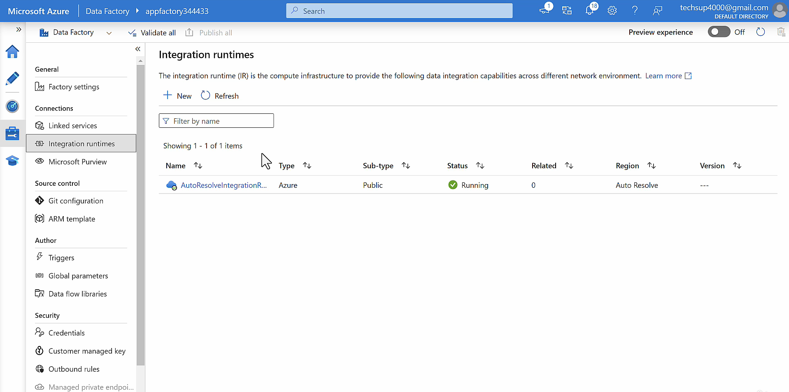
- Create new runtime with self-hosted type
  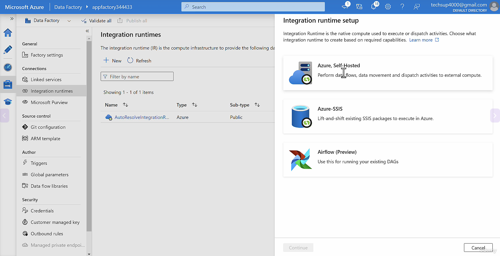
  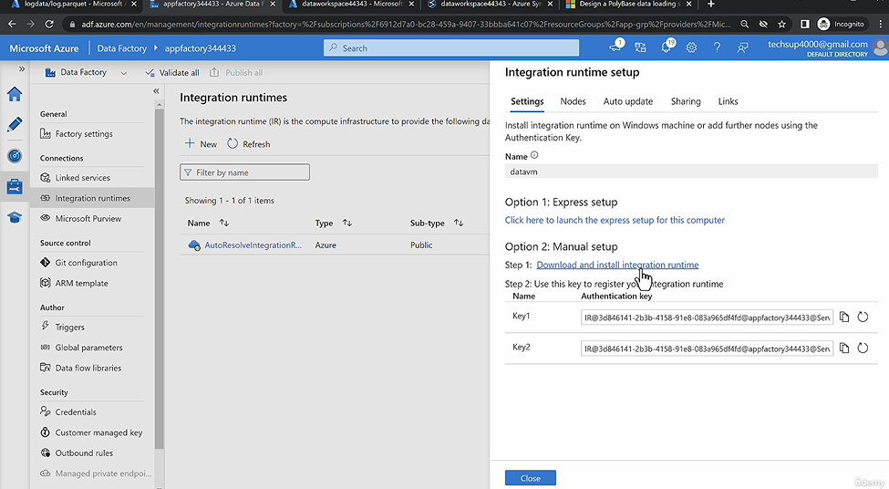
- On the VM, use this link and install with the key
- It will show then as integrated to the Azure Data Factory
  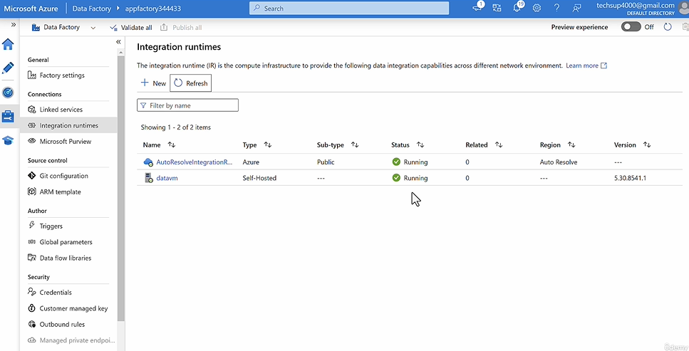

2. Create a Pipeline in Azure DataFactory, to ingest the data from the VM to destination (Azure Synapses Dedicated SQL Pool)

- Go to Azure Data Factory > Author
  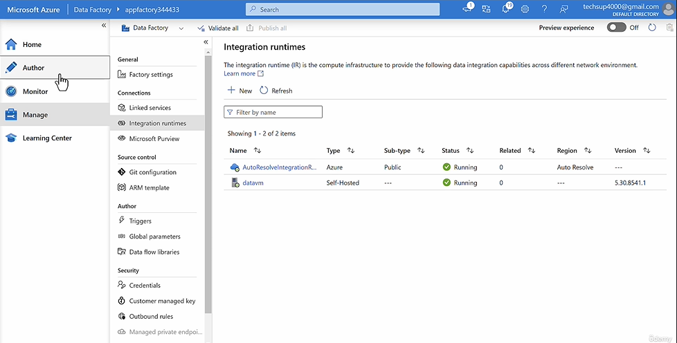
- New Pipeline
  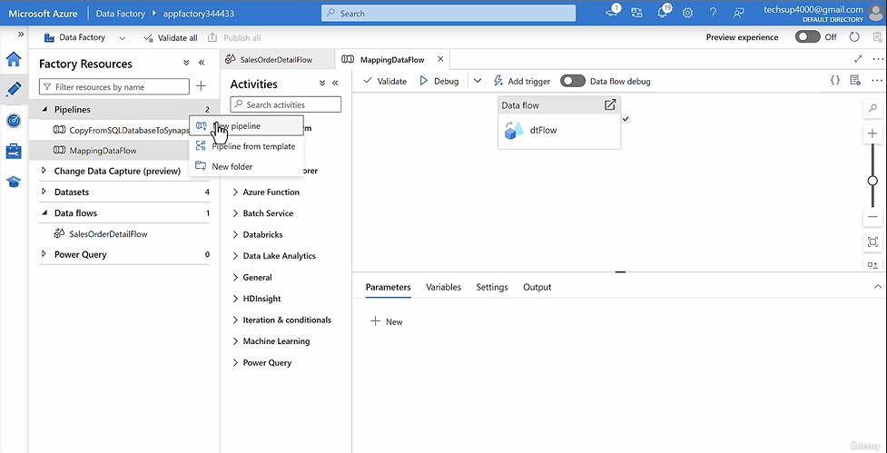
  - "Copy Data" Activity
    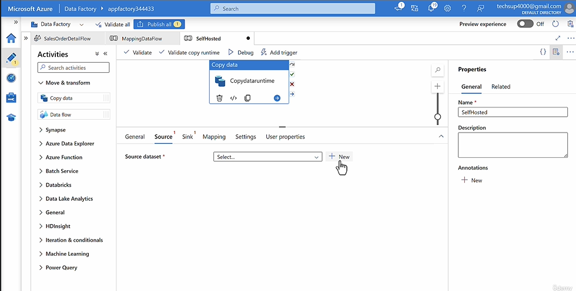
    - Source : FileSystem  
      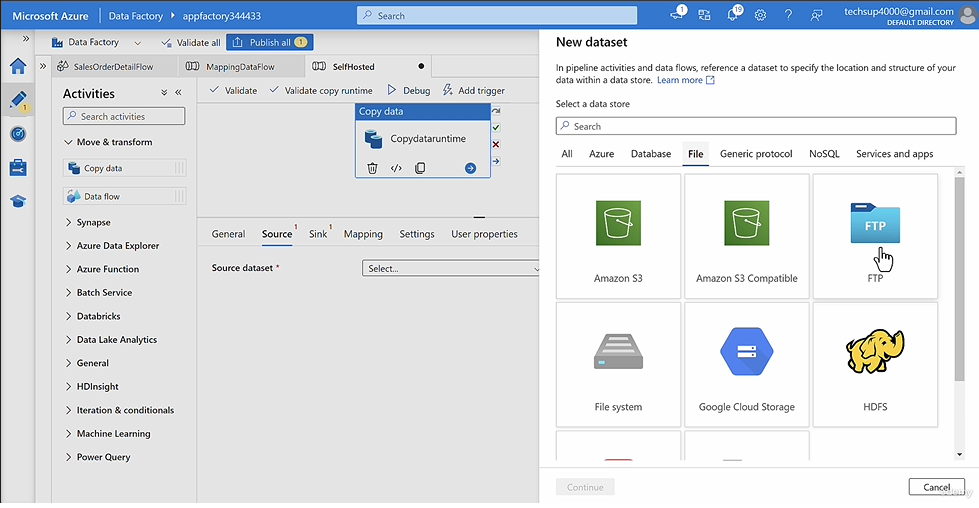
      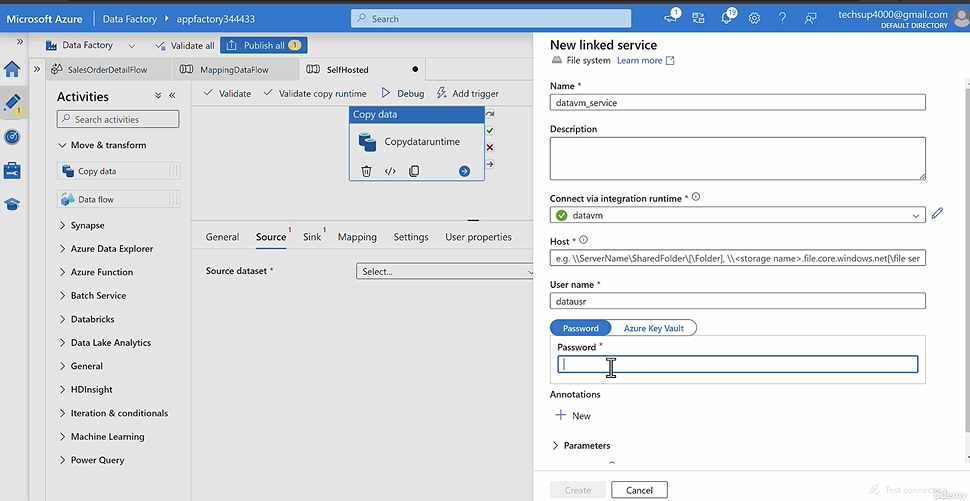
    - Disable localfolderpathvalidation on the server, incase you face connection issue
      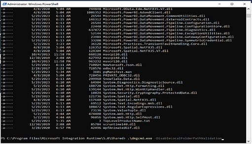
