## Azure File Sync

- It is used with Azure File share, to sync the file from File share to the File Server (on-premise)
- Both Users and Machines can connect to File shares
- Used to sync files on differnet File servers
- File Server(On-Premise) -- File Sync -- Azure File Share
- File sync can
  - either hold all the files inthe file share
  - or using cloud tiering can cache of frequency access files in the file share.
- In case you File Server goes down, you can just replace the File server by insalling Azure File Sync agent

## How to implement Azure File Sync

1. Create a File share in Azure Storage Account - General Purpose type
   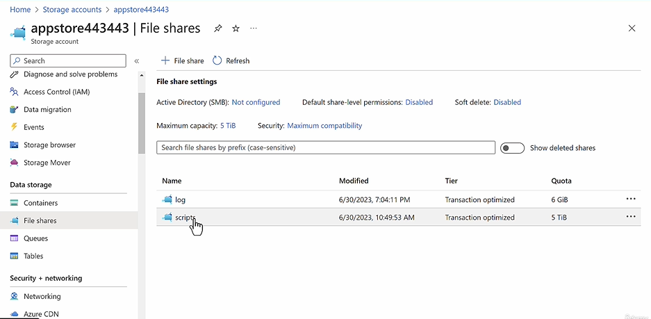
   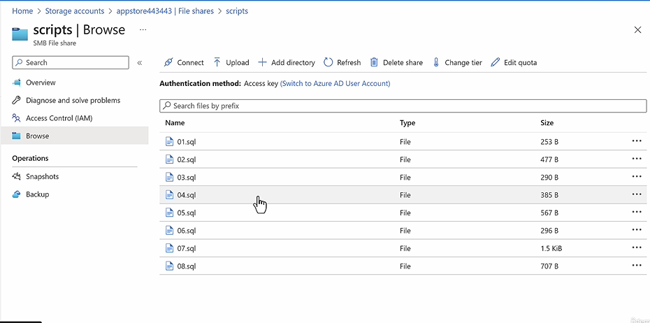
2. Create a File Sync Resource
   **Project Details**
   - Subscription
     - Resource Group
   - Storage Sync Service :
   - Region :

   **Network connectivity**
   - Allow access from
     - All Networks (Default)
     - Private Endpoint only

   **Tags**
   - Name/Value

   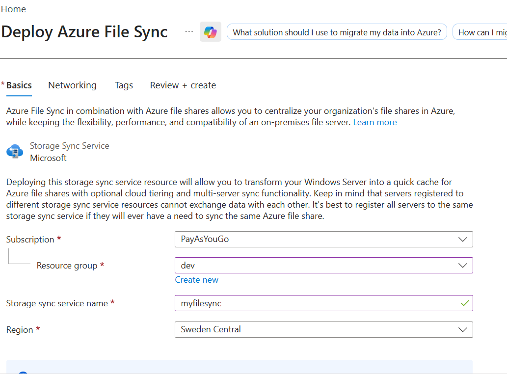

3. Create a sync group in the Azure sync resource
   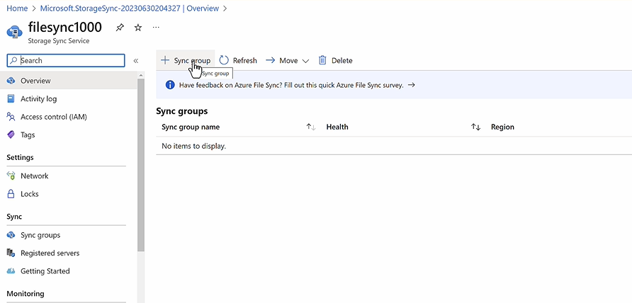
   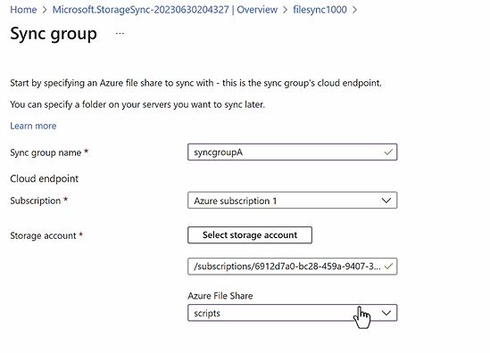
4. Install the Azure File Sync Agent on the Virtual Machine
   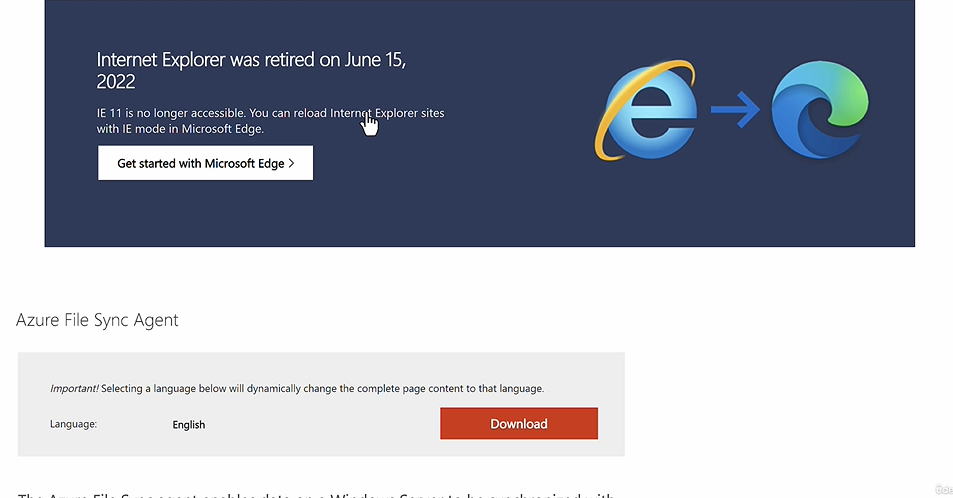
   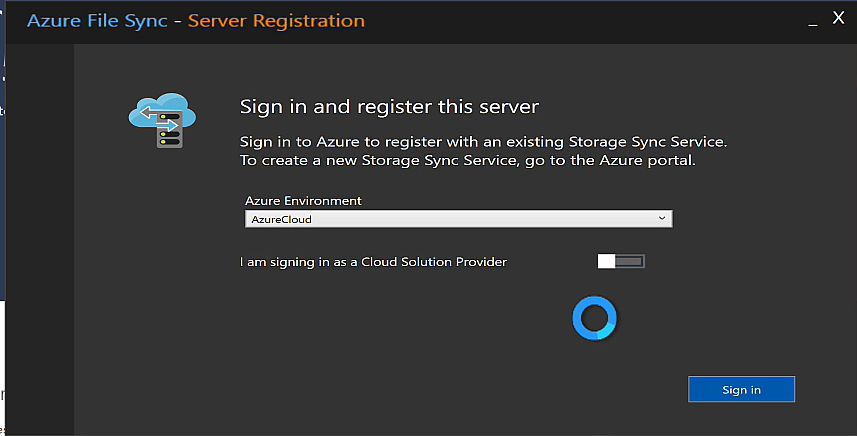
   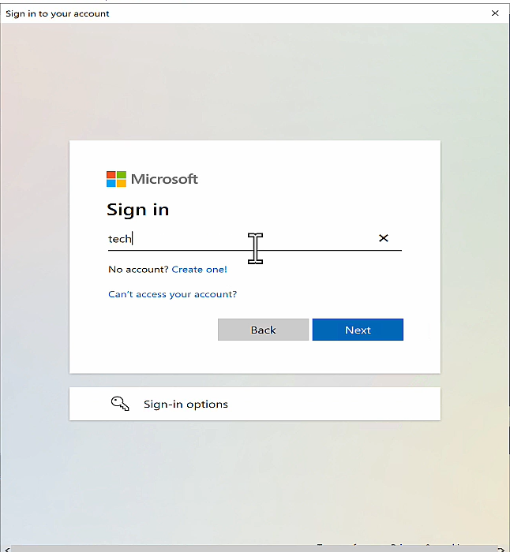
   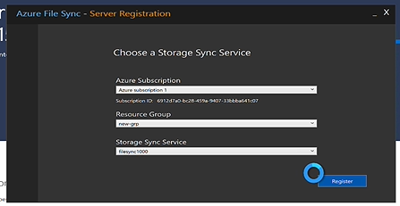
5. Verify the server registration in the azure sync resource
   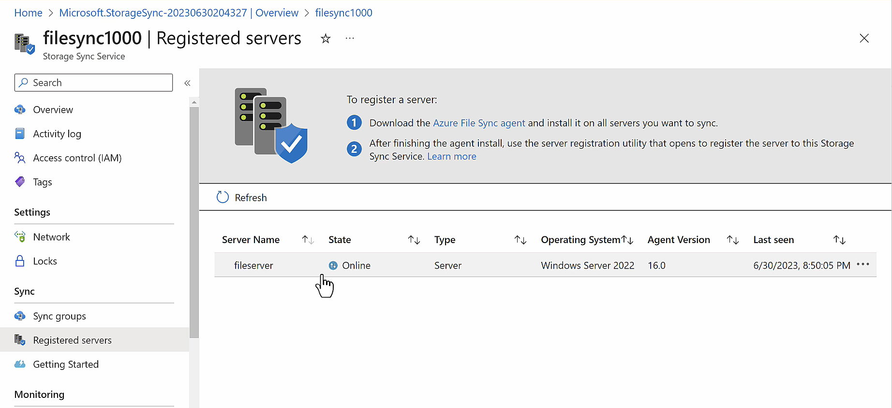
6. Now the File Server will save the files in File Share as local copy.
7. If you want the files to be stored into a seprate data disk
   - Create and attach new data disk to the Server.
     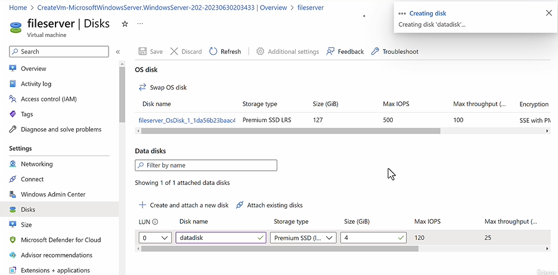
   - Create Volumn out of the disk
     - First Initialize
     - Create New Volumn
       ![alt text]images/({CD5A6A81-93BB-4925-B0CD-269EE89F6A88}.png)
   - Go to Sync Group > Add Server Endpoint
     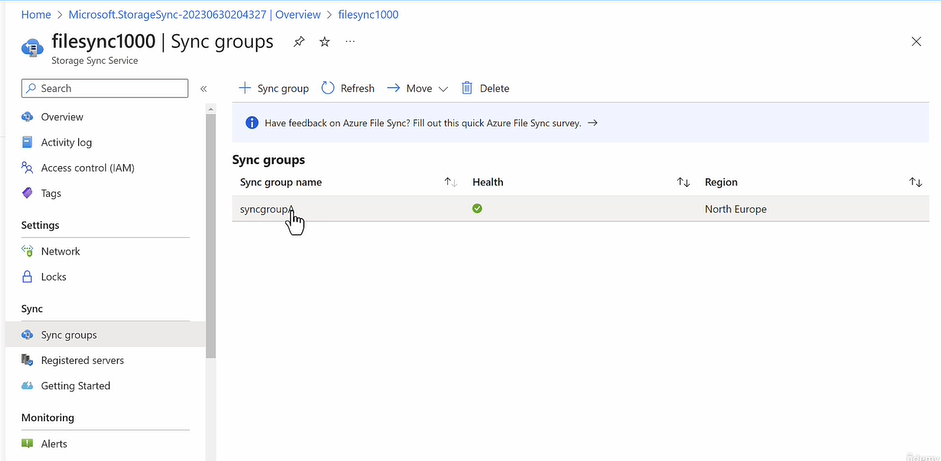
     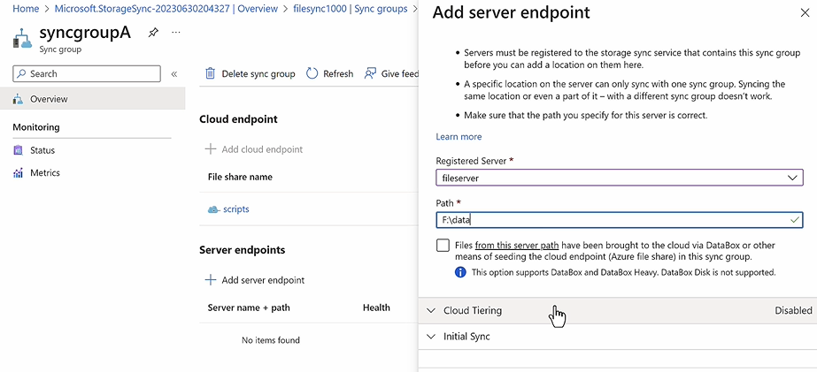

```
Azure File Share (Cloud Endpoint)
           ↕
     Azure File Sync
           ↕
On-Prem Windows Server (Sync Endpoint)
```

| Operation               | On-Prem → Azure | Azure → On-Prem          |
| ----------------------- | --------------- | ------------------------ |
| Add File                | ✅              | ✅                       |
| Modify File             | ✅              | ✅                       |
| Delete File             | ✅              | ✅                       |
| Rename File             | ✅              | ✅                       |
| Create Folder           | ✅              | ✅                       |
| Delete Folder           | ✅              | ✅                       |
| ACL/Permissions Changes | ✅              | ✅ (NTFS ACLs supported) |

**Common Misunderstanding**

**Azure File Sync is not a backup solution.**

If a user deletes 1000 files on-prem:

- Azure File Sync detects the deletion.
- Azure File Share deletes the files.
- Other servers delete the files.

To recover, you need:

- Azure File Share snapshots
- Azure Backup
- Third-party backup solution

**Azure File Sync is bidirectional**

Changes can originate from either:

- On-premises Windows Server (sync endpoint) ➜ Azure File Share ➜ Other servers
- Azure File Share (cloud endpoint) ➜ On-premises server(s)
