## Overview

A centralized logs storage

We can direct logs from various resources types

- Azure Web Apps
- Azure SQL Databases
- Azure Virtual Machines

## How to create a Log Analytics Workspace

**Project Details**

- Subscription
- Resource Group

**Instance Details**

- Name
- Region

**Tags**

- Name/Value

## How to stream logs from Azure VM to LAW

To stream data from VM into Log Analytics Workspace, you need **Data Collection Rule**

- Go to Monitor
  - Data Collection Rule

    **Rule Detail**
    - Rule Name
    - Subscription
      - Resource Group
    - Region
    - Platform Type :
      - Windows (Default)
      - Linux
      - All
    - Data Collection Endpoint : < Blank >

    **Resources**
    - Add Resources
      - Add VM: < Choose VM >

    **Collect & Deliver**
    - Add Data Source
      - Windows Event logs
        - Security
          - Audit Failure (Select)
          - Audit Success
        - System
          - Critical (Select)
          - Error (Select)
          - Warning (Select)
          - Info
          - Verbose
        - Application
          - Critical (Select)
          - Error (Select)
          - Warning (Select)
          - Info
          - Verbose
      - Performance Counters
    - Destination
      - Choose < Log Analytics Workspace >
        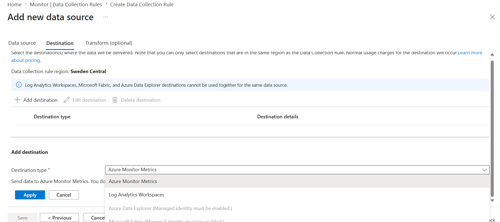
        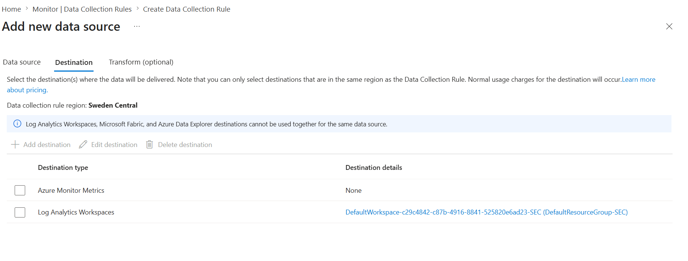
    - Tags
      - Name / Value

When you create a datacollection rule, it will install an **Azure Monitor Agent** into the VM. This Agent collects the data from the VM and sends it to the Azure Monitor. From Azure Monitor you can further send this log information to MS Defender or MS Sentinel

- You can also create filter rules for the data being ingested.
- **Multihoming** : A concept where Linux/Windows VM can send log data to multiple log Analsytics Workspace at a time

## How to send Web App Logs into Azure Log Analytics Workspace

- Choose an Azure Web App resource
  - Diagnostic Settings
    - Add Diagnostic Setting
      - Logs
        - HTTP logs (Select)
        - App Service Console logs
        - App Service Application logs (Select)
        - App Service Platform logs
        - Access Audit Logs
        - IPSecurity Audit Logs
      - Metrics
        - All
        -

      - Destination
        - Log Analytics Workspace (Select)
          - < Choose LAW resource>
        - Azure Storage
        - Azure Event Hub
        - Partner Solutions

## How to send Azure SQL Database Logs into Azure Log Analytics Workspace

**Step 1** : For "SQL Security Audit Events"

- Go to Azure SQL Database Resource (Not Server)
- Auditing
  - Enable Audition at Server Level : Disabled (Default)
  - Enable Azure SQL Auditing : Disabled (Default)
    - Destination
      - Log Analytics Workspace (Select)
        - < Choose LAW Resouce>
      - Event Hub
      - Storage Account

If you have multiple databases in a Azure SQL Server, you should enable auditing at the Server level instead of individual database level.

**Step 2** : For "SQL Security Audit Events"

- Go to Azure SQL Database Resource (Not Server)
- Diagnostic Settings
  - Logs
    - All logs
    - Error (Select)
    - Timeout (Select)
    - Deadlocks (Select)
    - Blocks (Select)
    - Audit (Select)
  - Metics
    - Basic
    - WorkloadManagement
  - Destination
    - Log Analytics Workspace (Select)
      - < Choose LAW resource >
    - Storage Account
    - Event Hub
    - Partner Solution
      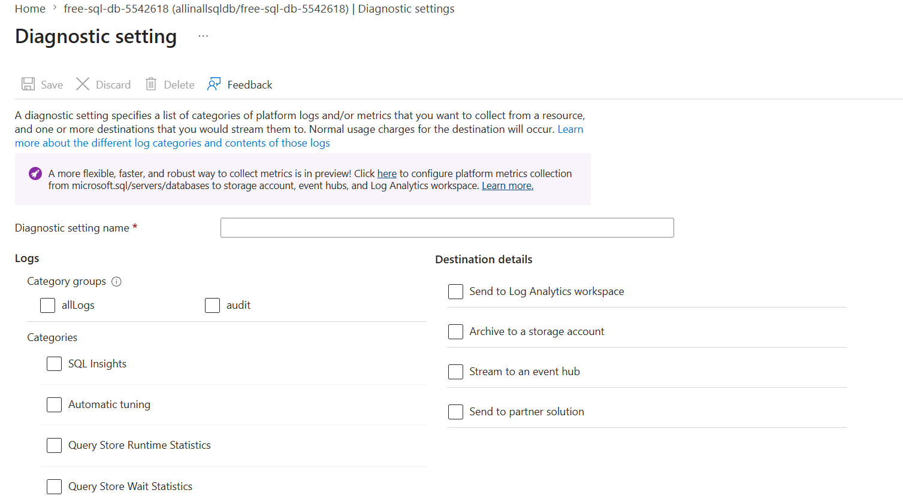

## How to send Azure EntraID Sign-In Logs into Azure Log Analytics Workspace

- Pre-requisite : Azure EntraID - P1/P2 Tenant
  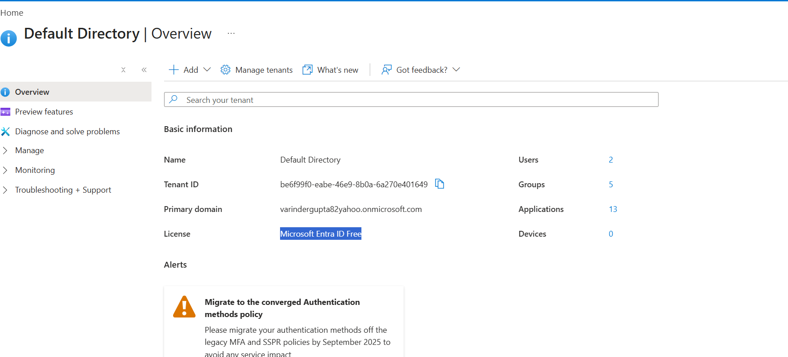

- Go to Azure EntraID
- Signin > Export Data Setting
  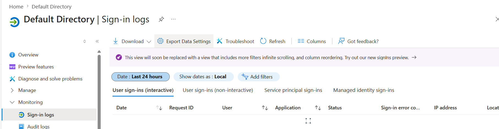

  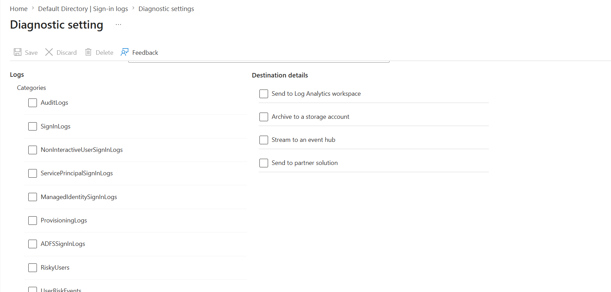

## How to create alert using Azure Log Analytics Workspace

- Write KQL : EntraID SignIn Logs, errorCode is not equal to 0
  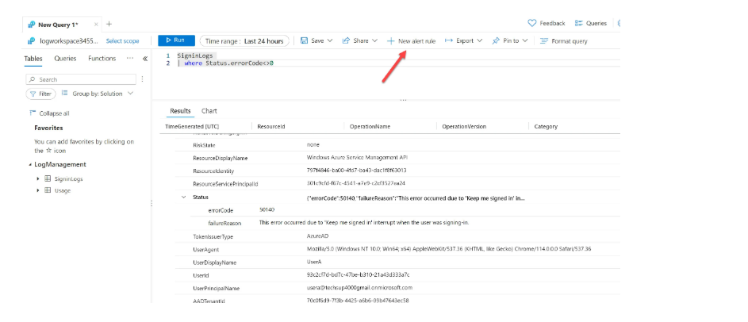

```
SigninLogs
| where Status.errorCode <> 0
```

- Condition
  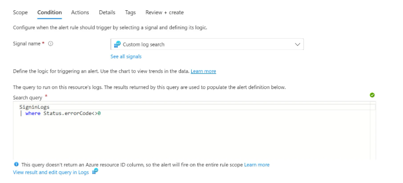

  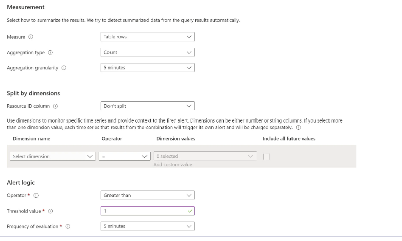

## How we can get Performance Monitoring for Azure VM

- Enable VM insight For Azure Virtual Machines, like we do Application insights for Azure Web App.
- Choose a VM, Enable Insight
  - Insight : Disabled (Default)
    - Data Collection Rule : < Choose/Create a DCR >
      - Guest Performance : Enabled
      - Proecess and Dependency Map : Enable
      - Log Analytics Workspace : < Choose LAW Resource >

Once Enabled, when you to go to VM > Insight. It will show line charts


- If you go to Map Tab, you will see processes and port maped to VM


## How we can get NAG Logs (Flow logs) into Log Analytics Workspace for Monitoring Networking

NSG is used to restrict inboud/outbound connection

- NSG can be associated with vNIC or Subnet

**Step 1** : Create a flow log
Go to Network Watcher > Flow logs > Create Flow logs
**Project Details**

- Flow log Type :
  - NSG
  - vNet
- Add Target Resouce : < Choose NSG /vNET >
- Select storage account :
- Retention : x Days

**Analytics**

- Enable traffic analytics : Disabled (Default)
  - Traffic analytics processing interval : 10 Min / 1 Hr
  - Log Analytics Workspace : < LAW Resource>

This will show Graphs in Network Watcher > Traffic Analytics For

- Total Traffic
- Mallicious Traffic
- Blocked Traffic
- Frequent Conversations

**Tags**

- Name/Value

## How Log Retention works in case of Log Analytics Workspace

Logs in Log Analytics Workspace are automatically deleted according to the configured retention policy at either the workspace level or individual table level. No separate cleanup job is required.

**Default Retension** - Across tables

- Default : 30 days
- Max : 730 days
  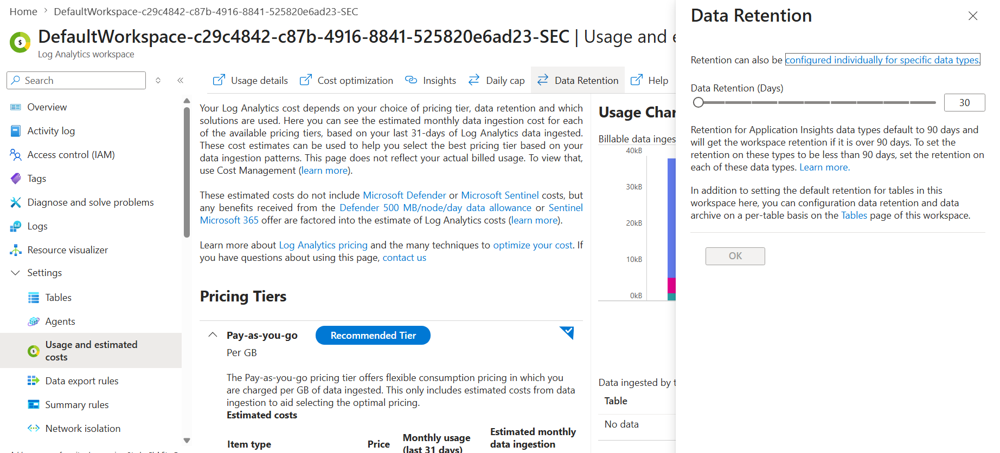

| Log Type              | Retention                  |
| --------------------- | -------------------------- |
| Application logs      | 30-90 days                 |
| Infrastructure logs   | 90-180 days                |
| Security logs         | 180-365 days               |
| Audit/Compliance logs | 1-7 years (often archived) |

**Table Specific Retention**

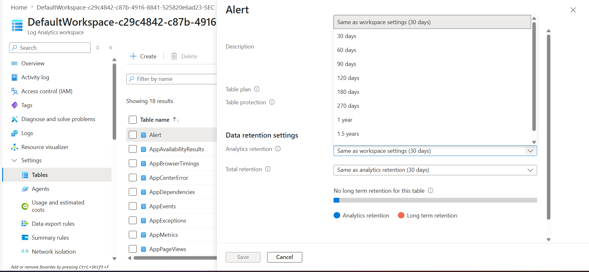

- Max : 2 years

## Azure Log Analytics Workspace Tables

```
AppServiceHTTPLogs - Azure Web Apps

Event - Azure VM

Heartbeat - Azure VM

AzureDiagnostics - Azure SQL Database

# EntraID SignIn Logs, errorCode is not equal to 0

SigninLogs
| where Status.errorCode <> 0
```
