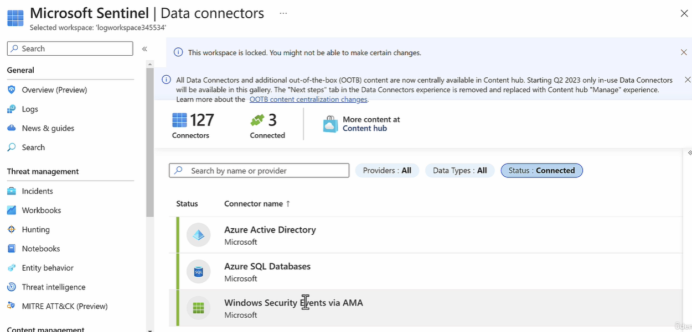
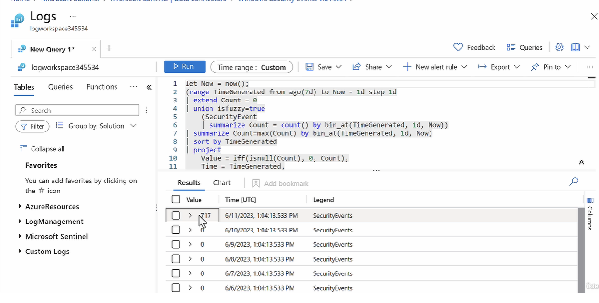
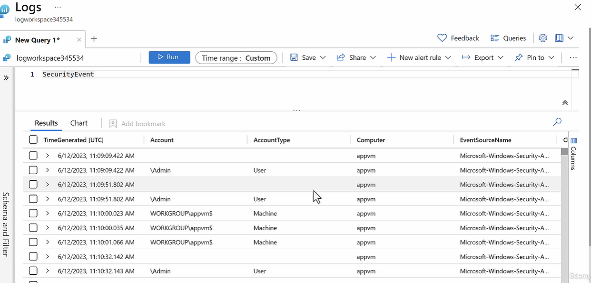

## Overview

It is a Security Monitoring Tool

Sentinel is a service that provide

- SIEM - Security Information Event Management
- SOAR - Security Orchestration Automated Response
  Solutions

Organizations use Microsoft Sentinel to collect, detect, investigate, and respond to security threats across their IT environment.

- It collects data across users, devices, application and infrastructure (Cloud or on-premise)

- It can automate response to security threats

## How to add MS Sentinel to a workspace

- Go to MS Sentinel
  - Add to Workspace : < Choose LAW resource >

## What is the role of Data Connector in MS Sentinel

Data Connector is to connect to variety of sources for data collection.


**Data Connector Types**

- Windows Security Events
  - Create Data Collection Rule
    - Rule Name:
    - Subscription
      - Resource Group
    - Resouces : < Choose the Windows VM resource >
    - Collect events
      - All Security Events (Default)
      - Common
      - Minimal
      - Custom
        
- Azure SQL Database
- Azure EntraID

**Log Analytics Workspace Table**

```
SecurityEvent

```



## How to create a scheduled Query Rule in MS Sentinel

The main idea behind MS Sentinel is to collect security data from various resources into Log Analytics Workspace, and can find any suspicious activity using KQL


