## Azure Monitor

A complete monitoring solution where you can collect, analyse and respond to the data collected

- Pre-existing, we don't create any resource
- You can monitor both cloud and on-premise resources

## Features

- Metrics : Numeric values collected over time
  - Scope : < Choose Resource >
  - Metric : Depends on resource - Aggregation : Average

    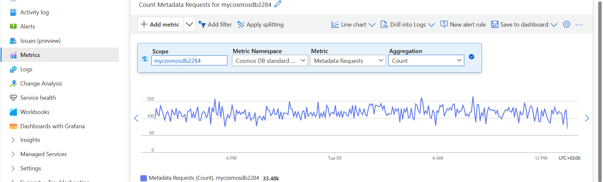

- Activity Log
  - Scope : < Choose Subscription >
    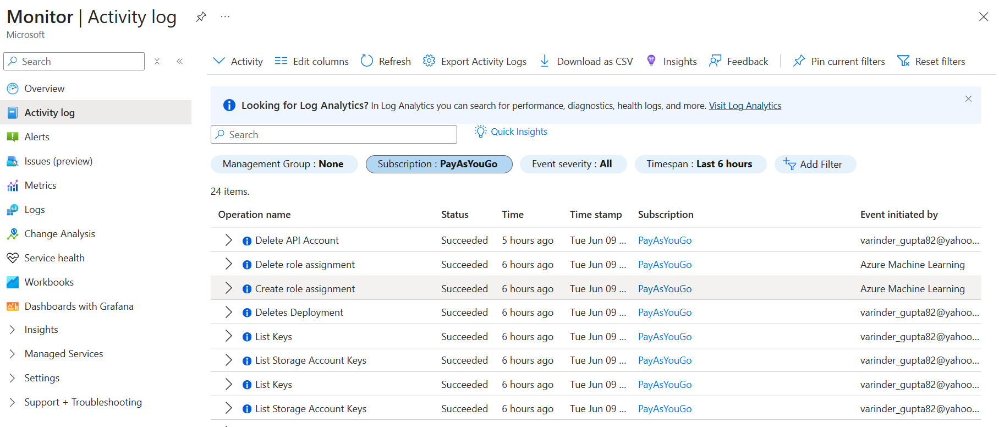

- Logs
  - Pre-requisite : Need Log Analytics Workspace
- Alerts

## Setting Up Alert

### Create Alert Rule

- Scope : < Choose Resource >
- Condition
  - Signal : < List of Metric depends on Resource >
    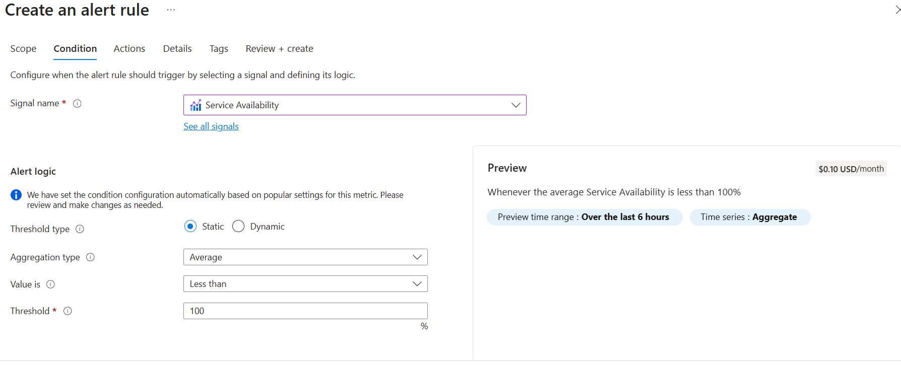
    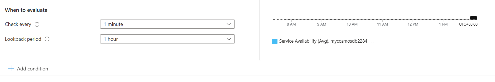
- Action
  - Action Group
    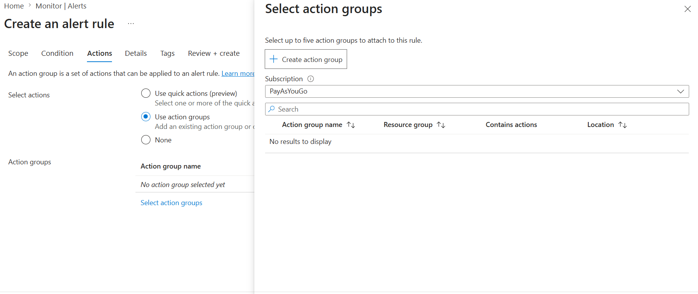
    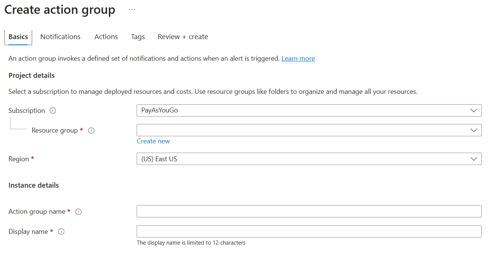
    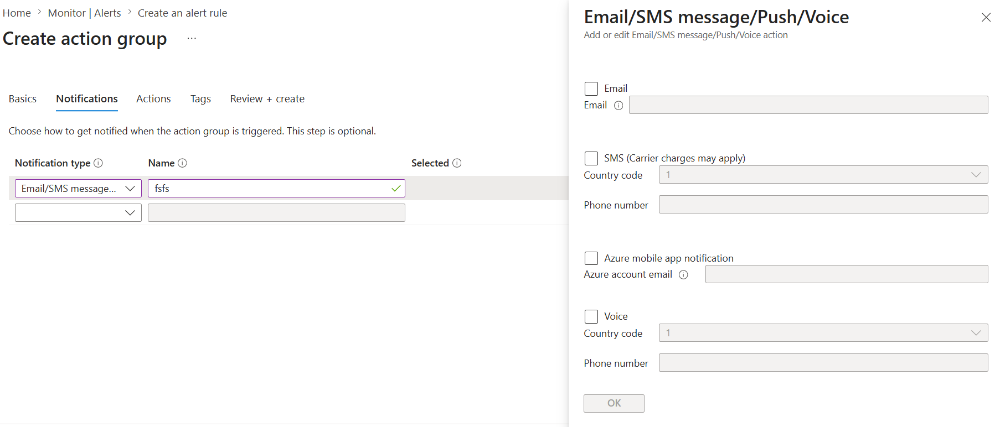
    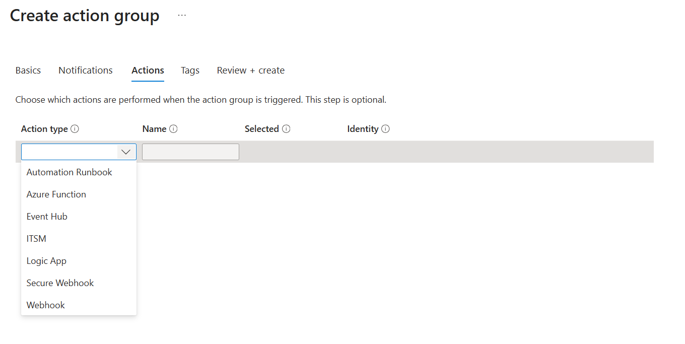
- Details
  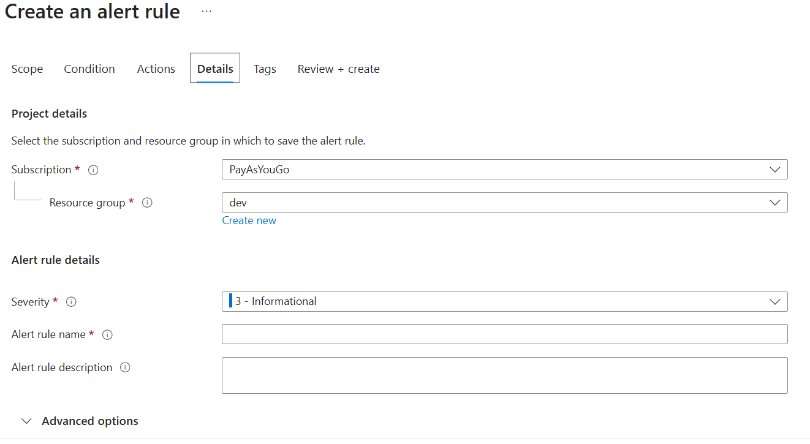

## Alert Logic - Dynamic Threshold

While creating a alert rule - condition, we need to choose threshold type

- Static : We decides, what should be the threshold value
  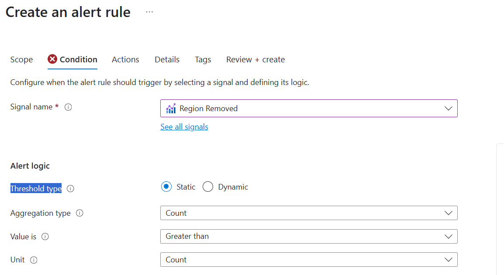
- Dynamic : Azure decides based on the past data, what should be the threshold value
  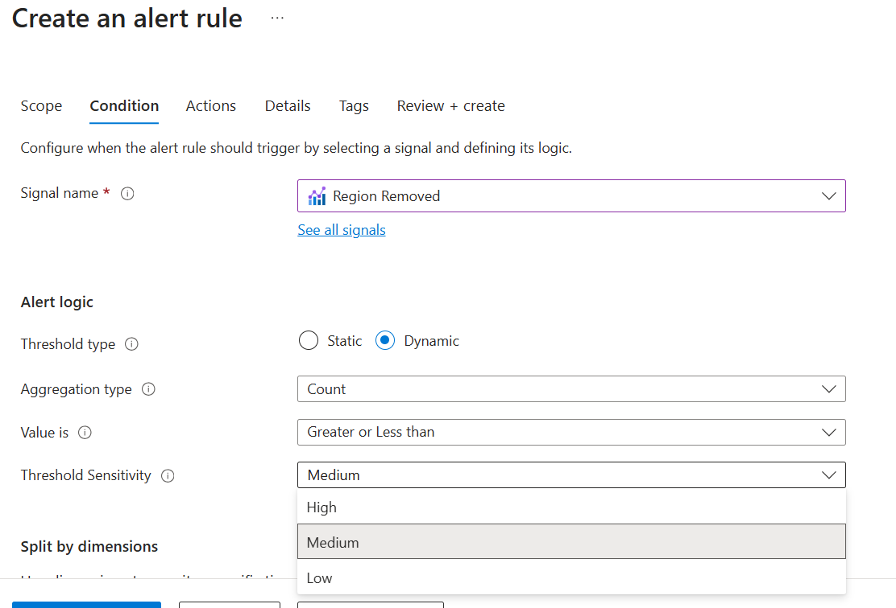

## Log Analytics Workspace

- Used for collect logs in one place
- Need to create resource (Doesn not pre-exists)
- Metix/Alerts can just tell us something went wrong, like CPU utalization is high, but to debug we need logs
- You use KQL (Kusto Query Language to Create Alerts/Dashboards)

- Web Apps can send logs to LAW via Diagnostic Logs
  - Steps
    - Choose Log Category
      - HTTP Logs
      - App Service Console Logs
      - App Service Application Logs
      - Access Audit Logs
      - App Servie Platform Logs
      - App Service Authentication Logs
    - Choose Destination
      - Log Analytics Workspace
      - Archieve to Storage Account
      - Stream to Event Hub
      - Send to Partner Solution

### Create Log Analytics Workspace

- Subscription
- Resource Group
- Name
- Location
  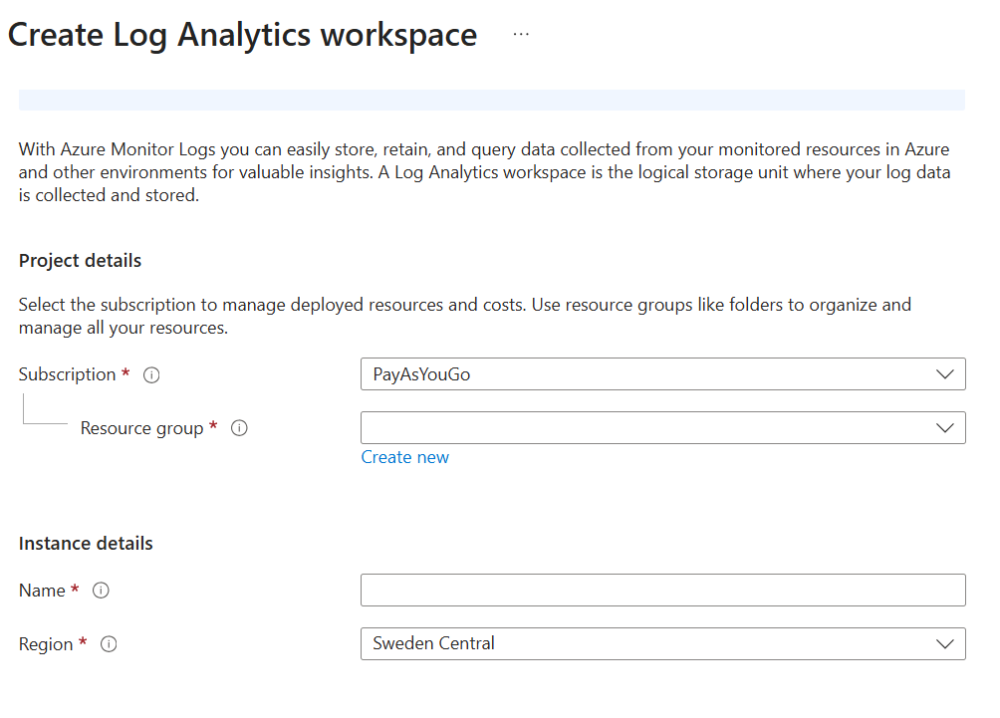

## Application Insight

A tool inside Azure Monitor

- It is a performance monitoring tool, use to monitor
  - requests
  - dependencies
  - excpetions
  - traces
  - UI experience
- It supports Opentelemetry to collect telemetry data.
- Helps in Observability and Peformance Monitoring

Investigates

- Application Dashboard : At a-glance assessment of application health and performance
- Live Metrics : A real-time analytics dashboard for insights into application activity and performance
- Search View
- Availability View
- Failures View
- Performance View
- Agent Details

- Monitoring
  - Alerts
  - Metrics
  - Logs
  - Workbooks : Interactive reports and dashboards
  - Dashboard with Grafana
    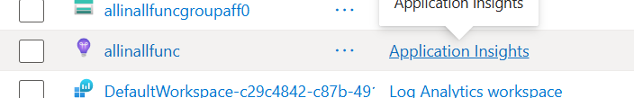
    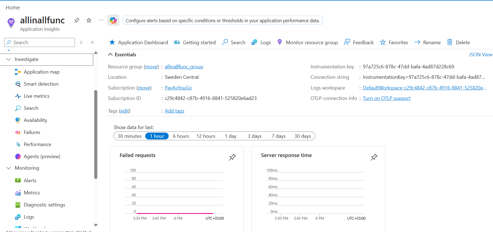

## How to enable Application Insight for Azure Web App

### Steps

- Choose an Azure Web App
  - Monitoring
    - Application Insights
      - Turn on Application Insights - Name : < Application Insight Resource Name >
      - Log Analytics Workspace Name < Choose/Create Log Analytics Workspace >

Application Insights collect data about your application, and need some place to store that data, so LAW is used for storing data.
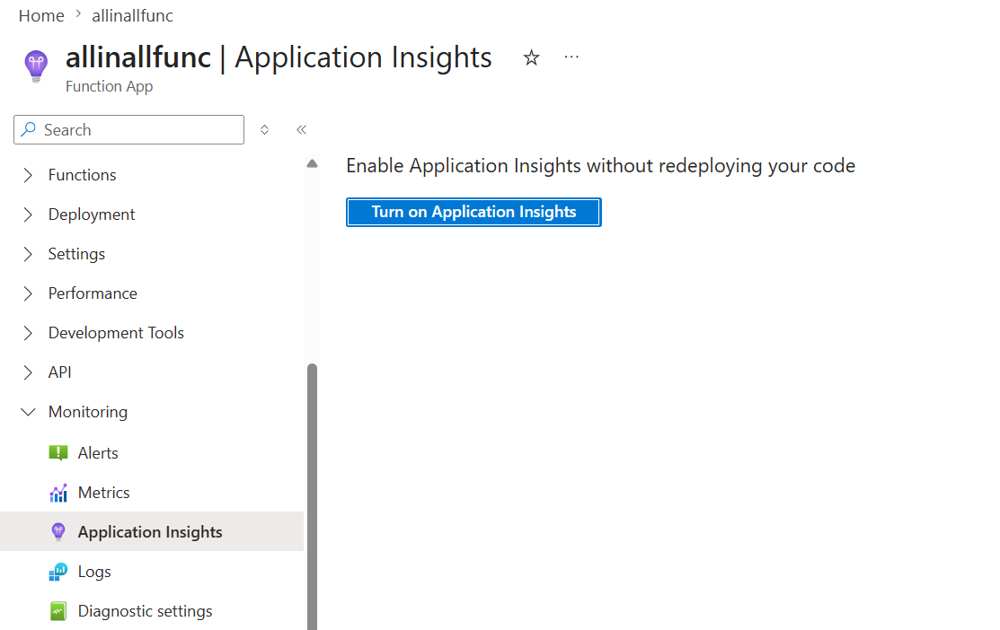
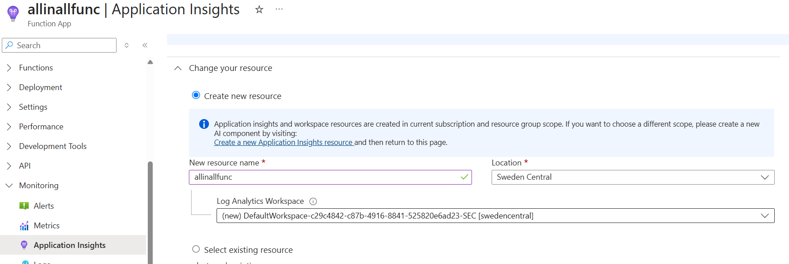
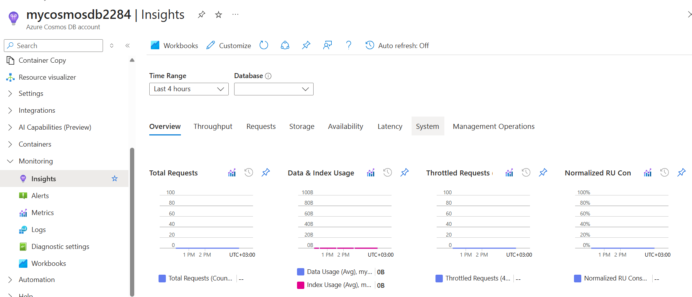


```
If you're looking for Insights under Monitoring for an Azure SQL Database/Managed Instance and can't find it, that's likely because SQL Insights was retired on 31 December 2024 and has been removed from the Azure portal. Microsoft now recommends Database Watcher for advanced SQL monitoring.

What you should see instead

For an Azure SQL Database, the common monitoring options are:

Monitoring → Metrics
Monitoring → Alerts
Monitoring → Logs (if Log Analytics is configured)
Intelligent Performance → Query Performance Insight
Intelligent Performance → Performance Recommendations
```

```
In case you enabled Application Insight on Web App, after choosign the LAW, you need to need to tell what all to collect

**Instrument you application**

Choose Runtime : Java/.Net/Python

- Collection level
- Profiler and Cost Optimization
- Snapshot debugger
- SQL Commands
```

## Application insight - Live Metrix View

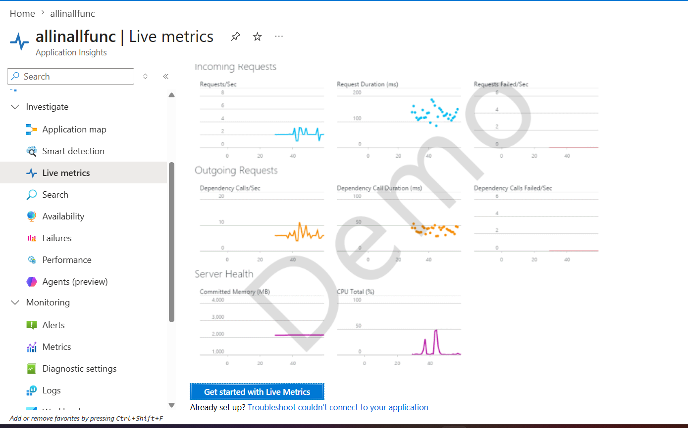

```
Enable live metrics with Azure Monitor OpenTelemetry by following language-specific guidelines:

ASP.NET: Not supported.
ASP.NET Core: Enabled by default.
Java: Enabled by default.
Node.js: Enabled by default.
Python: Enabled by default.`
```

## Application insight - Performance View

- Request Count
  - URL : /api/orders
  - Average Duration : x seconds
  - Count : 100
- CPU
- Storage
- Available Memory

Here if you click the request details, it gives you also which resourc it is hitting like SQL and what query it is passing (if 'SQL Commands' is enabled )

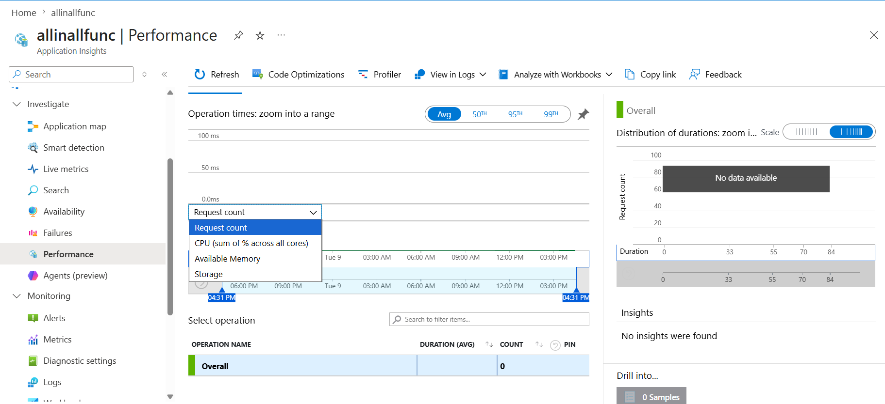

## Application insight - Application Map

Highlevel view to show, how application components are integrated like webapp, database, storage etc.

- who calling which component
- Calls made with avg. call time

## Application insight - Availability

Useful to execute schedules availability tests for multiple endpoints with average response time.
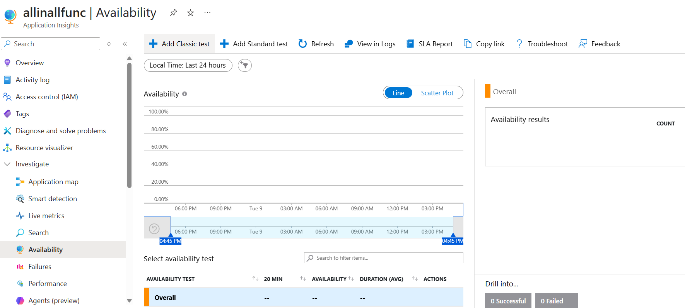

Test Types

- Classic Test
  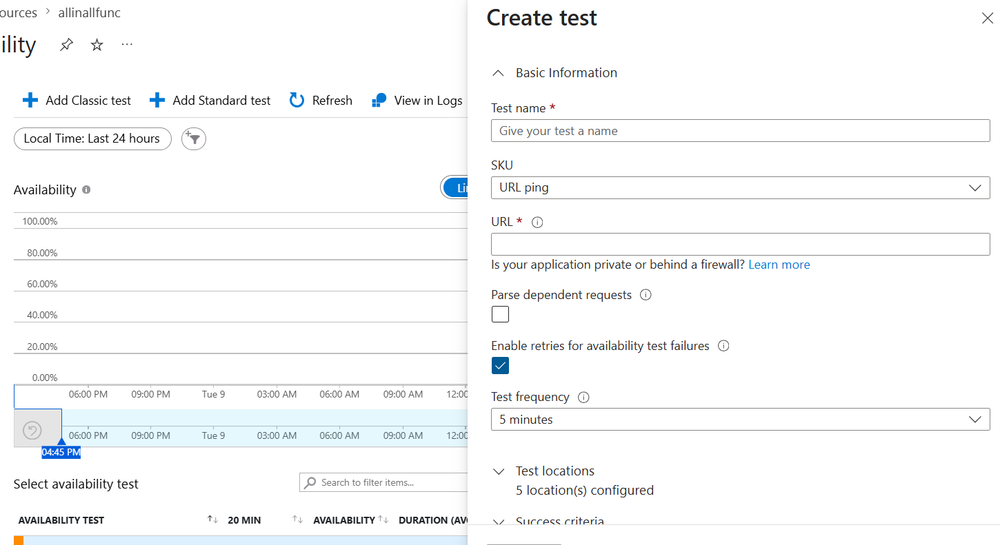
- Standard Test
  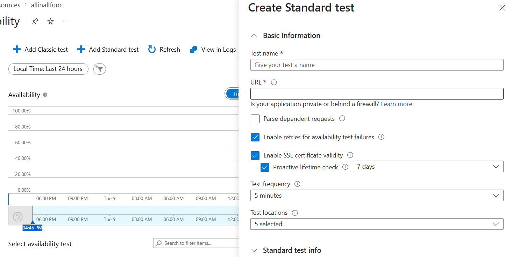
  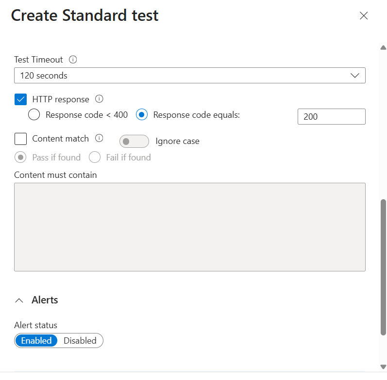

  These alerts are to any action group or email.

## Application insight - Other Features

- Users : Track and Analyse user interaction with your application
- Session : Session Trends
- Funnels : How users progress through a series of steps in your application
- User Flow : To identify most common routes and area where users are most engaged and encoutered issues
- Cohorts : Group Users or Events by common characteristics to analyse behaviour pattern, feature usage and impact of changes over time
- Active Users
- Authenticated User Timeline
- User Retention Analysis
- User Impact Analysis
- Usage Calander
  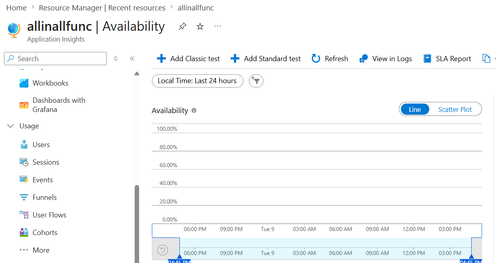
  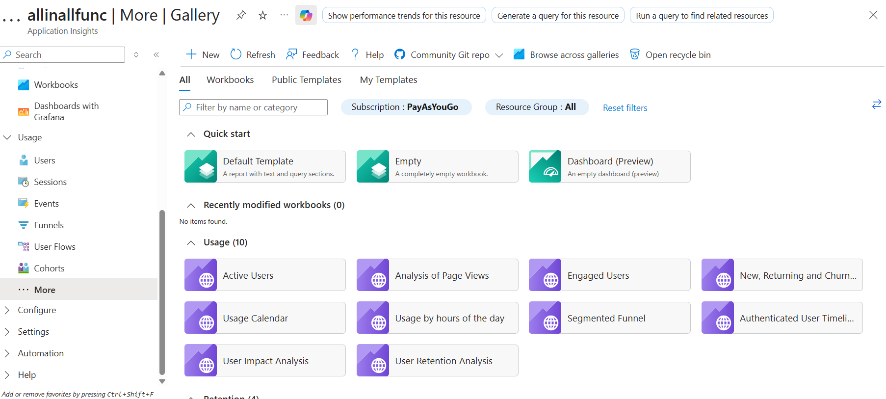

##

| Resource Type               | Application Insights Support           |                        |
| --------------------------- | -------------------------------------- | ---------------------- |
| Azure App Service           | Native integration                     |                        |
| Azure Functions             | Native integration                     |                        |
| Azure Kubernetes Service    | Via OpenTelemetry / Container Insights |                        |
| Azure Container Apps        | Supported                              |                        |
| Azure Spring Apps           | Supported                              |                        |
| Azure Service Fabric        | Supported                              |                        |
| Java Applications           | Supported                              |                        |
| .NET Applications           | Supported                              |                        |
| Node.js Applications        | Supported                              |                        |
| Python Applications         | Supported                              |                        |
| Applications running on VMs | Supported via SDK/OpenTelemetry        |                        |
| On-premises applications    | Supported via SDK/OpenTelemetry        |                        |
| Applications in AWS/GCP     | Supported via SDK/OpenTelemetry        | ([Microsoft Learn][1]) |

[1]: https://learn.microsoft.com/en-us/azure/azure-monitor/app/app-insights-overview?utm_source=chatgpt.com "Application Insights OpenTelemetry observability overview"
