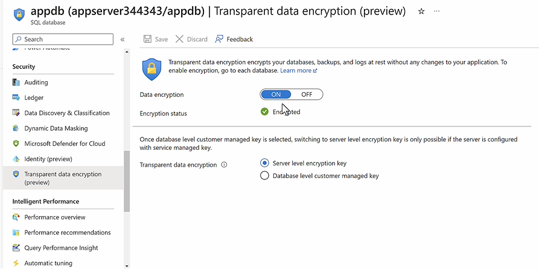
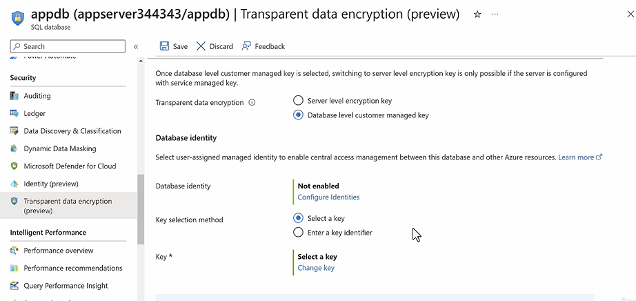

## Azure SQL Database - Deployment Options

- Install MS SQL Server on Azure VM (IaaS)
  - You have full admin access on the compute infrastructure
  - Operation Overhead
  - Usecase : You need to migrate an On-Premise SQL Server Data base of a specific version to Azure.
- Azure SQL Database Service (PaaS)
  - Full Managed Service
  - No Operation Overhead
  - No Acess to underlying infrastructure
  - Features (Under different Pricing Tier)
    - High Availability (By Default - as it store 3 replicas in an availability zone)
    - Auto data encryption at rest
    - Auto data encryption at flight
    - Auto Data Backup
    - MultGiple Data Redundancy Options
    - Automated Tunning
- Azure SQL Managed Instance (PaaS)
  - No Acess to underlying infrastructure
  - Usecase : You need to migrate an On-Premise SQL Server Data base of a latest SQL Server Enterprise Edition to Azure.
  - Native vNet Integration

**Rule of thumb**

- New build → Azure SQL Database
- Lift-and-shift SQL Server → Azure SQL Managed Instance
- Need OS-level control → SQL Server on Azure VM

## Overview

Full Managed MS SQL Database without operation overhead of server patching.

With additional Features

- Backup
- High Availability
- Scaling
- Monitoring

# Type

PaaS > DBaaS

[Go Back Home](../README.md)

## How to create a Azure SQL Database

**Project Detail**

- Subscription: subscriptionId
- Resource Group : resource group name

**Database Detail**

- Database Name : < Database name >
- Database Server:
  - Server Name: < unique-name >.database.windows.net
  - Region: Sweden Central

**Authentication**

- Authentication Method:
  - Use SQL authentication
    - Admin User Name : myadmin (can't use admin, administrator,root)
    - Admin Password: **\***
  - Use MS EntraId authentication
    - Select Admin user from Entra ID
  - Use both MS Entra and SQL authentication (Default)
- Want to use SQL elastic pool: Disabled (Default)
  - Enabled
    - Elastic Pool
    - Name : Elastic Pool Name
  - Disabled
    - Workload environment
      - Development/Test (Default)
      - Production
    - Compute & Storage
      - Service Tier ## Tip : Cost Factor
        - DTU Based Purchasing Model (Database Transaction Unit - combines compute power)
          - Basic (For less demanding workload)
            - Max Data Storage (2 GB)
            - Max DTU : 5
          - Standard (Budget Friendly)
            - Max Data Storage (1 TB based on DTU)
            - Max DTU : 3000
          - Premium (Highest Availability and Performance)
            - Max Data Storage (4 TB based on DTU)
            - Max DTU : 4000
        - vCore Based Purchasing Model : Here you can decide on no. of vCore and Size of Database
          - General Purpose (Most Budget Friendly) - Max 4 TB Storage
            - Compute Tier :
              - Provisioned : Compute resources are pre-allocated. Billed per hour based on vCores configured​.
              - Serverless : Compute resources are auto-scaled​. Billed per second based on vCores used​.
          - Hyperscale (Higly Scalable Compute and storage as both are separete layers,can scale up to 100 TB)
            - Compute Tier :
              - Provisioned : Compute resources are pre-allocated, Billed per hours based on vCore allocated
              - Serverless : Compute resources are auto-scaled, Billed per second based on vCore Used - Storage Tier :
          - Business Critical (Highly Available and Peformance)

  **Note:** You can switch between tiers anytime, with a small downtime

  **Tip : Cost Benefit** vCore Provisioned Type offer **Hybrid Benefit Model** feature, where you can use your MS SQL Server Licenses as per enterprise aggrement with MS

  **Tip : Cost Benefit** vCore - Serverless Types offer **Auto Pause** feature, where the database will autopause when not being used for long

  **Tip : Scaling** vCore - Serverless Types autoscale based on demand

  
  Elastic pools provide a simple and cost effective solution for managing the performance of multiple databases within a fixed budget. An elastic pool provides compute (eDTUs) and storage resources that are shared between all the databases it contains. Databases within a pool only use the resources they need, when they need them, within configurable limits. The price of a pool is based only on the amount of resources configured and is independent of the number of databases it contains.

  | Feature                   | General Purpose Serverless        | Hyperscale Serverless                   |
  | ------------------------- | --------------------------------- | --------------------------------------- |
  | Typical Use Case          | Small-to-medium workloads         | Large-scale workloads                   |
  | Max Database Size         | Up to 4 TB                        | Up to 100 TB                            |
  | Storage Architecture      | Local SSD + remote storage        | Distributed storage layer               |
  | Compute Scale             | Auto-scales up/down               | Auto-scales up/down                     |
  | Auto-pause                | Yes                               | Yes (newer serverless offering)         |
  | Scale-up Speed            | Minutes                           | Faster, near-instant for storage growth |
  | Read Replicas             | No                                | Yes                                     |
  | Backup/Restore Speed      | Standard                          | Very fast snapshots                     |
  | Cost Efficiency           | Better for intermittent workloads | Better for large databases              |
  | Migration from SQL Server | Good                              | Better for very large databases         |

**Read Replica** is only available in

- DTU Based
  - Premium
- vCore Bases
  - HyperScalar
  - Business Critical

**Backup storage redundancy**

- Backup Storage Redundancy:
  - Locally-Redundant Backup Storage
  - Zone-Redundant Backup Storage
  - Geo-Redundant Backup Storage (Default) ## Tip: Cost Saving
  - Geo-Zone-Redundant Backup Storage

**Firewall rules**

- Allow Azure services and resources to access this server : Enabled(Default)
- Add current client IP address\* : Disabled (Default)

- Private endpoints : Disabled (Default)
  - Name
  - Virtual Network
  - Subnet
  - Private DNS Zone : Enabled (Default)
    - Name

- Encrypted connections : Enabled (Default)
  - Minimum TLS version : TLS1.2

**Security**

- Microsoft Defender for SQL : Disabled (Default)
  - Name

- Data Source
  - None (Default)
  - Backup
  - Sample
- Maintenance window (Default : 5 PM - 8 AM )

**Tags**

- Name / Value

## How to implement Zone Redundancy in Azure SQL Database ##Tip : Security Feature

Zone-redundancy in Azure SQL Database replicates your database across multiple Availability Zones within the same Azure region. If one zone fails, Azure automatically fails over to a replica in another zone with minimal interruption.

- High Availability within a zone is built into the service by default through replicas managed by Azure.
- Zone redundancy is optional and must be enabled when supported by the service tier and region.
- When enabled, Azure places replicas across different Availability Zones.

```
Without Zone Redundancy
Region
 └─ Zone 1
     ├─ Primary
     └─ Replicas

With Zone Redundancy
Region
 ├─ Zone 1 → Primary
 ├─ Zone 2 → Replica
 └─ Zone 3 → Replica
```

Important: Zone redundancy is only available for supported service tiers (typically Premium, Business Critical, and certain Hyperscale configurations).

##

### Backup and Retension

In Azure SQL Database, backups are automatic and managed by Microsoft — that’s why you don’t see a backup schedule during creation.

| Backup Type            | Frequency          |
| ---------------------- | ------------------ |
| Full backup            | Weekly             |
| Differential backup    | Every 12–24 hours  |
| Transaction log backup | Every 5–10 minutes |

| Tier     | Default PITR Retention |
| -------- | ---------------------- |
| Basic    | 7 days                 |
| Standard | 7–35 days              |
| Premium  | 7–35 days              |

| Feature          | Solves                                  |
| ---------------- | --------------------------------------- |
| Managed Identity | Authentication / authorization          |
| Private Endpoint | Network security / private connectivity |

## How to implement Passwordless authentication

Azure Function -- Azure SQL Database

**Steps**

Step 1: Enable Managed Identity

Navigate to

```
Azure Function
    → Identity
    → System Assigned
    → Status = On
    → Save
```

Azure creates:

```
Managed Identity
       ↓
Service Principal
```

Step 2: Configure Azure SQL Entra Admin

Without this step, Entra authentication won't work.

Navigate to:

```
Azure SQL Server
    → Microsoft Entra ID
    → Set Admin
```

Choose:

Yourself
DBA group

Step 3: Connect as Entra Admin

```
Microsoft Entra ID - Universal
```

Step 4: Create User for Managed Identity

Connect to the database and run:

```
CREATE USER [my-function-app]
FROM EXTERNAL PROVIDER;
```

Grant permissions:

```
ALTER ROLE db_datareader
ADD MEMBER [my-function-app];

ALTER ROLE db_datawriter
ADD MEMBER [my-function-app];
```

Step 5: Application Code

Connection String

```
Server=tcp:myserver.database.windows.net;
Database=mydb;
Encrypt=True;
TrustServerCertificate=False;
```

```
var connection = new SqlConnection(
    connectionString);

var credential = new DefaultAzureCredential();

var token = credential.GetToken(
    new TokenRequestContext(
        new[] { "https://database.windows.net/.default" }));

connection.AccessToken = token.Token;

await connection.OpenAsync();
```

## Azure SQL - Transparent Data Encryption

By Default, Azure SQL Database is encrypted by Azure Managed Encryption key,



You can also use you custom managed key to encrypt the data.


