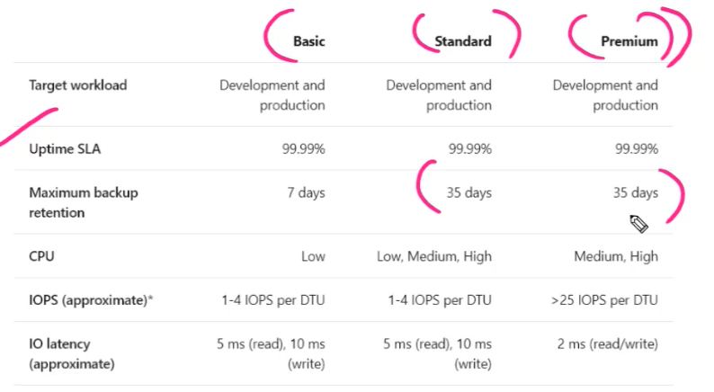
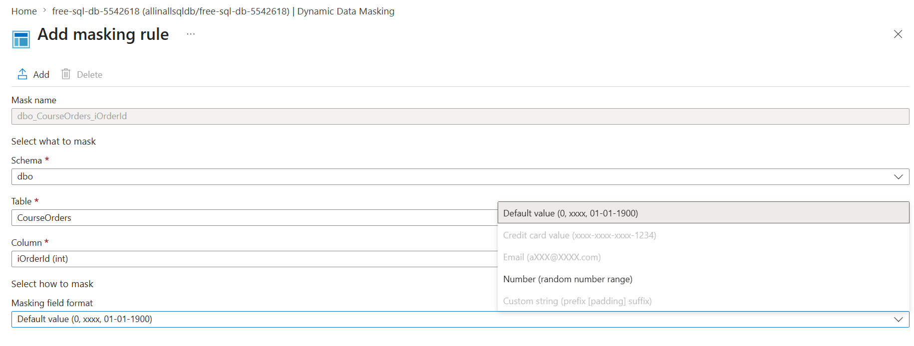
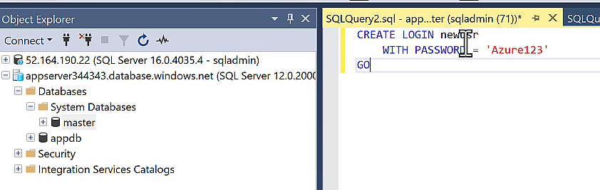
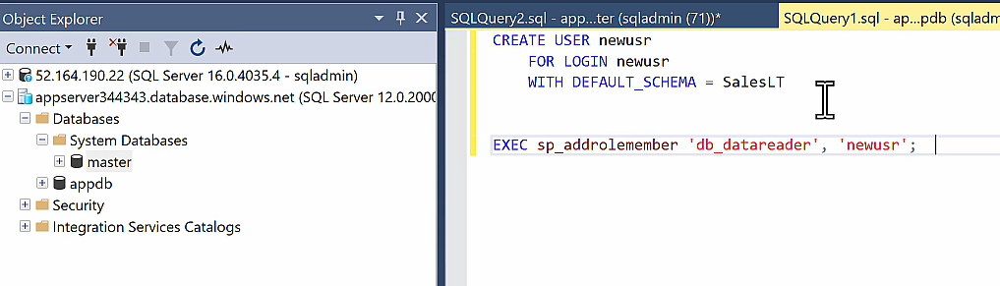
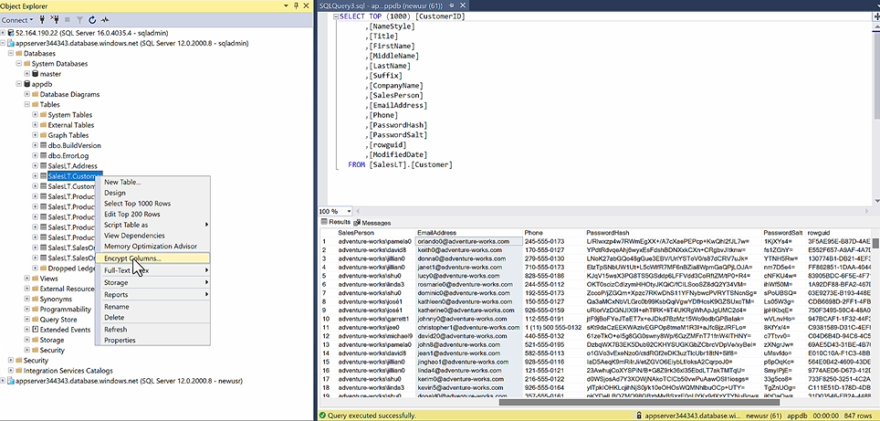
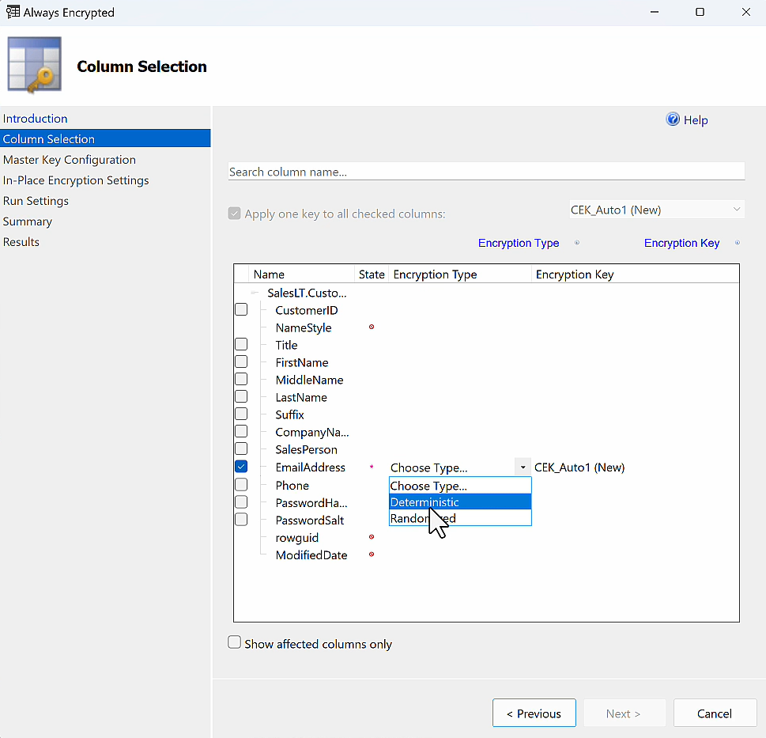
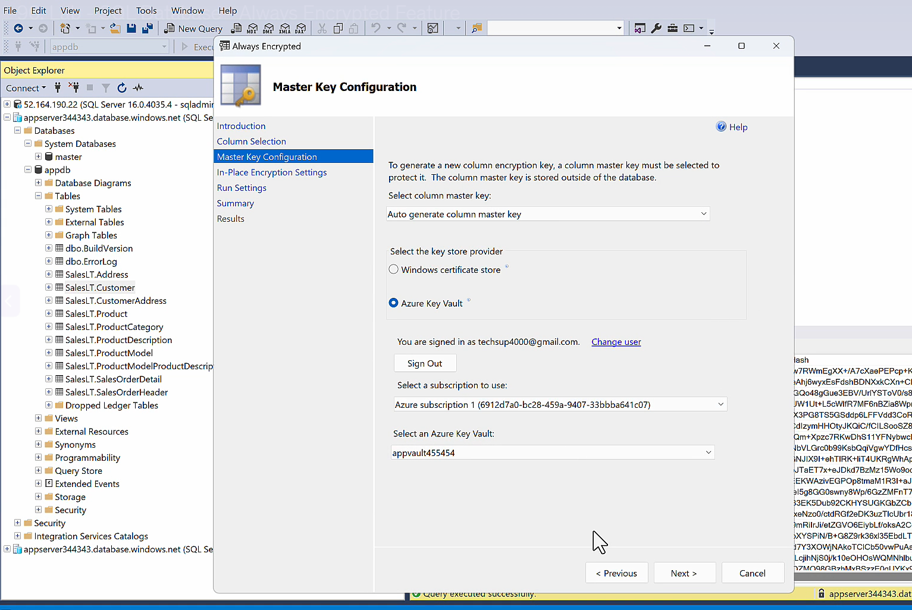

## Azure SQL Database - Deployment Options

- Install MS SQL Server on Azure VM (IaaS)
  - You have full admin access on the compute infrastructure
  - Operation Overhead
  - Usecase : You need to migrate an On-Premise SQL Server Data base of a specific version to Azure.
- Azure SQL Database Service (PaaS)
  - Full Managed Service
  - No Operation Overhead
  - No Acess to underlying infrastructure
  - Features (Under different Pricing Tier)
    - High Availability (By Default - as it store 3 replicas in an availability zone)
    - Auto data encryption at rest
    - Auto data encryption at flight
    - Auto Data Backup
    - MultGiple Data Redundancy Options
    - Automated Tunning
- Azure SQL Managed Instance (PaaS)
  - No Acess to underlying infrastructure
  - Usecase : You need to migrate an On-Premise SQL Server Data base of a latest SQL Server Enterprise Edition to Azure.
  - Native vNet Integration

**Rule of thumb**

- New build → Azure SQL Database
- Lift-and-shift SQL Server → Azure SQL Managed Instance
- Need OS-level control → SQL Server on Azure VM

## Overview

Full Managed MS SQL Database without operation overhead of server patching.

With additional Features

- Backup
- High Availability
- Scaling
- Monitoring

# Type

PaaS > DBaaS

[Go Back Home](../README.md)

## How to create a Azure SQL Database

**Project Detail**

- Subscription: subscriptionId
- Resource Group : resource group name

**Database Detail**

- Database Name : < Database name >
- Database Server:
  - Server Name: < unique-name >.database.windows.net
  - Region: Sweden Central

**Authentication**

- Authentication Method:
  - Use SQL authentication
    - Admin User Name : myadmin (can't use admin, administrator,root)
    - Admin Password: **\***
  - Use MS EntraId authentication
    - Select Admin user from Entra ID
  - Use both MS Entra and SQL authentication (Default)
- Want to use SQL elastic pool: Disabled (Default)
  - Enabled
    - Elastic Pool
    - Name : Elastic Pool Name
  - Disabled
    - Workload environment
      - Development/Test (Default)
      - Production
    - Compute & Storage
      - Service Tier ## Tip : Cost Factor
        - DTU Based Purchasing Model (Database Transaction Unit - combines compute power)
          - Basic (For less demanding workload)
            - Max Data Storage (2 GB)
            - Max DTU : 5
          - Standard (Budget Friendly)
            - Max Data Storage (1 TB based on DTU)
            - Max DTU : 3000
          - Premium (Highest Availability and Performance)
            - Max Data Storage (4 TB based on DTU)
            - Max DTU : 4000
        - vCore Based Purchasing Model : Here you can decide on no. of vCore and Size of Database
          - General Purpose (Most Budget Friendly) - Max 4 TB Storage
            - Compute Tier :
              - Provisioned : Compute resources are pre-allocated. Billed per hour based on vCores configured​.
              - Serverless : Compute resources are auto-scaled​. Billed per second based on vCores used​.
          - Hyperscale (Higly Scalable Compute and storage as both are separete layers,can scale up to 100 TB)
            - Compute Tier :
              - Provisioned : Compute resources are pre-allocated, Billed per hours based on vCore allocated
              - Serverless : Compute resources are auto-scaled, Billed per second based on vCore Used - Storage Tier :
          - Business Critical (Highly Available and Peformance)

  **Note:** You can switch between tiers anytime, with a small downtime

  **Tip : Cost Benefit** vCore Provisioned Type offer **Hybrid Benefit Model** feature, where you can use your MS SQL Server Licenses as per enterprise aggrement with MS

  **Tip : Cost Benefit** vCore - Serverless Types offer **Auto Pause** feature, where the database will autopause when not being used for long

  **Tip : Scaling** vCore - Serverless Types autoscale based on demand

  
  Elastic pools provide a simple and cost effective solution for managing the performance of multiple databases within a fixed budget. An elastic pool provides compute (eDTUs) and storage resources that are shared between all the databases it contains. Databases within a pool only use the resources they need, when they need them, within configurable limits. The price of a pool is based only on the amount of resources configured and is independent of the number of databases it contains.

  | Feature                   | General Purpose Serverless        | Hyperscale Serverless                   |
  | ------------------------- | --------------------------------- | --------------------------------------- |
  | Typical Use Case          | Small-to-medium workloads         | Large-scale workloads                   |
  | Max Database Size         | Up to 4 TB                        | Up to 100 TB                            |
  | Storage Architecture      | Local SSD + remote storage        | Distributed storage layer               |
  | Compute Scale             | Auto-scales up/down               | Auto-scales up/down                     |
  | Auto-pause                | Yes                               | Yes (newer serverless offering)         |
  | Scale-up Speed            | Minutes                           | Faster, near-instant for storage growth |
  | Read Replicas             | No                                | Yes                                     |
  | Backup/Restore Speed      | Standard                          | Very fast snapshots                     |
  | Cost Efficiency           | Better for intermittent workloads | Better for large databases              |
  | Migration from SQL Server | Good                              | Better for very large databases         |

**Read Replica** is only available in

- DTU Based
  - Premium
- vCore Bases
  - HyperScalar
  - Business Critical

**Backup storage redundancy**

- Backup Storage Redundancy:
  - Locally-Redundant Backup Storage
  - Zone-Redundant Backup Storage
  - Geo-Redundant Backup Storage (Default) ## Tip: Cost Saving
  - Geo-Zone-Redundant Backup Storage

**Firewall rules**

- Allow Azure services and resources to access this server : Enabled(Default)
- Add current client IP address\* : Disabled (Default)

- Private endpoints : Disabled (Default)
  - Name
  - Virtual Network
  - Subnet
  - Private DNS Zone : Enabled (Default)
    - Name

- Encrypted connections : Enabled (Default)
  - Minimum TLS version : TLS1.2

**Security**

- Microsoft Defender for SQL : Disabled (Default)
  - Name

- Data Source
  - None (Default)
  - Backup
  - Sample
- Maintenance window (Default : 5 PM - 8 AM )

**Tags**

- Name / Value

## How to implement Zone Redundancy in Azure SQL Database ##Tip : Security Feature

Zone-redundancy in Azure SQL Database replicates your database across multiple Availability Zones within the same Azure region. If one zone fails, Azure automatically fails over to a replica in another zone with minimal interruption.

- High Availability within a zone is built into the service by default through replicas managed by Azure.
- Zone redundancy is optional and must be enabled when supported by the service tier and region.
- When enabled, Azure places replicas across different Availability Zones.

```
Without Zone Redundancy
Region
 └─ Zone 1
     ├─ Primary
     └─ Replicas

With Zone Redundancy
Region
 ├─ Zone 1 → Primary
 ├─ Zone 2 → Replica
 └─ Zone 3 → Replica
```

Important: Zone redundancy is only available for supported service tiers (typically Premium, Business Critical, and certain Hyperscale configurations).

##

### Backup and Retension

In Azure SQL Database, backups are automatic and managed by Microsoft — that’s why you don’t see a backup schedule during creation.

| Backup Type            | Frequency          |
| ---------------------- | ------------------ |
| Full backup            | Weekly             |
| Differential backup    | Every 12–24 hours  |
| Transaction log backup | Every 5–10 minutes |

| Tier     | Default PITR Retention |
| -------- | ---------------------- |
| Basic    | 7 days                 |
| Standard | 7–35 days              |
| Premium  | 7–35 days              |

| Feature          | Solves                                  |
| ---------------- | --------------------------------------- |
| Managed Identity | Authentication / authorization          |
| Private Endpoint | Network security / private connectivity |

## How to implement Passwordless authentication

Azure Function -- Azure SQL Database

**Steps**

Step 1: Enable Managed Identity

Navigate to

```
Azure Function
    → Identity
    → System Assigned
    → Status = On
    → Save
```

Azure creates:

```
Managed Identity
       ↓
Service Principal
```

Step 2: Configure Azure SQL Entra Admin

Without this step, Entra authentication won't work.

Navigate to:

```
Azure SQL Server
    → Microsoft Entra ID
    → Set Admin
```

Choose:

Yourself
DBA group

Step 3: Connect as Entra Admin

```
Microsoft Entra ID - Universal
```

Step 4: Create User for Managed Identity

Connect to the database and run:

```
CREATE USER [my-function-app]
FROM EXTERNAL PROVIDER;
```

Grant permissions:

```
ALTER ROLE db_datareader
ADD MEMBER [my-function-app];

ALTER ROLE db_datawriter
ADD MEMBER [my-function-app];
```

Step 5: Application Code

Connection String

```
Server=tcp:myserver.database.windows.net;
Database=mydb;
Encrypt=True;
TrustServerCertificate=False;
```

```
var connection = new SqlConnection(
    connectionString);

var credential = new DefaultAzureCredential();

var token = credential.GetToken(
    new TokenRequestContext(
        new[] { "https://database.windows.net/.default" }));

connection.AccessToken = token.Token;

await connection.OpenAsync();
```

## Azure SQL - Transparent Data Encryption

By Default, Azure SQL Database is encrypted by Azure Managed Encryption key,


You can also use you custom managed key to encrypt the data.


## Dynamic Data Masking (Tip : Security Feature)

A techinique to limit the exposure of data in a Database.

**UseCase** : you don't want nonadmin users to access credit card information in yout table

Different Data Masking Rule :

- Default
- Email : First letters of the emal is exposed and the domain is replaced with \*\*\*
- Custom Text : Here we decide which characters to expose for a particular cölumn/field
- Credit Card Masking Rule : Here only last 4 digits are exposed. used to mask field/column containinig credit card information
- Random Number : Here you generate a random number for a column/Field

### Steps to implement Dynamic Data masking in Azure SQL Database

- Login to Azure > Goto Azure SQL Database Resource > Dynamic Data Masking
- Add Mask
  - Name : < schema > -< Table > - < Column > (AutoFilled)
  - Schema
  - Table
  - Column
  - Masking Rule
    - Default
    - Email
    - Custom Text
    - Credit Card
    - Random Number

  

To see the masking affect login with non-admin user, as masking does not affect admin user access.

## How to Create a non-admin user in Azure SQL Database

**Option 1:** Create a Read-Only User (Recommended)

```
USE appdb;
GO

CREATE USER app_reader
WITH PASSWORD = 'StrongPassword#123!';
GO

ALTER ROLE db_datareader
ADD MEMBER app_reader;
```

The user can query data but cannot modify it.

**Option 2:** Read + Write User

```
USE appdb;
GO

CREATE USER app_user
WITH PASSWORD = 'StrongPassword#123!';
GO

ALTER ROLE db_datareader
ADD MEMBER app_user;
GO

ALTER ROLE db_datawriter
ADD MEMBER app_user;
```

Permissions:

- SELECT
- INSERT
- UPDATE
- DELETE

No schema changes allowed.

**Option 3:** Restrict Access to Specific Schema

```
USE appdb;
GO

CREATE USER reporting_user
WITH PASSWORD = 'StrongPassword#123!';
GO

GRANT SELECT
ON SCHEMA::SalesLT
TO reporting_user;
```

This user can only read objects in the SalesLT schema.

**Option 4:** Azure AD User (Preferred for Enterprises)

`````
USE appdb;
GO

CREATE USER [john.doe@company.com]
FROM EXTERNAL PROVIDER;
GO

ALTER ROLE db_datareader
ADD MEMBER [john.doe@company.com];
````

Benefits:

- No SQL passwords
- MFA support
- Centralized identity management
- Easier auditing

| Role              | Permissions                  |
| ----------------- | ---------------------------- |
| db_datareader     | Read all tables/views        |
| db_datawriter     | Insert/Update/Delete         |
| db_ddladmin       | Create/Alter objects         |
| db_backupoperator | Backup related tasks         |
| db_owner          | Full database admin          |
| db_securityadmin  | Manage users and permissions |


For a typical application or reporting account, avoid db_owner and grant only db_datareader and/or specific schema permissions following the principle of least privilege.

Azure SQL Database uses contained database users. The user exists only within that specific database.

Azure SQL Server
│
├── master
│
├── appdb
│   └── reporting_user
│
└── anotherdb

If you create reporting_user in appdb, the user:

- Can connect only to appdb
- Has no access to anotherdb
- Is not a server-level login


SELECT DB_NAME() AS CurrentDatabase;
`````

If you want to create a server level user, used it in the application database here are the steps

- 

- Associate the non-admin user to your database
  

## Azure Database Encryption

Actually, Azure SQL Database data is encrypted both at rest and in transit by default.

**1. Encryption in Transit (Data in Flight)**

When a client connects to Azure SQL Database:

```
Application
    |
 TLS 1.2 / TLS 1.3
    |
Azure SQL Database
```

The connection is encrypted using TLS (Transport Layer Security).

**2. Encryption at Rest**

Azure SQL Database automatically uses Transparent Data Encryption (TDE).

```
Database Files
    |
    | TDE
    |
Encrypted Storage
```

**3. Backup Encryption**
Automatic backups are also encrypted.

```
Database
   |
Backup
   |
Encrypted
```

## Always Encrypted Feature

UseCase : We don't want event the database administator to see the data, we mark it as always encrypted, only accessible to the application.

**Why Enterprises Use Always Encrypted**

Typical sensitive fields:

- Social Security Numbers
- National IDs
- Credit Card Numbers
- Salary Data
- Healthcare Records
- Personal Identifiable Information (PII)

Compliance frameworks such as:

- PCI-DSS
- HIPAA
- GDPR
- Financial regulations

often require protection from privileged database administrators.

```
User
  |
  v
Web Application
  |
Managed Identity
  |
Azure Key Vault
  |
Column Master Key
  |
Azure SQL Database
```

Who gets access to the key?

- Not the end user.
- Not the DBA.
- The application identity.

```
Security Team
    |
    +--> Create Encryption key in Key Vault

Application Team
    |
    +--> Managed Identity gets Get/Wrap/Unwrap permissions

    Key Vault
    |
    +--> my-webapp Managed Identity
            Get
            WrapKey
            UnwrapKey

Deployment Pipeline
    |
    +--> Create CEK
    +--> Enable Always Encrypted on columns

DBA
    |
    +--> Manage database
    +--> No Key Vault access
```

For a regulated environment (banking, healthcare, government), I would recommend:

- DBA = Database administration only
- Security team = Key Vault administration only
- Application Managed Identity = Key usage only
- No individual should have both database admin rights and Key Vault key permissions

That's the architecture that gives you the real benefit of Always Encrypted: the DBA can manage the database but cannot view protected data.

**Separation of Duties**

| Principal            | Database       | Key Vault   |
| -------------------- | -------------- | ----------- |
| App Managed Identity | Read/Write     | Get Key     |
| DBA                  | Admin          | No Access   |
| Security Admin       | No Data Access | Manage Keys |

| Team             | Permissions                  |
| ---------------- | ---------------------------- |
| Database Team    | Azure SQL Database           |
| Security Team    | Azure Key Vault              |
| Application Team | Application Managed Identity |
| Auditors         | Read-only monitoring         |

| Encryption Type | Use when                                                 | Limitation                          |
| --------------- | -------------------------------------------------------- | ----------------------------------- |
| Deterministic   | Need equality search/join, e.g. `WHERE NationalID = @id` | Same value produces same ciphertext |
| Randomized      | Maximum protection                                       | Cannot search/join easily           |

So we prefer to use Always encrypted over Data Masking

**Steps to enable always encryption at column level in Database**




## Azure SQL Managed Instance

- Used in case you need to migrate on-premise MS SQL Server latest enterprise edition to Azure
- vNet Integration (Not available in Azure SQL Database)
  
