## Overview

There are differnet type of data and for each type Azure has different data storage options

**For Data Storage**

- Structure Data : Azure SQL Database
  - Azure SQL Database is basically an implementation of MS SQL Server on Azure cloude, full managed by Azure.
  - OLTP (Online Transaction Processing) System
- Semi-Structure (JSON ): Azure CosmosDB
  - Azure CosmosDB is no SQL Database
- Un-Structured Data (images/videos/backups files) : Storage Blob Storage

**For Data Analysis**

A general pratice for Data Analytics is not run analytics queries on the operation database like Azure SQL Database, instead first store the data into some datawarehouse - OLAP Operation.

- Azure Synapsis : Azure Datawarehouse solution
  - OLAP (OnLine Analytics Proceessing) System.
- Azure DataFactory : Transfer data to Azure Synapsis
- Azure Databricks : For Processing and Analysing your data.
- Azure DataLake Gen2 Storage Account

## Azure Storage Account

Azure Storage Account is a fully managed storage on cloud that is

- highly available
- Secure
- Scalable
- Durable
- Redundant.

Azure Storage Account includes

- Azure Blobs
- Azure Data Lake Storage Gen2
- Azure Files
- Azure Queues
- Azure Tables.

The cost of your storage account depends on the usage and the options you choose.

It is an object storage, so everything is stored as binary object.

### Type

Storage Account Service for unstructure data (Blob, Files, Archieve, Videos)

### Storage Account Types

- Standard General Purpose V2
  - Offer Services
    - Blob Storage Service : For Unstructured data (Images,Videos,Documents,Audio files)
      - Containers
    - File Share Service : For shared File Server
      - SMB - Server Message Block Protocol (Windows)
      - NFS - Network File Share Protocol (Linux)
    - Storage Queue Service : Basic Messaging Service
      - One Message Sender - One Message Receiver
    - Table Storage Service : Basic NoSQL Database
      - Key - Value
- Premium (Does not support access tiers and Global Redundancy)
  - Block Blob
  - Page Blob
  - File Share

### How to create a Storage Account

- Subscription
  - Resource Group
- Storage Account Name : < Unique Name >
  - lower case
  - no special character
  - 3-24 characters
- Region : Sweden Central
- Storage Type
  - Azure Blob Storage and Azure Data Lake Storage (Default)
  - Azure Files Storage
  - Azure Table Storage
  - Azure Queue Storage

## Storage Type = Azure Blob Storage and Azure Data Lake Storage

- Performance
  - Standard (For General Purpose)
    - Redundancy :
      - LRS
      - ZRS
      - GRS
      - GZRS

  - Premium (For low latency)
    - Block Blobs (BB): Low Latency and High Tranaction rate
      - Only 'Container' Option
    - File Shares : Enterprise High Performance Application
    - Page Blobs (PB): Random read/write operation
    - Redundancy :
      - LRS
      - ZRS

- Enable hierarchical namespace : Hierarchical namespace, complemented by Data Lake Storage Gen2 endpoint, enables file and directory semantics, accelerates big data analytics workloads, and enables access control lists (ACLs)
  - Enabled
    - Enable SFTP
    - Enable network file system v3

- Access tier ## Tip: Costing Factor (Only support GP V2 Storage Account)
  As there is also Cost associated with accessing the blobs
  - Storage Account and Blob Level
    - Hot : Optimized for frequent access (Default)
      - storage cost : high
      - Access cost : least
    - Cool : Optimized for infrequent access
      - Stored for min. 30 days else billed for that.
    - Cold : Optimized for rarely accessed and backup
      - Stored for min. 90 days else billed for that.
      - storage cost : less
      - Access cost : high
  - Blob Level Only
    - Archieve : For long term backups
      - Stored for min. 180 days else billed for that.
      - Rehydratation of data to Hot, Cool to access it, so take hours.
      - storage cost : minimal
      - Access cost : highest

- Public Network Access
  - Enabled (Default)
    - Still not anonymour access
    - This mean the endpoint is accessible via Intenet
  - Disable
    - Private Endpoint
      - Name
      - Virtual Network
      - Subnet
- Enable Versioning
  - Enabled
- Enabled Change Feed
  - Enabled
- Enable Soft delete for blobs
  - Enabled : 7 days
- Enable Soft delete for Containers
  - Enabled : 7 days
- Enable Point-in-time recovery
  - Enabled (then versioning, change feed, and blob soft delete must also be enabled)
- Allow Anonymous access on containers (Default : No annonymous access)
  - Enabled
- Enable Storage Account Key access
  - Enabled (Default)
- Require secure transfer for REST API operations : via HTTPS only
  - Enabled (Default)
- Enable Defender for Storage
  - Enabled
- Data encryption type : Enabled (Default) Data is encrypted at rest
  - Microsoft Managed Key (Default)
  - Customer Managed Key
- Infrastructure encryption : Disabled (Default)
  - Adds a second layer of encryption to your storage account’s data.
- Tags
  - Name/Value

```
<storage ac>.blob.core.windows.net/<Container>/<virtual folder>/<file>.<ext>
```

## Different Authentication Techiniques

There are different ways to authorize users to access data in azure storage account

1. Anonymous Access
2. Key Authorization
3. Shared Access Signature
4. MS Entra ID

### 1. Anonymous Access

- It can be used to give annonymous access to the data in storage account
- It is disabled by default (Most unsecure way)
- Use Case:
  - public website / images

There are two levels involved:

- Storage Account Level – "Allow Blob Anonymous Access"
- Container Level – Public access setting on each container

If you enable "Allow Blob Anonymous Access" on the storage account, you are only permitting containers to be made public.
You still cannot access blobs anonymously unless the container itself is configured for public access.

```
Storage Account: Allow anonymous access = Yes
Container: Private
Result: Anonymous access NOT allowed
```

```
Storage Account: Allow anonymous access = Yes
Container: Blob
Result: Anonymous read access to blobs
```

### 2. Key Authorization

- Each Storage Account gets 2 keys.
- Gives full access at storage account level. (Unsecure way)

### 3. Shared Access Signature

- Use case : For giving short term access to resource

- Generate temporary, fine-grained (Storage type level + Access) access Token
  - You can generate SAS at
    - blob level
    - container level
    - storae account level
- Only SAS at blob level : Accessible directly via browser
- SAS at Container Level
  - Permissions
    - Read
    - Add
    - List
    - Delete
    - Write
      
- SAS at Storage Account Level
  - 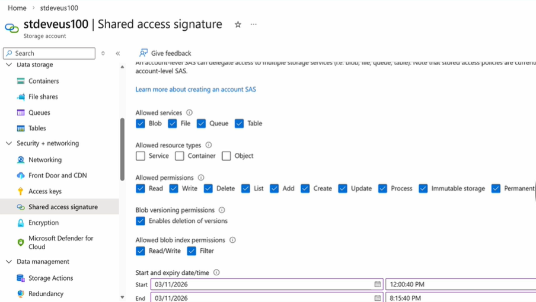

### 4. MS Entra ID

- Use RBAC to user Identities
  - Role
    - Reader
    - Storage Blob Data Reader
    - Storage Blob Data Writer

## Client to access Azure Storage Account

- Azure Storage Explorer (Client Tool)

## Stored Access Policy (SAP)

- Use Case : Shared Access Signature is a URL, what if URL is stolen.
- Options
  - Rotate Access Key
    - Drawback : Other applications using the key will also lose access
  - Use **Stored Access Policy**: Create SAS with SAP
    1. SAP is defined at container level with permissions (Choose multiple)
       - Read
       - Add
       - List
       - Delete
       - Write
       - Immutable Storage
    2. Create SAS with Permissions defined in SAP.
    3. Remove Permissions in the SAP.
       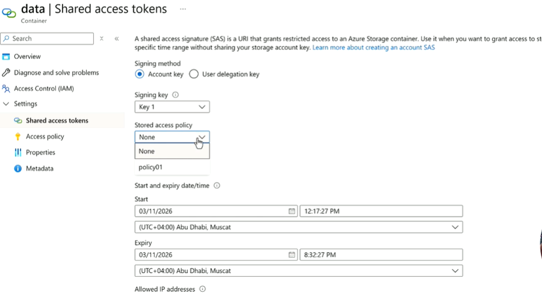
    - USER A - SAS without SAP --> URL A
    - USER B - SAS with SAP B --> URL B
    - USER C - SAS with SAP C --> URL C
      - Each User can have different permission based on the SAP
      - Now if user B URL is stolen, Just remove access from SAP B, so only URL B will be lose access.

## Life Cycle Management Policy

In Storage Account, there are two cost associated

- storage cost
- access cost

- Different Tier offer differnt storage and access cost, which is inversly propotional to each other.

So if our data is frequently access, we should save it in the hot tier
or if our data is rearly accssed, we should save it in the cold/archieve tier or delete if required.

To automate this transition of blob data from one tier to another, we use Lifecycle Management Rules.

Lifecycle Management Rules is defined as JSON :

- Transition blobs between hot,cool,cold,archieve tiers
- Delete current version, previous version after a period of time
- Applicable to Block Blob and Append Blob, not to system containers like $logs and $web
- These rules run periodically and can take 24 to take affect
- we can **filter** subset of blobs within storage account
- **Actions**
  - tierToHot
  - tierToCool
  - tierToCold
  - tierToArchieve
  - Delete
    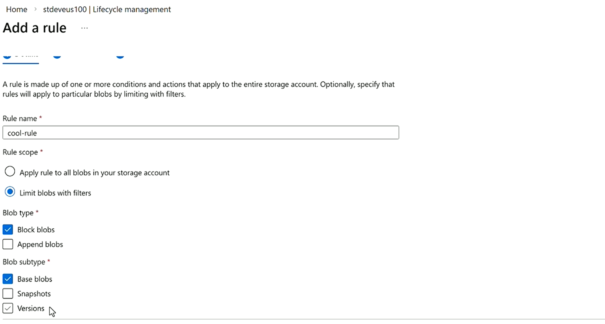
    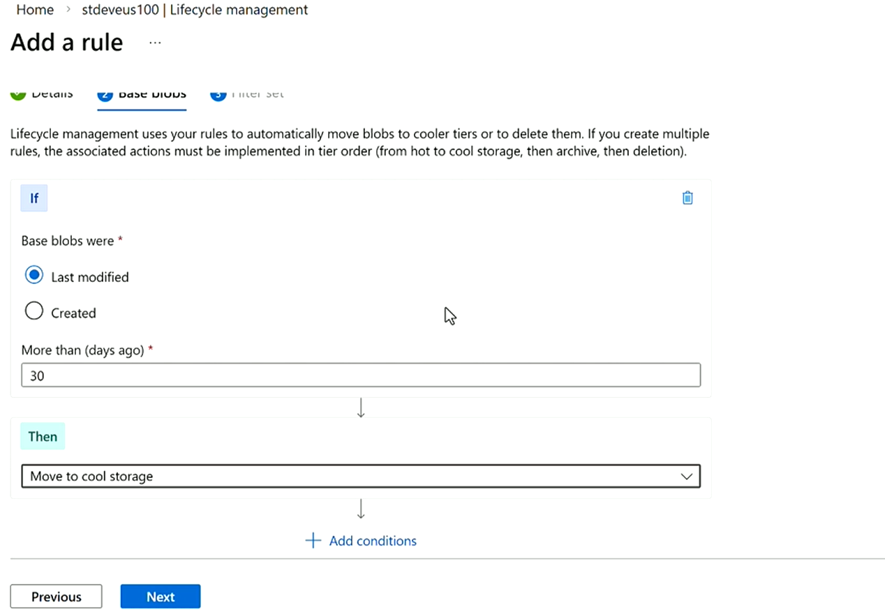
    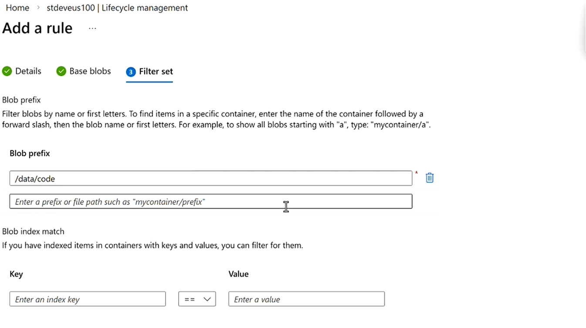

## Blob Snapshot

A readonly point-in-time copy of the blob

- Create Snapshot of a blob
  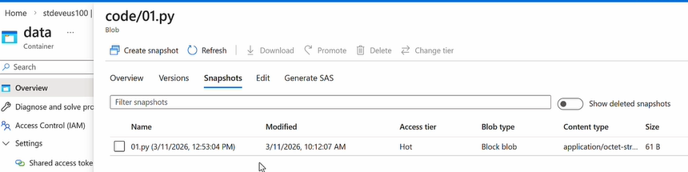
- Promote snapshot to restore to that snapshot
  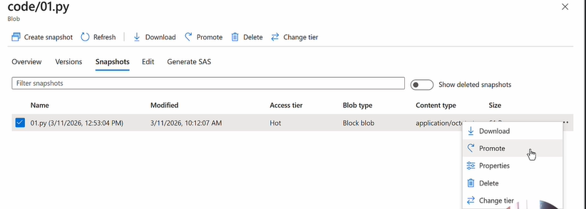

## Blob Versionoing

To keep track of each and every change made to a blob, So Azure automatically make a version of the blob for each change on the blob.

So instead of you creating a snapshot manually, at every point in time, you store multiple versions of the blob

- Keep all version
- Delete version after x days

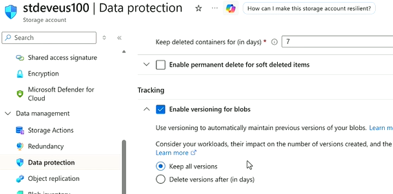

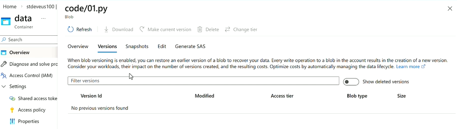

## Blob Metadata

Key-value pair associated to each blob for filtering like department name

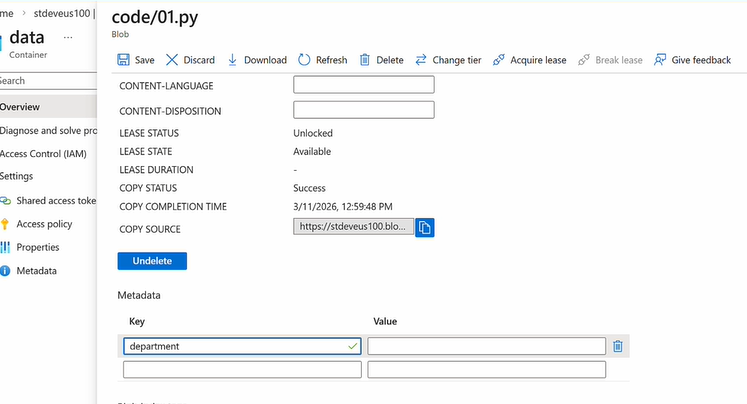

## Immutable Storage

Write Once, read many, so no modification is allowed

## AzCopy CLI Tool

To copy to/from azure storage account

## Static Web Hosting

You can host static website (HTML,JS, CSS) from a storage container named $web

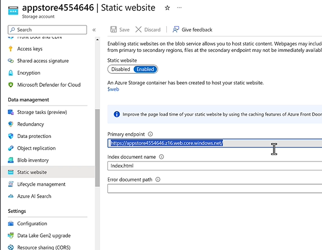

- If you need to support headers, use Azure CDN with it
- AuthN and AuthZ are not supported for authentication

If you need these feature use "Azure static web apps"

## Azure Blob concurrency

1. Optimistic concurrency : Using ETag blob property
   - Read blob and store ETag property
   - Update blob
   - Update if current ETag = stored ETag
2. Passimistic concurrency : Using Lease
   - Read blob and get lease (BlobleaseClient class)
   - Update blob
   - Update blob with leaseID
   - Relase the lease

## Azure Blob - change feed

The purpose of change feed is to provide transaction logs of all the changes that occur to the blobs and blobs metadata

- Change feed provides ordered, guaranteed, durable, immutable, read-only logs of these changes
- Each change guarantees exactly one transaction log entry, so won't have to manage multiple log entries for the same change.
- Enable us to build solutions that process change events occur in blob storage account at low cost either in streaming or in batch mode
  - Keep all logs
  - Delete change feed logs for X days

## Key Role

- Storage Blob Data Reader
- Storage Blob Data Contibutor
- Storage Blob Data Owner
- Storage Blob Delegator : Allow for user delegation key, used for signing SAS Token
