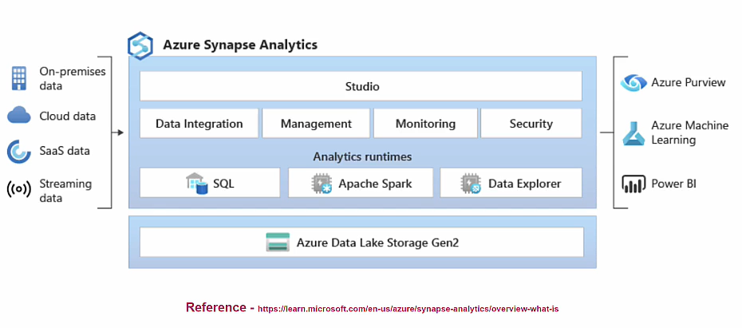

## Overview

It is an Azure Datawarehouse solutionm

- Provide centralized storage of data from different sources
- Primarly used by business for Data Analytics
- It is an OLTP system.
- Data is structured in the form of tables, but quite powerful as compared to Azure SQL Database.

  ## 

## How to create Azure Synapse workspace

**Project details**

- Subscription
  - Resource Group
- Managed Resource Group

**Workspace details**

- Workspace name : < Unique >
- Region :
- Select Data Lake Storage Gen2 : < Choose Data Lake Stroage>
  - Account name:
  - Container Name :

**Authentication**

- Authentication method
  - Use both local and Microsoft Entra ID authentication
    - SQL Server admin login
    - SQL Server admin password
  - Use only Microsoft Entra ID authentication

**Networking**

- Managed virtual network : Disabled (Default)
- Firewall rules
  - Allow connections from all IP addresses : Enabled (Default)
- Encrypted connections : TLS 1.2

**Tags**

- Name/Value
