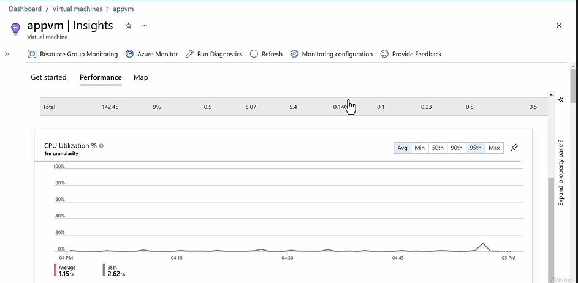
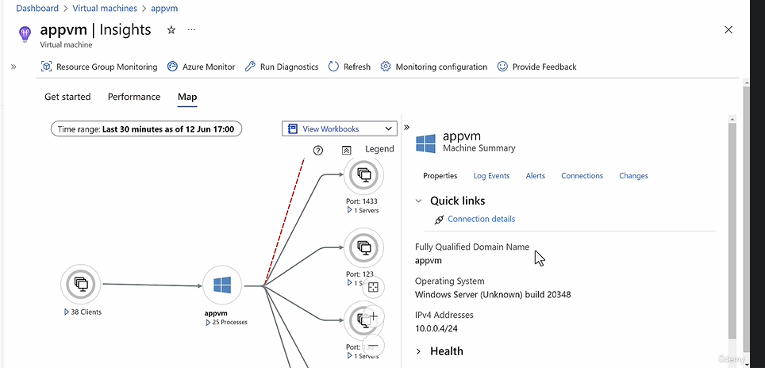

## Azure Virtual Machine

## Azure Availability Set

- Availability Zone Scoped
- While you create it you have to specify
  - Fault Domain
  - Update Domain
- So when you assign a VM to an Availability Set, the VM is distribute across the Fault Domain and Update Domain, to ensure highest possible availability in case of Updates like - Maintenacne or Faults like Power Outage.

## How to improve availability within an Availability Zone, where you want to keep the VMs together within an AZ

**Ansewer** : Use Availability Set (Azure VM Specific)

## How to improve availability within an Region, where you can to spread the VMs in different AZs

**Ansewer** : Use Availability Zone (Azure VM Specific)

## What is an Availability Zone

**Answer** Unique Phycial Datacenters with independent Power, Cooling and Networking.

```
Use Availability Zones whenever available; otherwise use Availability Sets with 3 Fault Domains and 20 Update Domains
```

## How we can get Performance Monitoring for Azure VM

- Enable VM insight For Azure Virtual Machines, like we do Application insights for Azure Web App.
- Choose a VM, Enable Insight
  - Insight : Disabled (Default)
    - Data Collection Rule : < Choose/Create a DCR >
      - Guest Performance : Enabled
      - Proecess and Dependency Map : Enable
      - Log Analytics Workspace : < Choose LAW Resource >

Once Enabled, when you to go to VM > Insight. It will show line charts


- If you go to Map Tab, you will see processes and port maped to VM


