## Virtual Network Peering

- Virtual networks are isolated from each other
  - so resources in vNet1 can not communicate to resource in vNet2 using private IP
- The vNets can be in different regions and subscriptions as well
- we can connect two virtual network with different address range using Virtual Network Peering

## How to create a vNet peering

It will create peering connection from both the vNets.
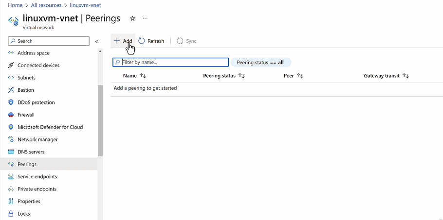

## Ways to connecting to On-premises networks

Virtual Network Peering , can connect two networks on the cloud, but what if we want to connect to an on-premise network. For this we need to setup VPN connection

VPN Connection Types:

- Point-To-Site VPN Connection
  - This is done using Azure Virtual Network Gateway
  - We attach this Azure Virtual Network Gateway to the Azure Virtual Network
  - We need an empty Gateway Subnet that will be used by the Azure Virtual Network Gateway, to facilitate the Client machine to connect to the resources in the virutal netowrk using private IP
    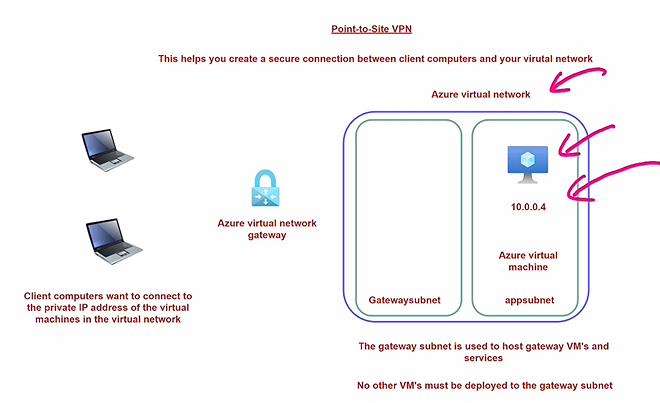
- Site-To-Site VPN Connection
  - Here On-Premise router connects to the Azure Virtual Network Gateway
    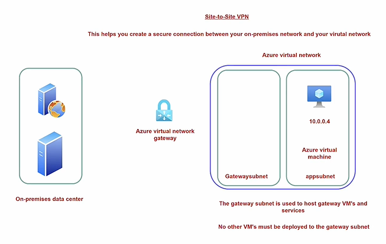
- Azure Express Route :
  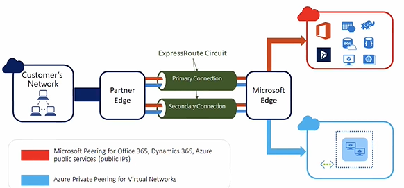

**Usecase Scenario** : There are two Virtual machines, one in Azure Cloud and other in the On-premise network and you need to setup communication between them using private ip address.

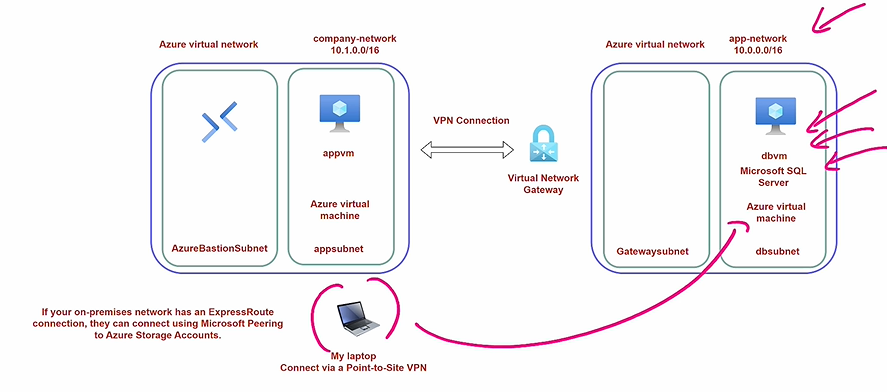

The Azure Virtual Network Gateway should be create as part of the Azure Virtual Network with Gateway Subnet, which will contain the resource required for the Azure Virtual Network Gateway to function.

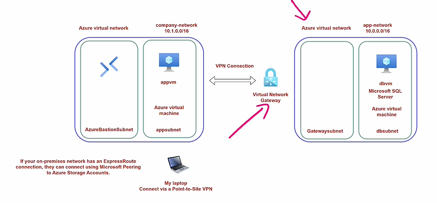

## How to Create an Azure Virtual Network Gateway

**Steps**

1. Create Gateway Subnet inside a Azure Virtual Network
   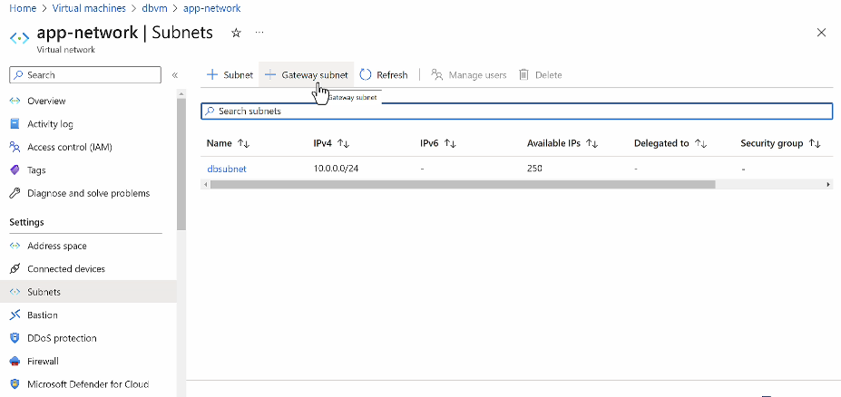
   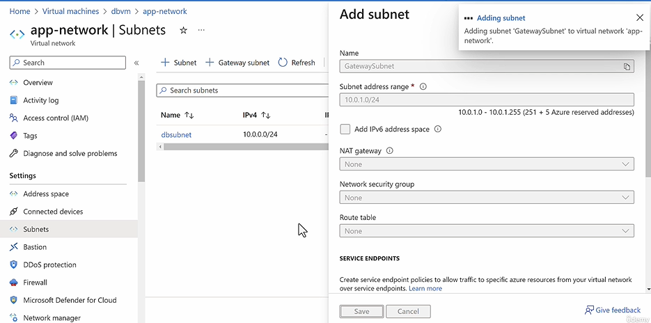

2. Create Azure Virtual Network Gateway Resource

   **Project Details**
   - Subscription
     - Resource Group

   **Instance Details**
   - Name
   - Region
   - Gateway Type
     - VPN (Default)
       - Route Based (Default)
       - Policy Based
     - Express
   - SKU
     - VpnGw2AZ

- Virutal Network : < Choose Virtual Network >
  - Gateway Subnet : < Choose Gateway Subnet >
- Public IP # This will be assigned to Virtual Network Gateway
  - Create New
    - IP Name :
    - SKU : Standard (Only)
  - Existing
- Availability Zone : Zone Redundant
- Enable active-active mode : Enabled (Default)
  - Enabled
    - Second Public IP # This will be assigned to Virtual Network Gateway
      - Create New
        - IP Name :
        - SKU : Standard (Only)
      - Existing
    - Availability Zone : Zone Redundant
    - Enable active-active mode : Enabled (Default)
  - Disabled

**Tags**

- Name/Value

## How to setup Point-To-Site VPN Connection

**Steps**

- In Azure Virtual Network Gateway > Point-To-Site Configuration

  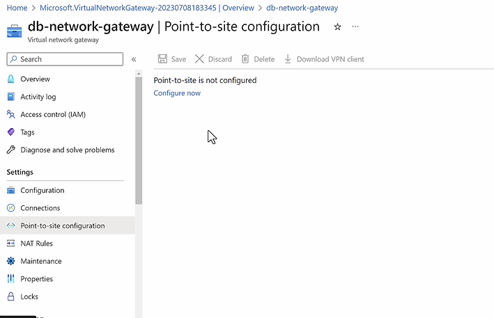

  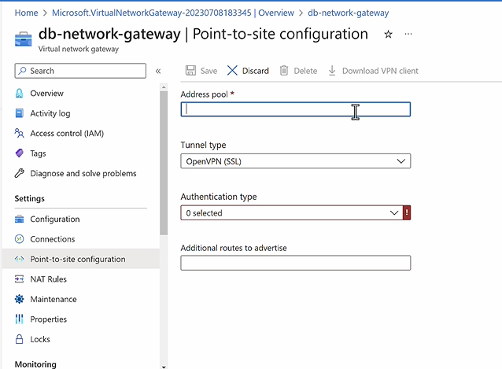

  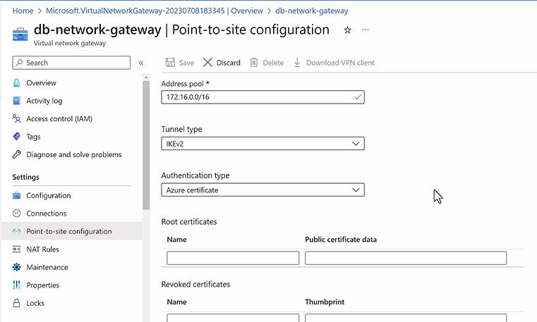

- Geneate the Certificate and then use it to connect to the Azure Virtual Network Gateway.

## How to setup Site-To-Site VPN connection
