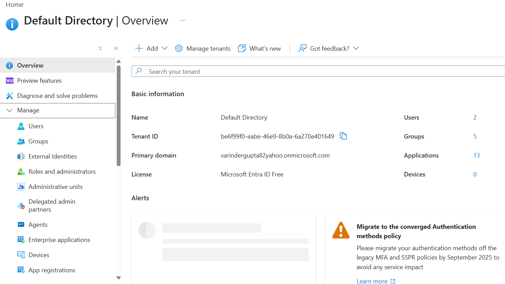

## MSEntraID

- MS Cloud based Identity and Access Management Service
- Centralized Service
- Authentication and Authorization

## Authentication

    - User
    - Group
    - Managed Identity
    - App Registration
    - Administrator Unit



## Authorization

    - Role (RBAC)

## Tenant

**Relationship**

Tenant = The Microsoft Entra ID instance (directory) for an organization.
Directory = The collection of users, groups, applications, devices, policies, etc.

So:

1 Tenant ↔ 1 Entra ID Directory

When Microsoft documentation refers to a tenant, it is usually referring to the directory itself.

| Entity                             | Relationship                                 |
| ---------------------------------- | -------------------------------------------- |
| Microsoft Entra Tenant ↔ Directory | 1 : 1                                        |
| Azure Subscription ↔ Tenant        | Many : 1                                     |
| Tenant ↔ Azure Subscriptions       | 1 : Many                                     |
| User ↔ Tenants                     | Many : Many (via B2B/Guest access)           |
| Application ↔ Tenants              | One app can be Single-Tenant or Multi-Tenant |

## Application Registration

Used to represent an application as an Identity, so that application can be provided Accesses via that Identity

- It consists of
  - Client ID
  - Tenant ID
  - Client Secret
  - Redirect URI

The Application Object, can have it own access or can use access of the logged in user.

**Drawback**: You must manage:

Secret rotation
Secret storage in Key Vault

**Recommended** : Managed Identity
No secrets, no certificates.

| Object                                    | What it is                                       | Lives where?                   | Used for                                                      |
| ----------------------------------------- | ------------------------------------------------ | ------------------------------ | ------------------------------------------------------------- |
| **Application Object (App Registration)** | Blueprint/definition of an application           | Home tenant only               | Defines app permissions, redirect URIs, secrets, certificates |
| **Service Principal**                     | Identity instance of the application in a tenant | Every tenant that uses the app | Authentication and authorization                              |
| **Managed Identity**                      | Special Microsoft-managed Service Principal      | Azure resource's tenant        | Azure resources authenticating without secrets                |

| Scenario                                       | Recommended                                        |
| ---------------------------------------------- | -------------------------------------------------- |
| Azure Function accessing SQL                   | Managed Identity                                   |
| Azure VM accessing Storage                     | Managed Identity                                   |
| AKS workload accessing Key Vault               | Managed Identity / Workload Identity               |
| External application accessing Microsoft Graph | Application Object + Service Principal             |
| SaaS application used by many tenants          | Multi-tenant App Registration + Service Principals |
| CI/CD pipeline (GitHub Actions, Jenkins)       | Service Principal or Federated Identity            |

When you enable a Managed Identity on an Azure Function, Azure is actually creating a Service Principal behind the scenes.

```
Azure Function
    ↓
Managed Identity
    ↓
Service Principal (in Entra ID)
```

```
Application Object
= The car design/blueprint in the factory.

Service Principal
= The actual car on the road.


Application Object
      ↓
   Creates
      ↓
Service Principal
```

You don't see or manage it directly, but it exists in Entra ID.

## MS Graph

Used to access user informaiton in the MS Entra ID

## Provide Application Object access to Graph API (To read/update user information)

**Steps**

- Choose Application Object
  - APIs Permission
    **MS Graph**
    - User.Read (Default) - Sign In and Read User Profile
    - Choose "MS Graph API"
      - Delegated Permission : Your application access the API as signed In user
      - Application Permissions (Choose)
        - user.ReadAll (Add) - Read All User Full Profile
        - user.ReadWriteAll (Add) - Read and Write All User Full Profile
        - Grant Admin Access for Default Directory (Not sucure approach)

OAuth Flow

Step1

POST https://login.microsoftonline.com/{{tenentId}}/oauth2/v2.0/token
Content-Type: application/x-www-form-urlencoded

client_id={{clientId}}&
client_secret={{clientSecret}}&
scope=https//graph.microsoft.com/default&
grant_type={{client_credentails}}&

This returns a Token

Step2
GET https://graph.microsoft.com/v1.0/users
Authorization: Bearer <Token>
