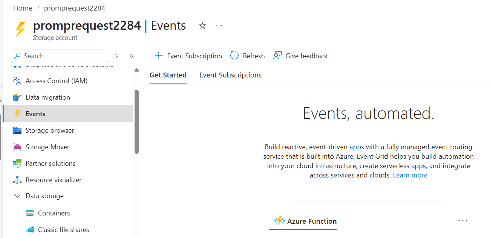
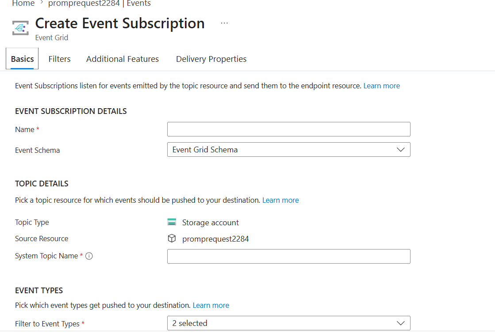
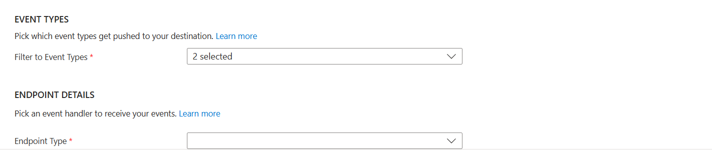
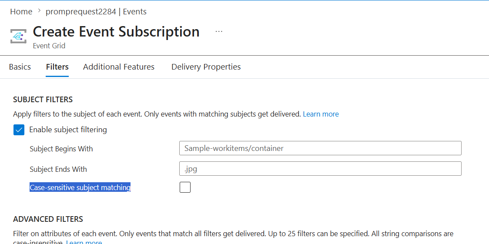
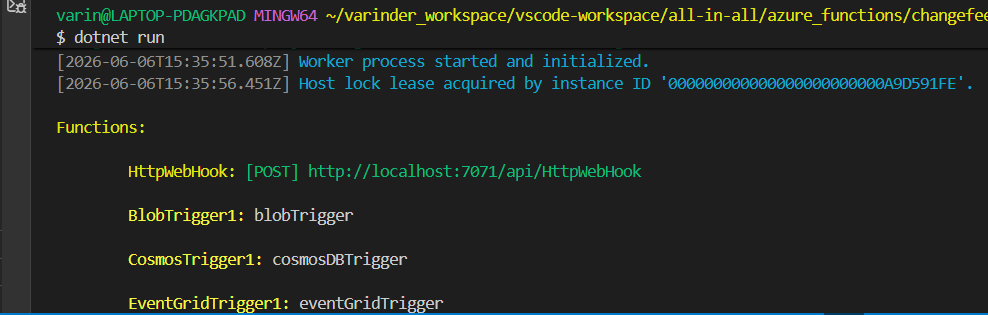
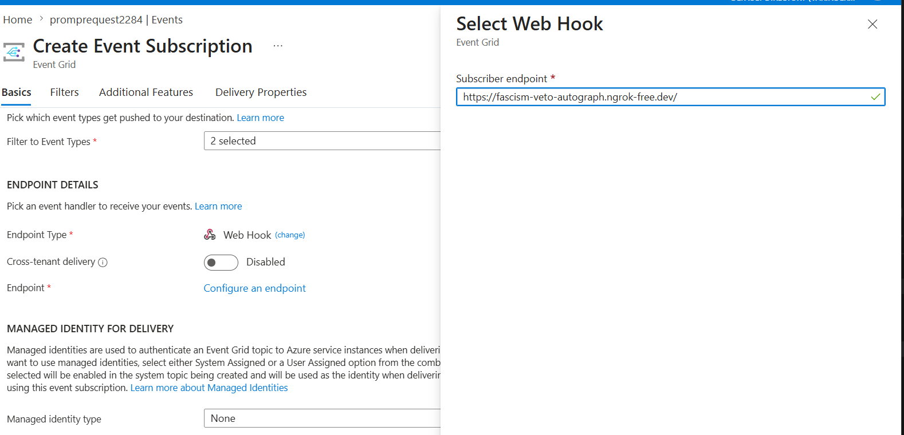
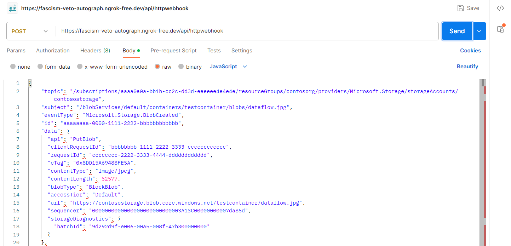

## Overview

This servie is meant to work with events that can be generated from various systems

This is a streaming service. So data is steamed into it, so high throughput is requried.

The prime focus is quick distribution and handling of events.

## Components

User uploads a file

↓

Azure Blob Storage (Event Source & Publisher)

↓

Azure Event Grid - Topic (Event Router)

↓

Azure Function / Logic App / Webhook (Event Handler)

| Role            | Component          |
| --------------- | ------------------ |
| Event Source    | Azure Blob Storage |
| Event Publisher | Azure Blob Storage |

##

Imagine a custom application monitoring a database:

```
 SQL Database
     |
     | New Order Created
     v
 Custom App
     |
     | Publishes event
     v
 Event Grid - Topic
```

| Role            | Component            |
| --------------- | -------------------- |
| Event Source    | SQL Database         |
| Event Publisher | Order Processing App |

##

1. Events Source (Generate an event. eg: Azure Storage Account)

   ↓

2. Event Publisher (The Application that send Event to Event Grid. eg. Azure Storage Account - blob Service)

   ↓

3. Event Grid (In-Build)

   ↓

4. Event Handler (Handle the event)

##

1. **Event** : Smalled amount of information that describe what has happened.

2. **Event Source** : Source of Event.
   - create vm
   - stop vm
   - custom application sending events
   - add blob in storage account

3. **Event Publisher** : Publish the Event to Event Grid

4. **Event Router** : Event Grid itself

5. **Event Handler** : Process/Handle the Event
   - Azure Function
   - Azure Service Bus
   - Azure Login Apps
6. **Event Topic**
7. **Event Topic Subscription**

## Azure Event Grid - Blob Event

In case of Azure Service Bus, we need to create a service bus resouce in Azure to handle the Azure Serviec Bus - Blob Trigger.

But Azure Gid is in-built, we need not to create any resource in Azure.

Eg. On blob create event, Event Object encapsulate

- blob URL, not the actual blob
- Event Type
- Time

## Event Grid System Topics

Each Azure service (Azure Storage Account) has its own sytem topic in event grid.

For custom application we can have our own custom topics

## .Net Implementation

Here we no need to create any resource like Azure Storage Queue Or Azure Service Bus - Queue/Topic

Just create an function as Event Handler with type "Azure Event Grid Trigger", Listen to an event Type "CloudEvent"

## How do you publish Stroage Account event to Event Grid - Topic

1. Goto the storage Account > Event
   
2. Create a subscription
   
   - Name : < >
   - Schema : Azure Event Grid
   - System Topic Name : < > // That will be create in Event Grid automatilly and all event will be published to it.
   - Event Types : Choose Events from the List
     - Blob Created
     - Blob Deleted
     - Blob Renamed
     - Blob Tier Changed
     - Directory Created
     - Directory Deleted
     - Directory Renamed
     - Directory Tier Changed
     - ...
     - ...
       
   - Endpoint Type : Pick Event Handlers
     - Azure Function
       - Subscription
       - Resource Group
       - Function App: < So Function App is Mandary for this >
       - Slot:
       - Function Name:
     - Azure Event Hub
     - Storage Queue
     - Service Bus Queue
     - Service Bus Topic
     - Web Hook
     - Event Grid Topic

**Microsoft.EventGrid** Resource ProviderNeed, so make sure it is registered under subscription > resource provider

## How to test Event Grid - Hanlder locally

Use NGROK and expose your local function to web.

1. Install NGROK on your machine
2. Create/sign in to your ngrok account, and get the token
   - https://dashboard.ngrok.com/get-started/setup/windows
3. ngrok config add-authtoken YOUR_AUTHTOKEN
4. ngrok http 7071

```

Session Status                online
Account                       Varinder Gupta (Plan: Free)
Version                       3.39.1-msix-stable
Region                        Europe (eu)
Latency                       53ms
Web Interface                 http://127.0.0.1:4040
Forwarding                    https://fascism-veto-autograph.ngrok-free.dev -> http://localhost:7071

Connections                   ttl     opn     rt1     rt5     p50     p90
                              0       0       0.00    0.00    0.00    0.00
```

Make call as below

```
curl -X POST "https://fascism-veto-autograph.ngrok-free.dev/runtime/webhooks/EventGrid?functionName=EventGridTrigger1" \
  -H "Content-Type: application/json" \
  -H "aeg-event-type: Notification" \
  -d '{
    "specversion": "1.0",
    "type": "Microsoft.Storage.BlobCreated",
    "source": "/subscriptions/test/resourceGroups/rg/providers/Microsoft.Storage/storageAccounts/mystorage",
    "id": "1",
    "time": "2026-06-06T10:00:00Z",
    "subject": "/blobServices/default/containers/input/blobs/test.csv",
    "datacontenttype": "application/json",
    "data": {
      "api": "PutBlob",
      "url": "https://mystorage.blob.core.windows.net/input/test.csv"
    }
  }'
```

Without NGROK you can use

```
curl -X POST "http://localhost:7071/runtime/webhooks/EventGrid?functionName=EventGridTrigger1" \
  -H "Content-Type: application/json" \
  -H "aeg-event-type: Notification" \
  -d '{
    "specversion": "1.0",
    "type": "Microsoft.Storage.BlobCreated",
    "source": "/subscriptions/test/resourceGroups/rg/providers/Microsoft.Storage/storageAccounts/mystorage",
    "id": "1",
    "time": "2026-06-06T10:00:00Z",
    "subject": "/blobServices/default/containers/input/blobs/test.pdf",
    "datacontenttype": "application/json",
    "data": {
      "api": "PutBlob",
      "url": "https://mystorage.blob.core.windows.net/input/test.pdf"
    }
  }'
```

## Cloud Event Schema

Event Grid Schema

https://learn.microsoft.com/en-us/azure/event-grid/event-schema

Cloud Event Schema - Recommended

https://learn.microsoft.com/en-us/azure/event-grid/cloud-event-schema

```
{
    "specversion": "1.0",
    "type": "Microsoft.Storage.BlobCreated",
    "source": "/subscriptions/{subscription-id}/resourceGroups/{resource-group}/providers/Microsoft.Storage/storageAccounts/{storage-account}",
    "id": "9aeb0fdf-c01e-0131-0922-9eb54906e209",
    "time": "2019-11-18T15:13:39.4589254Z",
    "subject": "blobServices/default/containers/{storage-container}/blobs/{new-file}",
    "data": {
        "api": "PutBlockList",
        "clientRequestId": "4c5dd7fb-2c48-4a27-bb30-5361b5de920a",
        "requestId": "9aeb0fdf-c01e-0131-0922-9eb549000000",
        "eTag": "0x8D76C39E4407333",
        "contentType": "image/png",
        "contentLength": 30699,
        "blobType": "BlockBlob",
        "url": "https://gridtesting.blob.core.windows.net/testcontainer/{new-file}",
        "sequencer": "000000000000000000000000000099240000000000c41c18",
        "storageDiagnostics": {
            "batchId": "681fe319-3006-00a8-0022-9e7cde000000"
        }
    }
}
```

## Additional Information

```
 [Function(nameof(EventGridTrigger1))]
    public void Run([EventGridTrigger] CloudEvent cloudEvent)
    {
        Console.WriteLine("Event received: ");
        _logger.LogInformation("Event Id: {id}", cloudEvent.Id);
        _logger.LogInformation("Event Type: {type}", cloudEvent.Type);
        _logger.LogInformation("Event Source: {source}", cloudEvent.Source);
        _logger.LogInformation("Event Subject: {subject}", cloudEvent.Subject);
        _logger.LogInformation("Event Data: {data}", cloudEvent.Data);
        _logger.LogInformation("Event Time: {time}", cloudEvent.Time);

    }
```

```
[2026-06-06T13:13:08.798Z] Event received:
[2026-06-06T13:13:08.815Z] Event Id: 9aeb0fdf-c01e-0131-0922-9eb54906e209
[2026-06-06T13:13:08.819Z] Event Type: Microsoft.Storage.BlobCreated
[2026-06-06T13:13:08.821Z] Event Source: /subscriptions/{subscription-id}/resourceGroups/{resource-group}/providers/Microsoft.Storage/storageAccounts/{storage-account}
[2026-06-06T13:13:08.824Z] Event Subject: blobServices/default/containers/{storage-container}/blobs/{new-file}
[2026-06-06T13:13:08.826Z] Event Data: {"api":"PutBlockList","clientRequestId":"4c5dd7fb-2c48-4a27-bb30-5361b5de920a","requestId":"9aeb0fdf-c01e-0131-0922-9eb549000000","eTag":"0x8D76C39E4407333","contentType":"image/png","contentLength":30699,"blobType":"BlockBlob","url":"https://gridtesting.blob.core.windows.net/testcontainer/{new-file}","sequencer":"000000000000000000000000000099240000000000c41c18","storageDiagnostics":{"batchId":"681fe319-3006-00a8-0022-9e7cde000000"}}
[2026-06-06T13:13:08.830Z] Event Time: 11/18/2019 15:13:39 +00:00
```

## ## How do you publish Resource Group event to Service Bus Qeueue

- Event Types :
  - Resource Write Success
  - Resource Write Failure
  - Resource Write Cancel
  - Resource Delete Success
  - Resource Delete Failure
  - Resource Delete Cancel
  - Resource Action Success
  - Resource Action Failure
  - Resource Action Cancel

- Endpoint Type : Queue
  <Choose Service Bus Queue>

## Using Filters

While creating the subscription, we can have Subject Filters enabled



## Connect an HTTP endpoint (WebHook)

1.  Create Subscription with
    - Endpoint Type : WebHook
      - Function POST URL

        

        You need to use NGROK to access the URL from the Azure Portal

        

        Through PostMan, you can access this endpoint directly
        

## Custom Topics

So normally when we create a subscription in for an Resoruce Event Grid like Storage Account Event subscription, The topic name we give is of system topic. So far Azure Services are Event Sender/Publisher and we have different subscriptions like Function Type , WebHook Type (3rd Party Consumer- External or Internal)

But in case we have a custom applicaiton, and want it as Event Publisher to event grid, then in that this scenario we need to have custom topic

This approach is quite useful in custom event type Like: Comapny.Order.OrderCreated

1. Go to "Event Grid Topic" Service and create a Topic
2.
