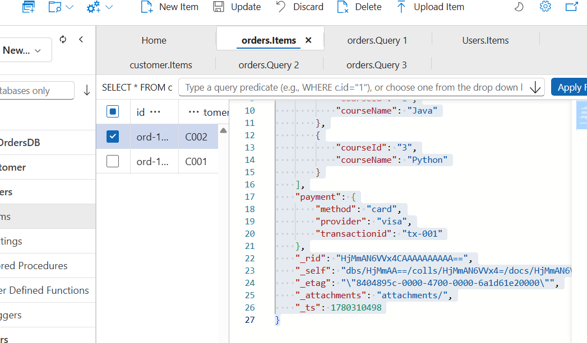
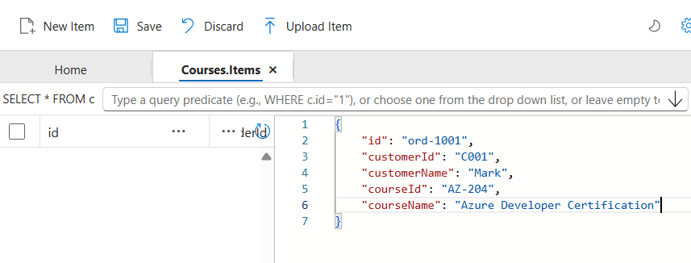
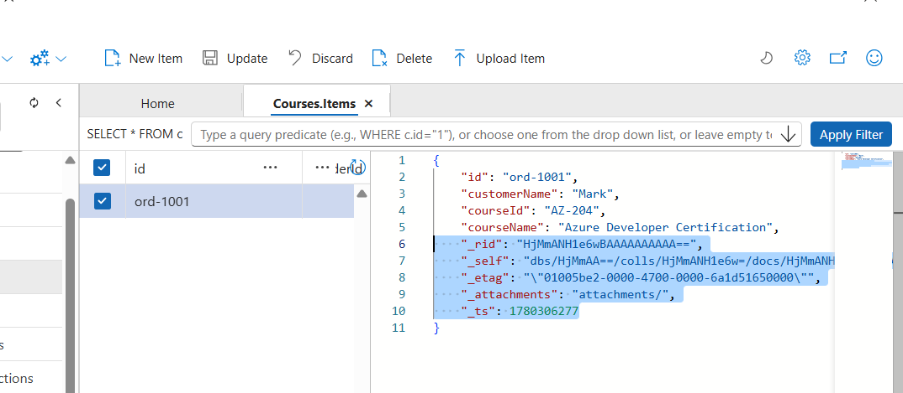

## Overview

### Different Data Types

- Structured Data (Tables) : Azure SQL Database
- Semi-Structured Data (JSON) : Azure CosmosDB
- UnStructured Data (Images, Vidoes, Zip) : Azure Storage

### Azure SQL Database - Used For Strctured Data

- Use Tables (Rows and Columns)
- Tables with Fixed Schema
- Relational between Tables
- Good for Transactional Data (ACID Characteristics)

### Azure CosmosDB - Used For Unstrctured (JSON) Data

- No SQL, Relational and Vector Database
- No Fixed Schema (Data is in different forms)
- Much efficient in data storage and retrieval
- Examples
  - MongoDB (Open Source)
    - Database -> Container -> Documents (JSON)
  - CosmosDB (Azure Managed)
    - Database -> Container -> Documents (JSON)
- Support different APIs
  - NoSQL :
    - Data is stored as JSON
    - You can query using SQL
  - MongoDB
    - Data is stored as BSON
  - Table
    - Data is stored as key-value pair
  - Casandra
    - Data is stored as column-oriented schema
  - Gramlin
    - Graph based data

## Key Concepts

### Request Units

- In CosmosDB, you dont pay separately for Compute and Memory/IOPS, everything is bundled as a single Unit - RUs
- RU - represent cost of database operation
- when you fetch a single item with id and partition key
  - 1 KB read = 1 RU
- Free Tier support 1000 RU per second.
- So costing is in terms of RUs

### Partition Key

```
    - CosmosDB Account
        - Database
            -  ContainerA : Orders (Partition Key : OrderType)
                - Item (Item Id)
                - Item (Item Id)
                - Item (Item Id)
                - Item (Item Id)
                - Item (Item Id)
            - ContainerB : Complaints (Partition Key: ComplainType)
                - Item (Item Id)
                - Item (Item Id)
                - Item (Item Id)
                - Item (Item Id)
                - Item (Item Id)
```

- Container : Hold your JSON documents
- CosmosDB divide data into different partitions depends on the partition key, so choose wisely
- Partition Key : helps in quick search

### Item Id

- Each item in your cosmosDB get item ID within the partition
- Partition Key + Item Id (Unique)
- Item ID = Table Primary Key

\***\*Imp** : To CREATE and UPDATE an Item, we need to provide both Partition Key and ID, without any system properties like \_ts.

## Arrays with JSON Object


**Query** : By flattening the structure using JOIN

```
SELECT o.id,o.courseId as orderId , i.courseName,i.courseId as courseId
FROM Orders o Join i in o.items
WHERE i.courseName = 'C#'
```

## Objects with Objects



```
SELECT *
FROM Orders o
WHERE o.payment.transationid = 'tx-001'
```

### Physical Partitions

- managed by azure for scaling.

### Create Azure CosmosDB Account

- API Type : No SQL
  - No SQL (Default)
  - MongoDB
  - Casandra
  - Table
  - Gramlin
- Workload Type : Learning
  - Learning
  - Development/Testing
  - Production
- Subscription
- Resource Group
- Account Name : < Unique >
- Availability Zone :
  - Disabled
  - Enabled
    - LRS
    - ZRS
    - GRS
- Region
- Capacity Throughput
  - Serverless
    - Unpredictable workload
    - Billed only for consumed RUs
    - Scaling on-demand
  - Provisioned Throughput
    - Preconfigured RUs
      - Manual
      - Autoscale (Min, Max)
    - Billed per hour
    - Guaranteed Thorughput

## Create Database in CosmosDB Account

- Database ID : < DB Name>

## Create Container in the Database

- Database ID
- Container ID : < Container Name > (Orders)
- Partition Key : /< Partition Key > (/CustomerId)
- Container RU : Only visible for CosmosDB Account with Capacity Throughput : Provisioned Throughput, not for serverless

  

## Create Item in the Container

- **Input**
  

- **Output**
  

  So few system based properties are added with the item
  - \_rid
  - \_attachments
  - \_ts
  - \_etag
  - \_self

## Running Query Against Containers

```
SELECT * FROM c where c.id = "ord-1001" (c is selected container)

SELECT * FROM orders c where c.id = "ord-1001"

SELECT * FROM users c where  c.customerName = "varinder gupta"

SELECT * FROM users c where  c.customerName = "varinder gupta" AND c.rating > 3
```

## CosmosDB Query Types

- **In Partition Query** : If your query has partition key with equality filter (= only) specified, CosmosDB automatically optimizes the query, it routes the query to the physical partition

```
Select * from Orders o where o.CustomerId = "cus-101"
```

- **Cross Partition Query** :If your query has nopartition key specified,

```
Select * from Customer c where c.name = "cus-101"
```

## Costing

- RUs (Compute + RAM)
- Storage
