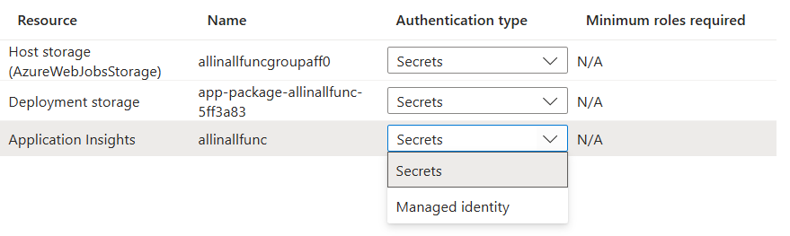

### Type

PaaS

- Serverless Service , You are charged based on the running time of the function app.

- Azure App Service is not Serverless, as it has App Service Plan (Free/Basic/Standard/Premium/Isolated)

### Configuration

- Hosting Option : Flex Consumption

| Feature               | Flex Consumption  | Functions Premium | App Service   | Container Apps    | Consumption  |
| --------------------- | ----------------- | ----------------- | ------------- | ----------------- | ------------ |
| Scale to zero         | ✅                | ❌                | ❌            | ✅                | ✅           |
| Scaling               | Fast event-driven | Event-driven      | Metrics-based | KEDA event-driven | Event-driven |
| VNet support          | ✅                | ✅                | ✅            | ✅                | ❌           |
| Cold start prevention | Optional          | Yes               | Yes           | Optional          | ❌           |
| Max instances         | 1000              | 100               | 30            | 300               | 200          |

- Subscription
- Resource Group
- Function Name : < unique-name >.azurewebsites.net
- Region : Sweden Central
- Runtime Stack : .net
  - .Net
  - Java
  - NodeJS
  - Python
  - Powershell
  - custom handler
- version : 10 (LTS)

```
For Hosting Option : Flex Consumption

- Instance Size: The amount of memory allocated to each instance of the function app
  - 512 MB
  - 2048 MB
  - 4096 MB`
```

```
For Hosting Option : App Service Plan

- Plan : < App Service Plan >
  -  Base B1
```

```
This option is visible based on the Hosting Option and Plan

- Zone Redundancy
  - Enabled
```

**Storage**

- Storage Account: Select a storage account or create a new one. Accounts must support blobs, queue, and Table storage (General Purpose v2)
- Diagnostic Settings : Disabled (Default)

**Networking**

- Enable Public Access : Public access is applied to both main site and advanced tool site. Deny public network access will block all incoming traffic except that comes from private endpoints.
  - Enabled (Default)
  - Disabled
- Enable Network Injection/Integration
  - Enabled
    - Virtual Network : Select or create a virtual network that is in the same region as your new app.
  - Disabled (Default)

**Monitoring**

- Application Insight: Azure Monitor application insights is an Application Performance Management (APM) service for developers and DevOps professionals. Enable it below to automatically monitor your application. It will detect performance anomalies, and includes powerful analytics tools to help you diagnose issues and to understand what users actually do with your app. Your bill is based on amount of data used by Application Insights and your data retention settings.
  - Disabled (Default)
  - Enabled
    - Application Insight : < Select or Create Application Insight Resource>

```
This option is visible based on the Hosting Option and Plan


**Deployment**

- Continuous Deployment : Disable (Default)
  - Enabled
    - GitHub Settings : Org/Repo/Branch/

```

- Authentication
  - Managed Identity : Disabled (Default)
    - Enabled
- Tags

##

## Azure Function - Managed Identity

For best security practice, use managed identity authentication when available (some resources may only use secrets).


**Steps 1**

- Choose Azure Function
  - Identity
    - Managed Identity : Enable

**Steps 2**

- Choose Resource whose accesss need to be granted to the Managed Identity of Function
  - IAM
    - Role : < Choose Role >
    - User : < Choose Function Managed Identity >

## Question: "If Azure Functions can expose HTTP endpoints, why do we need ASP.NET Web API at all?"

The answer is that they solve different problems.

Use Azure Functions when

```
Event-driven systems
Serverless workloads
Background processing
Integrations
```

Examples

```
Blob uploaded
→ Process file

Cosmos document changed
→ Trigger workflow

Message arrives in Service Bus
→ Process order

Timer every night
→ Generate report
```

Functions are excellent for:

```
Short-lived execution
Auto-scaling
Pay-per-execution
Event processing
```

### Use ASP.NET Web API when

When you are builing

```
Business applications
Microservices
Backend APIs
Long-running services
```

Examples:

```
Order Management API
Customer API
Product API
Banking API
E-commerce Backend
```

### Can Functions replace Web APIs?

For small applications: Yes
For enterprise applications: No

Why not?

Suppose you have:

```
100 endpoints
Complex authentication
Swagger
Versioning
Middleware
Caching
CQRS
Dependency Injection
Custom Authorization
```

ASP.NET Core handles this naturally.

Functions become harder to manage.

### Enterprise Architecture

```
Frontend
     ↓
API Management
     ↓
ASP.NET Web API
     ↓
Cosmos DB

Cosmos Change Feed
     ↓
Azure Function
     ↓
Service Bus
```

or

```
Frontend
     ↓
API Management
     ↓
Function App
```

for lightweight APIs.

### Decision Metrix

| Scenario                 | Web API | Function |
| ------------------------ | ------- | -------- |
| CRUD APIs                | ✅      | ⚠️       |
| Event processing         | ❌      | ✅       |
| Blob processing          | ❌      | ✅       |
| Change Feed              | ❌      | ✅       |
| Service Bus consumer     | ❌      | ✅       |
| Complex business service | ✅      | ⚠️       |
| Long-running service     | ✅      | ❌       |
| Serverless integration   | ❌      | ✅       |
| E-commerce backend       | ✅      | ⚠️       |
| Scheduled jobs           | ❌      | ✅       |

For a Solution Architect, the usual recommendation is:

```
Web API = synchronous business operations

Azure Functions = asynchronous/event-driven processing
```

That's why in modern Azure solutions you'll often see both:

## Function (Storage Queue Trigger)

```
    [Function(nameof(QueueTrigger1))]
    public void Run([QueueTrigger("orderstate", Connection = "promprequest2284_STORAGE")] Order message)
    {
        if (message.Id == "order123")
        {
            _logger.LogError("Received a null message from the queue.");
            return; // means success so message will be removed from the queue, if you want to retry, throw an exception instead of returning.
        }
        if (message.Id == "order1234")
        {
            _logger.LogError("Invalid message. Retrying.");
            throw new Exception("Invalid order message."); // message will be send to the poison queue after 5 retries (default) if the exception is thrown in the function.
        }
        _logger.LogInformation("Order details: Id: {id}, Product: {product}, Quantity: {quantity}", message.Id, message.CustomerId, message.UserId);
    }
```
