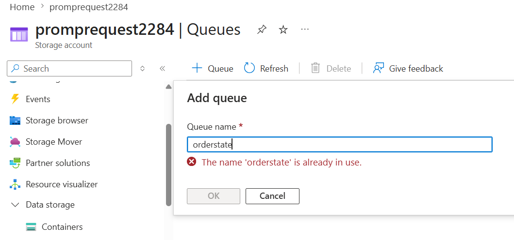

## Using a Messaging Service

Lets think of a flow

UI -> Web API -> function -> 3rd Party API -> DB -> Generate Report -> Email

The above scenario works fine, untill

- Number of requests are low
- All systems work fine

But in case any system had any issue/timeout, the request from User, will left unhandled. Which is not acceptable.

**Proble Statement** : Each request must be handled once raised by user.

**Solution** : Use Messaging service, and decouple components

UI -> Web API -(msg)-> Queue -(msg)-> function -> 3rd Party API -> DB -> -(msg)-> Queue -(msg)-> Generate Report -(msg)-> Queue -(msg)-> Email

In this case, if any system is not available, the msg will be ther for it to be available so can process and proceed to next stage.

### Azure Messaging Services

- Azure Storage Queues
- Azure Service Bus

## Azure Storage Queue

- Basic Queue service available in Azure Storage Account(Type: General Purpose v2), besides
  - blob service
  - Table Service
  - File Share Service.

## Create Storage Account Queue

- Create Storage Account - General Purpose V2
- Create Queue : So this is very simple queue, just name

  

- Add Message to the Queue
  

## Azure Storage Queue - Sending Message

```

    [Function(nameof(QueueTrigger1))]
    public void Run([QueueTrigger("orderstate", Connection = "promprequest2284_STORAGE")] Order message)
    {
        if (message.Id == "order123")
        {
            _logger.LogError("Received a null message from the queue.");
            return; // means success so message will be removed from the queue, if you want to retry, throw an exception instead of returning.
        }
        if (message.Id == "order1234")
        {
            _logger.LogError("Invalid message. Retrying.");
            throw new Exception("Invalid order message."); // message will be send to the poison queue after 5 retries (default) if the exception is thrown in the function.
        }
        _logger.LogInformation("Order details: Id: {id}, Product: {product}, Quantity: {quantity}", message.Id, message.CustomerId, message.UserId);
    }
```

### Best practice for poison processor

```
Read poison message
Log full details
Save to error table / Cosmos / SQL
Send alert
Return successfully
```

So the message is removed from poison queue after it is safely recorded.

```
[Function(nameof(PoisonQueueProcessor))]
public async Task Run(
    [QueueTrigger("orderstate-poison", Connection = "promprequest2284_STORAGE")]
    Order message)
{
    try
    {
        _logger.LogError(
            "Poison message. Id: {id}, CustomerId: {customerId}",
            message.Id,
            message.CustomerId);

        // Save message to error store
        // Send Teams/email alert
        // Do NOT reprocess business logic here
    }
    catch (Exception ex)
    {
        _logger.LogCritical(ex, "Failed to record poison message");

        // In many enterprise systems, still avoid throwing here
        // unless you really want orderstate-poison-poison
    }
}
```

Do not use poison queue processor as an automatic retry processor.

If you want replay, do it separately:

```
Fix bug/data
Move message manually/control-job from orderstate-poison → orderstate
```

For poison/error messages, Cosmos DB is usually a good default, especially if the message payload is JSON.

```
{
  "id": "error-order123-20260603",
  "sourceQueue": "orderstate",
  "originalMessage": {
    "id": "order123",
    "customerId": "cust123"
  },
  "errorType": "ValidationError",
  "errorMessage": "Missing paymentInfo",
  "status": "PendingReview",
  "createdAt": "2026-06-03T11:30:00Z",
  "retryCount": 5
}
```

Use a separate container, not just a separate partition.

```
Database: order-db

Container 1: Orders
Partition key: /CustomerId

Container 2: ProcessingErrors
Partition key: /sourceQueue

```

For example, you may want to keep errors only 30 days:

```
ProcessingErrors TTL = 30 days
```

Example

```
{
  "id": "error-order123-20260603",
  "sourceQueue": "orderstate",
  "originalMessage": {
    "id": "order123",
    "customerId": "cust123"
  },
  "errorMessage": "Missing paymentInfo",
  "status": "PendingReview",
  "createdAt": "2026-06-03T11:30:00Z"
}
```

Typically after the error is resolved and successfully reprocessed, Mark it as Processed (enterprise favorite)

```
{
  "id": "error-order123",
  "status": "Resolved",
  "resolvedAt": "2026-06-03T12:00:00Z",
  "resolvedBy": "ReplayJob"
}
```

Benefit

```
Audit trail
Historical reporting
Root cause analysis
Compliance
```

Then use TTL

## Service Bus

- [Service Bus](./servicebus.md)
