## Overview

An enterprise grade service bus in azure

- Messaging Model
  - Point-To-Point : Queues 1-to-1
  - PubSub Model : Topics-Subscriptions 1-to-Many
- Reliability & Delivery Features
  - Duplicate Detection
  - Transactional Support
  - Peek-Lock
  - Dead-Letter Queue
- Scalable and Elastic
  - Handle Traffic Spikes
- Advanced Routing
  - Message Filtering Rules
  - SQL & Correlation Filters
- Session & Ordering
  - FIFO Processing

## Create Service Bus Namespace

- Project Detail
  - Subscription
  - Resource Group
- Instance Detail
  - Namespace name : < Unique >.servicebus.windows.net
  - Location
  - Pricing Tier : Basic
    - Basic
    - Standard
    - Premium
      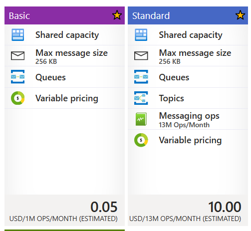 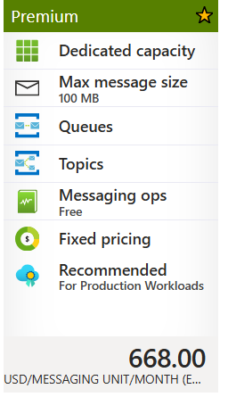
- Geo Replication : only available on Premium
  - Enable Geo-replication : Yes/No
- Security
  - Min. TLS Version: 1.2
  - Local Authenticaiton : SAS Key Authentication
    - Disabled (Default)
    - Enabled
- Networking
  - Public Access
  - Private Access : only available on Premium
- Tag

## Createm Service Bus Queue

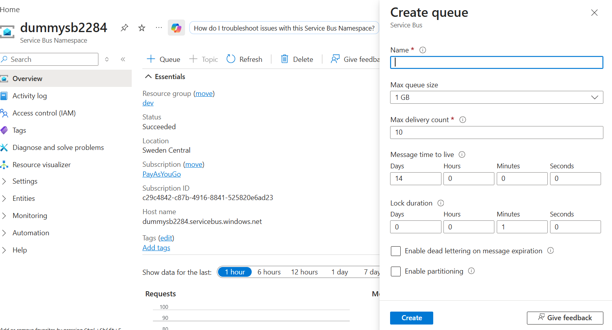

- **Name**
- **Max Queue Size** : 1/2/3/4/5 GB
- **Max Delivery Count (Retry)**: 10 (1-2000)
- **Message time to live** : Message time to live determines how long a message will stay in the queue before it expires and is removed or dead lettered. When sending messages it is possible to specify a different time to live for only that message. This default will be used for all messages in the queue which do not specify a time to live for themselves
- **Lock duration** : Sets the amount of time that a message is locked for other receivers. After its lock expires, a message pulled by one receiver becomes available to be pulled by other receivers. Defaults to 1 minute, with a maximum of 5 minutes.
- **Enable dead lettering on message expiration** : Dead lettering messages involves holding messages that cannot be successfully delivered to any receiver to a separate queue after they have expired. Messages do not expire in the dead letter queue, and it supports peek-lock delivery and all transactional operations.
- **Enable partitioning** : Partitions a queue across multiple message brokers and message stores. Disconnects the overall throughput of a partitioned entity from any single message broker or messaging store. This property is not modifiable after a queue has been created.

Below are standard Tier Features

- **Enable duplicate detection** : Enabling duplicate detection configures your queue to keep a history of all messages sent to the queue for a configurable amount of time. During that interval, your queue will not accept any duplicate messages. Enabling this property guarantees exactly-once delivery over a user-defined span of time
  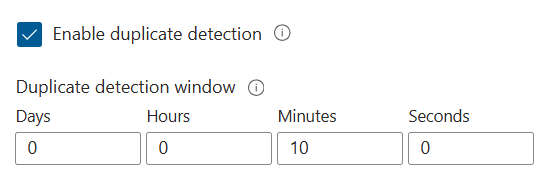

- **Enable Session** : Service bus sessions allow ordered handling of unbounded sequences of related messages. With sessions enabled a queue can guarantee first-in-first-out delivery of messages
- **Forward Message to Queue/Topic**
  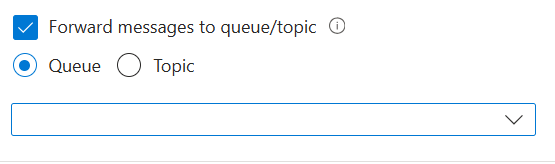

### In Azure Service Bus, TTL expiration and Dead Letter Queue (DLQ) are two different concepts.

#### Case 1: Message expires due to TTL

```
Queue TTL = 7 days
Message sits in queue for 7 days
Nobody consumes it
```

Dead-letter on message expiration = Disabled (default in many setups)

```
Message expires
       ↓
Message is removed
       ↓
Lost permanently
```

Dead-letter on message expiration = Enabled

```
Message expires
       ↓
Moved to DLQ
```

Reason

```
TTL Expired
```

#### Case 2: Consumer keeps failing

```
MaxDeliveryCount = 10
```

```
Receive message
      ↓
Function throws exception
      ↓
Receive again
      ↓
Throw again
      ↓
10 times
      ↓
Moved to DLQ
```

Reason

```
MaxDeliveryCountExceeded
```

Difference from Azure Storage Queue

Storage Queue

```
queue
   ↓
queue-poison
```

Service Bus Queue

```
queue
   ↓
Dead Letter Queue (DLQ)
```

The DLQ is build into the Servie Bus Queue

```
orders
orders/$DeadLetterQueue
```

#### Typical enterprise flow

```
Service Bus Queue
       ↓
Function
       ↓
Success → Complete

Failure → Retry
       ↓
MaxDeliveryCount exceeded
       ↓
DLQ
       ↓
DLQ Processor
       ↓
Cosmos DB Error Store
       ↓
Alert / Replay
```

As a Solution Architect, I generally recommend:

```
Enable DLQ on expiration
Enable DLQ on max delivery count
Monitor DLQ
Have a replay process
```

If function throw exception

```
Function A processes
 ↓
Exception
 ↓
Message not deleted
 ↓
Visibility timeout expires
 ↓
Message becomes visible again
 ↓
Function A or Function B may receive it
 ↓
Exception
 ↓
Message not deleted
 ↓
TTL expires
 ↓
Poison Queue
 ↓
Change Feed Function
 ↓
Store the state in CosmosDB
 ↓
Retry Mechanism
```

#### Storage Queue is a competing consumer model.

```
Queue
 ↓
Consumer A
Consumer B
Consumer C

One message
 ↓
One consumer
```

No fan-out. For fan-out use Service bus - Topics

There is no ACID transaction across queue consumers.

Queues provide: At least once delivery

Not : Exactly once delivery

Therefore enterprise systems must be: Idempotent

```
if (AlreadyProcessed(orderId))
{
    return;
}
```

Service Bus Queue behaves similarly to Storage Queue in one important aspect: One message is processed by one consumer.

TTL does NOT send to DLQ

```
Message received
     ↓
Function A throws exception
     ↓
Message lock expires
     ↓
Message becomes available again
     ↓
Function A or Function B receives it
     ↓
Fails again
     ↓
DeliveryCount increases
     ↓
MaxDeliveryCount reached (e.g. 10)
     ↓
Dead Letter Queue (DLQ)
     ↓
Change Feed Function (Change Feed does not exist on Service Bus DLQ, Change Feed exists for: CosmosDB only)
     ↓
Store the state in CosmosDB
     ↓
Retry Mechanism
```

**Correct Flow**

```
Service Bus Queue
        ↓
Azure Function
        ↓
Exception
        ↓
Retry
        ↓
MaxDeliveryCount exceeded
        ↓
Dead Letter Queue
        ↓
DLQ Processor Function
        ↓
Store Error in Cosmos DB
        ↓
Alert Teams / Email
        ↓
Manual or Automated Replay
```

Example

```
orders
   ↓
orders/$DeadLetterQueue
   ↓
DLQProcessor Function
   ↓
ProcessingErrors (Cosmos DB)
```

Then

```
ProcessingErrors Container
        ↓
Operations fixes root cause
        ↓
Replay Job
        ↓
Send back to orders queue
```

What I would recommend as a Solution Architect

```
Service Bus Queue
        ↓
Business Function
        ↓
Retries
        ↓
DLQ
        ↓
DLQ Function
        ↓
Cosmos DB Error Store
        ↓
Dashboard / Alerting
        ↓
Replay Tool
```

For Storage Queue

```
Storage Queue
      ↓
Azure Function
      ↓
Exception
      ↓
Message becomes visible again
      ↓
Retry
      ↓
Retry
      ↓
Retry
      ↓
maxDequeueCount reached
      ↓
Poison Queue
      ↓
Poison Queue Processor Function
      ↓
Store Error in Cosmos DB
      ↓
Alert Teams / Email
      ↓
Manual or Automated Replay
```

| Service Bus             | Storage Queue                 |
| ----------------------- | ----------------------------- |
| Dead Letter Queue (DLQ) | Poison Queue                  |
| `MaxDeliveryCount`      | `maxDequeueCount`             |
| Message Lock            | Visibility Timeout            |
| Built-in DLQ            | Separate `queue-poison` queue |

Why do we need visibility timeout?

To prevent multiple consumers from processing the same message simultaneously while allowing automatic retry if the consumer crashes or fails before completing the message.

For Storage Queue Trigger

Default visibility timeout is typically controlled by host.json.

```
{
  "version": "2.0",
  "extensions": {
    "queues": {
      "visibilityTimeout": "00:00:30",
      "maxDequeueCount": 5
    }
  }
}
```

Meaning

```
Retry after 30 seconds
Move to poison queue after 5 failures
```

### Enterprise Recommendation

```
Fast processing (< 30 sec)
    visibilityTimeout = 30 sec

Medium processing (1-2 min)
    visibilityTimeout = 2-5 min

Long processing
    Use Durable Functions or split work
```

| Processing Time    | Recommendation                               |
| ------------------ | -------------------------------------------- |
| < 5 min            | Normal Function                              |
| 5-30 min           | Normal Function (lock renewal)               |
| 30 min - few hours | Consider splitting work or Durable Functions |
| Hours / Days       | Durable Functions                            |
| Human workflow     | Durable Functions                            |

For Azure Functions with a Service Bus Trigger, you usually do not renew the lock yourself.

The Functions runtime automatically renews the lock while your function is running.

Just Configure maximum auto-renew duration in host.json

If you expect long processing:

```
{
  "version": "2.0",
  "extensions": {
    "serviceBus": {
      "maxAutoLockRenewalDuration": "00:30:00"
    }
  }
}
```

```
Keep renewing the Service Bus lock
for up to 30 minutes
```

```
[Function("ProcessOrder")]
public async Task Run(
    [ServiceBusTrigger("orders", Connection = "ServiceBusConnection")]
    string message)
{
    await ProcessLargeFile();
    await CallExternalApi();
    await UpdateCosmosDb();
}
```

Azure Functions renews the lock while the work is happening.

NOte: For private endpoing we need premium tier of service bus namespace.

For development and sometimes test environments, I would typically use Standard Service Bus with public access to reduce cost (IP Restrictions (optional)). For production, and often pre-production, I would use Premium Service Bus with Private Endpoints, disable public network access, and integrate applications through VNets. The final decision depends on regulatory requirements, security posture, and the need for production parity."

## Use Managed Identity instead of Connection String

As a best practice, we should avoid using connection string

For Service Bus, we need to give two role to the managed identity to send and read messages from the service bus

- Service Bus Data Receiver Role

```
    [Function(nameof(ServiceBusQueueTrigger1))]
    public async Task Run(
        //[ServiceBusTrigger("orderstatus", Connection = "dummysb22841_SERVICEBUS")]
        [ServiceBusTrigger("orderstatus", Connection = "ServiceBusConnection")]
        ServiceBusReceivedMessage message,
        ServiceBusMessageActions messageActions)
    {
        try
        {
            string body = message.Body.ToString();

            // Access application properties if needed
            message.ApplicationProperties.TryGetValue("AppName", out var appName);
            message.ApplicationProperties.TryGetValue("AppVersion", out var appVersion);

            _logger.LogInformation(
                "Received message from Service Bus. MessageId={MessageId}, AppName={AppName}, AppVersion={AppVersion}",
                message.MessageId,
                appName,
                appVersion);

            Order? order = JsonConvert.DeserializeObject<Order>(body);

            if (order == null)
            {
                await messageActions.DeadLetterMessageAsync(
                    message,
                    deadLetterReason: "InvalidPayload",
                    deadLetterErrorDescription: "Message could not be deserialized to Order.");

                return;
            }

            _logger.LogInformation(
                "Order received. Id: {id}, CustomerId: {customerId}, UserId: {userId}",
                order.Id,
                order.CustomerId,
                order.UserId);

            await messageActions.CompleteMessageAsync(message);
        }
```

local.setting.json

```
{
  "IsEncrypted": false,
  "Values": {
    ..
    ..
    "ServiceBusConnection__fullyQualifiedNamespace": "dummysb22841.servicebus.windows.net"
  }
}
```

- Service Bus Data Sender Role

```
[ApiController]
[Route("api/orders")]
public class OrdersController : ControllerBase
{
    private readonly ServiceBusSender _sender;
    private readonly ILogger<OrdersController> _logger;

    public OrdersController(
        ServiceBusSender sender,
        ILogger<OrdersController> logger)
    {
        _sender = sender;
        _logger = logger;
    }

    [HttpPost]
    public async Task<IActionResult> Post([FromBody] Order order)
    {
        try
        {
            _logger.LogInformation(
                "Received order. Id={Id}, CustomerId={CustomerId}",
                order.Id,
                order.CustomerId);

            var json = JsonSerializer.Serialize(order);

            _logger.LogInformation(
                "Serialized payload: {Payload}",
                json);

            var message = new ServiceBusMessage(json)
            {
                ContentType = "application/json",
                MessageId = order.Id,
                // Set TimeToLive at msg level 10 seconds if needed, otherwise it will use the default TTL of the queue/topic.
                TimeToLive = TimeSpan.FromMilliseconds(10000)
            };

            // Set  application properties if needed
            message.ApplicationProperties["AppName"] = "AgentApplication";
            message.ApplicationProperties["AppVersion"] = "1.0.0";

            _logger.LogInformation(
                "Sending message to Service Bus. MessageId={MessageId}",
                message.MessageId);

            await _sender.SendMessageAsync(message);

            _logger.LogInformation(
                "Message successfully sent. MessageId={MessageId}",
                message.MessageId);

            return Accepted(new
            {
                MessageId = message.MessageId,
                Status = "Sent"
            });
        }
        catch (Exception ex)
        {
            _logger.LogError(
                ex,
                "Failed to send message. OrderId={OrderId}",
                order?.Id);

            return StatusCode(500, ex.Message);
        }
    }
}
```

Program.cs

```
builder.Services.AddSingleton(sp =>
{
    var fullyQualifiedNamespace =
        builder.Configuration["ServiceBus:Namespace"];

    return new ServiceBusClient(
        fullyQualifiedNamespace,
        new DefaultAzureCredential());
});
```

application.json

```
{
  "Logging": {
    "LogLevel": {
      "Default": "Information",
      "Microsoft.AspNetCore": "Warning"
    }
  },
  "AllowedHosts": "*",
  "ServiceBus": {
    "Namespace": "dummysb22841.servicebus.windows.net"
  }
}
```

## Duplicate Message Detection

Prevent same message to be accepted twice, so in case sender send same message again, service bus reject the message.

### How it works

Service Bus maintains message ids of message for a specific time windows and, it does not accept any message with same message id, already received in that time window.


| Avg message size | Approx messages in 5 GB |
| ---------------: | ----------------------: |
|             1 KB |            ~5.2 million |
|             2 KB |            ~2.6 million |
|             3 KB |            ~1.7 million |
|             4 KB |            ~1.3 million |
|            10 KB |                ~524,000 |
|            50 KB |                ~104,000 |
|           256 KB |                 ~20,000 |

## If there are 1.5 mission messages, so how many function will invoke at a time, how it is in reality

- 1.5 million messages does NOT mean 1.5 million functions run simultaneously
- Suppose:
  - Queue contains 1,500,000 messages
  - Each message takes 2 seconds to process
  - Function concurrency per instance = 32 (No of instance depends on Plan, Premium Max: 20 instances)

```
Queue: 1,500,000 messages

Instance 1
  ├─ Message 1
  ├─ Message 2
  ├─ ...
  └─ Message 32
```

```
Instance 1 → 32 concurrent
Instance 2 → 32 concurrent
Instance 3 → 32 concurrent
...
Instance 20 → 32 concurrent
```

```
20 × 32 = 640 messages per 2 seconds

1,500,000 / 640
≈ 2343 seconds
≈ 39 minutes
```

## Service Bus - Topic

Used When there is single message that need to be read by multiple receiver, which is not possible in case of Queues.

Used in **Fan-out** scenarios, where message need to be send to multiple receivers.

### Pre-requisite:

Service Bus with - Standar or Premium Tier

### Create Service Bus Namespace

### Create Serviec Bus Topic

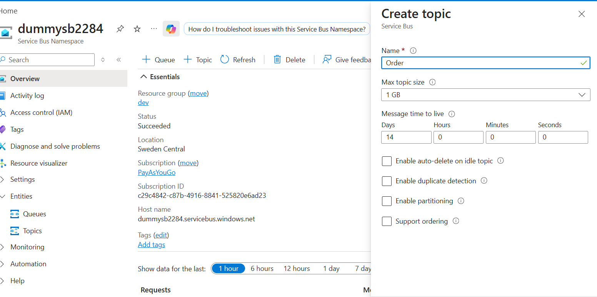

- Name:
- Max Topic Size : 1-5 GB
- TTL :
- Enable Auto Delete on Ideal Topic :
- Enable Duplicate Detection
- Enable Partition
- Support Ordering : This indicates whether the topic supports ordering

### Create Topic - Subscription

When we create subscription for the topic, each subscription will get the copy of the message.

Example : Billing Subscription, Notification Subscription

- Name
- Max. Delivery Count
- Auto Delete After Idle For
  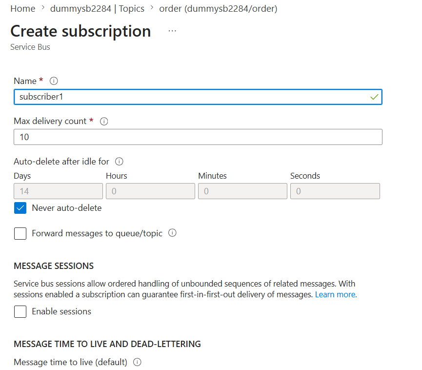
- Neve Auto Delete
- Forward Message to Queue/Topic
- Enable Session : With sessions enabled a subscription can guarantee first-in-first-out delivery of messages.
- TTL
- Enable Dead Lettering on message expire
- Move messages that cause filter evaluation exceptions to the dead-letter subqueue
- Lock duration
  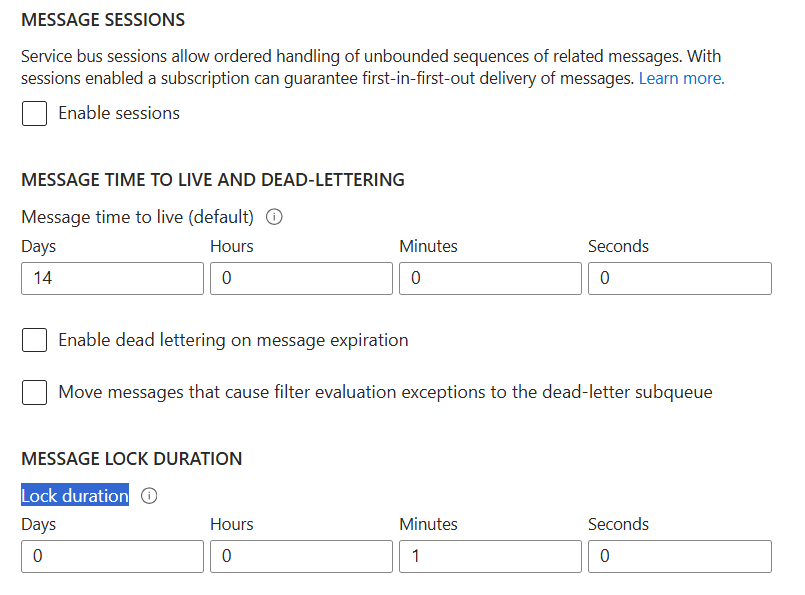

  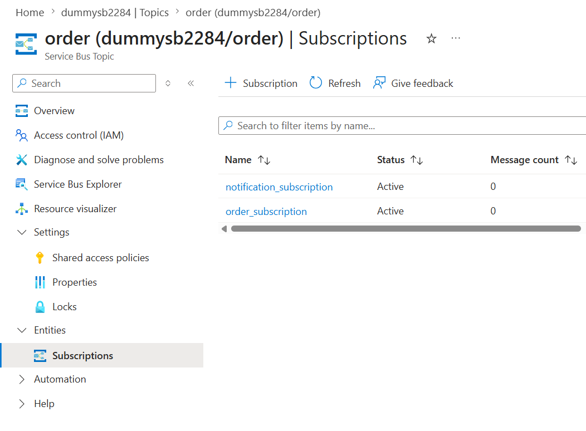

### Use DefaultAuthentication instead of connectionstring

In case you use managed identity using DefaultAuthentication, you need to give

- "Service Bus Data Sender" Role to the sernder identity
- "Service Bus Data Receiver" Role to the receiver identity

For local Testing use "az login" amd on the cloud use the AKS or App Service - System Assigned Managed Identity

### Service Bus Topic Subscription -Filter

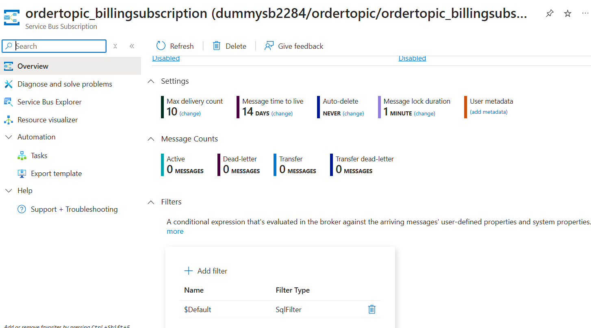

There is a $default filter with condition 1==1, so it accept all messages

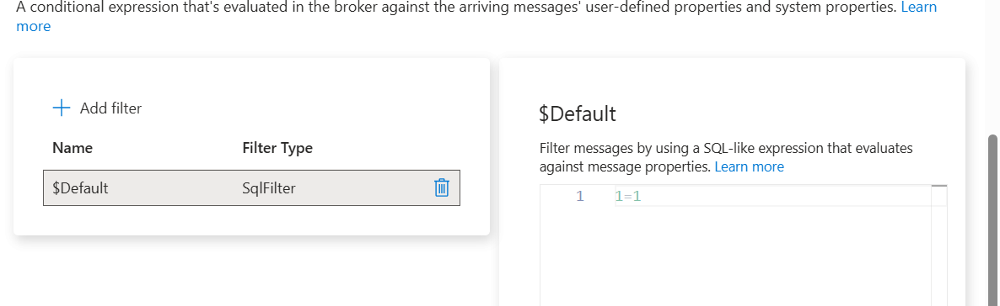

### Add custom Filter

Filter Types

- SQL FIlter
- Correlation Filter

### SQL Filter

Use can only use message Application properties in the Filters,
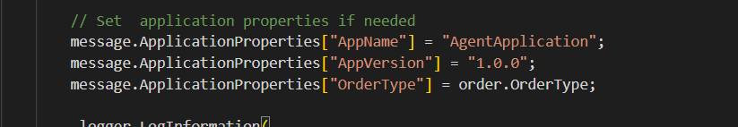
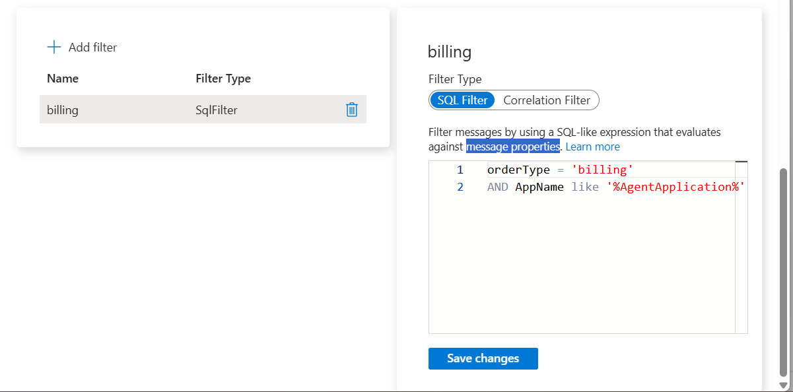
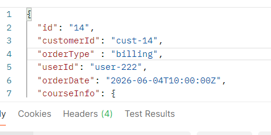

### Correlation Filter

When you want to use the message property besides the message application properties

If you are using multiple filter, all filter conditions must satify, else message will be rejected by the subscription.

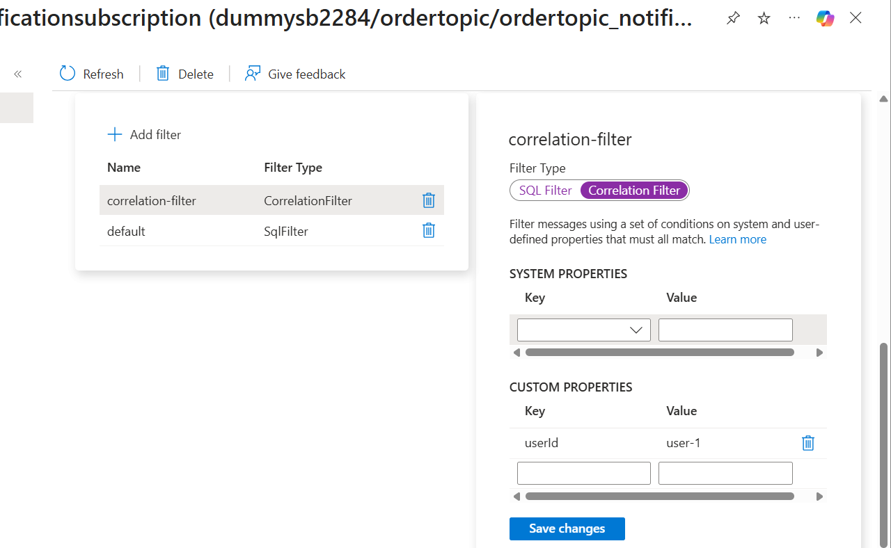
