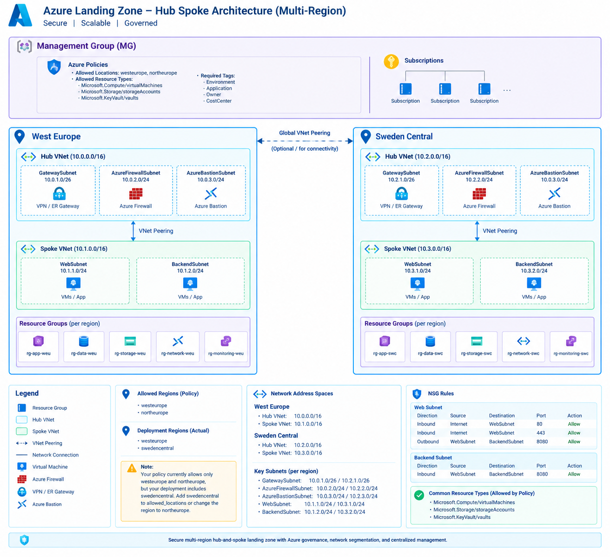

## Target Architecture

```
Management Group
│
├── Governance Policies
│
└── Subscription
    │
    ├── West Europe
    │   ├── Hub (10.0.0.0/16)
    │   ├── Spoke (10.1.0.0/16)
    │   └── App/Data/Storage Resources
    │
    └── Sweden Central
        ├── Hub (10.2.0.0/16)
        ├── Spoke (10.3.0.0/16)
        └── App/Data/Storage Resources
```

## Governance Layer

```
Tenant Root Group
│
└── Landing Zone Management Group
    │
    ├── Azure Policy
    │   ├── Allowed Locations                                       → Built-in
    │   │   ├── westeurope
    │   │   └── northeurope
    │   ├── Allowed Resource Types                                  → Built-in
    │   │   ├── Microsoft.Compute/virtualMachines
    │   │   ├── Microsoft.Storage/storageAccounts
    │   │   └── Microsoft.KeyVault/vaults
    │   ├── Require Tags                                            → Built-in
    │       ├── Environment
    │       ├── Application
    │       ├── Owner
    │       └── CostCenter
    │   ├── Require Diagnostic Settings                             → Built-in
    │   ├── Key vaults should have deletion protection enabled      → Built-in
    │   ├── Key vaults should have soft delete enabled              → Built-in
    │   ├── Azure Key Vault should disable public network access    → Built-in
    │   └── Microsoft cloud security benchmark                      → Built-in/initiative
    │   └── CIS Microsoft Azure Foundations Benchmark v2.0.0        → Built-in
```

## Multi-Region Landing Zone

```
Azure Tenant
│
├── Management Group
│
├── Subscription
│
├── West Europe
│   │
│   ├── RG-Network-WEU
│   │
│   ├── Hub-VNet-WEU
│   │   Address Space: 10.0.0.0/16
│   │
│   │   ├── GatewaySubnet
│   │   │   10.0.1.0/26
│   │   │
│   │   ├── AzureFirewallSubnet
│   │   │   10.0.2.0/24
│   │   │
│   │   └── AzureBastionSubnet
│   │       10.0.3.0/24
│   │
│   └── Spoke-VNet-WEU
│       Address Space: 10.1.0.0/16
│
│       ├── WebSubnet
│       │   10.1.1.0/24
│       │
│       └── BackendSubnet
│           10.1.2.0/24
│
│
└── Sweden Central
    │
    ├── RG-Network-SWC
    │
    ├── Hub-VNet-SWC
    │   Address Space: 10.2.0.0/16
    │
    │   ├── GatewaySubnet
    │   │   10.2.1.0/26
    │   │
    │   ├── AzureFirewallSubnet
    │   │   10.2.2.0/24
    │   │
    │   └── AzureBastionSubnet
    │       10.2.3.0/24
    │
    └── Spoke-VNet-SWC
        Address Space: 10.3.0.0/16
        │
        ├── WebSubnet
        │   10.3.1.0/24
        │
        └── BackendSubnet
            10.3.2.0/24
```

## Network Connectivity

```
                        Azure Tenant
                              │
        ┌─────────────────────┴─────────────────────┐
        │                                           │
        ▼                                           ▼

 +-------------------+                   +-------------------+
 |   West Europe     |                   |  Sweden Central   |
 +-------------------+                   +-------------------+
          │                                         │
          │ Regional Peering (Optional)             │
          └─────────────────┬───────────────────────┘
                            │
                            ▼

     ┌─────────────────────────────────────────┐
     │          Global VNet Peering            │
     └─────────────────────────────────────────┘


West Europe                                  Sweden Central
=============                                ===============

Hub VNet                                     Hub VNet
10.0.0.0/16                                 10.2.0.0/16
│                                            │
├─ GatewaySubnet                             ├─ GatewaySubnet
├─ Azure Firewall                            ├─ Azure Firewall
└─ Azure Bastion                             └─ Azure Bastion
│                                            │
│ VNet Peering                               │ VNet Peering
│                                            │
▼                                            ▼

Spoke VNet                                   Spoke VNet
10.1.0.0/16                                 10.3.0.0/16
│                                            │
├─ WebSubnet                                 ├─ WebSubnet
│ 10.1.1.0/24                               │ 10.3.1.0/24
│                                            │
└─ BackendSubnet                             └─ BackendSubnet
   10.1.2.0/24                                 10.3.2.0/24`
```

## Traffic Flow

### Inbound User Traffic

```
Internet
   │
   ▼
Azure Firewall (Hub)
   │
   ▼
WebSubnet
   │
   ▼
BackendSubnet
```

### Administrative Access

```
Administrator
      │
      ▼
Azure Bastion
      │
      ▼
VMs in WebSubnet / BackendSubnet
```

### Site-to-Site

```
On-Premises
      │
      ▼
VPN Gateway
(GatewaySubnet)
      │
      ▼
Hub VNet
      │
      ▼
Spoke VNets
```

## Resource Group Structure

```
West Europe
│
├── rg-network-weu
├── rg-app-weu
├── rg-data-weu
├── rg-storage-weu
└── rg-monitoring-weu

Sweden Central
│
├── rg-network-swc
├── rg-app-swc
├── rg-data-swc
├── rg-storage-swc
└── rg-monitoring-swc
```

## NSG Flow

### Web Subnet

| Direction | Source    | Destination   | Port | Action |
| --------- | --------- | ------------- | ---- | ------ |
| Inbound   | Internet  | WebSubnet     | 80   | Allow  |
| Inbound   | Internet  | WebSubnet     | 443  | Allow  |
| Outbound  | WebSubnet | BackendSubnet | 8080 | Allow  |

### Backend Subnet

| Direction | Source    | Destination   | Port | Action |
| --------- | --------- | ------------- | ---- | ------ |
| Inbound   | WebSubnet | BackendSubnet | 8080 | Allow  |
