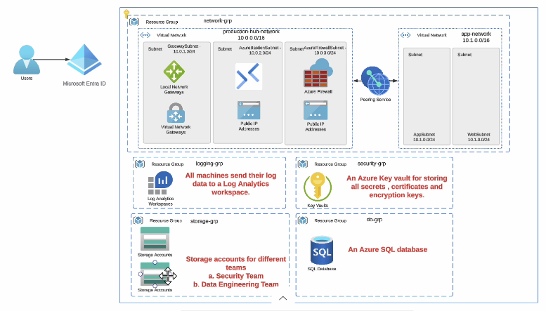

```
Tenant Root Group
│
└── Landing Zone Management Group
    │
    ├── Azure Policy
    │   ├── Allowed Locations                                       → Built-in
    │   ├── Allowed Resource Types                                  → Built-in
    │   ├── Require Tags                                            → Built-in
    │   ├── Require Diagnostic Settings                             → Built-in
    │   ├── Key vaults should have deletion protection enabled      → Built-in
            Key vaults should have soft delete enabled              → Built-in
            Azure Key Vault should disable public network access    → Built-in
    │   └── Microsoft cloud security benchmark                      → Built-in/initiative
    │   └── CIS Microsoft Azure Foundations Benchmark v2.0.0        → Built-in
```


