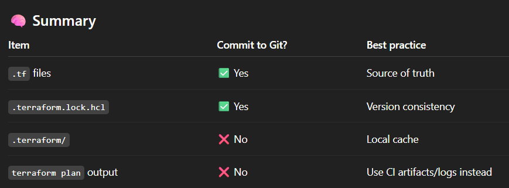

### 🚀 Authenticate

## As per Best practices

```bash
👉 For Local development

Use:
 `az login` (with contritutor accesss to my person account on the dev, staging and prod env.)

Benefits
- Faster iteration
- No need to manage secrets locally
- Terraform automatically picks it up

👉 For CI/CD pipelines (recommended setup)

Use:
- Service Principal (App Registration)
- Even better → Workload Identity Federation (no secrets)


We can not use Managed Identity, as Managed Identity does not work with:
- GitHub Actions (hosted runners)
- Azure DevOps (Microsoft-hosted agents)

👉 Why?
Because those runners are not inside your Azure tenant, so they can't have your Managed Identity.

👉 When Managed Identity works

You can use Managed Identity if your pipeline runs on:
- Azure VM
- Azure Container Instance
- Azure Kubernetes Service
- Self-hosted agent running in Azure
- Azure-hosted tools that support it

Examples:
- Azure DevOps self-hosted agent on a VM
- Terraform running inside an Azure-hosted container

Benefits
- No secrets needed ✅
- Authentication is automatic via Azure metadata endpoint

| Feature            | Managed Identity | Service Principal | OIDC (Federated) |
| ------------------ | ---------------- | ----------------- | ---------------- |
| Runs outside Azure | ❌               | ✅                | ✅              |
| Needs secrets      | ❌               | ✅                | ❌              |
| Best for CI/CD     | ⚠️ Limited       | ✅                | 🥇 Best         |
| Setup complexity   | Low              | Medium            | Medium           |
| Security           | High             | Medium            | Very High        |

```

### 🚀 How to Deploy

Dev

```bash
terraform init -backend-config=backend/dev.hcl
terraform apply -var-file=envs/dev.tfvars
```

Staging

```bash
terraform init -backend-config=backend/staging.hcl
terraform apply -var-file=envs/staging.tfvars
```

Prod

```bash
terraform init -backend-config=backend/prod.hcl
terraform apply -var-file=envs/prod.tfvars
```

### 🚀 How to Destroy

```bash
cd infrastructure/environments/dev

terraform destroy
```

### Best practice tips (important in real setups)

- Preferred: Resource Group level
- Assign Contributor to a specific Resource Group
- Use separate resource group per environment (dev/test/prod)
- Use separate Service Principal per environment (dev/test/prod)
- Avoid sharing one SP across all environments
- Prefer Managed Identity if Terraform runs inside Azure (DevOps, VM, ADO agent)
- Use custom roles (MS EntraID P1/P2 License needed) if Contributor is too permissive
  or In Storage Account: 1) Blob soft delete: ON 2) Retention: 7–30 days
- Always enforce via IaC + Azure Policy where possible
- create a storage account for state file for each environment
  az group create --name tf-state-rg --location westeurope
- Keep state config separate from variables
- Use tfvars for config only
- Use backend config for infrastructure state
- Version control tfvars (except secrets)
- For state management, store state files int he


