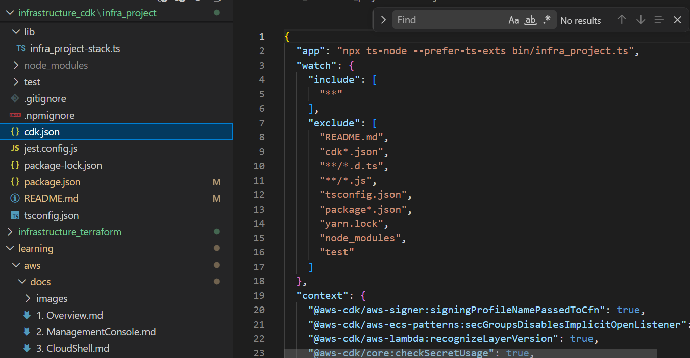
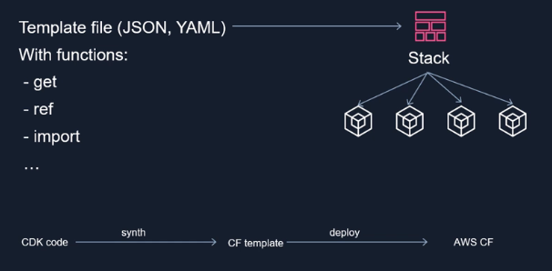
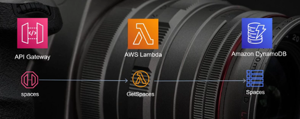
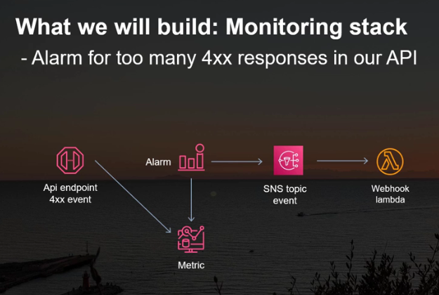
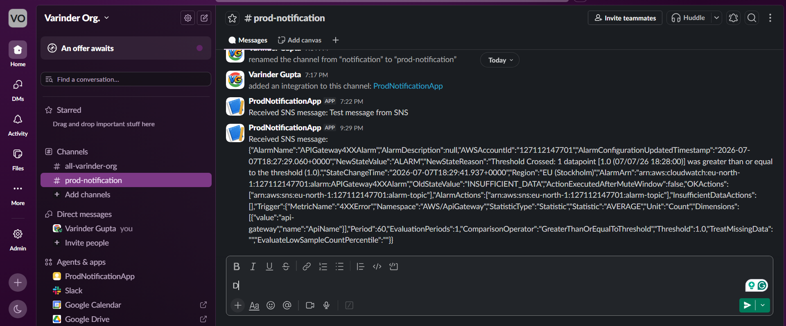
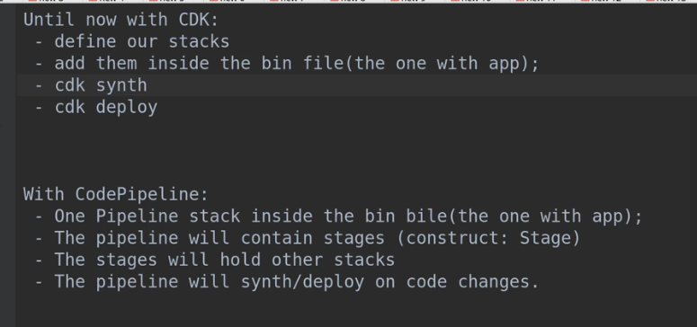

## Project Overview

This is a AWS CDK based project that deploy the AWS resources as IaC using TypeScript.

The `cdk.json` file tells the CDK Toolkit how to execute your app.



## CDK (Cloud Development Kit)

- Cloud Formation is an IaC Enginer in AWS
- It is an absraction over Cloud Formation
- An IaC solution Provided by AWS
- AWS Cloud Formation, organizes and manage resources into groups called 'Stac'



## Useful commands

- `cdk bootstrap` CloudFormation stack setup
- `cdk diff` compare deployed stack with current state
- `cdk synth` emits the synthesized CloudFormation template into `cdk.out` folder
- `cdk deploy` deploy this stack to your default AWS account/region

- `npm run build` compile typescript to js
- `npm run watch` watch for changes and compile
- `npm run test` perform the jest unit tests




To Manually run Test

```
 ts-node test/slack-webhook-handler.test.ts
```



