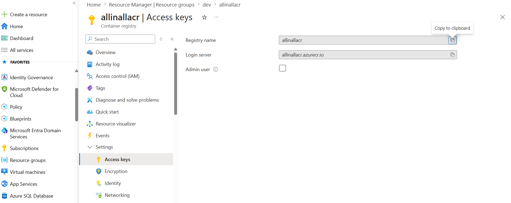
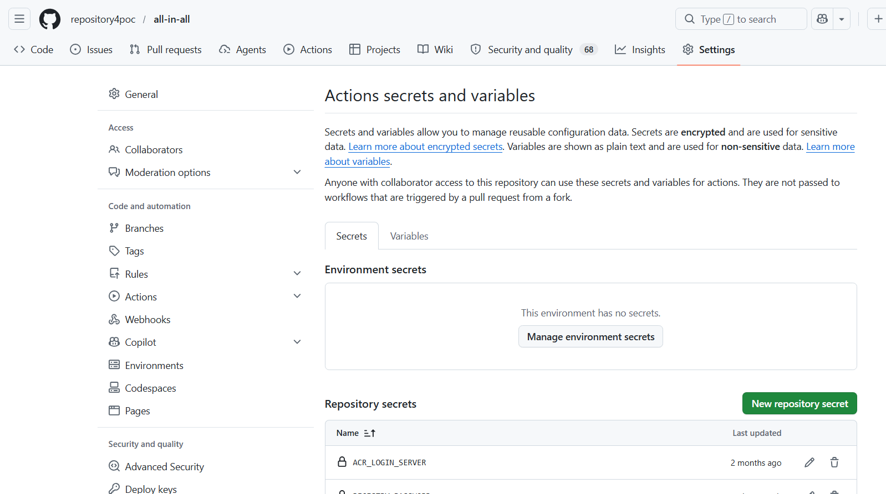
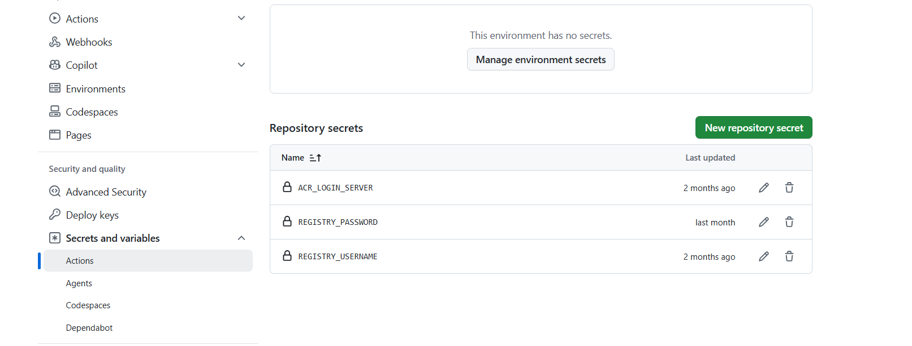

0. Prerequisites (DO THIS FIRST)

Install:

- Terraform
- Azure CLI
- kubectl
- Helm
- Docker

---

Login

```bash
az login
az acccount list
az account set --subscription <your-subscription-id>
az account show
```

- Separate Azure subscriptions per env

---

2. Deploy

```bash
terraform init -backend-config=backend/dev.hcl
terraform plan -var-file=envs/dev.tfvars
terraform apply -var-file=envs/dev.tfvars
terraform destroy -var-file=envs/dev.tfvars
```

\*\* Deploy Shared ACR (ONE TIME)

infrastructure/shared/acr/main.tf

4. Connect to AKS & Get ARGOCD URL & Password

```
az login

az aks get-credentials \
  --name aks-allinall-dev-se-01 \
  --resource-group dev

kubectl port-forward svc/argocd-server -n argocd 8080:443

kubectl -n argocd get secret argocd-initial-admin-secret \
  -o jsonpath="{.data.password}" | base64 -d

# One Time Activity
kubectl apply -f infrastructure_terraform/argocd/root-app.yaml

kubectl get applications -n argocd
kubectl describe application frontend -n argocd
kubectl describe application backendexpress -n argocd
```

### Authenticate

## As per Best practices

```bash For Local development

Use:
 `az login` (with contritutor accesss to my person account on the dev, staging and prod env.)

Benefits
- Faster iteration
- No need to manage secrets locally
- Terraform automatically picks it up

For CI/CD pipelines (recommended setup)

Use:
- Managed Identity for AKS

Note: Managed Identity does not work with:
- GitHub Actions (hosted runners)
- Azure DevOps (Microsoft-hosted agents)

Why?
Because those runners are not inside your Azure tenant, so they can't have your Managed Identity.

When Managed Identity works

You can use Managed Identity if your pipeline runs on:
- Azure VM
- Azure Container Instance
- Azure Kubernetes Service
- Self-hosted agent running in Azure
- Azure-hosted tools that support it

Examples:
- Azure DevOps self-hosted agent on a VM
- Terraform running inside an Azure-hosted container

Benefits
- No secrets needed ✅
- Authentication is automatic via Azure metadata endpoint

| Feature            | Managed Identity | Service Principal | OIDC (Federated) |
| ------------------ | ---------------- | ----------------- | ---------------- |
| Runs outside Azure | ❌               | ✅                | ✅              |
| Needs secrets      | ❌               | ✅                | ❌              |
| Best for CI/CD     | ⚠️ Limited       | ✅                | 🥇 Best         |
| Setup complexity   | Low              | Medium            | Medium           |
| Security           | High             | Medium            | Very High        |

```

### 🚀 How to Deploy

Dev

```bash
terraform init -backend-config=backend/dev.hcl
terraform apply -var-file=envs/dev.tfvars
```

Staging

```bash
terraform init -backend-config=backend/staging.hcl
terraform apply -var-file=envs/staging.tfvars
```

Prod

```bash
terraform init -backend-config=backend/prod.hcl
terraform apply -var-file=envs/prod.tfvars
```

### 🚀 How to Destroy

```bash
cd infrastructure/environments/dev

terraform destroy
```

### Best practice tips (important in real setups)

- Preferred: Resource Group level
- Assign Contributor to a specific Resource Group
- Use separate resource group per environment (dev/test/prod) and provide the access at RG level or - For state files,if you are using same storage group for state file, provide access to Service principal of each env. at the storage account level within the storage account. So Dev SP, can't impact tf state file in the stroage account for prod
- Use separate Service Principal per environment (dev/test/prod)
- Avoid sharing one SP across all environments
- Prefer Managed Identity if Terraform runs inside Azure (DevOps, VM, ADO agent)
- Use custom roles (MS EntraID P1/P2 License needed) if Contributor is too permissive
  or In Storage Account: 1) Blob soft delete: ON 2) Retention: 7–30 days
- Always enforce via IaC + Azure Policy where possible
- create a storage account for state file for each environment
  az group create --name tf-state-rg --location swedencentral
- Keep state config separate from variables
- Use tfvars for config only
- Use backend config for infrastructure state
- Version control tfvars (except secrets)
- For state management, store state files in the storage account
- ACR is shared resource provisioned once, everything else consumes it

### ACR

| Environment | Access            |
| ----------- | ----------------- |
| Dev         | AcrPush + AcrPull |
| Staging     | AcrPull           |
| Prod        | AcrPull           |


---

🧱 1. Final Architecture

👉 Use separate environments with strong isolation

Best setup:

```bash
(BEST)

Separate Azure subscriptions per environment specific resource group, shared resources like ACR will be in separate resource group and all Azure subscriptions has access to it with prevent delete restriction

Shared (once)
  └── ACR

Environments (separate)
  ├── dev
  │    └── AKS
  ├── staging
  │    └── AKS
  └── prod
       └── AKS (private)
```

👉 CI/CD connects everything

🧠 Should you use Terraform workspaces?

❌ Short answer: NO (for your case)

👉 Workspaces are not recommended for multi-environment infra like AKS

Why enterprises avoid them

```bash
❌ Hard to manage state
❌ Risk of deploying to wrong env
❌ Poor visibility
❌ Not CI/CD friendly at scale
```

✅ Instead use:

```
terraform apply -var-file=envs/dev.tfvars
terraform apply -var-file=envs/prod.tfvars
```

👉 Separate:

- state files
- backend configs
- pipelines

🧱 3. ACR Module (shared)

modules/acr/main.tf

```bash
resource "azurerm_container_registry" "acr" {
  name                = var.name
  resource_group_name = var.resource_group_name
  location            = var.location
  sku                 = "Standard"

  admin_enabled = false

  identity {
    type = "SystemAssigned"
  }

  tags = var.tags

  lifecycle {
    prevent_destroy = true
  }
}

```

🛡️ 3. Security best practices (CRITICAL)

🔐 Identity & access

- Use Managed Identity (no service principals)
- Disable local accounts:

```
local_account_disabled = true
```

🔐 Network security

✅ Use private cluster (prod mandatory)

```
private_cluster_enabled = true
```

✅ Restrict API access

```
api_server_authorized_ip_ranges = ["your-office-ip"]
```

🔐 ACR integration

Use kubelet identity:

```
role_definition_name = "AcrPull"
```

🔐 Secrets

👉 Never store in Terraform

Use:

- Azure Key Vault
- CSI driver in AKS

🔐 RBAC

Enable Azure AD RBAC:

```
role_based_access_control_enabled = true
```

💰 4. Cost optimization (VERY important)

🟢 Dev cluster
Small nodes:

```
Standard_B2s / B4ms
```

- Auto shutdown (optional)
- Minimal node count

🟡 Staging

- Medium nodes
- Autoscaling enabled

🔴 Prod

Autoscaling (MANDATORY)

- enable_auto_scaling = true
- min_count = 2
- max_count = 5

Clean unused resources

- Enable cluster autoscaler
- Remove unused namespaces/images

🧱 5. Cluster design (ENTERPRISE)

✅ Node pools per workload

- system pool → core services
- user pool → apps

🌍 6. High availability (prod)

- Use multiple availability zones:

📊 7. Monitoring (MANDATORY)

Enable:

- Azure Monitor
- Log Analytics

🧠 8. ACR + AKS integration (your case)

Since you use shared Azure Container Registry:

👉 Grant only pull

```
role_definition_name = "AcrPull"
```

🏢 9. Enterprise Terraform structure

```
shared/
  acr/

envs/
  dev/
  staging/
  prod/
```

👉 Separate:

- state
- pipelines
- permissions

🔁 10. CI/CD flow

```bash
Code → Build → Push to ACR → Deploy to AKS

```

- No manual deploy to prod
- Use approvals for prod

🚀 Final recommendation for YOU

✔ Do this

- ❌ No Terraform workspaces
- ✅ Use tfvars per env
- ✅ Shared ACR
- ✅ Separate AKS per env
- ✅ Private cluster (at least prod)
- ✅ Managed identity
- ✅ Autoscaling

🔥 Simple blueprint

```bash
ACR (shared)

AKS-dev     → cheap, flexible
AKS-staging → realistic
AKS-prod    → secure, HA
```

📁 2. Terraform repo structure (enterprise)

```bash
infrastructure/
  modules/
    aks/
    acr/

  shared/
    acr/

  envs/
    dev/
      main.tf
      backend.tf
      dev.tfvars
    staging/
    prod/

  global/
    variables.tf

```

🧱 3. AKS module (production-ready baseline)
modules/aks/main.tf

```bash
resource "azurerm_kubernetes_cluster" "aks" {
  name                = var.name
  location            = var.location
  resource_group_name = var.resource_group_name
  dns_prefix          = var.dns_prefix

  private_cluster_enabled = var.private_cluster_enabled

  identity {
    type = "SystemAssigned"
  }

  default_node_pool {
    name                = "system"
    vm_size             = var.vm_size
    enable_auto_scaling = true
    min_count           = var.min_count
    max_count           = var.max_count
  }

  role_based_access_control_enabled = true

  oms_agent {
    log_analytics_workspace_id = var.log_analytics_workspace_id
  }

  tags = var.tags
}
```

🧪 4. Dev vs Prod configuration

🟢 dev.tfvars

```
name                = "aks-allinall-dev-se-01"
location            = "swedencentral"
resource_group_name = "rg-allinall-dev-se"
dns_prefix          = "allinall-dev-se"

vm_size  = "Standard_B2s"
min_count = 1
max_count = 2

private_cluster_enabled = false
```

🔴 prod.tfvars

```
name                = "aks-allinall-prod-se-01"
location            = "swedencentral"
resource_group_name = "rg-allinall-prod-se"
dns_prefix          = "allinall-prod-se"

vm_size  = "Standard_DS2_v2"
min_count = 2
max_count = 5

private_cluster_enabled = true
```

🔐 5. ACR ↔ AKS integration (critical)

In AKS module:

```
resource "azurerm_role_assignment" "acr_pull" {
  principal_id         = azurerm_kubernetes_cluster.aks.kubelet_identity[0].object_id
  role_definition_name = "AcrPull"
  scope                = var.acr_id
}
```

👉 Secure, no passwords needed

🚀 6. CI/CD Pipeline (GitHub Actions example)

.github/workflows/deploy.yml

```
name: Build and Deploy

on:
  push:
    branches: [ "main" ]

jobs:
  build:
    runs-on: ubuntu-latest

    steps:
      - uses: actions/checkout@v3

      - name: Login to Azure
        uses: azure/login@v1
        with:
          client-id: ${{ secrets.AZURE_CLIENT_ID }}
          tenant-id: ${{ secrets.AZURE_TENANT_ID }}
          subscription-id: ${{ secrets.AZURE_SUBSCRIPTION_ID }}

      - name: Build & Push Image
        run: |
          az acr login --name myacr
          docker build -t myacr.azurecr.io/myapp:${{ github.sha }} .
          docker push myacr.azurecr.io/myapp:${{ github.sha }}

      - name: Deploy to AKS
        run: |
          az aks get-credentials --name aks-allinall-dev-se-01 --resource-group rg-allinall-dev-se
          kubectl set image deployment/myapp myapp=myacr.azurecr.io/myapp:${{ github.sha }}
```

🔁 7. Promotion flow (enterprise)

```
dev → staging → prod
```

Use:

```
az acr import \
  --name myacr \
  --source myacr.azurecr.io/myapp:<build-id> \
  --image myapp:prod-<build-id>
```

👉 No rebuild → same artifact everywhere

🛡️ 8. Security checklist
MUST DO:

```
✅ Private AKS (prod)
✅ Managed Identity
✅ Disable admin user on ACR
✅ Use Azure Key Vault
✅ Network policies
✅ RBAC enabled
```

💰 9. Cost optimization

```

| Env     | Strategy           |
| ------- | ------------------ |
| dev     | small nodes, no HA |
| staging | moderate           |
| prod    | autoscale + HA      |
```

🌍 10. Networking (advanced but recommended)

- VNet per environment
- Private endpoints for ACR
- Private AKS API server

🚀 Final architecture summary

```
ACR (shared)

AKS-dev     → cheap + flexible
AKS-staging → realistic testing
AKS-prod    → secure + HA + private
```

```

```




