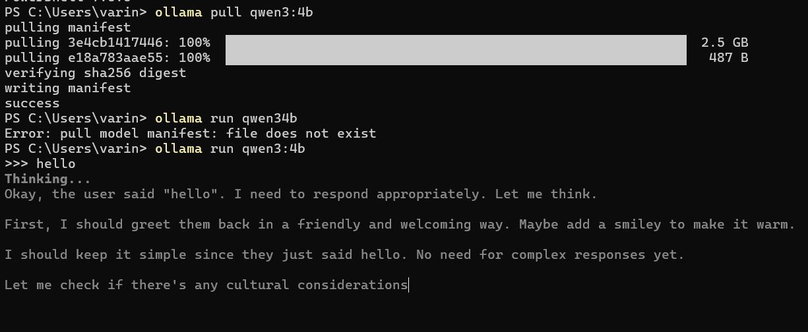
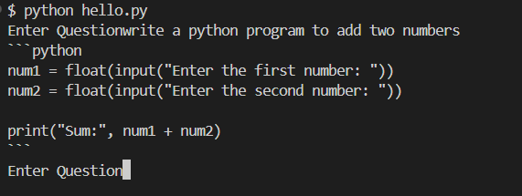
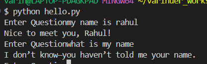

## AI Assistant

A software application that understand your instructions and provide useful responses.

## Popular AI Assistants

- ChatGPT (By OpenAI)
- Gemini (By Google)
- Claude (By Anthropic)

## AI Assistants can do

- Answer your Question
- Write an Email
- Generate Program
- Translate language
- Summarize document
- Brainstorm Idea

## AI Assistant vs AI Agent

AI Assistant don't decide what to do next, on its own.

## AI Agent

AI Agent is an AI Assistant with additional abilities:

1. Planning
2. Using Tools
3. Remembering Information
4. Taking actions on its own

## How does AI Assistant Answer Questions

1. You send a question/instruction to an AI Assistant through a progam (client application)
2. It receives your question/instruction
3. Send your question to LLM/AI Model
4. AI Model understand your question/instruction and generate the response
5. The response is send to your progam (client application)

## AI Model / LLM

- It is the brain of an AI assistant
- It has already learnt from enormous amount of books, articles, blogs, websites and publically available information
- When you ask a question, the model `predicts` the most appropriate answer based on this knowledge.
- Here we will use AI model, and do not train AI model

## Where does the AI Model runs

1. `Cloud Models`: The AI model runs on remote servers and your program sends request to them over the internet via API
   - Models from OpenAI, Google, Anthropic, Groq and others
2. `Local Models`: The AI model runs on your own machine.
   - Ollama (An Opensource AI Model)

### Advantage of Local Models

- Free (Opensource)
- Private (Installed on your machine)
- Great for learning

## What is an API

- API (Application Program Interface)
- Cloud Models are accessible via API, your program make call to these APIs with Questions/Instruction, these model understand the question and provide useful response.

## Setting up development environment

1. Python (Programming Language)
2. VS Code (IDEditor)
3. Ollama (AI Model)
4. GIT (Version Control System)

## Install Ollama

Ollama is a platform, that downloads and manage AI models for you.
There are many Opensource AI Model available. We will use

- Qwen3:4b

It provides a balance between speed and quality.

```
ollama pull qwen3:4b
```

```
ollama run qwen3:4b
>>> hello
```

```
Ctrl+C
```



once the AI Model is downloaded, it need not to download again

## Create Project folder and virtual environment

The virtual environment keep libraries separate from other python project libraries on your computer.

1. Create virtual environment

   ```
   python -m venv .venv
   ```

2. Activate virtual environment

   `Windows`

   ```
   .venv/Scripts/activate
   ```

   `Linux`

   ```
   source .venv/bin/activate
   ```

3. Validate

   ```
   (.venv)
   ```

## First AI Program

1. Create environment file

   `.env`

   ```
    ## Ollama - qwen3:4b
    BASE_URL=http//localhost:11434/v1
    API_KEY=ollama
    MODEL=qwen3:4b
   ```

2. Create `hello.py`

   ```
    from openai import OpenAI
    from dotenv import load_dotenv
    import os

    load_dotenv()

    client = OpenAI(
        base_url=os.getenv("BASE_URL"),
        api_key=os.getenv("API_KEY")
    )

    message = [
        {
            "role":"user",
            "content":"What is Artificial Intelligence?"
        }
    ]

    response = client.chat.completions.create(
        os.getenv("MODEL"),
        message)

    print(response.choices[0].message.content)

   ```

3. Install dependencies

   ```
   pip install openai
   pip install dotenv
   ```

4. Run

   ```
   python hello.py
   ```

## Experiment Time

If you rerun the program with same prompt, everytime you get a different answer.

So it is generating the answer on every run.

You application becomes a bridge between the User and the AI Model

AI-Powered Application : Application with AI

## Build your first assistant

`Take input from console`

```
question = input("Enter your question")
```

## Conversational Loop

```
while (True) :
    question = input("Enter Question")

    message = [
        {
            "role":"user",
            "content":question
        }
    ]

    if (question.lower() == "quit") :
        print("Good Bye..")
        break

    response = client.chat.completions.create(
        model=os.getenv("MODEL"),
        messages=message
    )

    print(response.choices[0].message.content)
```



## AI Model Limitation

AI Model has no memory of your previous messages.


