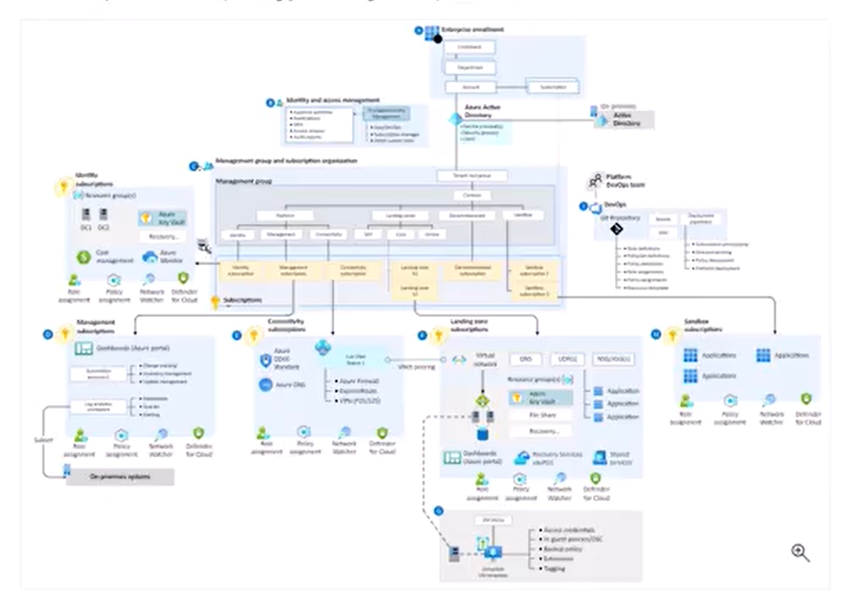
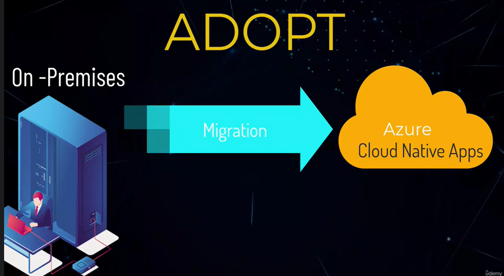
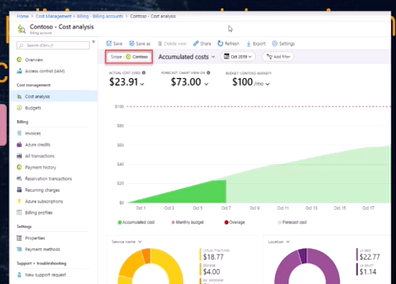
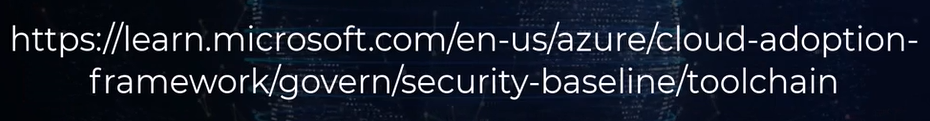
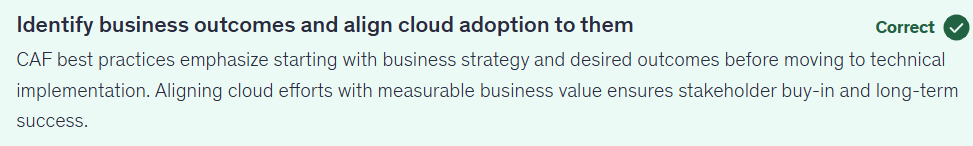
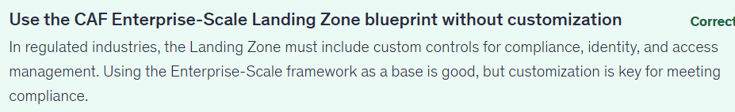
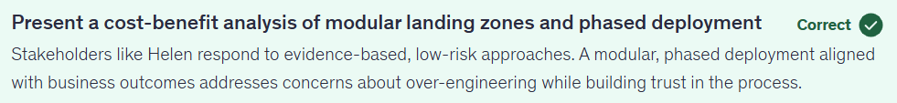
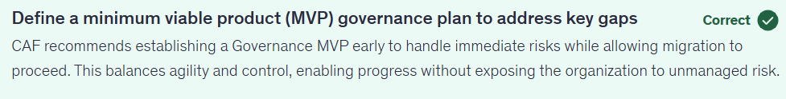
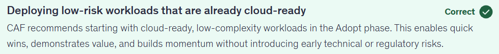

## Cloud Adoption Framework

- Cloud Adoption is a costly affair and to make this journey process oriented and simple, MS has provided a framework called `Cloud Adoption Framework - CAF`

- CAF provides a set of
  - Tools & Templates
  - Documentation
  - Proven Practices

that help an Organization succeed in Cloud Adoption Journey

- There are multiple stages in CAF.
  1. Strategy
  2. Planning
  3. Readyness (Ready your organization)
  4. Adopt the cloud
  5. Governance (Govern the Cloud)
  6. Manage (Manage the Cloud environment Properly)

## 1. Strategy Phase

- **1. Document Motivations**
  - Why are you moving to the cloud
  - What you want to get out of those cloud servies
- **2. Document Business Outcomes**
  - Will it reduce the cost.
  - For this you need to meet the
    - leadership team (People from CSuite)
    - Marketing team
    - Sales team
    - HR Team
      To document your goals
- **3. Understand and Evaluate Financial Considerations**
  - Measure your objectives and identify the return you expect from this specific investment of your cloud journey.
- **4. Understand and Evaluate Technical Considerations**
  - What will be your first technical project to go-live into your cloud platform.

**CAF -Tools and Templates**

- https://learn.microsoft.com/en-us/azure/cloud-adoption-framework/resources/tools-templates

- Here you get the tools and templates for each of your steps in CAF.

  

  

- During Asessment, involve all important stakeholders
  - leadership team
  - Finance Team - CFO (For Financial Considerations)
  - Sales Team
  - licensing team
  - Project Managers

As it is difficult to gather all together, So the best practise is

- Circulate the strategy assessment link amoung various teams and their opinion is taken offline.
- All Data is collected into online shared platform, and collaboration is done using the same platform.
- Once everybody agrees to the data, further more strong decisions are taken over an online meeting together.

- So these assessments gives us technical and financial consideration, business outcomes for your cloud journey

## 2. Planning Phase

- **1.Identify your digital estate**
  - If you have any on-premise infrastructure, then you create an invetory of existing digital assets that you plan to migrate to the cloud
  - Azure Migrate for discovery and migration
- **2.Organization Alignment**
  - Identify and Involve right people involve in the migration from technical as well as cloud governance standpoint
  - Who is responsible and accountable for what
  - Organizations setup Cloud(COE), that ensure that there are specific set of people who are totally focused on cloud journey and address this cultural change, addressing the skills and systems, required to build the cloud competency.
- **3.Skill Readiness Plan**
  - Have a plan to build those skills, as these would be people resistant to new technologies and changes.
- **4.Cloud Adoption Plan**
  - A comprehensive plan that brings together the development, Operations and Business teams towards a shared cloud adoption goal.
  - Here we have a plan that - Defined the pre-requisites - Prioritizes the workloads
    - 10 workload that can be migrated to the cloud
    - align assets to the workloads
    - Review your decisions along with other peers.
    - Do you want to migrate or innovate
    - There are 5 R's in migration strategy
      - Rehost
      - Revise
      - Refactor
      - Rebuild
      - Replace
    - Define rough timeline for releasing the project and go ahead with the initial estimates.
      

## 3. Readyness Phase - Landing Zone

**What is a Landing Zone**

Before Deploying your applicaiton onto Cloud we have to look into `Design Considerations` as an architect. All these `Design Considerations` collectively refered as a `Landing Zone`.

So `Landing Zone` Provides a full blown environment for an application, and the environment provides all the 6 design considerations.

1. Scalability

2. Security
   - How data at transit and data at rest is secured

3. Identity & Access Management
   - Who gonna have access to these resources
   - How your customers will access the data

4. Connectiviity
   - Connectiviy between resources like VM and Database
     - Inbound and Outbound traffic
     - Would you have network segmentation
     - How about connectivity to other PAAS services
     - How about Name Resolution Services like DNS

5. Monitoring
   - Do you want to use any kind of service that provide inventory of all the applications ans servers
   - How about visibility
   - Do you want to create dashboard

6. Governance
   - Keep Track the cost
   - Optimize your cloud Investment
   - Create Budgets

7. DevOps
   - Platform Automation
   - DevOps Design Considerations
   - Product Development Lifecycle
   - Storing your code as far as Infrastructure As A Code is concerned

So before your application is design, you gonna have infrastructure in Azure ready for your application to be hosted in Azure.

So when the developer pushes the code through DevOps Automation, the application just sit inside this landing zone and automatically have all these integration design capabilities.

So Landing Zone is a concept that is providing an application a destination to sit in.

So all these design consideration you have to finalize before deploying a landing zone.

**Landing Zone Architecture**

It is having a decentralized model, as services are sitting in individual subscriptions, not in one.

This type of design, provide your application

- Full blown security
- RBAC
- Satisty the auditing team as you have Governance in place
- Satisty the security team as you have Security in place
- Network team can also provide therir inputs as far as network topology and connectivity is concerned.

So Landing zone is an environment that provides full blown

- Scalability
- Security
- Identity & Access Management
- Connectivity/Networking
- Monitoring
- Governance
- DevOps

for your application

## 4. Adoption Phase

Now you have landing zone in place, its time to host your applications

These applications can be your existing on-premise application or start builing cloud-native applications

**Migration Approaches**
You can migrate your on-premise applications using

1. Life and Shift / Rehosting:
   - which is the fastest way to move your on-premise workloads to the cloud.

2. Modernize the application
   - take a bit loger time. But lays a rock solid foundation for the application in the cloud because it provide cost and performance efficiency

   - When you think of modernizing your applications, you would like to relook at your on-premise applications, and see
     - what components of the application are not utalized.
     - What can be redone with the modern frameworks and moderan programming platforms.
     - Can we use PAAS instead of hosting it onto VM
     - Can we use Managed Services from the Cloud Provider

3. Innovate
   - Another way to adopt cloud is by innovating
   - Innovation part of the Adoption phase focus of providing gratest business value
   - Here we start putting out thoughts together and see where we can go from here.
     - If we use CICD Pipelines
     - Can I innovate with AI Based Applications or Agents
     - Can I use ML algorithms
     - How about cognitivite engines like Vision API or Face Recognition System.
     - How about data related services in Azure
     - How about innovate the deployment using Kubernetes services

So in the phase we look into the ways to host workloads and data in the landing Zone, and start capitalizing the benefits of cloud.

5. Governance Phase

- Create a of rules / policies to control the environment
- Enhance the data security & manages the risk
- Ensure your IT spend is minimized

**5 Diciplences of Cloud Governance**

- Cost Management
  - Cost Management Center
    - Current and Estimated Cost
      
  - Power BI Desktop Connector
    - Great Visuals and Reports
- Security Baseline
  - Ensure expose minimal attach surface
  - Azure Key Vault (secrets,certificates,Encryption Keys)
    - Encrypt Virutal Drives
    - Encrypt Paas
  - Azure Entra ID / Active Directory
    - For Hybrid Entities
    - Multi-Factor Authentication
  - Azure Policity
    - To ensure Geo Regional Restrictions
    - Detect Malitious Activitiees
  - Defender For Cloud
    - Monitor Security Health of Networks and Resources
    - Detect Malitious Activitiees
    - Detect Vulnerabilities
  - Azure Monitor
    - Detect and Alert Malitious Activities
    - Monitor Security Health of Networks and Resources
  - Storage Encryption Service
  - Backup and Desaster recovery

    `Security Features provided per Service`

    

- Resource Consistency
  - ARM Templates
  - Azure Blueprints
  - Azure Automation
  - Azure Monitoring
    - Application Insights
      - You get telemetry data
    - Log Analytics
      - Aggregating all log data into single repository
    - Azure Monitor REST API
- Identity Baseline
  - In Hybrid Environment, you can sync on-premise Active Directory with the Azure EntraID. So make the fedaration possible
  - Azure AD - Sync Mechanisms : Sync On Premises uses with Azure AD.
    - Password Hash Sync (Default)
    - Pass Through Authentication (PTA)
      - An Agent run on one or more on-premises servers and the sync is done after secure password verification with the on-premises authentication agent.
      - Secure Password Exchange happens with your PTA Agent on-premises.
  - IAM in control
    - Whom you grant permission
    - What you grant permission for.
    - Principal of least previleges.
  - Do you have particular workflow, that grants permissions to the users. Eg. Do you have a reviewer and approver process in place.For this you can use `Previleged Access Manageent` in Azure EntraID (Premium Feature)
- Deployment Acceleration
  - Reduce Time to market
  - Automation and DevOps
  - Tools
    - Azure DevOps
      - Deployment Pipelines
      - Manage Configuration Drifts
    -

`Cloud is a journey, not a destination. As you ride in this journey you see different milestornes`

- When you start this journey, you dont know what will be the final state of this cloud adoption

## Which phase of CAF focus on Business Outcomes like Cost Reduction and Improved Agility

Strategy Phase

The Strategy phase helps define business goals, drivers, and justification for cloud adoption. It ensures alignment between Cloud Technology and Business Outcomes.

## As per CAF, before deploying a workload, what should you implement to prepare the environment for scalable and secure Operations

Azure Landing Zone

It provides a read-made foundation with identity, security, networking and governence already configured following best practices.

## Which CAF phase focues on modernize workloads.

Adopt Phase

It covers workload deployment, modernization, and scaling using tools, automation, and practices aligned to cloud-native principles.

## Which CAF phase focus on policy enforcement and risk reduction

Governance

It focues on defining guardrails using Azure Policy, RBAC, Cost Controls, and resource consistency to manage risk in the cloud environments.

## You are tasked with deploying a new Azure Environment using CAF. You want to follow a step-by-step guide for setup. What should you follow to implement best practices for the deployment

The CAF radiness - Azure Setup Guide

It provies step-by-step instructions for preparing your azure subscription and environment for deployment, ensuring compliance and scalability.

## Your company is starting its cloud adoption journey using Azure. The CIO asks you to ensure the cloud strategy aligns with business priorities and regulatory needs. You're reviewing the Cloud Adoption Framework (CAF) to guide the process. What should you focus on first to ensure alignment?

## You’re working with a healthcare client subject to HIPAA regulations. You’re in the Planning phase of the Azure CAF and need to set up an Azure Landing Zone. What is the most appropriate next step?

# Helen Ward, Director of Infrastructure & Operations, is skeptical about the proposed Azure Landing Zone architecture. She’s concerned about over-engineering and disruption to existing systems. How should you address her concern?

## During the CAF Readiness phase, your team identifies that your organization lacks a formal tagging policy for Azure resources, and identity management is inconsistent across business units. What should be your next action?

## Your cloud team is entering the “Adopt” phase of Azure CAF. Business leadership wants quick wins to demonstrate value. What should you prioritize?

