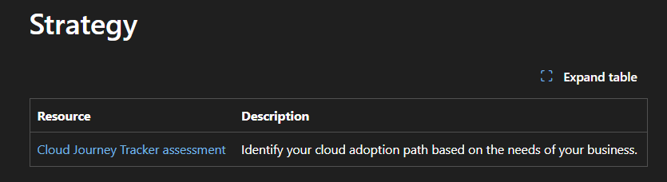
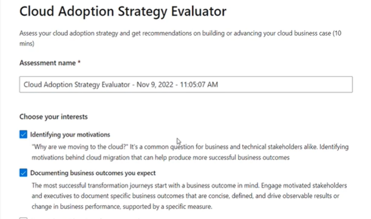
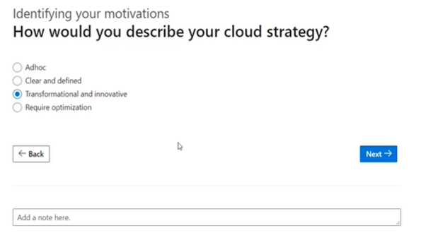
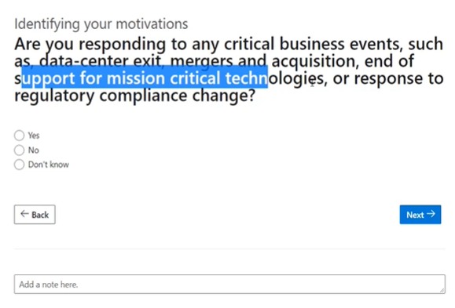
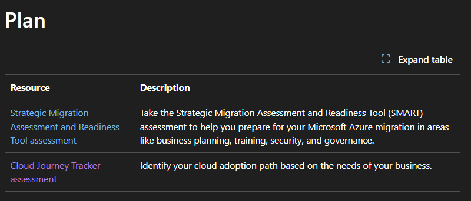

## Cloud Adoption Framework

- Cloud Adoption is a costly affair and to make this journey process oriented and simple, MS has provided a framework called `Cloud Adoption Framework - CAF`

- CAF provides a set of
  - Tools & Templates
  - Documentation
  - Proven Practices

that help an Organization succeed in Cloud Adoption Journey

- There are multiple stages in CAF.
  1. Strategy
  2. Planning
  3. Readyness (Ready your organization)
  4. Adopt the cloud
  5. Governance (Govern the Cloud)
  6. Manage (Manage the Cloud environment Properly)

## 1. Strategy Phase

- **1. Document Motivations**
  - Why are you moving to the cloud
  - What you want to get out of those cloud servies
- **2. Document Business Outcomes**
  - Will it reduce the cost.
  - For this you need to meet the
    - leadership team (People from CSuite)
    - Marketing team
    - Sales team
    - HR Team
      To document your goals
- **3. Understand and Evaluate Financial Considerations**
  - Measure your objectives and identify the return you expect from this specific investment of your cloud journey.
- **4. Understand and Evaluate Technical Considerations**
  - What will be your first technical project to go-live into your cloud platform.

**CAF -Tools and Templates**

- https://learn.microsoft.com/en-us/azure/cloud-adoption-framework/resources/tools-templates

- Here you get the tools and templates for each of your steps in CAF.

  

  

- During Asessment, involve all important stakeholders
  - leadership team
  - Finance Team - CFO (For Financial Considerations)
  - Sales Team
  - licensing team
  - Project Managers

As it is difficult to gather all together, So the best practise is

- Circulate the strategy assessment link amoung various teams and their opinion is taken offline.
- All Data is collected into online shared platform, and collaboration is done using the same platform.
- Once everybody agrees to the data, further more strong decisions are taken over an online meeting together.

- So these assessments gives us technical and financial consideration, business outcomes for your cloud journey

## 2. Planning Phase

- Identify your digital estate
  - If you have any on-premise infrastructure, then you create an invetory of existing digital assets that you plan to migrate to the cloud
  - Azure Migrate for discovery and migration
- Organization Alignment
  - Involve right people involve in the migration from technical as well as cloud governance standpoint
  - Who is responsible and accountable for what

-
