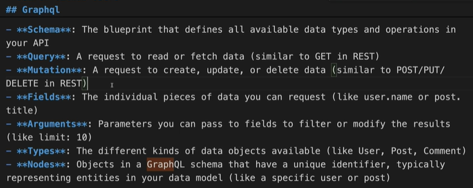
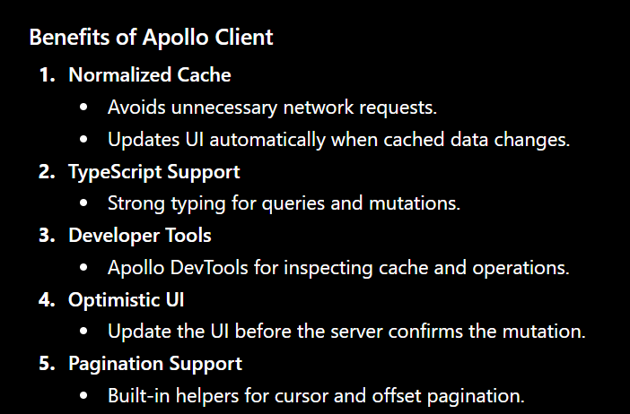
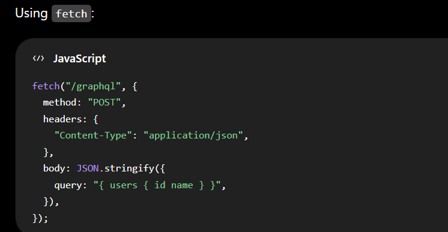
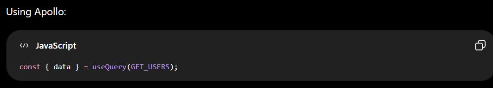

| Aspect             | REST API                                                    | GraphQL                                       |
| ------------------ | ----------------------------------------------------------- | --------------------------------------------- |
| **Endpoints**      | Multiple endpoints (e.g., `/users`, `/orders`, `/products`) | Usually a single endpoint (e.g., `/graphql`)  |
| **Data Fetching**  | Server defines response structure                           | Client specifies exactly what fields it needs |
| **Over-fetching**  | Common (receiving more data than needed)                    | Minimizes over-fetching                       |
| **Under-fetching** | May require multiple requests                               | Can retrieve related data in one request      |
| **Versioning**     | Often uses API versions (`/v1`, `/v2`)                      | Typically evolves schema without versioning   |
| **Caching**        | Easy with HTTP caching mechanisms                           | More complex due to flexible queries          |
| **Learning Curve** | Simpler and widely understood                               | Steeper learning curve                        |
| **Performance**    | Efficient for simple CRUD operations                        | Efficient for complex, data-rich applications |

**REST**

To get a user and their posts:

```
GET /users/123
GET /users/123/posts
```

Response from /users/123:

```
{
  "id": 123,
  "name": "John",
  "email": "john@example.com",
  "address": "...",
  "phone": "..."
}
```

You may receive fields you don't need.

**GraphQL**

```
query {
  user(id: 123) {
    name
    email
    posts {
      title
    }
  }
}
```

```
{
  "data": {
    "user": {
      "name": "John",
      "email": "john@example.com",
      "posts": [
        { "title": "First Post" },
        { "title": "Second Post" }
      ]
    }
  }
}
```

**When to Use REST**

- Simple CRUD applications
- Public APIs
- Services that benefit from HTTP caching
- Teams that want straightforward implementation and maintenance

**When to Use GraphQL**

- Mobile apps with limited bandwidth
- Applications with complex, nested data relationships
- Multiple frontend clients with different data requirements
- Rapidly evolving user interfaces

**Summary**

- **REST**: Multiple endpoints, fixed server-defined responses, simpler to implement and cache.
- **GraphQL**: Single endpoint, client-defined responses, reduces over-fetching and can fetch related data in one request.

A common rule of thumb: REST is often simpler for straightforward APIs, while GraphQL shines when clients need flexible access to complex, interconnected data.

## Installation

```
npm i graphql @apollo/client
```

@apollo/client is the official Apollo library for working with GraphQL APIs in JavaScript and TypeScript applications, especially React.

**Setup Apollo Client**

```
import { ApolloClient, InMemoryCache, ApolloProvider } from "@apollo/client";

const client = new ApolloClient({
  uri: "https://your-api.com/graphql",
  cache: new InMemoryCache(),
});
```

**Wrap your React app:**

```
import React from "react";
import ReactDOM from "react-dom";
import { ApolloProvider } from "@apollo/client";

ReactDOM.render(
  <ApolloProvider client={client}>
    <App />
  </ApolloProvider>,
  document.getElementById("root")
);
```

**Fetch Data with useQuery**

```
import { gql, useQuery } from "@apollo/client";

const GET_USERS = gql`
  query GetUsers {
    users {
      id
      name
      email
    }
  }
`;
```

**Use in a component:**

```
function Users() {
  const { loading, error, data } = useQuery(GET_USERS);

  if (loading) return <p>Loading...</p>;
  if (error) return <p>Error: {error.message}</p>;

  return (
    <ul>
      {data.users.map((user) => (
        <li key={user.id}>{user.name}</li>
      ))}
    </ul>
  );
}
```

**Benefits of Apollo Client**


**Apollo Client vs Fetch**




