## Next.js

A React Framework for createing high quality web applications

| Project               | Good choice             |
| --------------------- | ----------------------- |
| Simple frontend / SPA | React + Vite            |
| Full-stack web app    | Next.js                 |
| SEO-heavy website     | Next.js                 |
| E-commerce            | Next.js                 |
| Dashboard/admin app   | React + Vite or Next.js |
| Need SSR/SSG          | Next.js                 |
| Learning React        | React + Vite            |

- An SEO-heavy website is a website where getting traffic from Google and other search engines is very important.

  SEO = Search Engine Optimization.

  For example:
  - News website
  - Blog
  - E-commerce/product website
  - Real-estate website
  - Travel website
  - Restaurant directory
  - Documentation/knowledge website

    Imagine you have a page:

        "Best laptops under $1,000"

    You want someone searching Google for that phrase to find your page.

- An e-commerce app is an application that lets users browse, buy, and manage products online.

```
E-commerce App
│
├── Home
├── Products
│   ├── Product list
│   └── Product details
│
├── Cart
│   ├── Add product
│   ├── Remove product
│   └── Change quantity
│
├── Checkout
│   ├── Address
│   ├── Payment
│   └── Order confirmation
│
├── Account
│   ├── Login/Register
│   └── My orders
│
└── Admin
    ├── Products
    ├── Orders
    └── Customers
```

```
Frontend
Next.js + React
       ↓
Data fetching
TanStack Query (React Query)
       ↓
Backend
Next.js API / separate backend
       ↓
Database
PostgreSQL / MySQL / MongoDB
       ↓
Payments
Stripe / similar payment provider
```

```
→ Next.js handles the website and React UI
→ TanStack Query handles client-side API data
→ backend handles business logic
→ database stores products/orders/users.
```

## Create NextJS project

```
npx create-next-app full-stack-app
```

```
npm run dev
```

URL : Localhost:3000

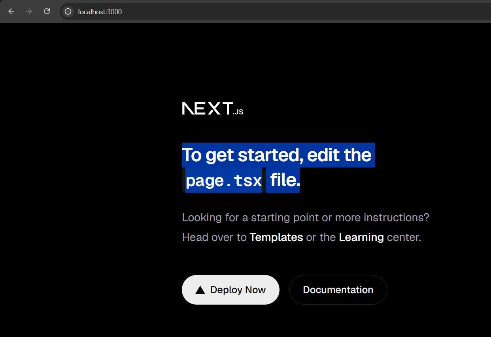

- `page.tsx` in the `app` folder represents the root of our application.

Return the Home component from the `page.tsx`

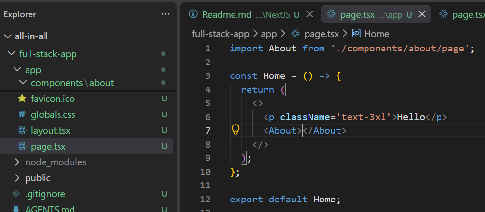

Similarly we can have other component's specific `page.tsx`

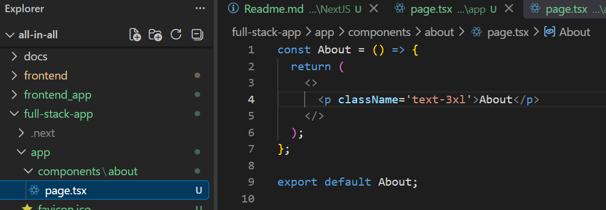

Include it in the `app/page.tsx`

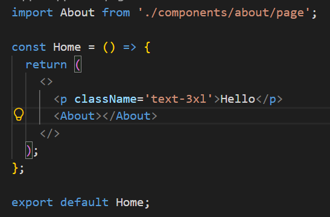

## To Open Browser in VS Code

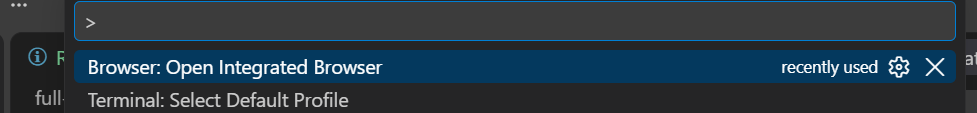

## Nested Routes

By default the component the folder structure pattern in the URL

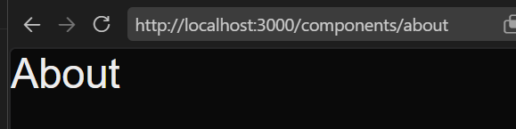

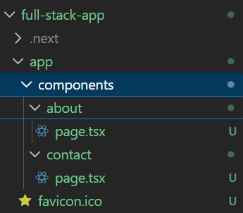

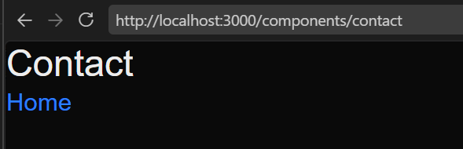

In case we want the URL to be /info/contact we need to place the `contact/page.tsx` under `/app/info/contact/page.tsx`

## Global.css

Put all your CSS in this file,

Using `@import "tailwindcss";` to import TailwindCSS, which is widely used as company standard nowadays

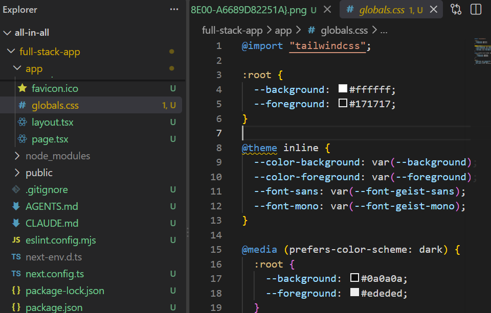

## Layout File

We have a default `layout.tsx` remove the content from it

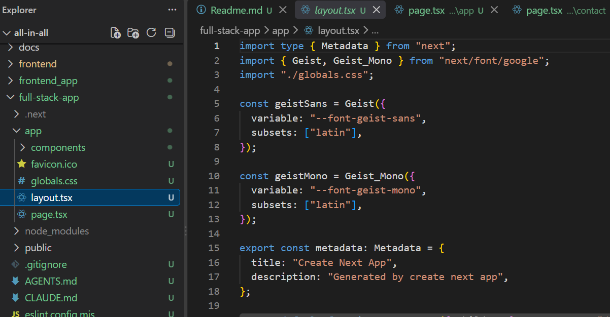

This is the `root layout`, it does not rerender, when we go from page to page, but the `template layout` does rerender.

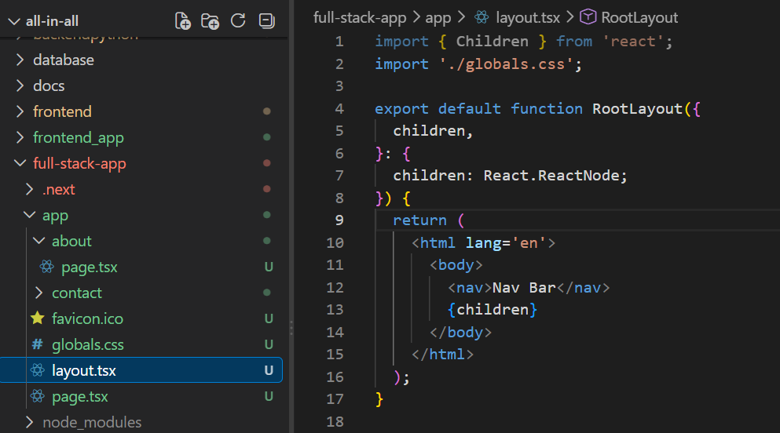

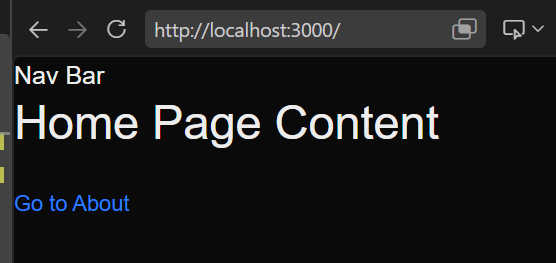

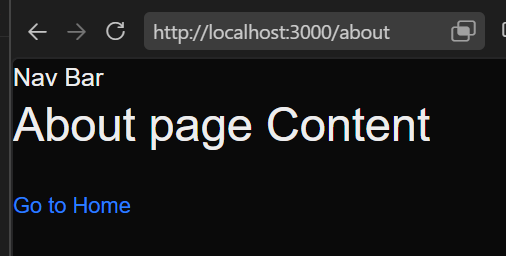

So `Nav Bar` remains there and the {childen} changes

- / : Page.tsx - Home Component
- /about : Page.tsx - About Component

## Nav Component

- create /components/Navbar.tsx
- render in layout.tsx

Note : If we want our components do not become the route, put it outside `/app`, parallel to it

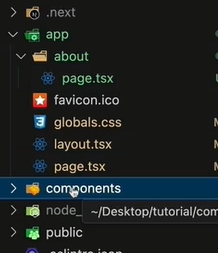

## Use Google Fonts

Automatically self-host any Google Font, Fonts are included in the deployment and served from the same domain as your deployment, No requests are sent to Google by the browser.

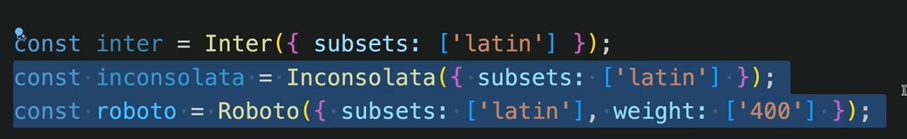

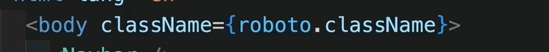

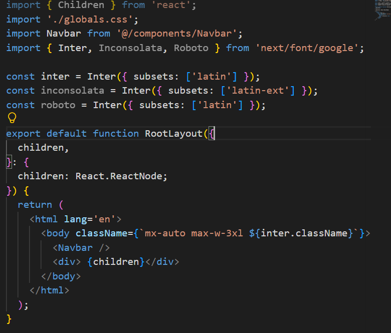

## Metadata

Next.js has a Metadata API that can be used to defind your application metadata for improved SEO and Shareability.

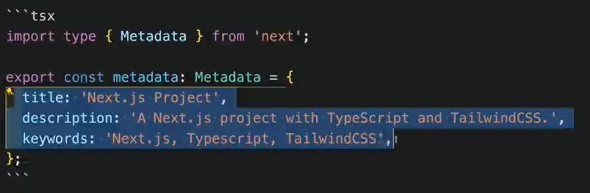

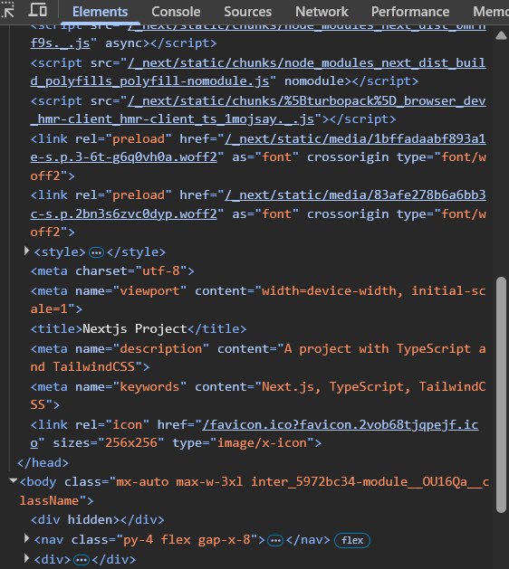

## Server Component and Client Component

All the components by default are server components. To use Client Component, you can add the React `useClient` directive

Server Components run on server, not on browser

`Benefits of Server Components`

- Data Fetching
  - Server Components allow you to move data fetching to the server, closer to your data source. This can improve performance by reducing time it takes to fetch data needed for rendering, and te amount of requests the client need to make.
- Security
- Caching
- Bundle Size

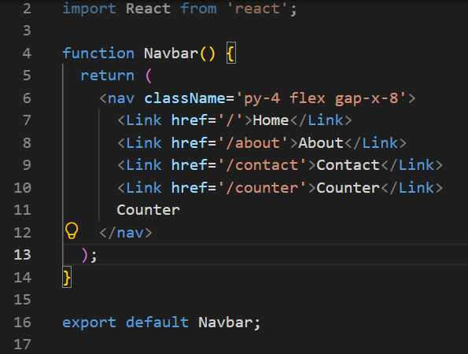

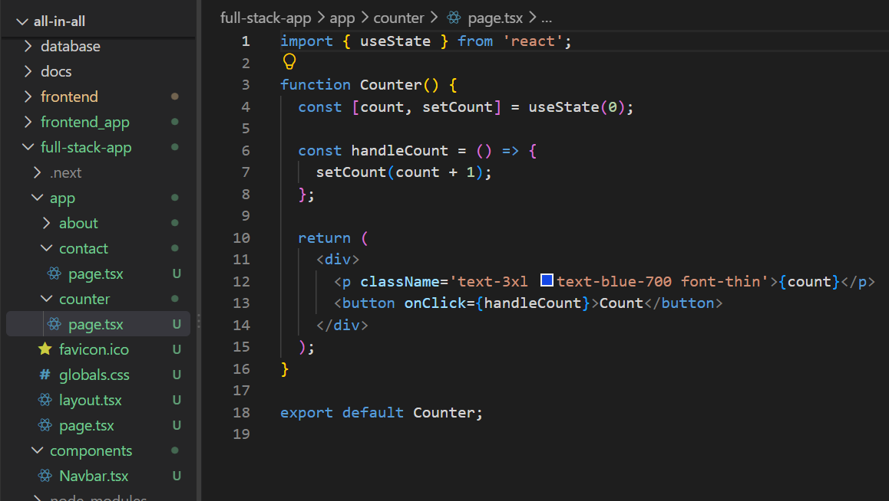

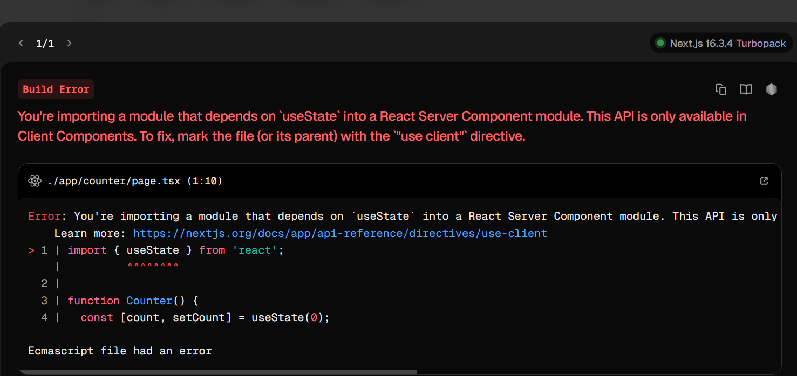

`use Client;`

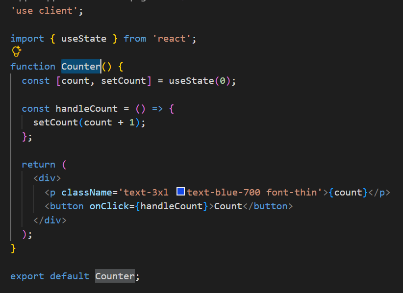

`Server Component`

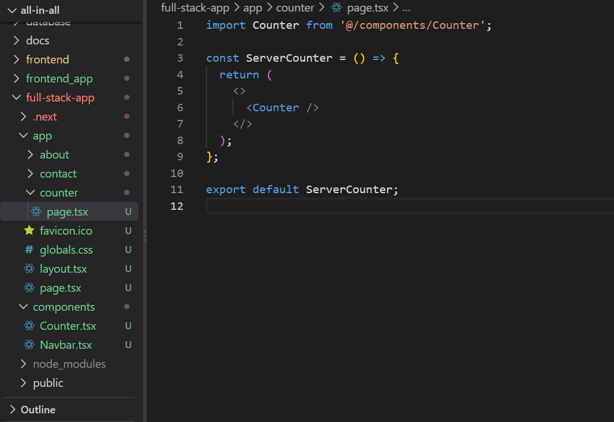

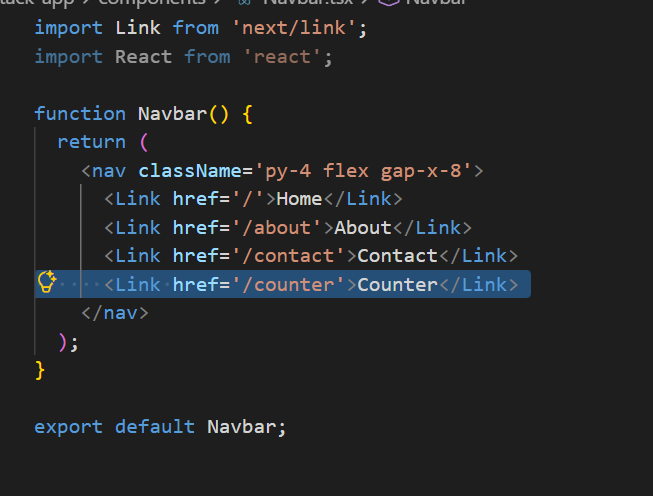

The above navigation link automatically direct to the `page.tsx` return in `app/counter`.
The name of the Component does not matter in this case. It only render whatever component returned as default from the `app/counter/page.tsx`

## Fetching Data

- Create a Server Component tours/page.tsx
- Just add async and start using await
- The same for DB

```
type Tour = {
    id: string;
    name: string;
    info: string;
    image: string;
    price: string;
}
```

```
const url = "https://www.course-api.com/react-tours-project"

async function TourPage(){
    const response = await fetch(url);
    const data: Tour[] = await response.json();
}

```

## Server Components are defined with async function

`app/tour/page.tsx`

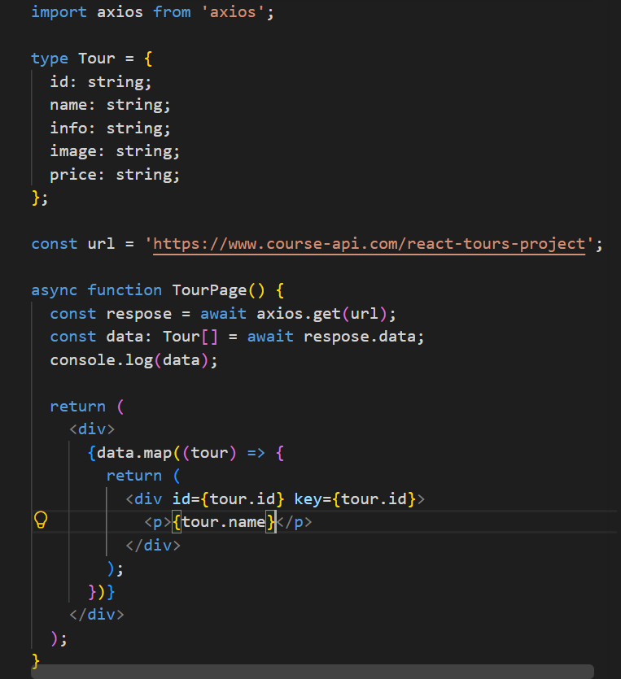

`components/Navbar.tsx`

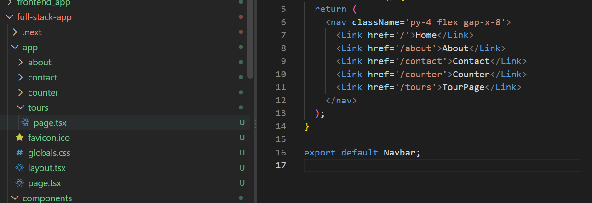

## <> vs `<section>` vs `<article>`

- <>...</> (React Fragment)

  This is not HTML. It's a React feature called a Fragment.

- <section>

  Represents a thematic grouping of content, usually with a heading.

  ```
  <section>
      <h2>Features</h2>
      <p>Our product offers...</p>
  </section>
  ```

- <article>

  Represents a self-contained piece of content that could stand on its own.

  ```
  <section>
    <h1>Latest Posts</h1>

    <article>
      <h2>Post 1</h2>
      <p>Content...</p>
    </article>

    <article>
      <h2>Post 2</h2>
      <p>Content...</p>
    </article>
  </section>
  ```

## Loading Component with the Server Component

If we define a loading component parallel to the Server Component it will render during the async call

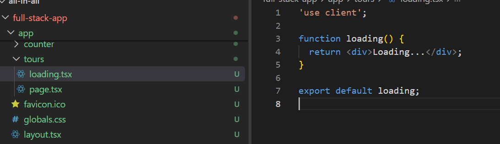

## Nested Layout

We can have a nested layout, for all the pages within a Server Component in `app/`

- create `layout.tsx` file in the `/app/<NodeJS Componeent>/layout.tsx`

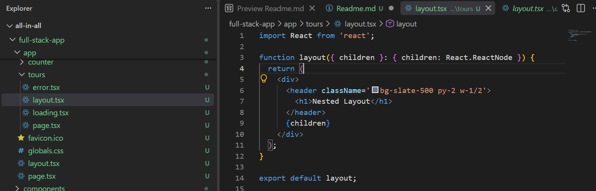

## Dynamic Page

| Folder/file  | Meaning                       |
| ------------ | ----------------------------- |
| `page.tsx`   | Creates a route               |
| `layout.tsx` | Shared UI around child routes |
| `[id]`       | Dynamic segment               |

## Next Link Component

```
<Link href=''>..</Link>

```

## Files Structure

In Next.js App Router, files such as:

```
app/
├── layout.tsx
├── page.tsx
├── error.tsx
├── loading.tsx
└── not-found.tsx
```

must have those exact lowercase names because Next.js uses them as special convention-based files.

Next.js scans the filesystem and looks specifically for:

- page.tsx
- layout.tsx
- loading.tsx
- error.tsx
- not-found.tsx

If you rename them:

```
Layout.tsx
Page.tsx
Error.tsx
```

Next.js will not recognize them as route files.

`What about the component inside?`

The file name is lowercase, but the React component should be PascalCase:

| Type                        | File Name                                   |
| --------------------------- | ------------------------------------------- |
| Next.js special route files | `page.tsx`, `layout.tsx`, `error.tsx`       |
| Your React component files  | `TourCard.tsx`, `Navbar.tsx`, `Sidebar.tsx` |
| Hooks                       | `useTours.ts`, `useAuth.ts`                 |

## Next Images Component

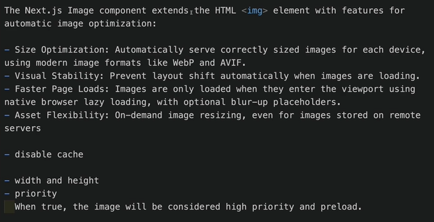

To use remote image in your application you need to add the domain name in the
`next.config.ts`

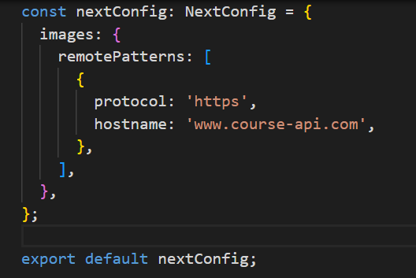

## More Route Options

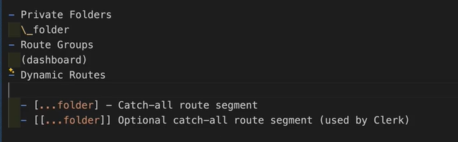

# Server Actions

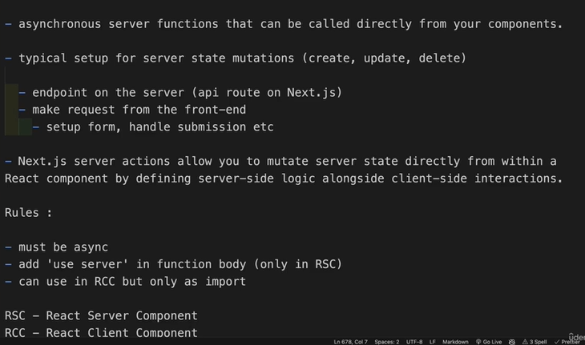

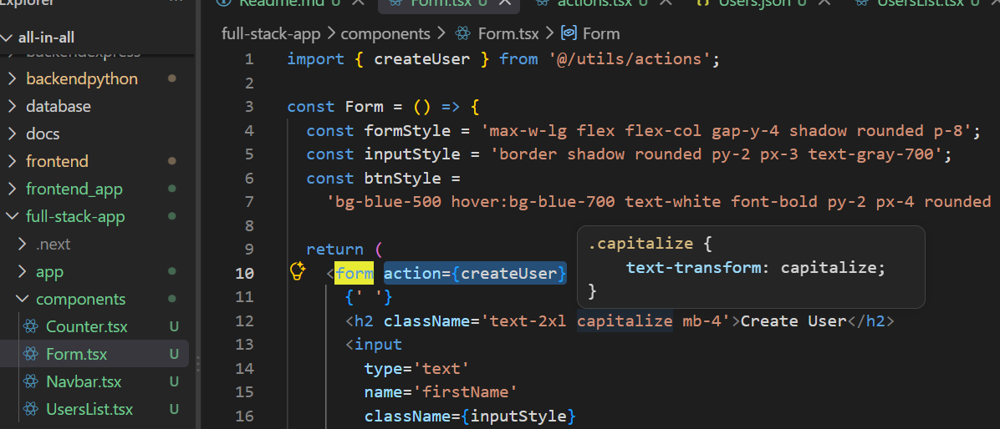

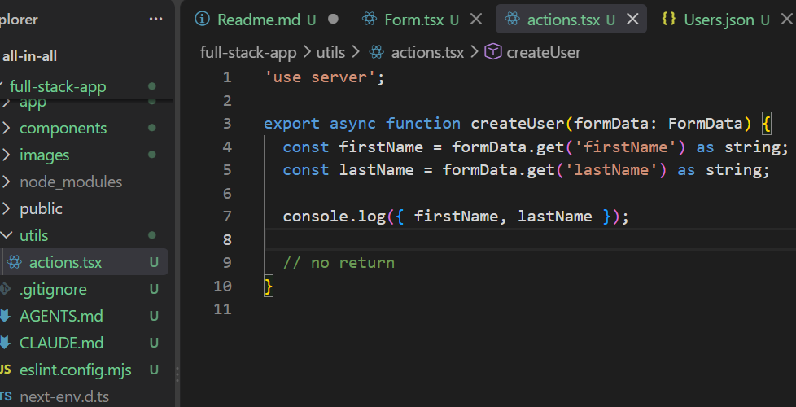

## Revalidate Cache

In some scenarios, when we save data, the page does not reflect the new data, this happens becasue NextjS, cache the data in some scenarios like form etc. Whenever you face such issue use one of theese options

- revalidate cache
- redirect

```
import {revalidatePath} from 'next/cache'


saveUser(newUser);
revalidatePath("/action");
```

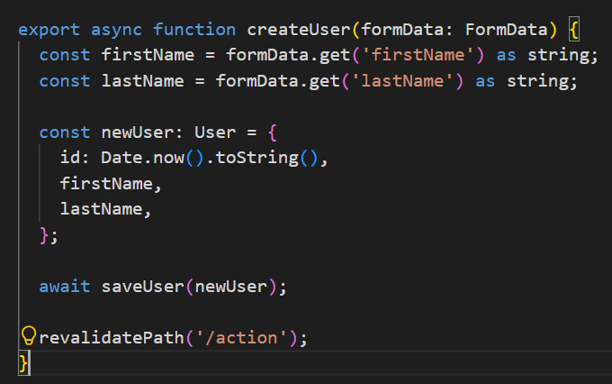

OR

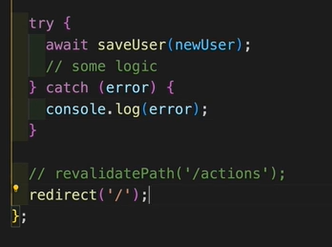

## useFormStatus

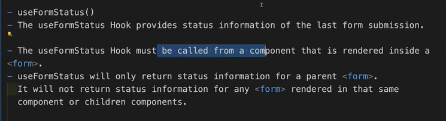

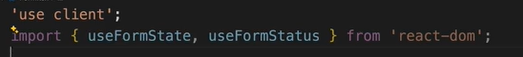
