## What is React

- React is a javascript library for builing UI (User Interfaces)
- Developed and maintained by Facebook (now Meta)
- Source (https://www.udemy.com/course/react-tutorial-and-projects-course)
- Other competetors - Angular, Vue
- React is all about components
  - Component Benetifs
    - Independent, Isolated and Reusable User Interfaces, so change in one component would not break you entire app.
    - Easy to make changes, as just identify the component and make changes
    - **Virutal DOM**, Not whole application is rerendered, on a component updated. Which results into better speed and user experience

## Pre-requisites

- HTML
- CSS
- JavaScript (As React is a JavaScript Library)

## Development Environment Setup

- Browser
  - Google Chrome
    - React Developer Tool Extension
- Text Editor
  - VS Code
- Node.js
  - An open-source , cross-platform JavaScript runtime platform
  - Allow us to run JavaScript outside Browser and Develop fast.

  How to check is node.js installed or not?

  ```
  node --version

  v24.13.1
  ```

  - Always recommended to install LTS version instead of current version. Less chances of bugs.

## Create-React-App

- Used to create project structure with a sample react application, that helps us develop fast.
- More better option is **Vite** (Veet)

```
npx create-react-app frontend-app
```

- When we install Node.js, it also install **NPM** (Node Package Manager)
- NPM allow use to quickly install/update/remove external JavaScript Packages.

  ```
  npm install <package-name>

  npm i <package-name>
  ```

## Folder Structure

- node_modules
  - Node packages sepecified in package.json
  - Child Dependencies
    ```
    npm clean
    ```
- public
  - index.html
    - div "root"
  - Fevicon.ico
  - logo.png
- src (brain of the application - contain all .js, .ts, .jsx files)
  - index.css
  - index.js
  - components
    - NavBar.jsx
- package.json
  - name
  - version
  - dependencies
    - Node packages
  - scripts
    - start
    - build
    - test

      ```
      npm run <start/test/build>

      npm run start = npm start
      ```

  - eslintConfig

- package-lock.json
  - A Snapshot of entire dependency tree.
- Readme.md
  - Project Overview
  - Project Structure
  - Build Instructions
  - Architecture Diagram
- .gitignore
  - /node_modules (Huge in Size)

## Remove Boiler Plate Code

- remove src folder
- create src folder
- create index.js with base component

## First Component

```
function Greeting(){
  return <h1>Greeting</h1>
}

export default Greeting
```

Corresponding Arrow Function

```
Const Greeting = () => {
  return <h1>Greeting</h1>
}

export default Greeting
```

## Difference between JS function and React Component

- Starts with Capital letter
- Must return JSX (HTML)
- Always Closing Tags.
- Export it (export default Greeting)

In react you can many component but only one root component that contains all the other components.

## Extensions and settings

- Auto rename tags
- Highlight matching tags
- ES7 + React/Redux-Native Snippets (dsznajder)
  - rafce (An Arrow function with export)
  - rfce (An regular function with export)

    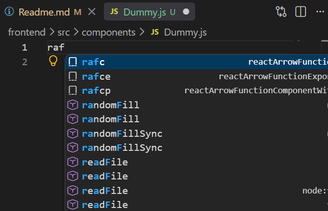

  - Auto import react at top

    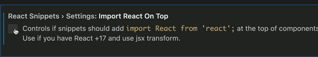
    - prior to react 17 we had to import react at top, but no longer now.

      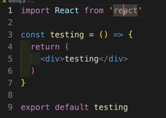

- Prettier - Code Formatter
  - settings

    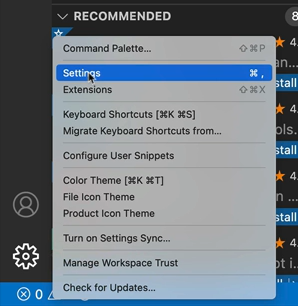

  - Format on save/paste

    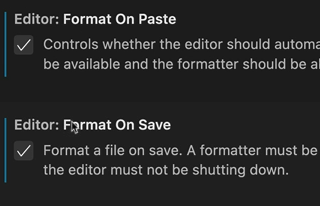

  - Default Formatter : Prettier

    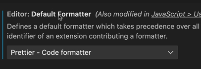

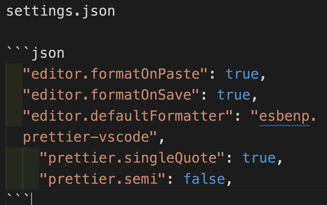

## JSX Rules

- Always return a single element
  - < section ></ section >
  - < article >< article />
  - Fragments : <></> (no unecessary div parent element in the DOM)
- Use camelCase for property names, to distiguish it from the native HTML properties, which are all lowercase.
  - onClick
  - htmlFor
  - readOnly
- In JSX, Use `className` prop to assign a `CSS Class` instead of `class` (which is a JavaScript reserved keyword)

  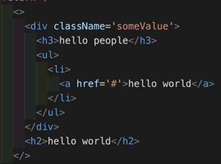

- All tags have closing tags (In native HTLM we have few exceptions like img)
- Use paranthesis while returning

  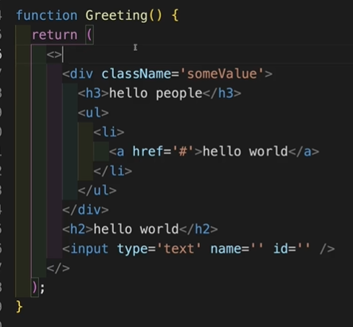

## Nested Components

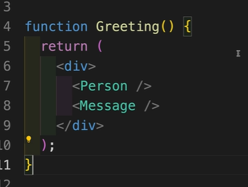

## React Developer Tool

This extension allow us to inpect and debug the component hierarchy, state and props in the react appication.

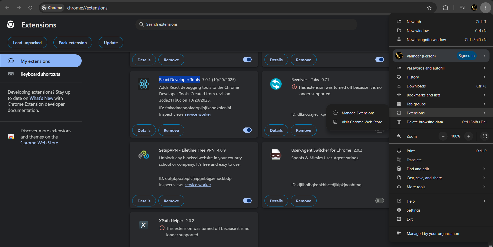

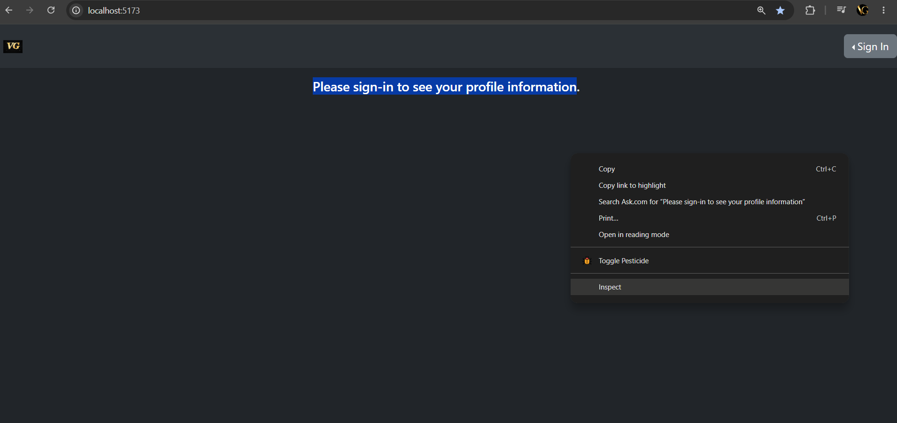

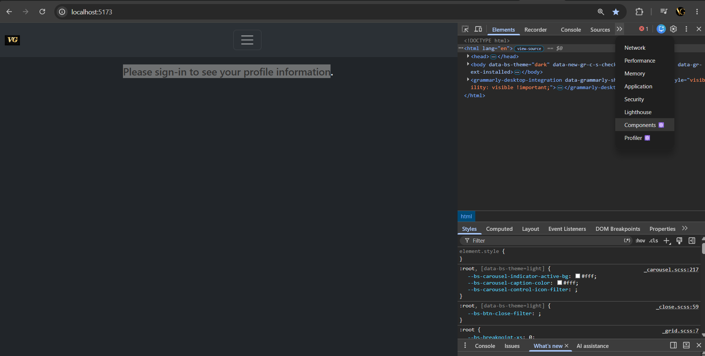

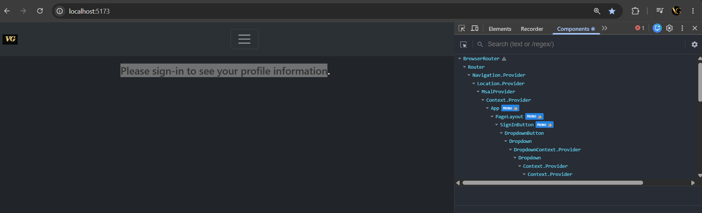

Very useful in understanding and debugging components

React Component is defined as a JS Function, but is used in JSX like `<Book\>` not Book(),

## Advantage of Components based Architecture

- Moduler codebase
- Easy to maintain
- Reusability

## Local Images (public folder)

- Remote Images
  - hosted outside like on S3 Buckets or Azure Storage Account
  - Use URL to the Image
- Local Images
  - In public folder
    - Not a best practice
    - less performant
  - In src folder
    - Prefred approach
    - under the hood they are optimized
  - replace `url` with `relative path` for image `src`

    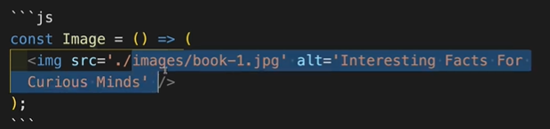

## JSX - CSS

**Inline CSS**
In JSX, for inline CSS, use `style` prop, which uses a JavaScript Object Format, enable dynamic styling.

The value should be an object with camelCase property names.

```
return (
  <>
    <div style={
      ## JS Object
      {
        background :'red',
        color : 'black'
      }
    }>


    </div>
  </>
)
```

We can also change CSS dynamially like for profile using inline style CSS

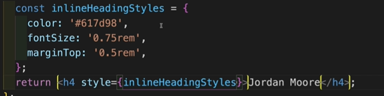

**External CSS**

```
.book {
  background : red,
  color : black
}
```

```
return (
  <>
    <div className="book">


    </div>
  </>
)

```

## JSX - JavaScript

- {} in JSX can contains JavaScript expression returning a value
- { expression } - Must return some value
- { \` # {expression} \` } : For string with expression

```
const title = "Title Text"
const heading = "This is the heading";

const randomMessage = (message) => {
  if(message.length() > 0)
    return "I have title";
  else
    return "I have no title";
}

return (
  <>
    
    <h1>{heading}</h1>
    <h2>{randomMessage(heading)}</h2>
  </img>
)

```

This is very useful in making reusable components, where the value come either from inside the component or from outside via props

We can use JavaScript function on string values

- message.toUpperCase()
- message.toCamelCase()
- message.toLowerCase()

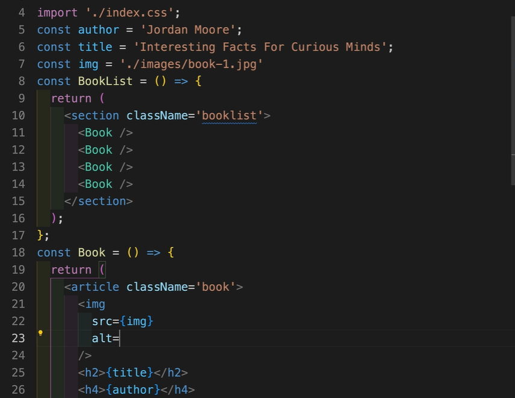

The downside of this appraoch is that the `Book` Component is private and can't be reused with other components.

## Arguments and Paramters

In vanila JavaScript,

- `Parameters` are defined while defining a function
- `Arguments` are actual values , passed during calling that function.

In React, we pass values to the Componets using `Props`

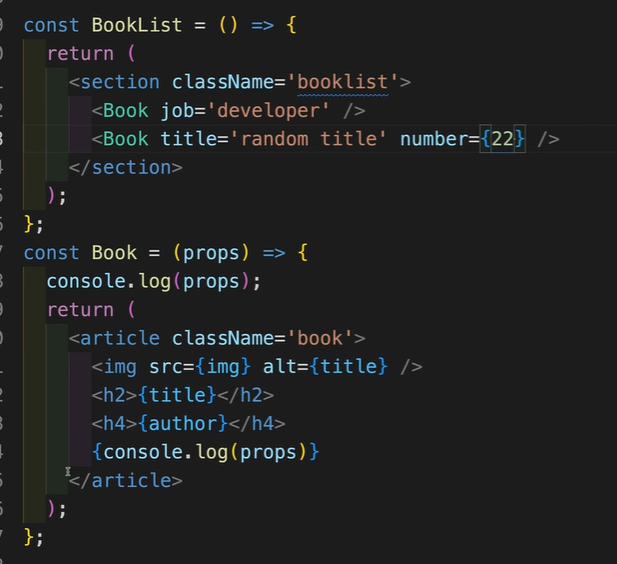

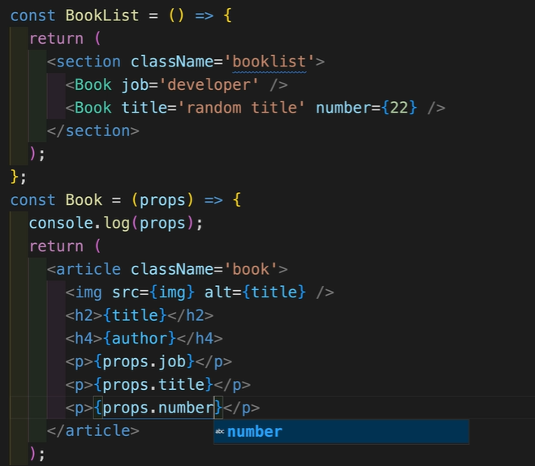

If you dont provide the props values, either you will be displayed nothing or get an error.

## Dynamic Parameters

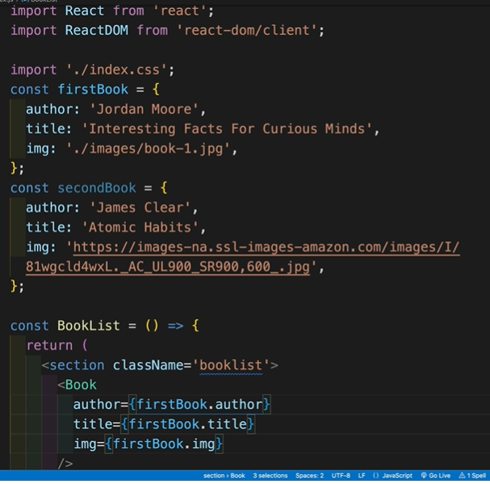

## Props Multiple Approaches

```
const book1 = {
  title : 'Atomic Habits',
  description : "Self Improvement",
  price : 130
}


// Option 1
return (
  <Book
    title={book1.title}
    description={book.description}
    price={book1.price}
  />
)

// Option 2
const {title, description, price} = book1;

return (
  <Book
    title={title}
    description={description}
    price={price}
  />
)

```

Similary with `Props`, a JS Object

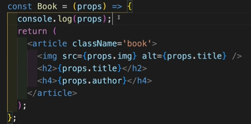

will be replaced with

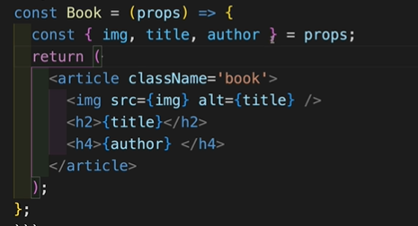

Alternate Approach

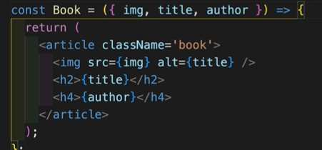

Downside, you can't log `props` within the component.

## Children Props

- Everything we rendered within the Component tags
- Used while setting up Context API

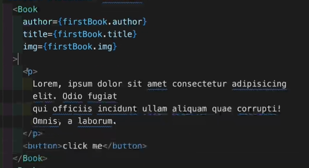

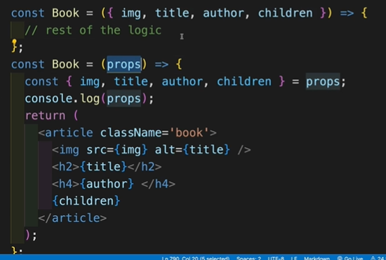

`children` is a keyword, cant use any name.

So if we have multiple books, few have children, few not. Used in those scenarios.

## Array of Objects in React

- In React we use JavaScript `map()` method to workd with Arrays

- `map(item, key)` create a new array by calling a function for every array element

- key must be unique, any property, and can be of any datatype string, number.

- `key` is used while we render list using `map(item,key)`

- key prop is very important,while rendering a list of items in React, because React uses the key prop to uniquely identify a list item and update only the changed element during rerendering (Optimized updates and rendering)

- Avoid using `key={index}`, rather use `key={book.id}` as using index as a key can cause issue, when reorder or modify the items, as the React rely on unique keys for stable updates.

- Here the `number` prop passes the current index from the books array to the `Book` component

- If you map over an array in JSX without providing a key prop, React will throw a warning in the console about missing keys.

```
<Book {...book} key={book.id} number={index} />;
```

```
const newArray = oldArray.map((item,key) => {
  console.log(item);
  return <p>{item}</p>
})
```

```
const booksArray = [
  {
    id : 1,
    title : 'Atomic Habits',
    description : 'Self Improvement',
    price : 145
  },
  {
    id : 2,
    title : 'Stop Worring & Start Living',
    description : 'Motivational',
    price : 350
  }
];

```

**First Approach**

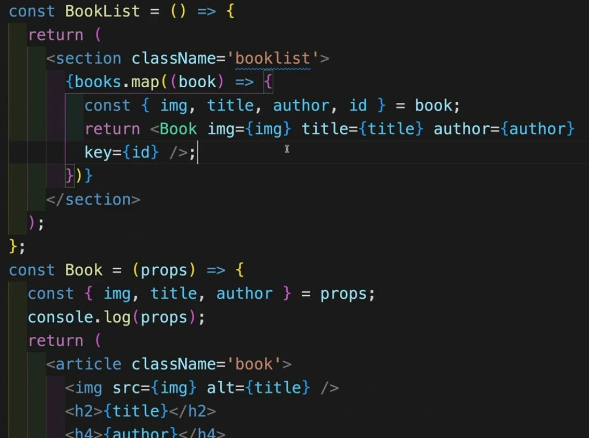

**Second Approach**

when we have smaller JSON object, But in case we have big JSON object, there is an alternate approach is, pass the entire JSON as props.

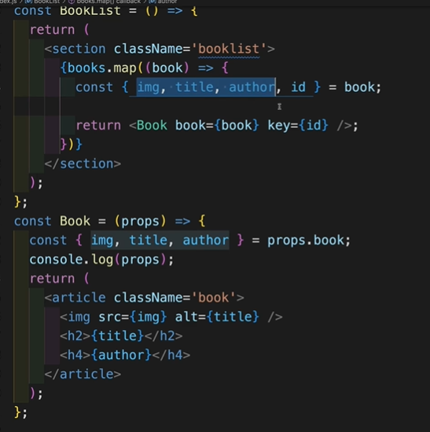

**Third Approach**

Use spread operator

- const newFriendsList = [...friends, newFriend] copy values

```
const book = {
  id: 1,
  title: "Harry Potter",
  author: "J.K. Rowling",
  image: "cover.jpg"
};

Then

<Book {...book} key={book.id} />

Equivalent to

<Book
  id={book.id}
  title={book.title}
  author={book.author}
  image={book.image}
  key={book.id}
/>
```

so `{...book}` flattens the book Object and pass each property like (id,title,author,image) as a separate prop to the Book component

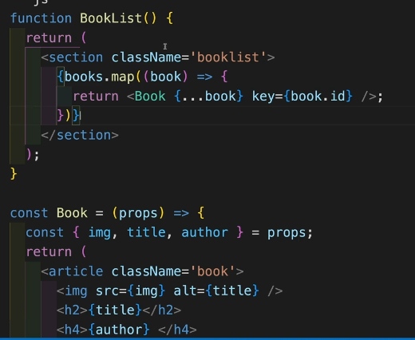

[For Arrys]

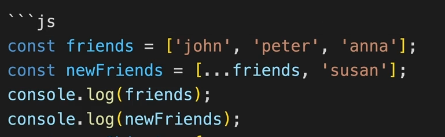

[For Object]

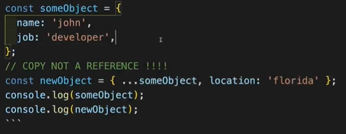

## Events Basics

[In JavaScript]

```
const btn = document.getElementById("submitBtn");

// Callback function
btn.addEventListener("click", function(e){
    // Access event object e
    // Do Operations
    // ----
})
```

[In React]

```
const handleButtenClickEvent = (e) => {
    // Prevent the default action of the form submission, that is refreshing the page.
    e.preventDefault();

    // Event object properties
    e.target.name
    e.target.value (Input value)

    // Do Operations
    // ----
}

<Book onClick={handleButtenClickEvent} />

```

**Different Events**

- onClick (Click Event)
- onSubmit (Submit Form)
- onChange (Input Change)

## Form Submission.

- Define a `const handleSubmit = (e) => {..}`
- Specify `<form onSubmit={handleSubmit}` at Form
- Include `<button type="submit"/>`

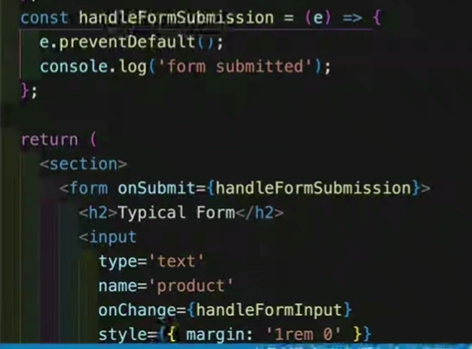

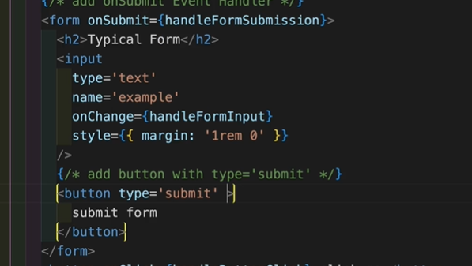

## Anonymous Function

Anonymous function only executes when the button is clicked or when the event occur

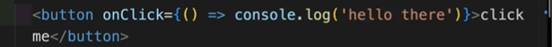

## Components Feature

Components are independent by default.

So the function can access to props, specific to that component.

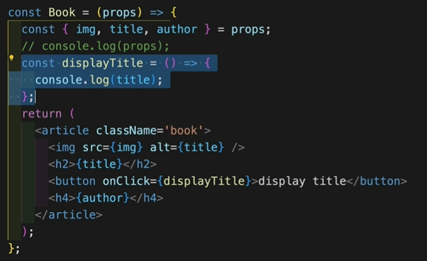

## Prop Drilling

In react we can only pass the data down (Parent -> Child), not otherway around. So you have to pass the data through each componennt in between the source to destination component. This process is called `Prop Drilling`

Alternative to this are

- Context API
- Redux
- Other state liberary

## Get a particular item from the list

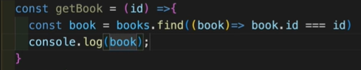

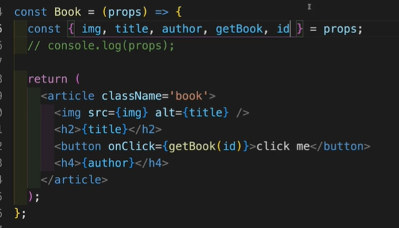

`onClick={getBook(id)}` will not work, here it invokes the getBookId function immediately when the component renders, rather on button click.

[FIX A] : Use Function reference

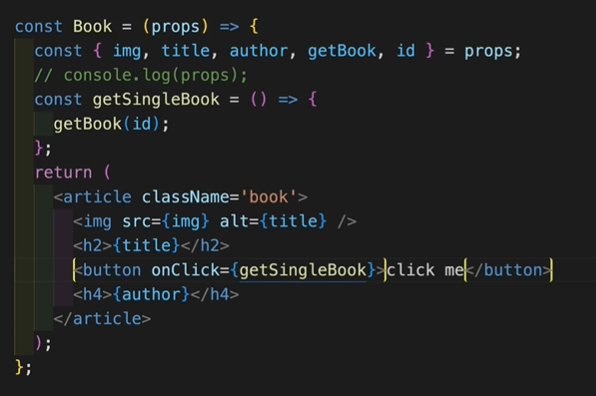

[FIX B] : Use Anonymous Function

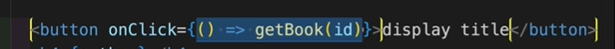

```
const findBook(id) {
  const book = books.find( (book) => book.id === id);
  return book;
}
```

## ES6 Modules

- `Named Export` : Name in `{book}` during import must match the export name

  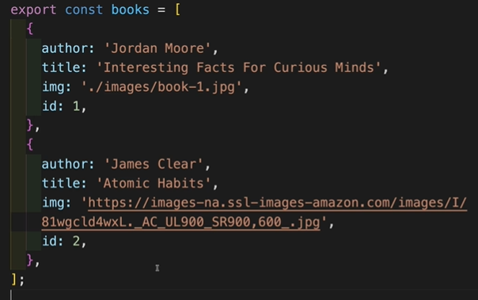

  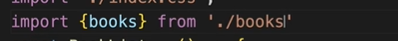

- `Default Export`: Only one default export per file. Name during import can be differnet and no `{}`

  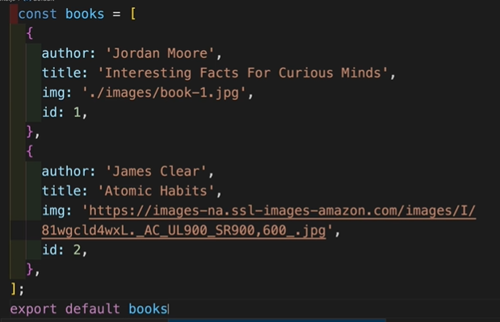

  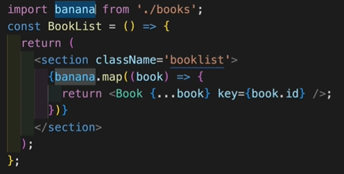

## Local Images (src folder )

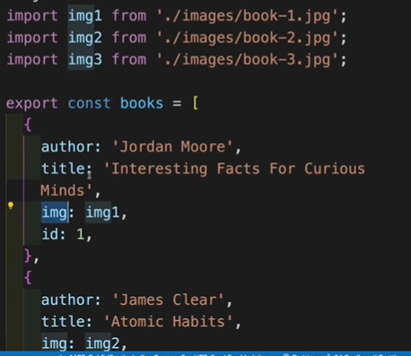

## JSX - String + expression

```
<h1>`string ${expression}`</h1>
```

JavaScript

```
const number = 5;

<h1>{number + 1}</h1>
```

HTML Output

```
<h1>6</h1>
```

JSX

```
const number = 5;

<h1>`Euro {number + 1}`</h1>

<h1>{`Euro ${number + 1}`}</h1>
```

HTML Output

```
<h1>Euro number + 1</h1>

<h1>Euro 6</h1>

```

## Build Folder

When we deploy the application, we need to build the application and put it into a specific format to be deplyed, as it will not follow the development setup format with

- src
- public
- node_modules
- ..
- ..

**package.json** has scripts

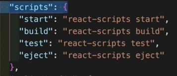

The below command will do the job and create deployable version of the application into a new folder `build`

So `build` folder contains the production ready application

```
npm run build
```

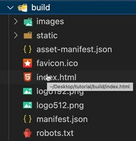

## Deployment

Deploy it onto platforms :

- Azure
- AWS
- Netlify

## Why is StrictMode included in a React project by default?

StrictMode is included by default in many React project templates (such as those created with older versions of Create React App and some Vite templates) because it helps developers find potential problems early during development.

```
import React from "react";
import ReactDOM from "react-dom/client";
import App from "./App";

ReactDOM.createRoot(document.getElementById("root")).render(
  <React.StrictMode>
    <App />
  </React.StrictMode>
);
```

It enables additional development-time checks and warnings, such as:

- Warning about deprecated APIs
- Highlighting issues that may cause bugs in future React versions
- Identifying unexpected side effects
- Encouraging reusable and resilient components

StrictMode:

- ✅ Runs only in development
- ✅ Does not affect production behavior
- ✅ Helps detect bugs and unsafe patterns
- ✅ Is included by default to encourage better React code quality and future compatibility

When you run:

```
npm run dev

or

npm start
```

your tooling loads React's development build.

This build includes:

- StrictMode checks
- Extra warnings
- Detailed error messages
- Development-only validations

When you run

```
npm run build
```

the creates an optimized production bundle and uses React's production build.

This build removes:

- StrictMode double-invocation behavior
- Most warning messages
- Extra validation code

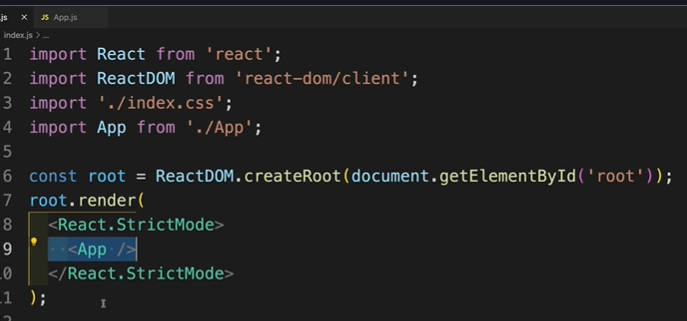

- Only comes with `create-react-app`, not with `vite`

## How can you pass the entire book object as a prop in a React component?

Use the spread operator `{...Book}` to pass all properties at once.

## In React, why is using camelCase important for attribute names in JSX

Because JSX attributes map directly to JavaScript properties.

JSX attributes like className correspond to JavaScript DOM properties.

## JSX Comments

```
{/*  ---  */}
```

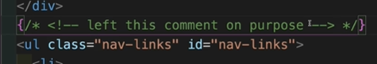

## Vite

- Faster than create-react-app
- Out-of-the-box support for TypeScript, JSX, CSS

## Vite Commands

```
npm create vite@latest <app-name> -- --template <template-name>
```

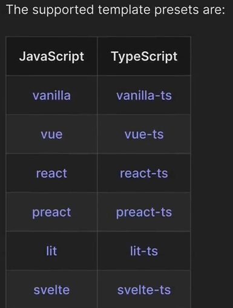

[package.json]

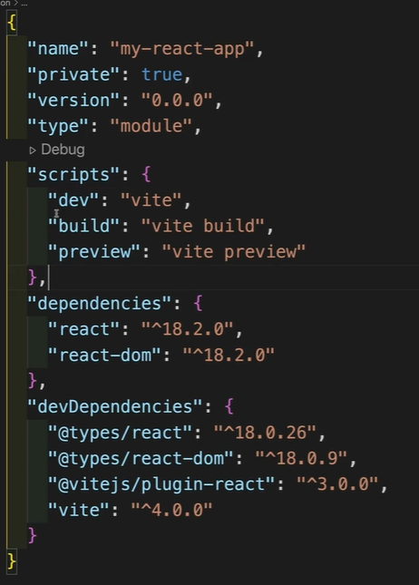

```
npm install

npm run dev       (http://localhost:5173, where create-react-app uses http://localhost:3000)


npm run build
```

With Vite you need to use:

- Need to use .jsx or .tsx extension
- index.html is in the `src` folder, instead of `public`
- fevicon.ico and logo.png still in the `public` folder
- instead of `index.js`, it uses `main.jsx` or `main.tsx`
- to spin up dev server `npm run dev` instead of `npm start`
- `npm run build` create `dist` folder instead of `build` folder for bundling production ready application.

## Advance React Topics

- Hooks
  - useState
  - useEffect
  - useRef
  - useContext
  - useReducer
- Forms
  - controlled/uncontrolled inputs, values,
  - onChange
  - FormData API
- Other Topics
  - Context API
  - Prop Drilling
  - Custom Hooks
  - Performance

## useState Hook

`Problem Statement`

The onClick increasing the count, but not updating it in the UI

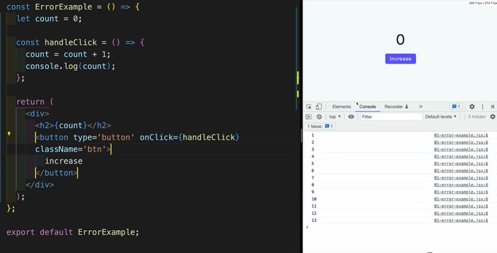

`Root Cause`

We are not triggering the rerender of ReactJS component.

So the vanila JS is working fine, but not React.

`Fix`

If we want to see the latest changes in the browser in React, we need to perform 2 tasks:

1. Set a state value
2. Trigger Rerender.

## Set state value using useState Hook

- Import it using Named import

  ```
  import {useState} from 'react'
  ```

- useState() is a function that returns an Array with two values
  - state value (preserved with rerenders)
  - function

  ```
  console.log(useState());
  ```

  

  ```
  console.log(useState('bob'));
  ```

  

  ```
  console.log(useState(1));
  ```

  

  ```
  const value = useState('hello')[0];
  console.log(value);
  ```

  

  ```
  const func = useState('hello')[1];
  console.log(func);
  ```

  This print the default function, that control that value.

  ```
  const [count,setCount] = useState(0)

  ```

  

  

## Initial Render and Rerender

- Initial Render happens when the application first loads or when the root component is first rendered. This is also called mounting the components

- Rerender happens when the component's state or props change, and component need to be updated in the DOM, to reflect the changes. React uses Virtual DOM to optimize the process of updating the Actual DOM, so that only necessary changes are made.

- We no longer need to import "react"

  ```
  No Longer needed..

  import React from 'react'
  ```

## General rules for Hooks

- Name start with `use` for both build-in and custom hooks
- Invoked inside the Component body, not outside the Component body
- Hooks does not work inside conditions like if-else.
- Set function does not update state immediately. So don't expect synchronous behaviour.

## useState with Arrays

1. Import Data

   ```
   import {data} from './data'
   ```

   ```
   [./data.js]

   export const data = [
    {
      name: 'ram',
      age: 10
    },
    {
      name: 'sham',
      age: 20
    }
   ]
   ```

2. Set Initial State

   ```
   import {useState} from 'react'
   .
   .

   const [customers,setCustomers] = useState(data)

   ```

3. Render the Array items

   ```
    .
    .
    .

   return (
      <>
        {
          costomers.map( (customer,id) => {
                                        const {id,name} = customer;

                                        return (
                                          <div key={id}>
                                            <h1>{customer.name}<h1>
                                            <button>Clear All</button>
                                            <button>Delete Item</button>
                                          </div>
                                        );
                                      }
                        )
        }
      </div>
   );

   ```

4. ClearAll and RemoveItem functionality

   ```

   const clearAll = () => {
    setCustomers([])
   }


   const removeItem = (id) => {
    const newArray = customers.filter((customers) => customer.id !== id);

    setCustomers(newArray);
   }

   ```

5. Attach the ClearAll and RemoteItem functions to the HTML

   ```
   <button onClick={clearAll}>Clear All</button>

   <button onClick={() => remoteItem(id)}>Delete Item</button>

   ```

   

## useState Optional or Mandatory

- useState is quite useful, if you are adding/updating/deleting the items, if you are just rendering, then you donot need useState. But as a best practice to use useState, so in the future you can add functionality.

  

## Auto batching


The below will perform only 1 rerender not 3 rerenders


## useState with JS Object


## useState is not synchronous

See the console.log still prining the old value.


## useState function update approach

Fix to the synch issue.


## useEffect Hook

`Problem Statement`


The sayHello() invoked on every rerender. So everytime component is rerendered, react create the function, and if there is invocation as shown it will invoke.

So this might cause issue if seyHello function has code that update the state, in that case it will get into infinite loop.


`Fix`

useEffect Hook helps us to invoke code conditionally.


So in useEffect, the callback function will be invoked on every rerender by default


But if we pass the second argument as [], it will be invoked only on initial render


useEffect can not use async callback function, as async function return promise

`This is not allowed`


`But invocing async function inside the callback function is OK`


## useEffect - multiple Effects

How we can have multiple effects in our application using depdendency array.

The below useEffect make the callback function invoke only once, during initial render.


Here below the first useEffect will be invoked on updated of firstValue and SecondValue


Here below the first useEffect will be invoked on updated of firstValue and second useEffect will be invoked on SecondValue update.


## useEffect with Fetch API

- fetch API, does not catch 404 error, so on exception, the catch block will be skipped.

Here the error is from the first log inside try.


To check the JS object properties, log the object


## What will happen if you call setState directly within a function outside useEffect

It will cause an infite render loop if the function is invoked during render.

## What happens when the dependency array of a useEffect is left empty ([])

The effect runs only once during the component's initial render.

## Multiple Returns in React Component

- JS reads from top to bottom. so make sure you load data before returning JSX

- useState is used for
  - defining state variable with initial value
  - defing the function for update the state
  - Components using the state variable will automatically rerender. (`Biggest Advantage`)

- useEffect is used in two scenrios
  - Load external data via fetch API, before the component return JSX.
  - invoke a function on state value update

- Component
  1. Define the state variable using useState
     
  2. Defind the useEffects for
     - Loading external data

       

  3. Multiple Return JSX based on state value

     

## Fetch skips 4xx or 5xx error - Work around


## Order Matters

Always make sure you put the error returns first before successful fetch return.


## Avoid putting function outside the useEffect

Avoid below approach as it causes multiple issues


## React Hook rules

- Never put hooks in condition like if-else
- always put hooks before functions return, else will be skipped


## What is the purpose of multiple returns in a React Component

To handle conditional rendering scenarios like

- loading
- error
- success states

## What happend if you destructure a property from a null object in a React Component

JavaScript throws an error, breakinig the application

## When using fetch API, why is it important to check the resp.ok property after making a request

To ensure the response status is successful (eg: 200 Ok)

## JS "truthy" / "falsy"


## Short Circuit


## Ternary Operator


## Toggle Alert


## User Challenge


```
import { useState } from "react";

type User = {
  name: string;
};

function UserChallenge() {
  const [user, setUser] = useState<User | null>(null);

  const login = () => {
    setUser({ name: "varinder" });
  };

  const logOut = () => {
    setUser(null);
  };

  return (
    <>
      {user ? (
        <>
          <h4>Hello there {user.name}</h4>
          <button onClick={logOut}>LogOut</button>
        </>
      ) : (
        <>
          <h4>Please Login </h4>
          <button onClick={login}>Login</button>
        </>
      )}
    </>
  );
}

export default UserChallenge;

```

## useEffect Function in a child component with condition

If you render the child component conditionally, the useEffect even with empty dependency array will be executed everytime it is render and rerendered. As the component mounts and unmounts.


```
import { useState } from "react";

function UserChallenge() {
  const [toggle, setToggle] = useState(false);

  const handleToggle = () => {
    setToggle(!toggle);
  };

  return (
    <>
      <button className="btn" onClick={handleToggle}>
        Click Toggle
      </button>

      {/* Ternary Operate always inside { } */}

      {toggle ? <RandomComponent /> : <></>}

      {toggle && <RandomComponent />}
    </>
  );
}

const RandomComponent = () => {
  return <h1>Hello There</h1>;
};

export default UserChallenge;
```

## Project Structure - Folder

`components/Navbar`


`index.jsx`


## Project Structure - Named Export

`ìndex.jsx`


`App.jsx`


## JSON Parsing


With the map() => { return } - return JSX is mandatory

## || vs ??

const img = image?.[0]?.url || "default Image"

const img = image?.[0]?.url ?? "default Image";

```

const url = "";
console.log(url ?? "default Image");
// ""

const url = 0;
console.log(url ?? "default Image");
// 0

const url = null;
console.log(url ?? "default Image");
// "default Image"

const url = undefined;
console.log(url ?? "default Image");
// "default Image"
```

# What is the purpose of the optional chaining operator (?.) in JavaScript?


It prevents errors when accessing properties of null or undefined objects by safely returning undefined without throwing error. (?.) checks if the object or property exists before trying to access it.

## In the Person component, what is the fallback value for the nickName prop


shakeAndBake

## In the Person component, what happens if the images array is undefined?


An Avatar image is displayed

## Forms in React


## Controlled inputs


## User Challenge


```
import { useState, useEffect } from "react";
import { UsersData } from "./UsersData";

function UserChallenge() {
  const [email, setEmail] = useState("");
  const [password, setPassword] = useState("");
  const [users, setUsers] = useState(UsersData);

  // Fix : React State Sync Issue
  useEffect(() => {
    console.log(email, password);
  }, [email, password]);

  // Handle Submit
  const handleSubmit = (e: React.SubmitEvent<HTMLFormElement>) => {
    e.preventDefault();

    setEmail(e.currentTarget.email.value);
    setPassword(e.currentTarget.password.value);

    const newuser = {
      id: Date.now(),
      name: e.currentTarget.email.value,
      age: 10,
    };

    setUsers([...users, newuser]);
  };

  // Handle Remove
  const handleRemove = (id: Number) => {
    const newArray = users.filter((user) => user.id !== id);
    setUsers(newArray);
  };

  return (
    <>
      <div className="container">
        <form className="form" onSubmit={handleSubmit}>
          <div className="form-row">
            <label className="form-label" htmlFor="email">
              Email
            </label>
            <input className="form-input" type="text" id="email"></input>
          </div>

          <div className="form-row">
            <label className="form-label" htmlFor="password">
              Password
            </label>
            <input className="form-input" type="password" id="password"></input>
          </div>
          <button type="submit">Submit</button>
        </form>

        <h3>List users</h3>
        {users.map((user) => {
          const { id, name, age } = user;
          return (
            <div key={user.id}>
              <p>{user.name}</p>
              <button onClick={() => handleRemove(id)}>Remote</button>
            </div>
          );
        })}
      </div>
    </>
  );
}

export default UserChallenge;
```

## Multiple Inputs

1. Define the intitial state as Object intead,

   

2. Define onChange={handleChange} with each Fields has `name` property

   

   The `JSON property` and `HTML name ` much be same

3. Add HTML with `name` and `onChange={handleChange}`

   

4. Define the `onSubmit={handleSubmit}` at form level

   

## Checkbox Input

1. Define the state variable

   

2. Define the HTML Element

   

3. Define the handler function

   

## Select input

1. Define the state variables

   

   

2. Define the HTML Element

   

3. Define the handler function

   

## FormData API

If you working with form, make sure you have `name` property for all the HTML elements, along with `id` property

1. Define the `onSubmit={handleSubmit}` at form

   

2. Access the form elements values using `FormData`

   

3. Clear the Form after submit

   

## In the ControlledInputs component, what happens if you do not call e.preventDefault() in the handleSubmit function?

Without e.preventDefault(). it will trigger default browser behaviour, which is reload the page on form submit

## In the MultipleInputs component, what ensures that each input updates the correct property in the user state object

```
const handleChange = (e) => {
  setUser({ ...user, [e.target.name]: e.target.value });
};
```

Each HTML element must have `name` property.

The name attribute on each input allows the handleChange function dynamically update the corresponding property in the state object using [e.target.name: e.target.value]

## In the UncontrolledInputs component, how is the FormData API used to retrieve form data after submission?

```
  const formData = new FormData(e.currentTarget);
  const newUser = Object.fromEntries(formData);
  console.log(newUser);
```

The FormData Object create key-value pairs from input fields
