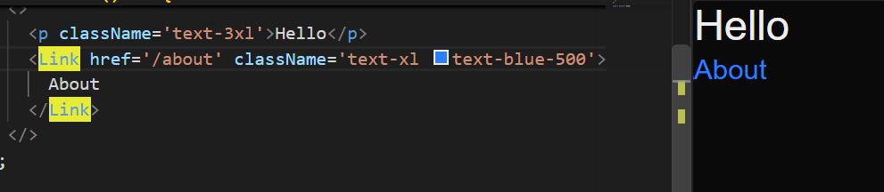
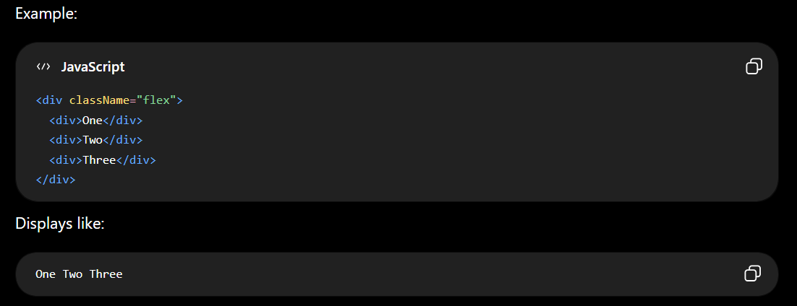
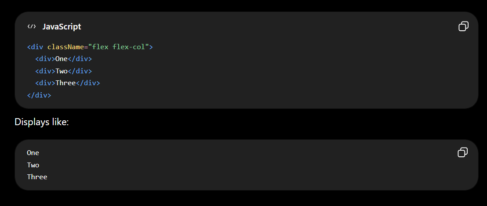
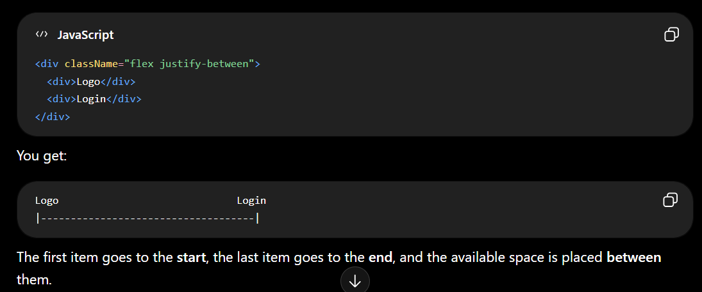
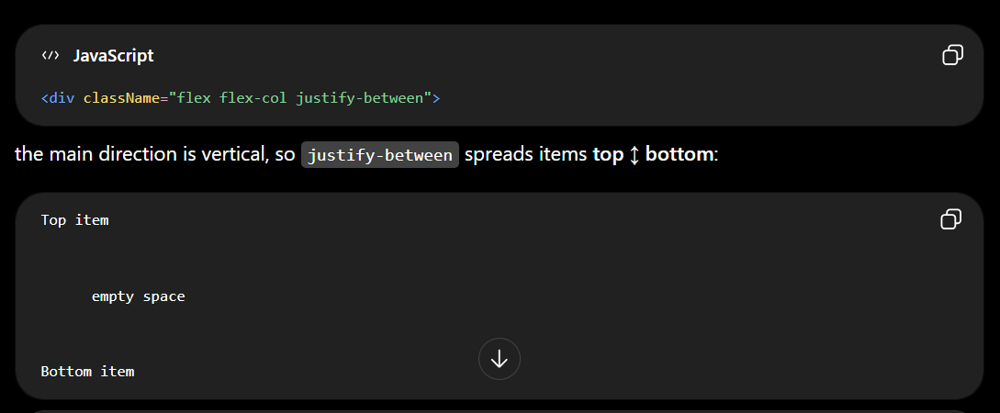
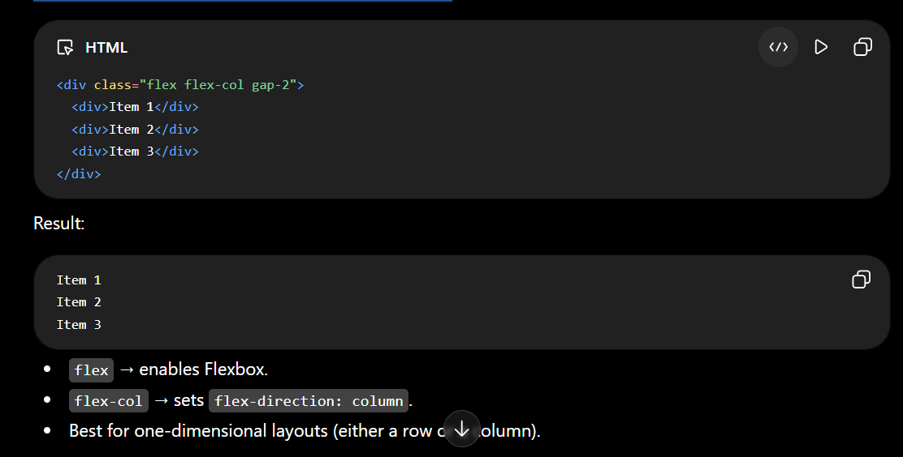
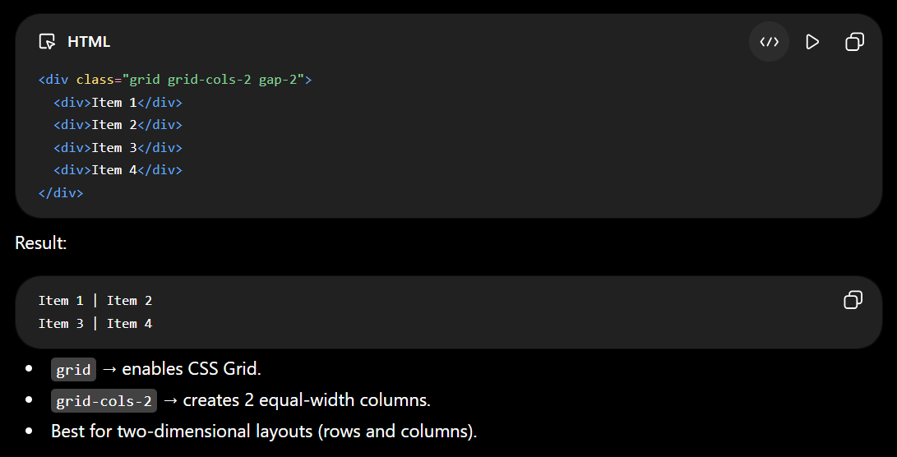
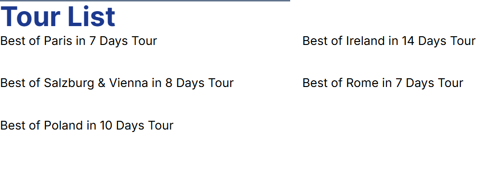
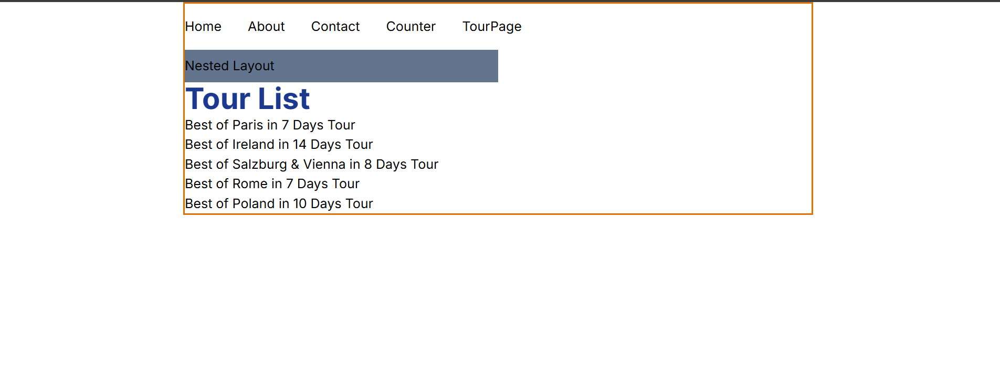
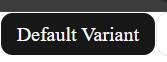

## Tailwind CSS

A CSS Framework

## Advantages of Tailwind CSS

1.  Faster UI Development

    Instead of switching between HTML and CSS files, you build designs directly with utility classes.

    ```
    <div class="flex items-center justify-between p-4">
            ...
    </div>
    ```

2.  No Unused Components

    Bootstrap ships with many components and styles you may never use.

    Tailwind generates only the CSS classes you actually use (via Purge/Content scanning), resulting in smaller production bundles.

3.  Excellent for React, Vue, and Next.js

    Tailwind fits naturally into component-based frameworks.

    ```
    <button className="bg-blue-600 text-white px-4 py-2 rounded">
    Save
    </button>
    ```

4.  Responsive Design is Easy

    Responsive classes are built in.No need to write custom media queries for many common cases.

    ```
    <div class="text-sm md:text-lg lg:text-xl">
    Responsive text
    </div>
    ```

5.  Dark Mode Support

    Tailwind provides built-in dark mode utilities

    ```
    <div class="bg-white dark:bg-gray-900">
    Content
    </div>
    ```

6.  Large Ecosystem

    The Tailwind ecosystem includes tools such as:
    - Tailwind CSS
    - Tailwind UI
    - Flowbite
    - DaisyUI

## When to use Tailwind

Tailwind is usually the stronger choice for:

- SaaS applications
- Dashboards
- Startup products
- React/Next.js projects
- Custom UI designs
- Large frontend codebases

Bootstrap is often preferable when you need a polished interface quickly with minimal design work. Tailwind is generally better when you want complete control over the final look and feel.

## Installation

https://tailwindcss.com/docs/installation/using-vite

1.  Create Vite Project

    ```
    npm create vite@latest <project-name>

    Choose Options
    - ReactJS
    - TypeScript
    - ESLite
    ```

2.  Install TalwindCSS

    ```
    npm install tailwindcss @tailwindcss/vite
    ```

3.  Configure the Vite plugin

    Add the @tailwindcss/vite plugin to your Vite configuration (vite.config.ts)

         ```
         import { defineConfig } from 'vite'
         import tailwindcss from '@tailwindcss/vite'

         export default defineConfig({
            plugins: [
                tailwindcss(),
            ],
         })
         ```

4.  Import Tailwind CSS

    Add an @import to your CSS file that imports Tailwind CSS.

    /src/style.css

    ```
    @import "tailwindcss";
    ```

    

5.  Start your build process

    Run your build process with npm run dev or whatever command is configured in your package.json file.

    ```
    npm run dev
    ```

6.  Start using Tailwind in your App.tsx

    ```
    <h1 class="text-3xl font-bold underline">
        Hello world!
    </h1>
    ```

    

## Install Additional packages

```
npm install nanoid react-icons
```

1. nanoid : A tiny library for generating unique IDs.

   ```
   import { nanoid } from 'nanoid';

   const id = nanoid();

   console.log(id);
   // V1StGXR8_Z5jdHi6B-myT
   ```

   Common uses:
   - Unique keys for React lists
   - IDs for tasks, notes, todos
   - Temporary client-side identifiers
   - Generating share codes or tokens

2. react-icons : A library that provides popular icon sets as React components.

   ```
   import { FaGithub } from 'react-icons/fa';
   import { MdEmail } from 'react-icons/md';

   function Contact() {
   return (
       <div>
       <FaGithub />
       <MdEmail />
       </div>
   );
   }
   ```

   You get icons from many libraries:
   - Font Awesome (fa)
   - Material Design (md)
   - Bootstrap Icons (bs)
   - Heroicons (hi)
   - Remix Icons (ri)
   - Feather Icons (fi)

   

## UUID vs NanoID

uuid and nanoid solve a similar problem (generating unique IDs), but many modern React projects prefer nanoid for a few reasons:

| Feature          | nanoid                   | uuid                          |
| ---------------- | ------------------------ | ----------------------------- |
| Bundle size      | Very small (~130 bytes)  | Larger                        |
| Performance      | Fast                     | Fast                          |
| Security         | Cryptographically secure | Cryptographically secure (v4) |
| URL-friendly IDs | Yes                      | No (contains hyphens)         |
| React projects   | Very popular             | Popular                       |
| Readability      | Short IDs                | Long IDs                      |

```
import { v4 as uuidv4 } from 'uuid';

console.log(uuidv4());
// 550e8400-e29b-41d4-a716-446655440000
```

```
import { nanoid } from 'nanoid';

console.log(nanoid());
// V1StGXR8_Z5jdHi6B-myT
```

Notice that NanoID generates a shorter, URL-friendly string.

Use uuid when:

- You must follow the UUID standard.
- Your backend/database expects UUIDs.
- You're integrating with systems that specifically require UUID v4.

Example:

- PostgreSQL UUID columns
- Enterprise APIs
- Distributed systems using UUIDs as identifiers

## Tailwind Useful Extensions

1. Tailwind CSS Intellisense
   
2. Tailwind Fold
   

## In JSX use single Quotes instead of double Quotes


Update Prettier Plugins Settings


## Margin

- mx-auto
  

- mr-6
  

## Padding

- p-8

  

- px-8
- py-8

  

## Max-Width

- max-w-7xl

  

## flex

Utilities for controlling how flex items both grow and shrink.

## flex-direction

Utilities for controlling the direction of flex items.


`sm:flex-row`


## gap

Utilities for controlling gutters between grid and flexbox items.


`sm:gap-x-20`


## font-size

`text-3xl`


## font-weight

`font-bold`


| Tailwind Prefix | Min Width | Typical Devices                                            |
| --------------- | --------- | ---------------------------------------------------------- |
| (default)       | 0px       | Small phones                                               |
| `sm:`           | 640px     | Large phones, small tablets, most laptops and desktops too |
| `md:`           | 768px     | Tablets (portrait), laptops                                |
| `lg:`           | 1024px    | Laptops, desktops, tablets (landscape)                     |
| `xl:`           | 1280px    | Large laptops, desktop monitors                            |
| `2xl:`          | 1536px    | Large desktop monitors, ultrawide screens                  |


`Examples`

## Text Size

```
      <p className='text-3xl'>Hello</p>

```

## Text Color

```
      <p className='text-blue-500'>About</p>

```



## font

```
font-bold
font-light
font-thin
```

```
      <p className='text-3xl text-blue-700 font-bold'>{count}</p>
```

## Background

```
bg-blue-700

bg-red-500
```

## Padding

```
p-1

p-0

pb-1

pt-2

pr-2

pl-2

px-1

py-1
```

```
      <button className='bg-blue-700 p-1' onClick={handleCount}>
        Count
      </button>

```

## Rounded

```
      <button className='bg-blue-700 rounded' onClick={handleCount}>
        Count
      </button>
```

## flex

This makes the element a flex container, so its children are arranged in a row by default.





```
flex            // display: flex
flex-row        // horizontal (default)
flex-col        // vertical
items-center    // align children vertically in center
justify-center  // align children along main axis center
gap-4           // spacing between children
```

```
flex  gap-x-9

flex flex-col items-center gap-x-9

flex flex-row items-center gap-y-9
```

```
    <div className='flex flex-col items-center'>
      <p className='text-3xl text-blue-700 font-bold'>{count}</p>
      <button className='bg-blue-700 rounded p-1' onClick={handleCount}>
        Count
      </button>
    </div>
```

## justify-between

puts equal space between flex items.





## Grid

grid grid-cols-\* and flex flex-col are different layout systems.

- flex flex-col

  Uses Flexbox and arranges items in a single column.

  

- grid grid-cols-\*

  Uses CSS Grid and arranges items into rows and columns.

  

```
grid md:grid-cols-2 gap-8
```

Equivalent to

```
grid lg:grid-cols-12 gap-4
```

grid-cols-12 is a Tailwind CSS utility class that defines a grid with 12 equal-width columns.

```
| 1 | 2 | 3 | 4 | 5 | 6 | 7 | 8 | 9 |10 |11 |12 |
```

```
<div className="grid grid-cols-12 gap-4">
  <div className="col-span-3">Sidebar</div>
  <div className="col-span-9">Main Content</div>
</div>
```

```
<section>
    <h1 className='text-blue-900 font-bold text-4xl'>Tour List</h1>
    <div className='grid md:grid-cols-2 gap-8'>
        {
            data.map((tour) => {
                return (
                    <div id={tour.id} key={tour.id}>
                        <Link href={`/tours/${tour.id}`}>{tour.name}</Link>
                    </div>
                );
            })
        }
    </div>
</section>

```



## Gap : Gap between containing items

```
gap-x-9
```

```
    <nav className='py-4 flex gap-x-8'>
      <Link href='/'>Home</Link>
      <Link href='/about'>About</Link>
      <Link href='/contact'>Contact</Link>
      <Link href='/counter'>Counter</Link>
      Counter
    </nav>
```

## Margin

```
mt-1

mb-2

mx-2

my-2

mx-auto  - Bring it at center on x-axis
```

## MAX WIDTH

```
max-w-7xl  (Full Width of a laptop screen)

max-w-3xl

max-w-2xl
```

This below combination bring the div with width `max-x-3xl` at center of screen

```
mx-auto max-x-3xl
```



## Border

```
border-[color]-[10-700]

border-red-300

border-[0-7]

```

## rounded object-cover

```
<Image
    src={mapsImg}
    alt={tour.name}
    className='rounded object-cover'
    >
</Image>
```

## Capitalize

It makes the first letter of each word uppercase.

```
<p className="capitalize">hello world</p>
```

**Displays as:**

Hello World

```
      <Button variant='default' size='sm' className='capitalize'>
        default variant
      </Button>
```

**Display**



## mx-auto

mx-auto only works if the element has a width smaller than its container

The x stands for the horizontal axis (left and right margins).

```
<div className="w-64 mx-auto bg-blue-200">
  Centered box
</div>
```

This creates a box with width 16rem (w-64) and centers it horizontally within its parent.

## max-w-6xl

Keep this content no wider than 1152px

| Class       | Width          |
| ----------- | -------------- |
| `max-w-xl`  | 36rem (576px)  |
| `max-w-2xl` | 42rem (672px)  |
| `max-w-4xl` | 56rem (896px)  |
| `max-w-6xl` | 72rem (1152px) |
| `max-w-7xl` | 80rem (1280px) |

So `max-w-6xl mx-auto` is essentially saying:

Keep this content no wider than 1152px, and center it on the page

| Class       | Effect                                                        |
| ----------- | ------------------------------------------------------------- |
| `max-w-6xl` | `max-width: 72rem` (1152px)                                   |
| `mx-auto`   | Centers the element horizontally (`margin-left/right: auto`)  |
| `px-1`      | Adds horizontal padding (`padding-left/right: 0.25rem` = 4px) |

## cn()

cn() often uses tailwind-merge, it can intelligently resolve conflicting Tailwind classes

```
cn("px-2", "px-4")
```
