## Tailwind CSS

A CSS Framework

## Advantages of Tailwind CSS

1.  Faster UI Development

    Instead of switching between HTML and CSS files, you build designs directly with utility classes.

    ```
    <div class="flex items-center justify-between p-4">
            ...
    </div>
    ```

2.  No Unused Components

    Bootstrap ships with many components and styles you may never use.

    Tailwind generates only the CSS classes you actually use (via Purge/Content scanning), resulting in smaller production bundles.

3.  Excellent for React, Vue, and Next.js

    Tailwind fits naturally into component-based frameworks.

    ```
    <button className="bg-blue-600 text-white px-4 py-2 rounded">
    Save
    </button>
    ```

4.  Responsive Design is Easy

    Responsive classes are built in.No need to write custom media queries for many common cases.

    ```
    <div class="text-sm md:text-lg lg:text-xl">
    Responsive text
    </div>
    ```

5.  Dark Mode Support

    Tailwind provides built-in dark mode utilities

    ```
    <div class="bg-white dark:bg-gray-900">
    Content
    </div>
    ```

6.  Large Ecosystem

    The Tailwind ecosystem includes tools such as:
    - Tailwind CSS
    - Tailwind UI
    - Flowbite
    - DaisyUI

## When to use Tailwind

Tailwind is usually the stronger choice for:

- SaaS applications
- Dashboards
- Startup products
- React/Next.js projects
- Custom UI designs
- Large frontend codebases

Bootstrap is often preferable when you need a polished interface quickly with minimal design work. Tailwind is generally better when you want complete control over the final look and feel.

## Installation

https://tailwindcss.com/docs/installation/using-vite

1.  Create Vite Project

    ```
    npm create vite@latest <project-name>

    Choose Options
    - ReactJS
    - TypeScript
    - ESLite
    ```

2.  Install TalwindCSS

    ```
    npm install tailwindcss @tailwindcss/vite
    ```

3.  Configure the Vite plugin

    Add the @tailwindcss/vite plugin to your Vite configuration (vite.config.ts)

         ```
         import { defineConfig } from 'vite'
         import tailwindcss from '@tailwindcss/vite'

         export default defineConfig({
            plugins: [
                tailwindcss(),
            ],
         })
         ```

4.  Import Tailwind CSS

    Add an @import to your CSS file that imports Tailwind CSS.

    /src/style.css

    ```
    @import "tailwindcss";
    ```

    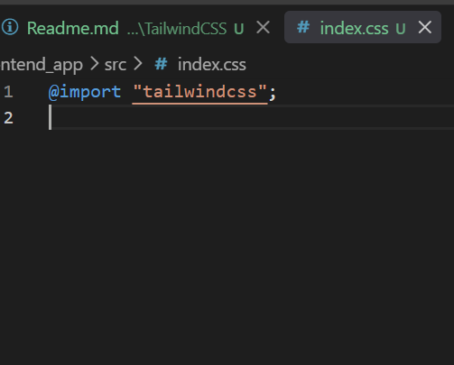

5.  Start your build process

    Run your build process with npm run dev or whatever command is configured in your package.json file.

    ```
    npm run dev
    ```

6.  Start using Tailwind in your App.tsx

    ```
    <h1 class="text-3xl font-bold underline">
        Hello world!
    </h1>
    ```

    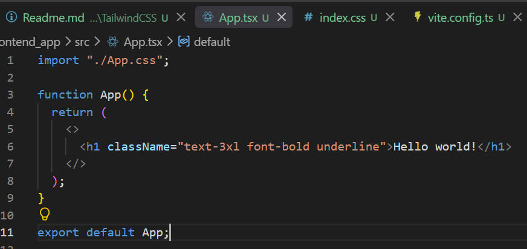

## Install Additional packages

```
npm install nanoid react-icons
```

1. nanoid : A tiny library for generating unique IDs.

   ```
   import { nanoid } from 'nanoid';

   const id = nanoid();

   console.log(id);
   // V1StGXR8_Z5jdHi6B-myT
   ```

   Common uses:
   - Unique keys for React lists
   - IDs for tasks, notes, todos
   - Temporary client-side identifiers
   - Generating share codes or tokens

2. react-icons : A library that provides popular icon sets as React components.

   ```
   import { FaGithub } from 'react-icons/fa';
   import { MdEmail } from 'react-icons/md';

   function Contact() {
   return (
       <div>
       <FaGithub />
       <MdEmail />
       </div>
   );
   }
   ```

   You get icons from many libraries:
   - Font Awesome (fa)
   - Material Design (md)
   - Bootstrap Icons (bs)
   - Heroicons (hi)
   - Remix Icons (ri)
   - Feather Icons (fi)

   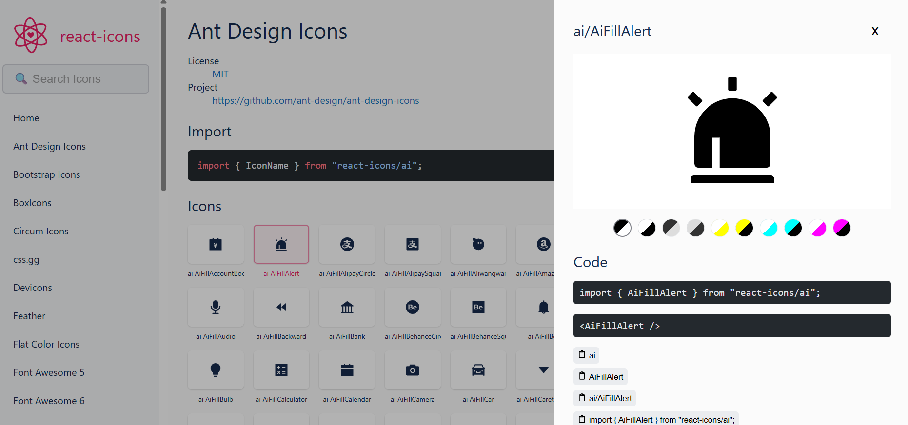

## UUID vs NanoID

uuid and nanoid solve a similar problem (generating unique IDs), but many modern React projects prefer nanoid for a few reasons:

| Feature          | nanoid                   | uuid                          |
| ---------------- | ------------------------ | ----------------------------- |
| Bundle size      | Very small (~130 bytes)  | Larger                        |
| Performance      | Fast                     | Fast                          |
| Security         | Cryptographically secure | Cryptographically secure (v4) |
| URL-friendly IDs | Yes                      | No (contains hyphens)         |
| React projects   | Very popular             | Popular                       |
| Readability      | Short IDs                | Long IDs                      |

```
import { v4 as uuidv4 } from 'uuid';

console.log(uuidv4());
// 550e8400-e29b-41d4-a716-446655440000
```

```
import { nanoid } from 'nanoid';

console.log(nanoid());
// V1StGXR8_Z5jdHi6B-myT
```

Notice that NanoID generates a shorter, URL-friendly string.

Use uuid when:

- You must follow the UUID standard.
- Your backend/database expects UUIDs.
- You're integrating with systems that specifically require UUID v4.

Example:

- PostgreSQL UUID columns
- Enterprise APIs
- Distributed systems using UUIDs as identifiers

## Tailwind Useful Extensions

1. Tailwind CSS Intellisense
   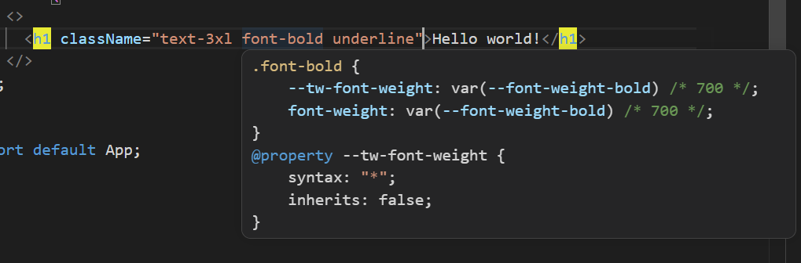
2. Tailwind Fold
   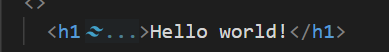

## In JSX use single Quotes instead of double Quotes

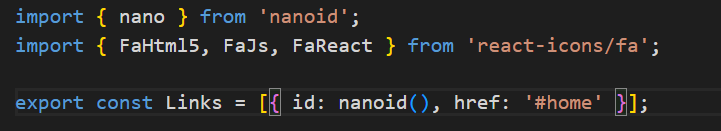

Update Prettier Plugins Settings

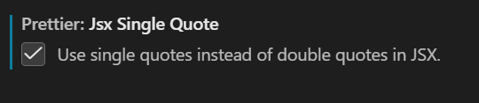

## Margin

- mx-auto
  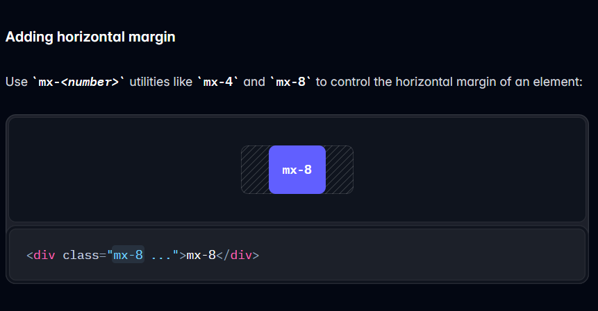

- mr-6
  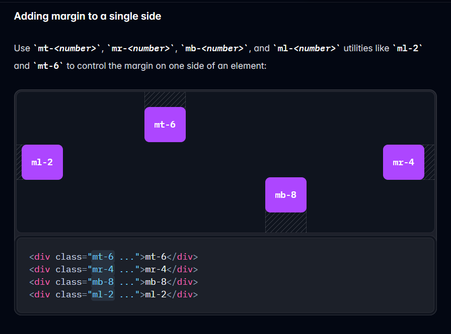

## Padding

- p-8

  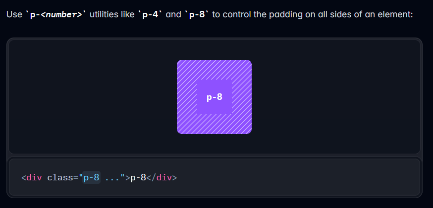

- px-8
- py-8

  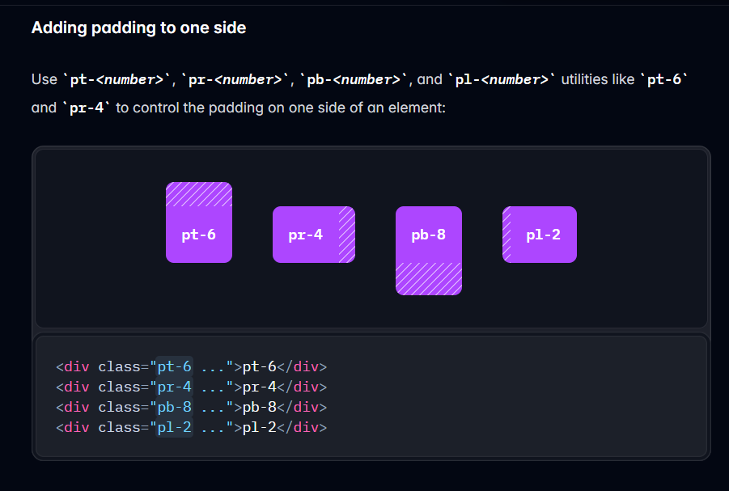

## Max-Width

- max-w-7xl

  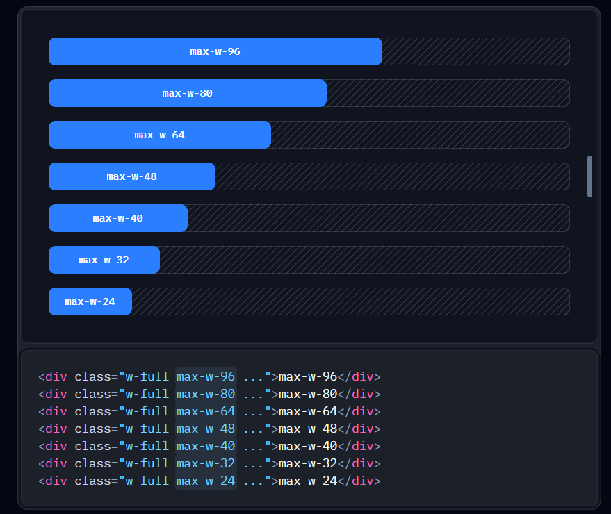

## flex

Utilities for controlling how flex items both grow and shrink.

## flex-direction

Utilities for controlling the direction of flex items.

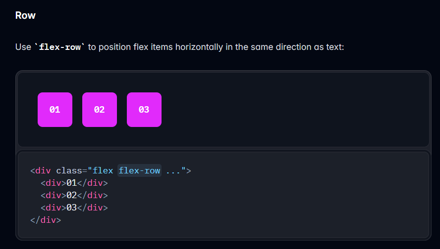

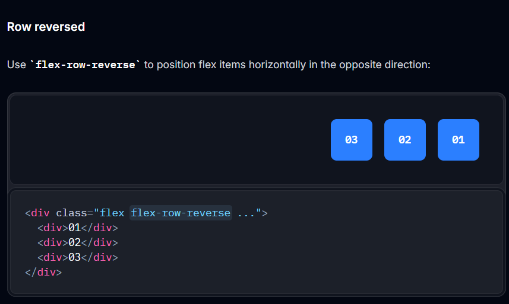

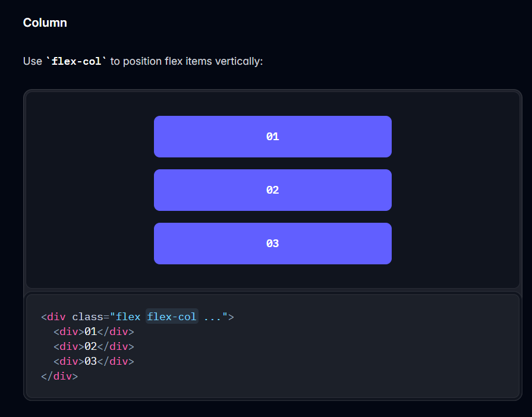

`sm:flex-row`

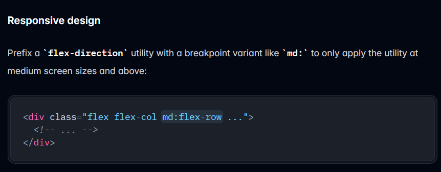

## gap

Utilities for controlling gutters between grid and flexbox items.

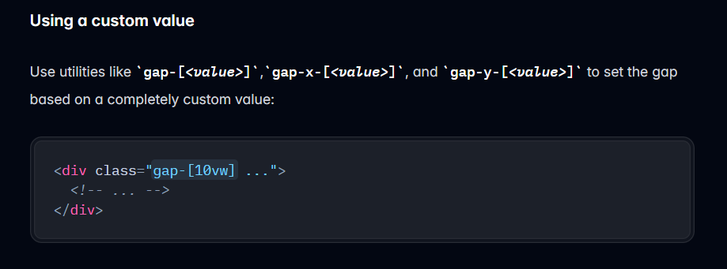

`sm:gap-x-20`

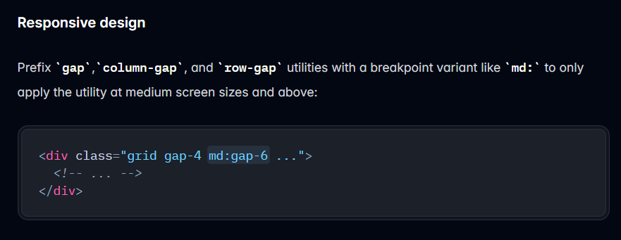

## font-size

`text-3xl`

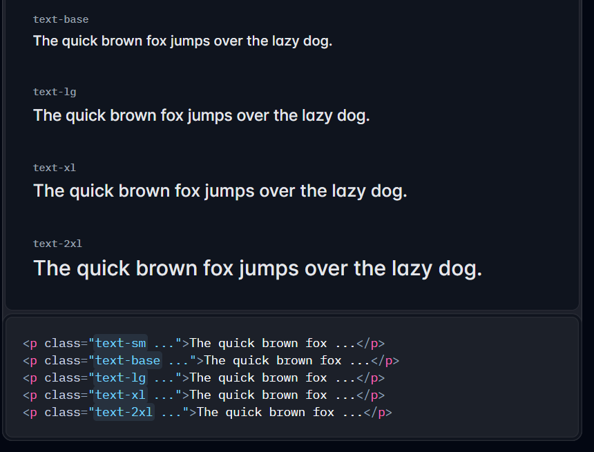

## font-weight

`font-bold`

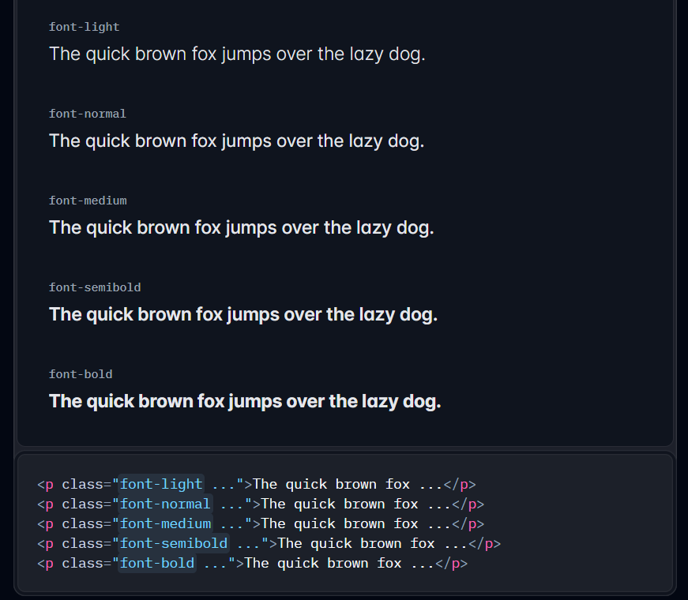

| Tailwind Prefix | Min Width | Typical Devices                                            |
| --------------- | --------- | ---------------------------------------------------------- |
| (default)       | 0px       | Small phones                                               |
| `sm:`           | 640px     | Large phones, small tablets, most laptops and desktops too |
| `md:`           | 768px     | Tablets (portrait), laptops                                |
| `lg:`           | 1024px    | Laptops, desktops, tablets (landscape)                     |
| `xl:`           | 1280px    | Large laptops, desktop monitors                            |
| `2xl:`          | 1536px    | Large desktop monitors, ultrawide screens                  |

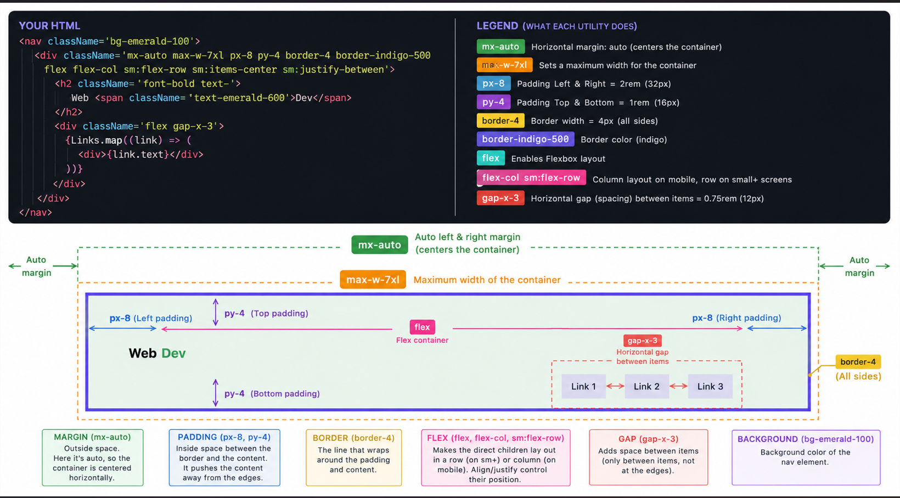
