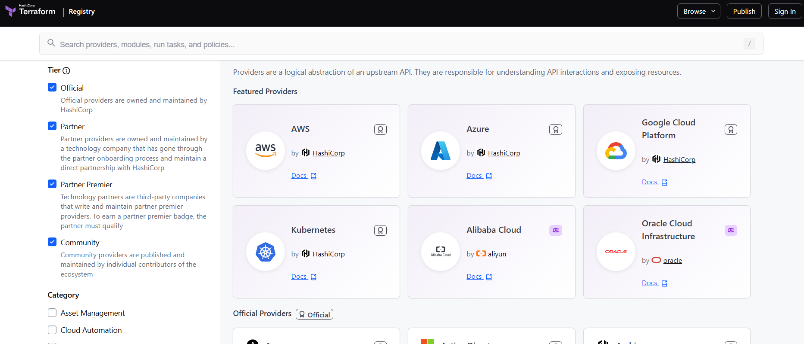
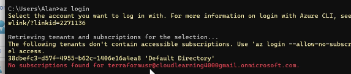
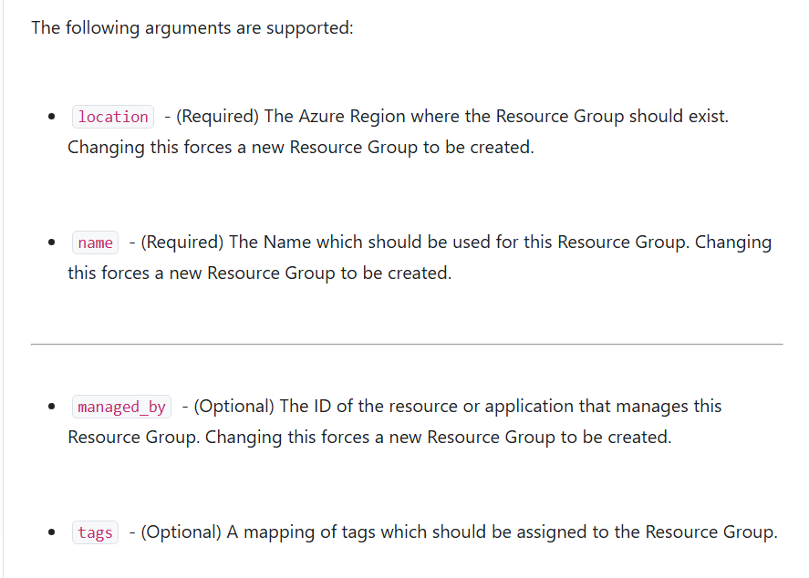
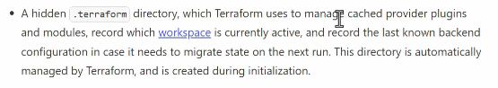
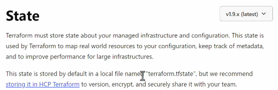
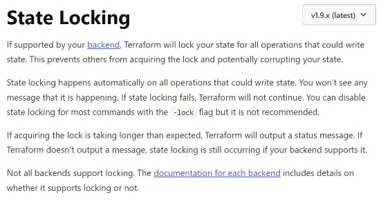

## Providers

Terraform provide provider to connect to different target

- AWS
- Azure
- GCP



## Terraform Documentation

https://registry.terraform.io/browse/providers

## Create First Terraform Configuration File

`main.tf` - Uses HCL (HashiCorp Configuration Language)

```
terraform {
  required_providers {
    azurerm = {
      source  = "hashicorp/azurerm"
      version = "=5.0.0"
    }
  }
}

# Configure the Microsoft Azure Provider
provider "azurerm" {
  features {}
}

```

## Authentication and Authorization onto Azure

- MS EntraID : Service for Authentication and Authorization

There are multiple ways of authentication in Terraform

1. Define a User in Entra ID, Login with via Azure Cli
   - UserName
   - Password

   ```
   az login
   ```

2. Define an Application Object, Login with
   - Service Principle
   - Client Secret

## Create User and use Azure CLI (az login)

1. Install the Azure CLI tool
2. Login with Azure CLI
   

Using Azure RBAC, we need to give `Contributor` role to the `Subscription`

- Have different subscriptions for Dev,Test,Prod
- Management Group --> Subscription(-Dev/Test/Prod) --> Resource Group --> Resources

## Write Terraform File - Azure resource group

https://registry.terraform.io/providers/hashicorp/azurerm/latest/docs/resources/resource_group

- Azure reousrce group - It logically group resources

`Resource Block`

```
# Create a resource group
resource "azurerm_resource_group" "example" {
  name     = "example-resources"
  location = "West Europe"
}

```



## Terraform init

Initialize Working Directory



1. Downloads providers

   ```
   provider "azurerm" {
        features {}
   }
   ```

2. Initializes the backend ,If you configure a remote backend

   ```
   terraform {
        backend "azurerm" {
            # configuration
        }
   }
   ```

   Note: If you are using backend, create it it a separate resource group `rg-terraform-state` in each subscription

3. Downloads modules

   Terraform prepares the required modules.

   ```
    module "network" {
        source = "./modules/network"
    }
   ```

4. Creates the .terraform directory

   Terraform stores downloaded providers, modules, and other initialization information there

```
terraform init = "Prepare this Terraform project so Terraform can work with it."
```

## terraform validate

Terraform validate checks things such as:

1. Terraform syntax is valid
2. Resource blocks are structured correctly
3. Provider/resource arguments are valid
4. References to variables and resources are valid
5. Required arguments are present
6. Configuration is internally consistent

## Terraform Plan

shows you what Terraform intends to change in your infrastructure before it actually makes those changes.

```
terraform plan -var-file="envs/dev.tfvars"

terraform plan -out main.tfplan -var-file="envs/dev.tfvars"
```

Note we can incorporate GenAI, that readout this tfplan file and provide a notification onto teams with summary of the change and wait for approval (Human-in-the-loop).

## Terraform Apply

Actually makes the infrastructure changes described by your Terraform configuration or Plan

```
terrform apply "main.tfplan"
```

## New Terraform Generated Files (terraform.tfstate and .terraform.lock.hcl)

On `terraform apply`, `terraform.tfstate` file is generated on local, which contains the current state of environment. If we delete, it we will lost the remote cloud state. So it will assume all resource need to recreate fresh. So it is very important to keep it safe, for terraform to work.



For Azure + Azure DevOps, the common recommended approach is to store your Terraform state in an Azure Storage Account using the azurerm backend, rather than keeping terraform.tfstate in your git repository or on the pipeline agent.

```
terraform {
  backend "azurerm" {
    resource_group_name  = "terraform-state-rg"
    storage_account_name = "mystateaccount"
    container_name       = "tfstate"
    key                  = "dev.tfstate"
  }
}
```

Why remote state (on Storage account) is better than Git

The state file contains important information about your infrastructure and can contain sensitive values.

Using Azure Storage gives you:

1. Centralized state — your team and Azure DevOps use the same state.
2. State locking — helps prevent two Terraform runs from modifying the same state simultaneously.
3. Persistence — the state isn't lost when an Azure DevOps agent is destroyed.
4. Access control — use Azure RBAC rather than putting credentials in the repository.
5. Versioning/recovery — Azure Storage can be configured for blob versioning and soft delete.


