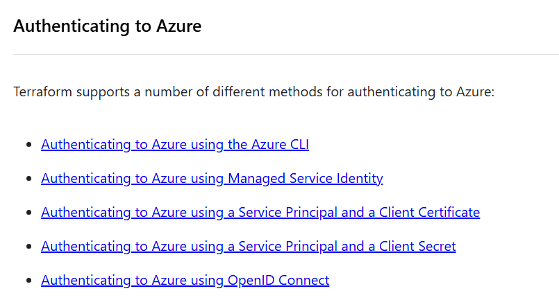
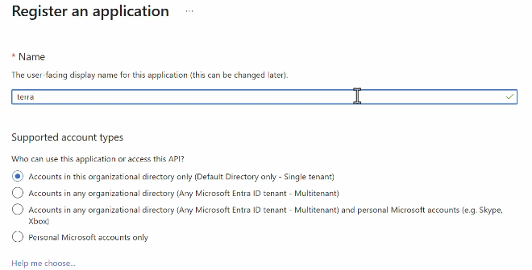
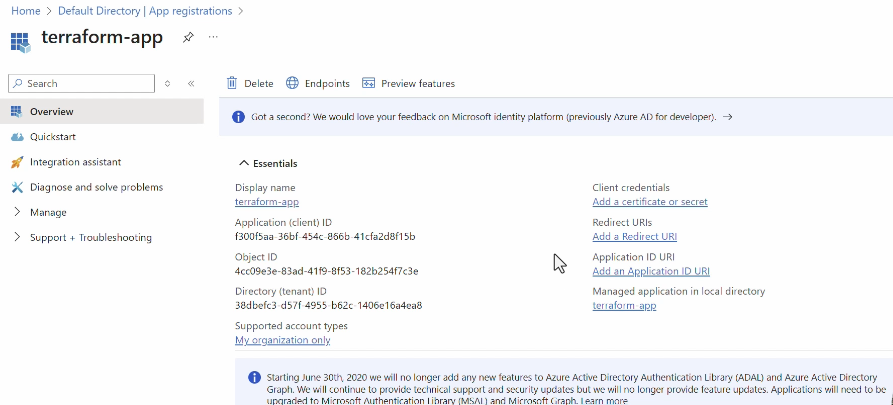
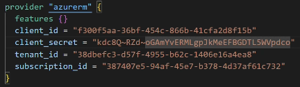
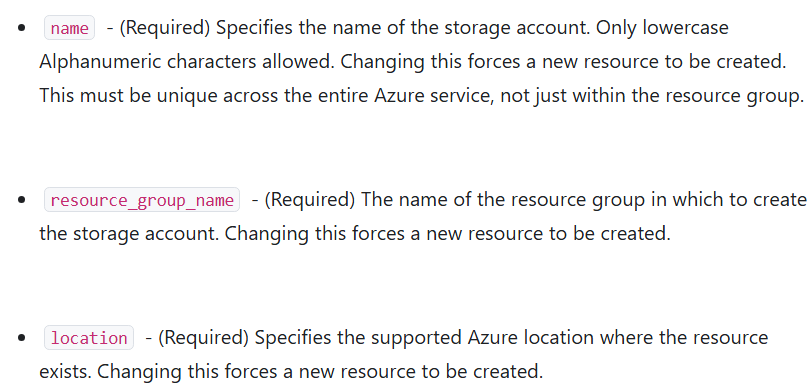
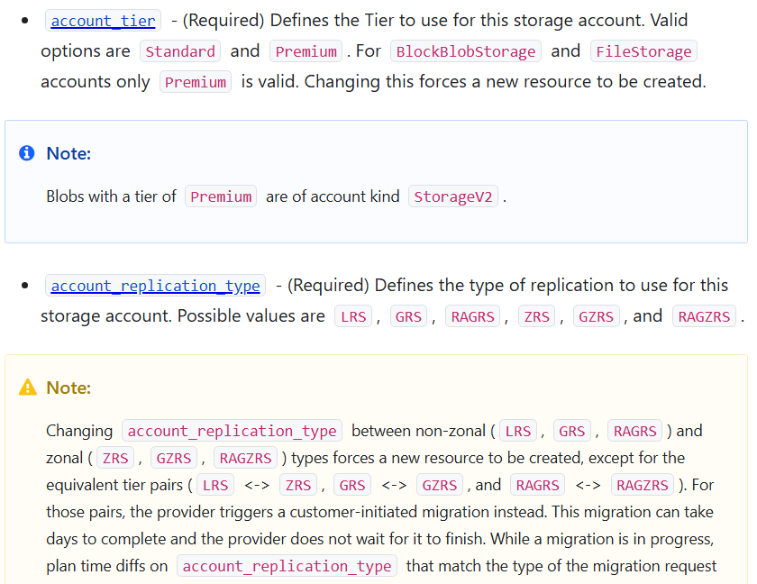
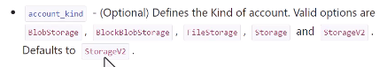

## Providers

Terraform provide provider to connect to different target

- AWS
- Azure
- GCP


## Terraform Documentation

https://registry.terraform.io/browse/providers

## Create First Terraform Configuration File

`main.tf` - Uses HCL (HashiCorp Configuration Language)

```
terraform {
  required_providers {
    azurerm = {
      source  = "hashicorp/azurerm"
      version = "=5.0.0"
    }
  }
}

# Configure the Microsoft Azure Provider
provider "azurerm" {
  features {}
}

```

## Authentication and Authorization onto Azure

- MS EntraID : Service for Authentication and Authorization

There are multiple ways of authentication in Terraform



1. Define a User in Entra ID, Login with via Azure Cli
   - UserName
   - Password

   ```
   az login
   ```

2. Define an Application Object, Login with
   - Service Principle
   - Client Secret

## Create User and use Azure CLI (az login)

1. Install the Azure CLI tool
2. Login with Azure CLI

   

Using Azure RBAC, we need to give `Contributor` role to the `Subscription`

- Have different subscriptions for Dev,Test,Prod
- Management Group --> Subscription(-Dev/Test/Prod) --> Resource Group --> Resources

## Write Terraform File - Azure resource group

https://registry.terraform.io/providers/hashicorp/azurerm/latest/docs/resources/resource_group

- Azure reousrce group - It logically group resources

`Resource Block`

```
# Create a resource group
resource "azurerm_resource_group" "rg" {
  name     = "${var.appname}-${var.environment}"
  location = var.region
  tags     = var.tags
}

```

```
terraform init -var-file="envs/dev.tfvars"
terraform validate
terraform plan -out main.tfplan -var-file="envs/dev.tfvars"
terraform apply "main.tfplan"

```


## Terraform init

Initialize Working Directory


1. Downloads providers

   ```
   provider "azurerm" {
        features {}
   }
   ```

2. Initializes the backend ,If you configure a remote backend

   ```
   terraform {
        backend "azurerm" {
            # configuration
        }
   }
   ```

   Note: If you are using backend, create it it a separate resource group `rg-terraform-state` in each subscription

3. Downloads modules

   Terraform prepares the required modules.

   ```
    module "network" {
        source = "./modules/network"
    }
   ```

4. Creates the .terraform directory

   Terraform stores downloaded providers, modules, and other initialization information there

```
terraform init = "Prepare this Terraform project so Terraform can work with it."
```

## terraform validate

Terraform validate checks things such as:

1. Terraform syntax is valid
2. Resource blocks are structured correctly
3. Provider/resource arguments are valid
4. References to variables and resources are valid
5. Required arguments are present
6. Configuration is internally consistent

## Terraform Plan

shows you what Terraform intends to change in your infrastructure before it actually makes those changes.

```
terraform plan -var-file="envs/dev.tfvars"

terraform plan -out main.tfplan -var-file="envs/dev.tfvars"
```

Note we can incorporate GenAI, that readout this tfplan file and provide a notification onto teams with summary of the change and wait for approval (Human-in-the-loop).

## Terraform Apply

Actually makes the infrastructure changes described by your Terraform configuration or Plan

```
terrform apply "main.tfplan"
```

## New Terraform Generated Files (terraform.tfstate and .terraform.lock.hcl)

On `terraform apply`, `terraform.tfstate` file is generated on local, which contains the current state of environment. If we delete, it we will lost the remote cloud state. So it will assume all resource need to recreate fresh. So it is very important to keep it safe, for terraform to work.


For Azure + Azure DevOps, the common recommended approach is to store your Terraform state in an Azure Storage Account using the azurerm backend, rather than keeping terraform.tfstate in your git repository or on the pipeline agent.

```
terraform {
  backend "azurerm" {
    resource_group_name  = "terraform-state-rg"
    storage_account_name = "mystateaccount"
    container_name       = "tfstate"
    key                  = "dev.tfstate"
  }
}
```

Why remote state (on Storage account) is better than Git

The state file contains important information about your infrastructure and can contain sensitive values.

Using Azure Storage gives you:

1. Centralized state — your team and Azure DevOps use the same state.
2. State locking — helps prevent two Terraform runs from modifying the same state simultaneously.
3. Persistence — the state isn't lost when an Azure DevOps agent is destroyed.
4. Access control — use Azure RBAC rather than putting credentials in the repository.
5. Versioning/recovery — Azure Storage can be configured for blob versioning and soft delete.


## Authenticate using Application Object

`Steps`

- MS EntraID --> Application Registration --> Create Registration

  

- Assign `contributor` role to the `Service Principle` at `Subscription-Dev/Test/Prod` Level

  

- Use `Client ID`, `Client Secret Value`, `Tenant ID`

  

  

When you create an App Registration for Terraform, you're typically creating a Service Principal (a non-human identity) that Terraform uses to authenticate to Azure.

In the context of Terraform authentication to Azure, choose:

✅ Accounts in this organizational directory only (Single tenant)

Why?

Terraform is usually deployed into:

- Your Azure subscription
- Your Entra ID tenant
- Your Azure DevOps organization

For modern Terraform deployments

Many teams no longer use client secrets at all. Instead they use:

- Managed Identity (Azure-hosted workloads)
- Workload Identity Federation (Azure DevOps/GitHub Actions)

### When would you use Multitenant?

Only if you're building a product that other companies will use.

```
Your SaaS Application
      ↓
Contoso users
Fabrikam users
Wingtip users
```

## Create Azure Storage Account







```
resource "azurerm_resource_group" "rg" {
  name     = "rg-${var.appname}-${var.tenant_code}-${var.environment}"
  location = var.region
  tags     = var.tags
}

## Note: We cant use - in storage account name

resource "azurerm_storage_account" "sa" {
  name                     = "sa${var.appname}${var.tenant_code}${var.environment}"
  resource_group_name      = azurerm_resource_group.rg.name
  location                 = azurerm_resource_group.rg.location
  account_tier             = "Standard"
  account_replication_type = "LRS"

  # Recommended security settings
  https_traffic_only_enabled = false // true - production
  min_tls_version            = "TLS1_2"

  # Terraform state recovery
  blob_properties {
    versioning_enabled = false // true - production

    # Recover deleted blobs
    delete_retention_policy {
      days = 30
    }

    # Recover deleted containers
    container_delete_retention_policy {
      days = 30
    }
  }

  tags = {
    purpose = "terraform-state"
  }
}

```

A Resource Group per tenant per environment is commonly useful when you need:

- Tenant-level isolation of Azure resources
- Separate RBAC permissions for customers/teams
- Tenant-level cost tracking
- Independent deployment/lifecycle management
- Ability to delete or recreate one tenant's infrastructure
- Different policies or locks for different tenants
- Clear operational boundaries

```
Production
├── myapp-tenant-a-prod
│   ├── App Service
│   ├── Storage
│   └── Key Vault
│
├── myapp-tenant-b-prod
│   ├── App Service
│   ├── Storage
│   └── Key Vault
│
└── myapp-tenant-c-prod
    ├── App Service
    ├── Storage
    └── Key Vault
```

That's a reasonable strong-isolation SaaS architecture.

But, if all tenants use the same:

```
Azure SQL Server
Azure Service Bus
Application
AKS cluster
```

then putting some resources in different resource groups doesn't necessarily give you data isolation.

Your application/data architecture still needs appropriate tenant isolation.

A common SaaS approach is therefore:

```
                 SaaS Application
                       │
        ┌──────────────┴──────────────┐
        │                             │
   Shared infrastructure       Tenant-specific
        │                       infrastructure
        │                             │
   ┌────┴─────┐              ┌────────┴────────┐
   │           │              │                 │
Tenant A    Tenant B       Premium A         Premium B
Tenant C    Tenant D       resources         resources
```

So you don't necessarily need one complete Azure infrastructure stack per tenant.

### A useful enterprise model

```
Subscription
│
├── rg-myapp-shared-prod
│   ├── Application
│   ├── App Gateway
│   ├── Service Bus
│   └── Monitoring
│
├── rg-myapp-tenant-a-prod
│   └── Tenant-specific resources - DB , Secrets
│
├── rg-myapp-tenant-b-prod
│   └── Tenant-specific resources - DB , Secrets
│
└── rg-myapp-tenant-c-prod
    └── Tenant-specific resources - DB , Secrets
```

```

| Replication | Protection                                      | Typical production use                      |
| ----------- | ----------------------------------------------- | ------------------------------------------- |
| **LRS**     | 3 copies in one datacenter                      | Dev/test, non-critical workloads            |
| **ZRS**     | Copies across availability zones                | **Common production choice**                |
| **GRS**     | Local redundancy + async copy to another region | Production with regional DR                 |
| **GZRS**    | Zone redundancy + geo-replication               | **Strong choice for critical production**   |
| **RA-GRS**  | GRS + read access to secondary region           | DR scenarios needing secondary-region reads |
| **RA-GZRS** | GZRS + read access to secondary region          | **High-criticality workloads**              |


```

| Replication | Protection                                      | Typical production use                      |
| ----------- | ----------------------------------------------- | ------------------------------------------- |
| **LRS**     | 3 copies in one datacenter                      | Dev/test, non-critical workloads            |
| **ZRS**     | Copies across availability zones                | **Common production choice**                |
| **GRS**     | Local redundancy + async copy to another region | Production with regional DR                 |
| **GZRS**    | Zone redundancy + geo-replication               | **Strong choice for critical production**   |
| **RA-GRS**  | GRS + read access to secondary region           | DR scenarios needing secondary-region reads |
| **RA-GZRS** | GZRS + read access to secondary region          | **High-criticality workloads**              |

                    Production
                        │
             ┌──────────┴──────────┐
             │                     │
       Regional outage       Regional outage
       NOT acceptable?        acceptable?
             │                     │
            Yes                    No
             │                     │
           GZRS                  ZRS
             │
       Need secondary
       read access?
             │
          ┌──┴──┐
         Yes    No
          │      │
       RA-GZRS  GZRS

Remember that replication isn't a backup strategy. GRS/GZRS protects against certain infrastructure/region failures, but accidental deletion, corruption, or application-level mistakes can still replicate to the secondary location. You should have an appropriate backup/retention strategy as well.

## Reference to named values instead of hardcording

[resource_type].[terraform_resource_block_name].[resource_propety]

azurerm_resource_group.rg.name

## Destroy you infrastructure

```
terraform destroy -var-file="envs/dev.tfvars"

As a security practice.
It ask for your confirmation, you need to type 'Yes'
```

## depends_on Clause
