## Providers

Terraform provide provider to connect to different target

- AWS
- Azure
- GCP

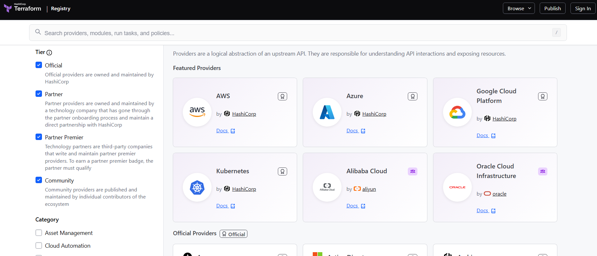

## Terraform Documentation

https://registry.terraform.io/browse/providers

## Create First Terraform Configuration File

`main.tf` - Uses HCL (HashiCorp Configuration Language)

```
terraform {
  required_providers {
    azurerm = {
      source  = "hashicorp/azurerm"
      version = "=5.0.0"
    }
  }
}

# Configure the Microsoft Azure Provider
provider "azurerm" {
  features {}
}

```

## Authentication and Authorization onto Azure

- MS EntraID : Service for Authentication and Authorization

There are multiple ways of authentication in Terraform

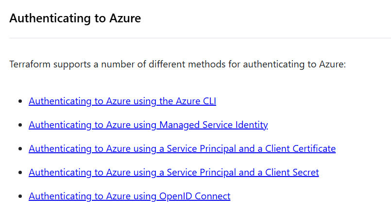

1. Define a User in Entra ID, Login with via Azure Cli
   - UserName
   - Password

   ```
   az login
   ```

2. Define an Application Object, Login with
   - Service Principle
   - Client Secret

## Create User and use Azure CLI (az login)

1. Install the Azure CLI tool
2. Login with Azure CLI

   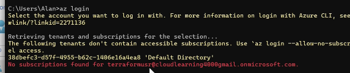

Using Azure RBAC, we need to give `Contributor` role to the `Subscription`

- Have different subscriptions for Dev,Test,Prod
- Management Group --> Subscription(-Dev/Test/Prod) --> Resource Group --> Resources

## Write Terraform File - Azure resource group

https://registry.terraform.io/providers/hashicorp/azurerm/latest/docs/resources/resource_group

- Azure reousrce group - It logically group resources

`Resource Block`

```
# Create a resource group
resource "azurerm_resource_group" "rg" {
  name     = "${var.appname}-${var.environment}"
  location = var.region
  tags     = var.tags
}

```

```
terraform init -var-file="envs/dev.tfvars"
terraform validate
terraform plan -out main.tfplan -var-file="envs/dev.tfvars"
terraform apply "main.tfplan"

```

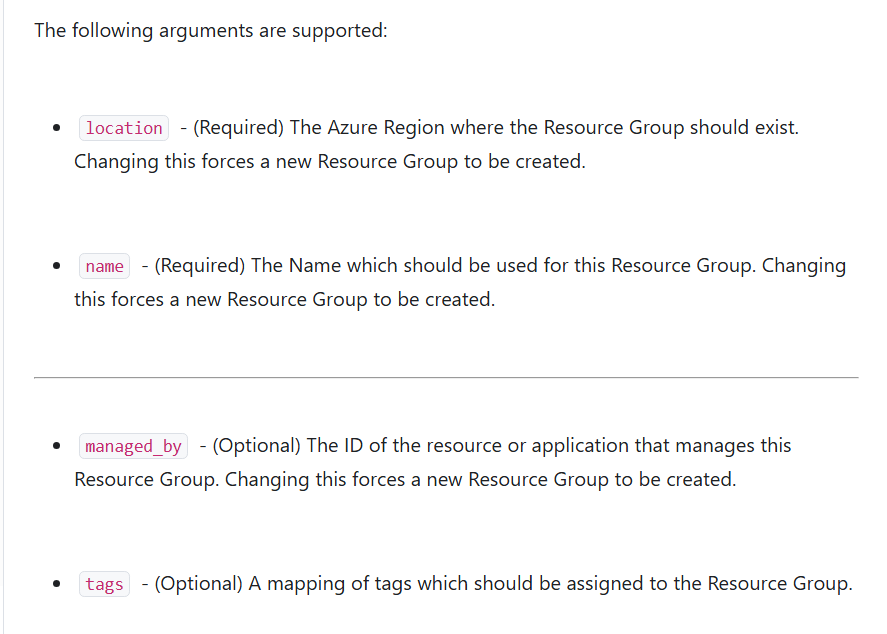

## Terraform init

Initialize Working Directory

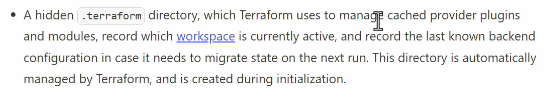

1. Downloads providers

   ```
   provider "azurerm" {
        features {}
   }
   ```

2. Initializes the backend ,If you configure a remote backend

   ```
   terraform {
        backend "azurerm" {
            # configuration
        }
   }
   ```

   Note: If you are using backend, create it it a separate resource group `rg-terraform-state` in each subscription

3. Downloads modules

   Terraform prepares the required modules.

   ```
    module "network" {
        source = "./modules/network"
    }
   ```

4. Creates the .terraform directory

   Terraform stores downloaded providers, modules, and other initialization information there

```
terraform init = "Prepare this Terraform project so Terraform can work with it."
```

## terraform validate

To validate your configuration files:

Terraform validate checks things such as:

1. Terraform syntax is valid
2. Resource blocks are structured correctly
3. Provider/resource arguments are valid
4. References to variables and resources are valid
5. Required arguments are present
6. Configuration is internally consistent

## Terraform Plan

shows you what Terraform intends to change in your infrastructure before it actually makes those changes.

```
terraform plan -var-file="envs/dev.tfvars"

terraform plan -out main.tfplan -var-file="envs/dev.tfvars"
```

Note we can incorporate GenAI, that readout this tfplan file and provide a notification onto teams with summary of the change and wait for approval (Human-in-the-loop).

## Terraform Apply

Actually makes the infrastructure changes described by your Terraform configuration or Plan

```
terrform apply "main.tfplan"
```

## New Terraform Generated Files (terraform.tfstate and .terraform.lock.hcl)

On `terraform apply`, `terraform.tfstate` file is generated on local, which contains the current state of environment. If we delete, it we will lost the remote cloud state. So it will assume all resource need to recreate fresh. So it is very important to keep it safe, for terraform to work.

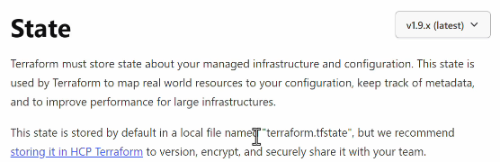

For Azure + Azure DevOps, the common recommended approach is to store your Terraform state in an Azure Storage Account using the azurerm backend, rather than keeping terraform.tfstate in your git repository or on the pipeline agent.

```
terraform {
  backend "azurerm" {
    resource_group_name  = "terraform-state-rg"
    storage_account_name = "mystateaccount"
    container_name       = "tfstate"
    key                  = "dev.tfstate"
  }
}
```

Why remote state (on Storage account) is better than Git

The state file contains important information about your infrastructure and can contain sensitive values.

Using Azure Storage gives you:

1. Centralized state — your team and Azure DevOps use the same state.
2. State locking — helps prevent two Terraform runs from modifying the same state simultaneously.
3. Persistence — the state isn't lost when an Azure DevOps agent is destroyed.
4. Access control — use Azure RBAC rather than putting credentials in the repository.
5. Versioning/recovery — Azure Storage can be configured for blob versioning and soft delete.

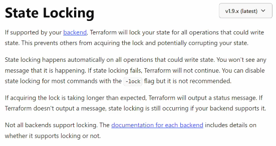

## Authenticate using Application Object

`Steps`

- MS EntraID --> Application Registration --> Create Registration

  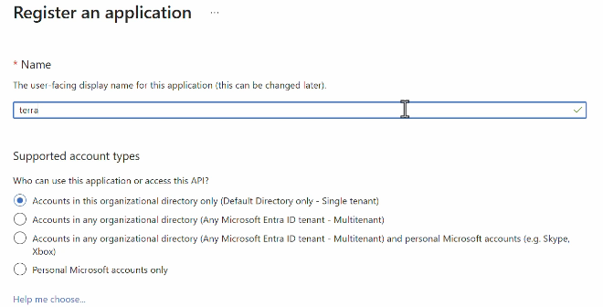

- Assign `contributor` role to the `Service Principle` at `Subscription-Dev/Test/Prod` Level

  

- Use `Client ID`, `Client Secret Value`, `Tenant ID`

  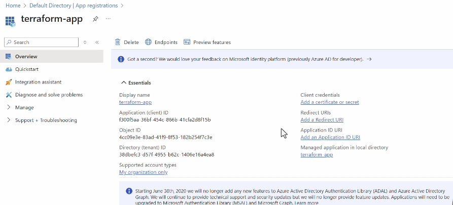

  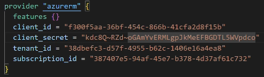

When you create an App Registration for Terraform, you're typically creating a Service Principal (a non-human identity) that Terraform uses to authenticate to Azure.

In the context of Terraform authentication to Azure, choose:

✅ Accounts in this organizational directory only (Single tenant)

Why?

Terraform is usually deployed into:

- Your Azure subscription
- Your Entra ID tenant
- Your Azure DevOps organization

For modern Terraform deployments

Many teams no longer use client secrets at all. Instead they use:

- Managed Identity (Azure-hosted workloads)
- Workload Identity Federation (Azure DevOps/GitHub Actions)

### When would you use Multitenant?

Only if you're building a product that other companies will use.

```
Your SaaS Application
      ↓
Contoso users
Fabrikam users
Wingtip users
```

## Create Azure Storage Account

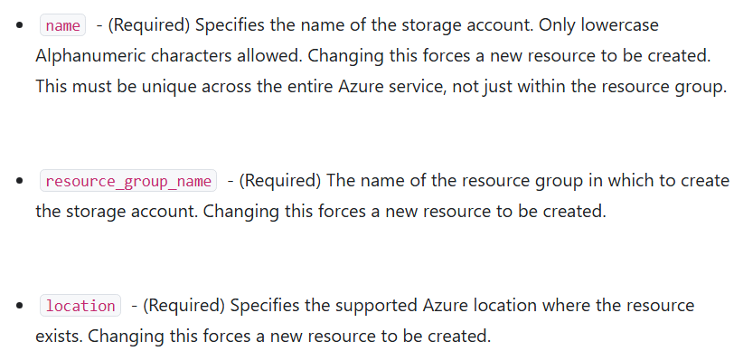

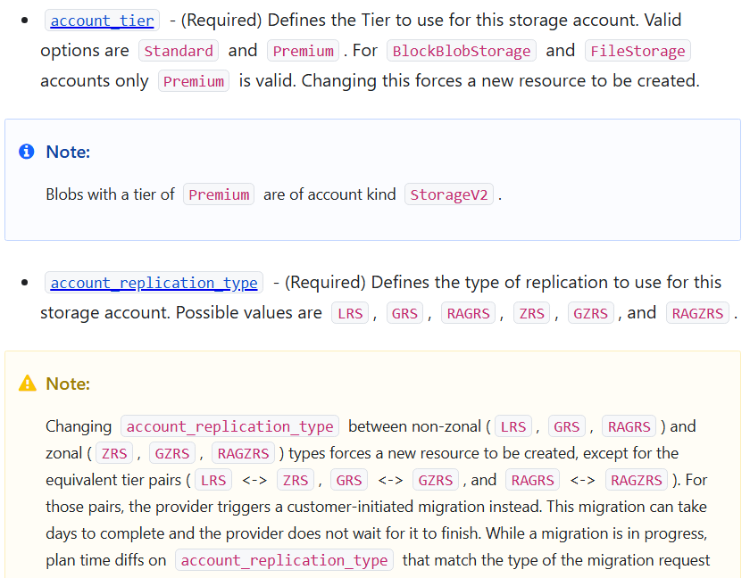

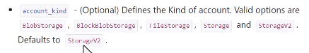

```
resource "azurerm_resource_group" "rg" {
  name     = "rg-${var.appname}-${var.tenant_code}-${var.environment}"
  location = var.region
  tags     = var.tags
}

## Note: We cant use - in storage account name

resource "azurerm_storage_account" "sa" {
  name                     = "sa${var.appname}${var.tenant_code}${var.environment}"
  resource_group_name      = azurerm_resource_group.rg.name
  location                 = azurerm_resource_group.rg.location
  account_tier             = "Standard"
  account_replication_type = "LRS"

  # Recommended security settings
  https_traffic_only_enabled = false // true - production
  min_tls_version            = "TLS1_2"

  # Terraform state recovery
  blob_properties {
    versioning_enabled = false // true - production

    # Recover deleted blobs
    delete_retention_policy {
      days = 30
    }

    # Recover deleted containers
    container_delete_retention_policy {
      days = 30
    }
  }

  tags = {
    purpose = "terraform-state"
  }
}

```

A Resource Group per tenant per environment is commonly useful when you need:

- Tenant-level isolation of Azure resources
- Separate RBAC permissions for customers/teams
- Tenant-level cost tracking
- Independent deployment/lifecycle management
- Ability to delete or recreate one tenant's infrastructure
- Different policies or locks for different tenants
- Clear operational boundaries

```
Production
├── myapp-tenant-a-prod
│   ├── App Service
│   ├── Storage
│   └── Key Vault
│
├── myapp-tenant-b-prod
│   ├── App Service
│   ├── Storage
│   └── Key Vault
│
└── myapp-tenant-c-prod
    ├── App Service
    ├── Storage
    └── Key Vault
```

That's a reasonable strong-isolation SaaS architecture.

But, if all tenants use the same:

```
Azure SQL Server
Azure Service Bus
Application
AKS cluster
```

then putting some resources in different resource groups doesn't necessarily give you data isolation.

Your application/data architecture still needs appropriate tenant isolation.

A common SaaS approach is therefore:

```
                 SaaS Application
                       │
        ┌──────────────┴──────────────┐
        │                             │
   Shared infrastructure       Tenant-specific
        │                       infrastructure
        │                             │
   ┌────┴─────┐              ┌────────┴────────┐
   │           │              │                 │
Tenant A    Tenant B       Premium A         Premium B
Tenant C    Tenant D       resources         resources
```

So you don't necessarily need one complete Azure infrastructure stack per tenant.

### A useful enterprise model

```
Subscription
│
├── rg-myapp-shared-prod
│   ├── Application
│   ├── App Gateway
│   ├── Service Bus
│   └── Monitoring
│
├── rg-myapp-tenant-a-prod
│   └── Tenant-specific resources - DB , Secrets
│
├── rg-myapp-tenant-b-prod
│   └── Tenant-specific resources - DB , Secrets
│
└── rg-myapp-tenant-c-prod
    └── Tenant-specific resources - DB , Secrets
```

```

| Replication | Protection                                      | Typical production use                      |
| ----------- | ----------------------------------------------- | ------------------------------------------- |
| **LRS**     | 3 copies in one datacenter                      | Dev/test, non-critical workloads            |
| **ZRS**     | Copies across availability zones                | **Common production choice**                |
| **GRS**     | Local redundancy + async copy to another region | Production with regional DR                 |
| **GZRS**    | Zone redundancy + geo-replication               | **Strong choice for critical production**   |
| **RA-GRS**  | GRS + read access to secondary region           | DR scenarios needing secondary-region reads |
| **RA-GZRS** | GZRS + read access to secondary region          | **High-criticality workloads**              |


```

| Replication | Protection                                      | Typical production use                      |
| ----------- | ----------------------------------------------- | ------------------------------------------- |
| **LRS**     | 3 copies in one datacenter                      | Dev/test, non-critical workloads            |
| **ZRS**     | Copies across availability zones                | **Common production choice**                |
| **GRS**     | Local redundancy + async copy to another region | Production with regional DR                 |
| **GZRS**    | Zone redundancy + geo-replication               | **Strong choice for critical production**   |
| **RA-GRS**  | GRS + read access to secondary region           | DR scenarios needing secondary-region reads |
| **RA-GZRS** | GZRS + read access to secondary region          | **High-criticality workloads**              |

                    Production
                        │
             ┌──────────┴──────────┐
             │                     │
       Regional outage       Regional outage
       NOT acceptable?        acceptable?
             │                     │
            Yes                    No
             │                     │
           GZRS                  ZRS
             │
       Need secondary
       read access?
             │
          ┌──┴──┐
         Yes    No
          │      │
       RA-GZRS  GZRS

Remember that replication isn't a backup strategy. GRS/GZRS protects against certain infrastructure/region failures, but accidental deletion, corruption, or application-level mistakes can still replicate to the secondary location. You should have an appropriate backup/retention strategy as well.

## Reference to named values instead of hardcording

[resource_type].[terraform_resource_block_name].[resource_propety]

azurerm_resource_group.rg.name

## Destroy you infrastructure

```
terraform destroy -var-file="envs/dev.tfvars"

As a security practice.
It ask for your confirmation, you need to type 'Yes'
```

## depends_on Clause

## Create a VM

A Virtual Machine is deployed within an subnet,

- It gets
  - A vNIC (Virtual Network Interface)
    - IP address (public/private) is associated to the Subnet
  - A OS Disk
    - Host OS
  - A NSG (Network Security Group)
    - Filter incoming and outgoing connections onto the VM
    - It can be attached to either vNIC or Subnet

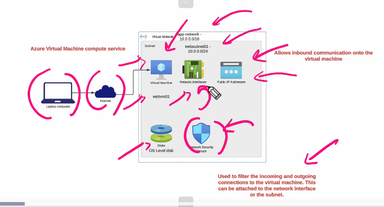

`Virtual Machine`


`Network Interface Id`


```
resource "azurerm_network_interface" "example" {
  .
  .

  ip_configuration {
    name                          = "internal"
    subnet_id                     = azurerm_subnet.example.id
    private_ip_address_allocation = "Dynamic"
  }
}
```

`Subnet`

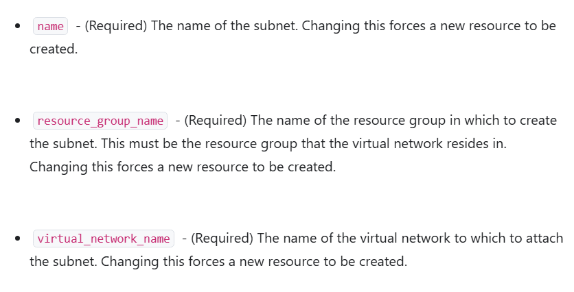

`Virtual Network`

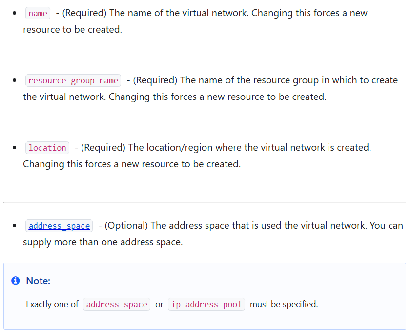

```
resource "azurerm_virtual_network" "example" {
  name                = "vnet-network"
  location            = azurerm_resource_group.rg.location
  resource_group_name = azurerm_resource_group.rg.name
  address_space       = ["10.0.0.0/16"]
  dns_servers         = ["10.0.0.4", "10.0.0.5"]

  subnet {
    name             = "subnet1"
    address_prefixes = ["10.0.1.0/24"]
  }

  subnet {
    name             = "subnet2"
    address_prefixes = ["10.0.2.0/24"]
    security_group   = azurerm_network_security_group.example.id
  }

  tags = {
    environment = "Production"
  }
}
```

```
resource "azurerm_network_security_group" "example" {
  name                = "acceptanceTestSecurityGroup1"
  location            = azurerm_resource_group.example.location
  resource_group_name = azurerm_resource_group.example.name

  security_rule {
    name                       = "test123"
    priority                   = 100
    direction                  = "Inbound"
    access                     = "Allow"
    protocol                   = "Tcp"
    source_port_range          = "*"
    destination_port_range     = "*"
    source_address_prefix      = "*"
    destination_address_prefix = "*"
  }

  tags = {
    environment = "Production"
  }
}

In Azure, a Network Interface (NIC) is a separate resource that sits between the VM and the virtual network. That's why the NIC is configured with a subnet, while the VM is configured with a NIC.

resource "azurerm_network_interface" "example" {
  name                = "example-nic"
  location            = azurerm_resource_group.example.location
  resource_group_name = azurerm_resource_group.example.name

  ip_configuration {
    name                          = "internal"
    subnet_id                     = azurerm_subnet.example.id
    private_ip_address_allocation = "Dynamic"
  }
}
```

### All we are creating is Managed Resources using Managed Services of Azure.

## How to calculate IP Address range

10.0.0.0/16

IPv4 has 32 bits.

/16 means:

- 16 bits = network portion
- 16 bits = host portion (2^16 = 65536 IP Addresses)

So the subnet mask is:

```
255.255.0.0
```

10.0.0.0/16 = 65,536 total IP addresses

Range: 10.0.0.0 - 10.0.255.255

For 10.0.0.0/16:

- Network address: 10.0.0.0 → identifies the subnet itself
- Broadcast address: 10.0.255.255 → sends traffic to all hosts in that subnet
- Usable host addresses: 10.0.0.2 through 10.0.255.253

| Type               | Address                   |
| ------------------ | ------------------------- |
| Network address    | `10.0.0.0`                |
| AWS/Azure reserved | `10.0.0.1`                |
| AWS/Azure reserved | `10.0.0.2`                |
| AWS/Azure reserved | `10.0.0.3`                |
| Usable host range  | `10.0.0.4` – `10.0.0.254` |
| Broadcast/reserved | `10.0.0.255`              |

### Subnet

10.0.1.0/24 = 2^32-24=2^8 = 256 Total IP addresses

`Range`

```
VNet: 10.0.0.0/16
│
├── Subnet A: 10.0.0.0/24
│   └── 5 reserved
│
├── Subnet B: 10.0.1.0/24
│   └── 5 reserved
│
├── Subnet C: 10.0.2.0/24
│   └── 5 reserved
│
├── Subnet D: 10.0.3.0/24
│   └── 5 reserved
│
└── Subnet E: 10.0.4.0/24
    └── 5 reserved
```

`There is no resource as subnet, it exists within the virtual network resource`

- VM Resource (Associated in vNIC)
- Public IP Resource (Attached to vNIC)

- vNIC Resource (Associated on Subnet )

- Subnets (No Resource) (Associated to on vNet )

- NSG Resource (Associated to vNIC or Subnet)

## How to upgrade terraform provider version

```
terraform init -upgrade
```

terraform init -upgrade primarily updates/initializes:

- Terraform providers
- Terraform modules
- Backend configuration/initialization
- Dependency lock information (.terraform.lock.hcl)

Your state file is not removed

## Using Local Variables

```
locals {
    version ="1.0.0"
}


local.version
```

value can be

- string
- number
- bool
- null
- map
- Array
- Expression

## Splitting Terraform Configuration files

main.tf can be split into

- terraform.tf (Provider Configuration)
- locals.tf (Local configuration)

So it does not matter how many configuration files you have, it will consider all the .tf files at the project root level.

## Types and Values - List

`local.tf`

```
locals {
  vnet_address_range = "10.0.0.0/16"
  subnet_values      = ["10.0.1.0/24", "10.0.2.0/24"]
}
```

`main.tf`

```
  subnet {
    name             = "backend"
    address_prefixes = [local.subnet_values[1]]
    security_group   = azurerm_network_security_group.nsg.id
  }
```

## Types and Values - Map

`local.tf`

```
locals {

  virtual_machine1  = {
    vnet_address_range = "10.0.0.0/16"
    subnet_values      = ["10.0.1.0/24", "10.0.2.0/24"]
    dns_servers        = ["10.0.0.4", "10.0.0.5"]
  }


  virtual_machine2  = {
    vnet_address_range = "10.1.0.0/16"
    subnet_values      = ["10.1.1.0/24", "10.1.2.0/24"]
    dns_servers        = ["10.1.1.4", "10.1.1.5"]
  }

}
```

`main.tf`

```
  subnet {
    name             = "backend"
    address_prefixes = [local.virtual_machine1.subnet_values[1]]
    security_group   = azurerm_network_security_group.nsg.id
  }
```

## Output

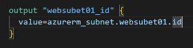

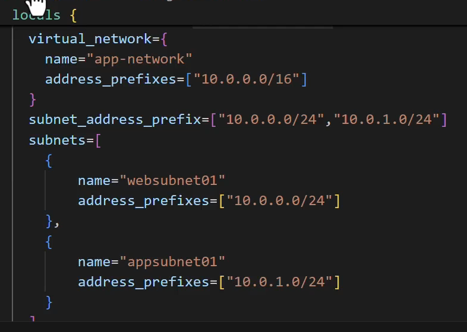

- local.virtual_network.name
- local.virtual_network.address_prefixes[0]
- local.subnet_address_prefix[0]
- local.subnet_address_prefix[1]
- local.subnets[0].name
- local.subnets[0].address_prefixes[0]
- local.subnets[0].name
- local.subnets[1].address_prefixes[1]

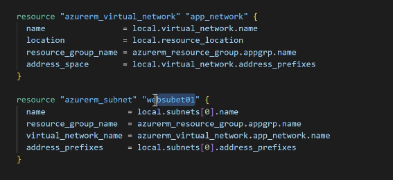

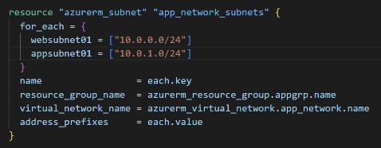

## Create Public IP Address

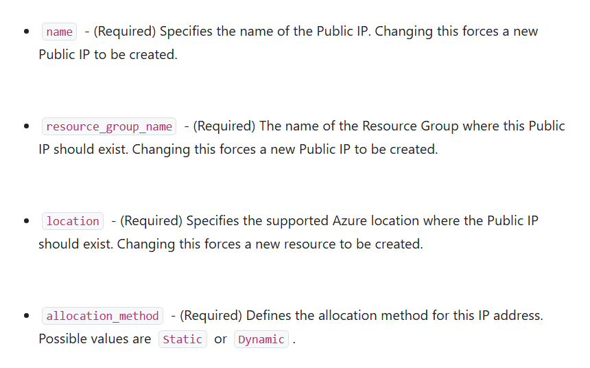

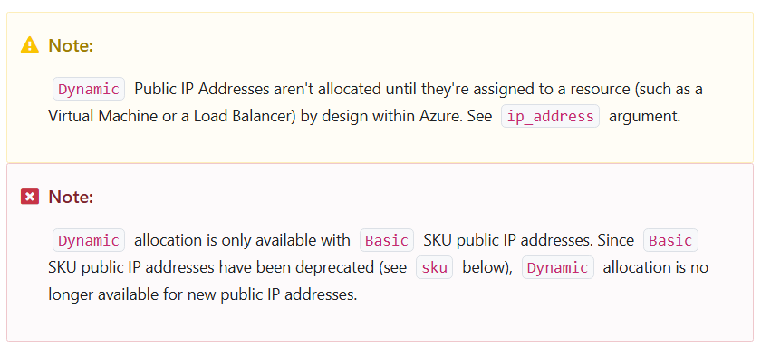

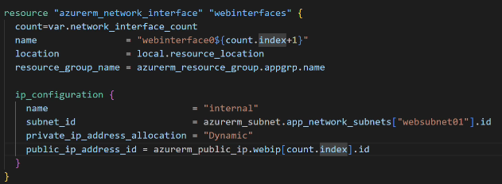

```
resource "azurerm_public_ip" "example" {
  name                = "acceptanceTestPublicIp1"
  resource_group_name = azurerm_resource_group.example.name
  location            = azurerm_resource_group.example.location
  allocation_method   = "Static"

  tags = {
    environment = "Production"
  }
}
```

## How to associate NSG to Subnet

```
resource "azurerm_subnet_network_security_group_association" "example" {
  subnet_id                 = azurerm_subnet.example.id
  network_security_group_id = azurerm_network_security_group.example.id
}
```

## Create a VM

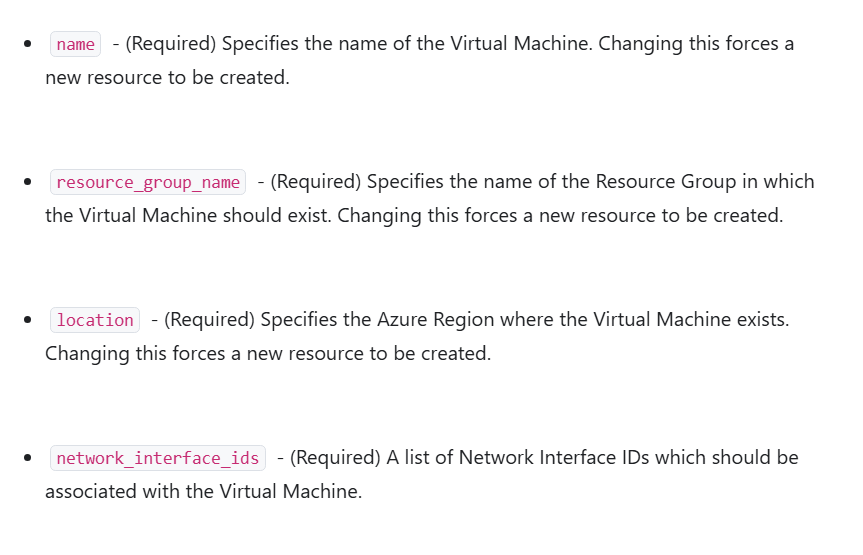

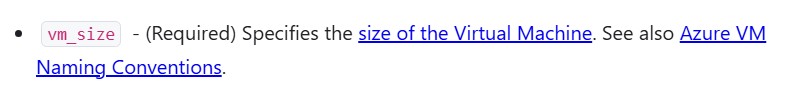

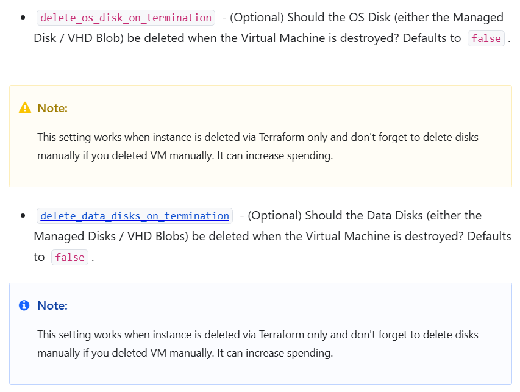

## Look at your state file

`terraform.tfstate`

## Using input variables

`variables.tf` at the project root

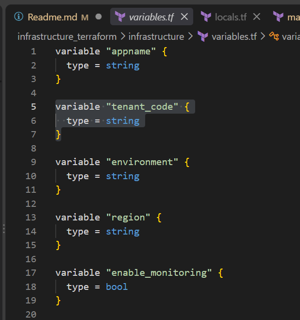

```
terraform plan -out main.tfplan -var-file="vars/dev.tfvars"

terraform apply "main.tfplan"

terraform destroy -var-file="vars/dev.tfvars"
```

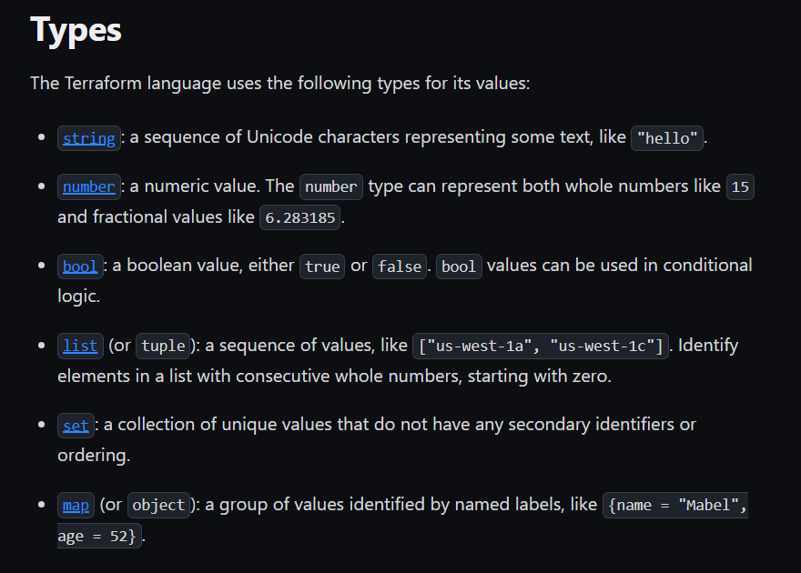

## Passing secret Values

```
variable "admin_password" {
  type        = string
  description = "This is admin password for the virtual machine"
  sensitive   = true
}

```

```
 admin_password = var.admin_password
```

## Add data disk to VM

1. `azurerm_managed_disk`

   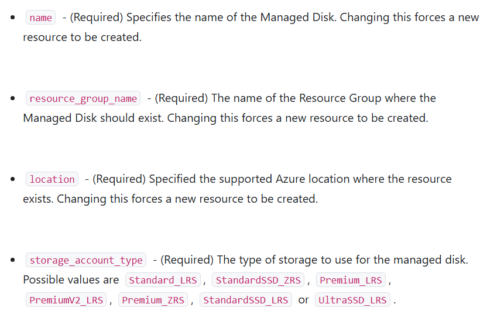

   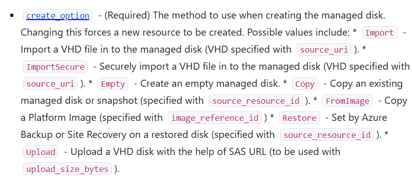

   ```
    resource "azurerm_managed_disk" "datadisk" {
    name                 = "datadisk-${var.appname}-${var.tenant_code}-${var.environment}"
    location             = azurerm_resource_group.rg.location
    resource_group_name  = azurerm_resource_group.rg.name
    storage_account_type = "Standard_LRS"
    create_option        = "Empty"
    disk_size_gb         = "20"

    tags = merge(var.tags, {
        Application = var.appname
        Environment = var.environment
        Tenant      = var.tenant_code
    })
    }
   ```

2. `azurerm_virtual_machine_data_disk_attachment`

   ```
   resource "azurerm_virtual_machine_data_disk_attachment" "vm_datadisk" {
   managed_disk_id    = azurerm_managed_disk.datadisk.id
   virtual_machine_id = azurerm_virtual_machine.vm.id
   lun                = "10"
   caching            = "ReadWrite"
   }
   ```

## Count - meta argument

It is used to create multiple similar infrastructure

- count=3
- count.index (0,1,2)

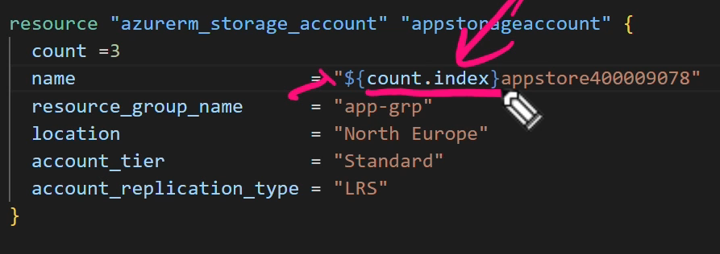

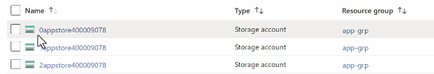

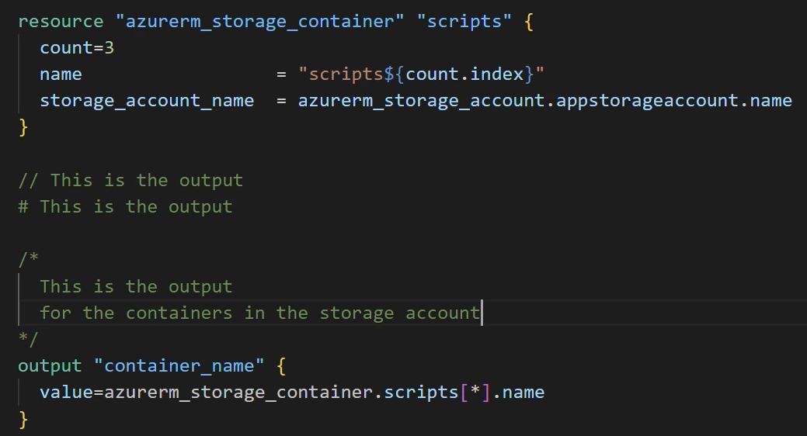

## For each - meta argument

It is used to create multiple distinct/different infrastructure using

```
foreach = toset(["value1","value2"])

each.key
```

```
foreach = tomap({"key"="value","key","value})

- each.key
- each.value
```

`toset(["value1","value2"])`

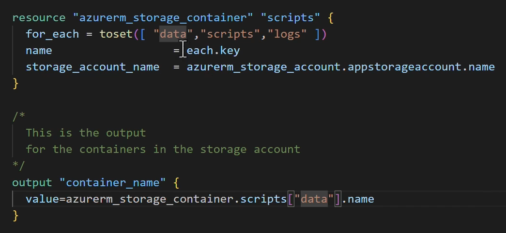

OR

`tomap({"key"="value","key","value})`

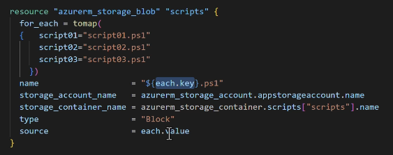

## for each and variable

`variables.tf`

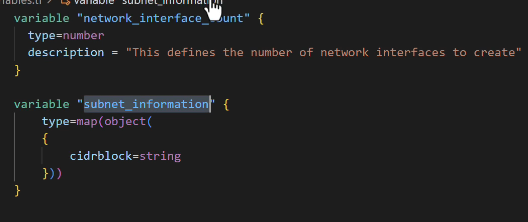

`dev.tfvar`

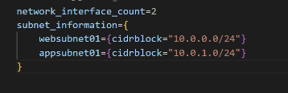

`main.tf`

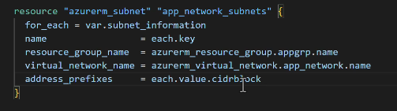

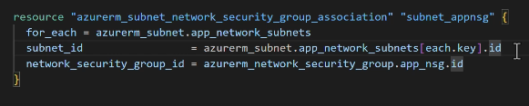

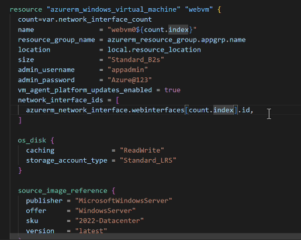

`Correction`

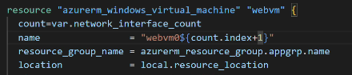

## High Availability Approaches (For VM)

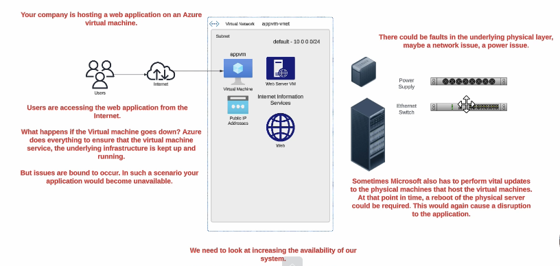

### Problem Statement

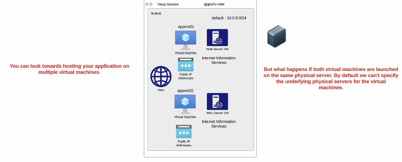

### Solution

- Availability Set
- Availability Zone

`Availability Set (Resource)`

- All VMs resides in the same data center.

- Fault Domain (Group of VM share same poweer source and network)
  - 3 (Max)
- Update Domain (Group of VM can be rebooted at same time) - 20 (Max)
  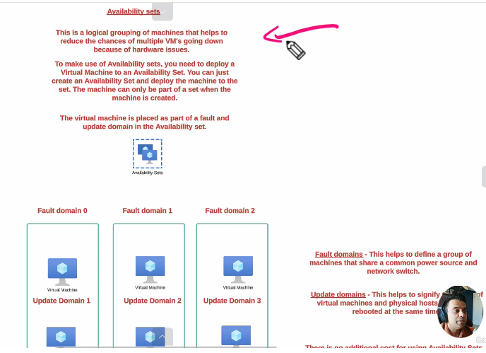

  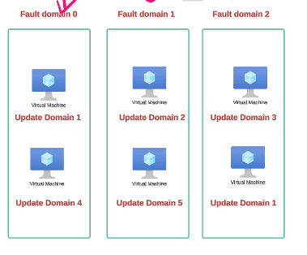

  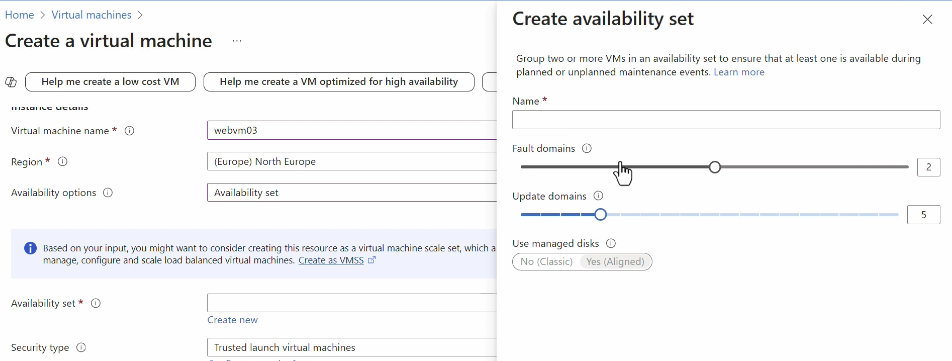

  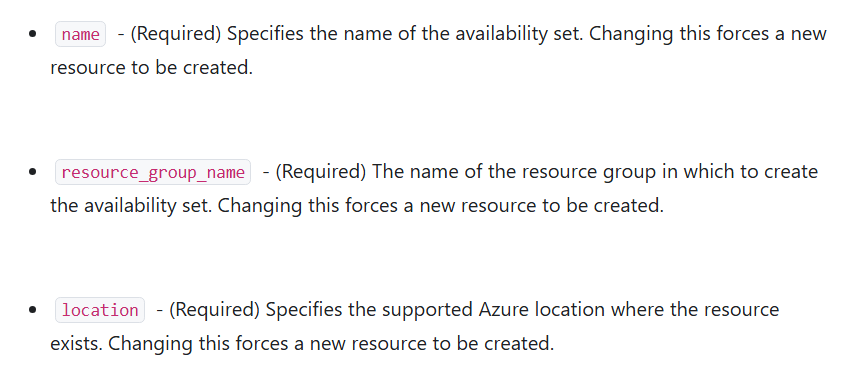

  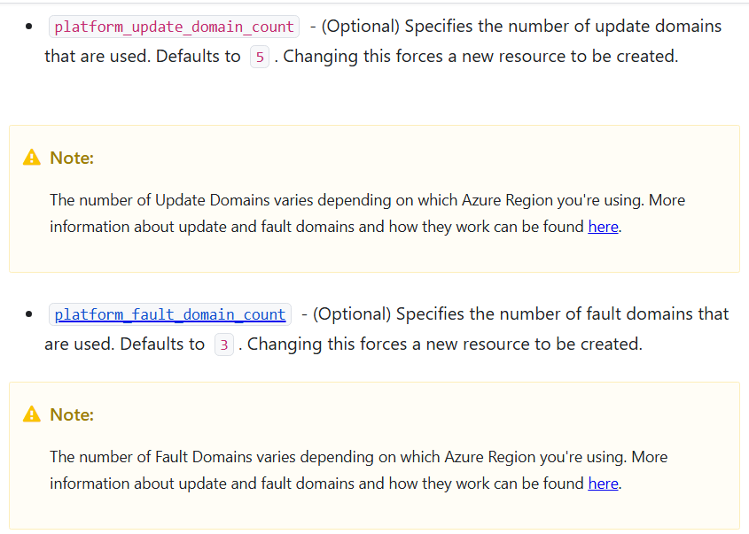

  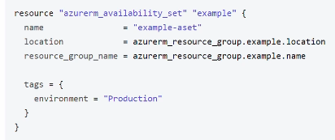

  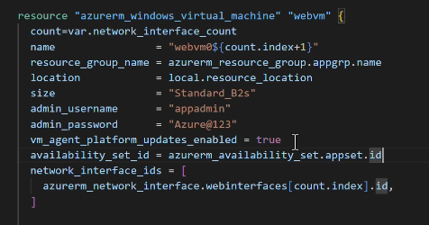

  

`Availability Zone`

- An availability zone is Group of data centers.

  

  

  `zone` : 1,2,3

  

## Azure Key Vault

- Stores
  - Secrets
  - Encryption Keys
  - Certificates


### Soft Delete vs Purge Protection

Example

Suppose you delete a cryptographic key from a vault:

With soft delete enabled

1. You delete the key
2. The key moves to a "deleted" state.
3. You can recover it within the retention period (for example, 90 days).
4. An authorized user may still be able to purge (permanently remove) it before the retention period ends.

With soft delete + purge protection enabled

1. You delete the key.
2. The key moves to the deleted state.
3. You can recover it during the retention period.
4. Nobody can permanently purge it until the retention period expires.
5. After the retention period, the service removes it automatically.

| Feature                                    | Soft Delete                                         | Purge Protection                                                        |
| ------------------------------------------ | --------------------------------------------------- | ----------------------------------------------------------------------- |
| Purpose                                    | Allows recovery of deleted items                    | Prevents permanent deletion during retention period                     |
| What happens when deleted?                 | Item is marked as deleted and retained for a period | Item remains in the soft-deleted state and cannot be permanently erased |
| Can it be restored?                        | Yes, during the retention period                    | Yes, during the retention period                                        |
| Can it be permanently deleted immediately? | Usually yes, if purge is allowed                    | No, purge is blocked until retention period expires                     |
| Main protection against                    | Accidental deletion                                 | Malicious or accidental permanent deletion                              |


`Permission Model`

In Azure we use RBAC permission model

´´´
resource "azurerm_key_vault" "example" {
name = "examplekeyvault"
location = azurerm_resource_group.example.location
resource_group_name = azurerm_resource_group.example.name
rbac_authorization_enabled = false
enabled_for_disk_encryption = true
tenant_id = data.azurerm_client_config.current.tenant_id
soft_delete_retention_days = 7
purge_protection_enabled = false

sku_name = "standard"

access_policy {
tenant_id = data.azurerm_client_config.current.tenant_id
object_id = data.azurerm_client_config.current.object_id

    key_permissions = [
      "Get",
    ]

    secret_permissions = [
      "Get",
    ]

    storage_permissions = [
      "Get",
    ]

}
}
´´´


The are two ways of Authorization in key vault

- RBAC
- Access Policy

| Feature                | Access Policies                                  | Azure RBAC                             |
| ---------------------- | ------------------------------------------------ | -------------------------------------- |
| Authorization scope    | Key Vault only                                   | Azure-wide authorization model         |
| Permission assignment  | Individual permissions (Get, List, Delete, etc.) | Roles (e.g., Key Vault Secrets User)   |
| Management             | Configured inside Key Vault                      | Managed through Azure IAM              |
| Granularity            | Fine-grained per operation                       | Role-based, can be scoped              |
| Integration            | Legacy model                                     | Recommended modern model               |
| Separation of duties   | Limited                                          | Better support                         |
| Consistency with Azure | Separate experience                              | Same model used across Azure resources |


In case you need to create secrets in the key vault using terraform Application Object, you need to assign the `Secret Officer` Role to the Application Object on the Key Vault Resource


## Using Variables as Object

`variables.tf`


`dev.tfvars`


`main.tf`


## Using Data Sources

In case we need to refer in terraform menifest file a pre-existing resource like key-vault, that is not terraform managed resource.

`Usee Data Block`


## Create Azure Key Vault Secret

```
resource "azurerm_key_vault_secret" "example" {
    name = "secret-sauce"
    value = "szechuan"
    key_vault_id = azurerm_key_vault.example.id
}
```


`Refer secret from Key Vault in VM`


In an enterprise Terraform setup, the usual pattern is:

- Generate or provide the password once.
- Store it in Azure Key Vault.
- Read it from Key Vault whenever infrastructure needs it.
- Never prompt for it during normal pipeline runs.
- Prevent Terraform from recreating it unless explicitly intended.

### Option 1: Terraform generates the password once (common)

```
resource "random_password" "vm_admin" {
  length  = 24
  special = true
}

resource "azurerm_key_vault_secret" "vm_admin_password" {
    name         = "vm-admin-password"
    value        = random_password.vm_admin.result
    key_vault_id = azurerm_key_vault.main.id
}
```

Use it in the VM:

```
resource "azurerm_windows_virtual_machine" "vm" {
    name                = "vm01"
    admin_username      = "adminuser"
    admin_password      = azurerm_key_vault_secret.vm_admin_password.value
}
```

Why it doesn't regenerate every run

The random_password value is stored in Terraform state
On subsequent runs:

```
terraform plan
```

Terraform sees the resource already exists in state and keeps the same password.

This is why the Terraform state backend must be durable (Azure Storage Account with remote state).

### Option 2: Security team manually creates the secret (very common in enterprises)

```
data "azurerm_key_vault_secret" "vm_admin_password" {
  name         = "vm-admin-password"
  key_vault_id = azurerm_key_vault.main.id
}
```

Use it:

```
resource "azurerm_windows_virtual_machine" "vm" {
  admin_username = "adminuser"
  admin_password = data.azurerm_key_vault_secret.vm_admin_password.value
}
```

Advantages:

- Password lifecycle owned by security team.
- Terraform never knows how the password was generated.
- Password rotation can happen outside Terraform.

Many regulated enterprises prefer this model.

So in each subscription-dev/test/prod, we have separate resource group, shared-resources having (Pre-Existing)

- storage account to store the terraform state
- key vault with secret

## Terraform vs Ansible

- Terraform : Infrastructure management
- Ansible : Configuration management

## Custom Script Extension (CSE) in Virtual Machine

CSE : Allow you to run scripts when the VM is first created or `bootstrap` your new machine with application like webserver.

- Set up webserver with default home page

## Build VM with webserve using Terraform

1. Create Bootstrap script

   `Powershell.ps1`

   

   

2. Store the `Bootstrap` powershell script into the Storage Account

   

3. Install the CSE in VM with Script

   

   

## Dynamic Block

`Problem Statement`

Long Security Rules list


`Solution`

Dynamic Block


## Reading a local file


## Build a linux machine with Nginx Web Server

Similar to IIS web Service on Windows.

We can install different package on Linux VM, one of the package is NGiNX

### Enterprise-standard approaches

`Linux`

1. Store the script in a separate file

```
terraform/
├── main.tf
├── variables.tf
├── linux/
│   └── bootstrap.sh.tpl (bootstrap.sh)
└── windows/
    └── bootstrap.ps1.tpl
```

```
# bootstrap.sh.tpl
#!/bin/bash

apt-get update
apt-get install -y nginx
```

```
custom_data = base64encode(
  templatefile("${path.module}/linux/scripts/bootstrap.sh.tpl", {
    environment = var.environment
  })
)
```

This works because Linux VMs can execute shell scripts (often via cloud-init).

So the rule of thumb is:

```
No Terraform variables needed
        ↓
bootstrap.sh
        ↓
file()

Terraform variables needed
        ↓
bootstrap.sh.tpl
        ↓
templatefile()
```

## Linux based machine


`Make sure to disable the password authentication`

## Provisioners

Used to execute actions on local or remote machine

`To have default.html page`


## Azure Bastion


1. AzureBastionSubnet

   

2. PublicIPAddress

   

3. Bastion

   

4. Connect to the VM using Bastion

   

## Azure Load Balancer


- Frontend IP
  - Public IP 1
  - Public IP 2
- Backend Pool
  - Virual Machine A
  - Virual Machine B
  - Virual Machine C
- Health Probe
  - endpoint : /
  - Port :
- Loadbalancing Rules
  - Frontend IP
  - Frontend Port
  - Backend Pool
  - Backend Port
  - Health Probe
  - Session Persistence

## Terraform Modules

Module : Reusable Code.


Each module folder has

- main.tf
- variables.tf
- outputs.tf

`main.tf`

```

module "acr" {
  source              = "./modules/containers/acr"
  resource_group_name = azurerm_resource_group.rg.name
  region              = var.region
  tags                = var.tags
}

```

The main module can not access the data in the child modules

## How information is passed ffrom one module to another

Using output

1. From sending module make sure you output that information into a variable.

   

2. In the receiving module, declare the variable and pass the information as variable

   

   

3. Use it in the reciving resource

   


### Azure Loadbalancer connect to the private ip address of virtual machine.

## VM Scaleset


- You define scaling conditions


Load Balancer

- Backend Pool
  - VMs
  - Scaleset

## Azure Traffic Manager

DNS based Global Load Balancer


- Create Traffic Manager Profile
  - Configure
    - Request Type : Priority/Weighted
    - Protocol: HTTP/HTTPS(choose)/TCP
    - Port : 80/443(select)/<custom>
    - PATH : /
  - Endpoints
    - Endpoint Type
      - Azure Endpoint
      - External Endpoint
      - Target Resource Type
        - Cloud Service
        - App Service
        - App Service Slot
        - IP Address
      - Target Resource
      - Custom Header
        - host:<App Service Endpoint>.azurewebsite.net

      https://<name>.trafficmanager.net

`variables.tf`


`modules/web/main.tf`


`main.tf`


| Feature                 | Azure Load Balancer    | Application Gateway | Traffic Manager | Azure Front Door        |
| ----------------------- | ---------------------- | ------------------- | --------------- | ----------------------- |
| Layer                   | L4 (TCP/UDP)           | L7 (HTTP/HTTPS)     | DNS             | L7 (HTTP/HTTPS)         |
| Scope                   | Regional               | Regional            | Global          | Global                  |
| Traffic Path            | In path                | In path             | DNS only        | In path                 |
| WAF                     | No                     | Yes                 | No              | Yes                     |
| SSL Termination         | No                     | Yes                 | No              | Yes                     |
| URL Routing             | No                     | Yes                 | No              | Yes                     |
| Global Failover         | No                     | Limited             | Yes             | Yes                     |
| CDN/Edge Acceleration   | No                     | No                  | No              | Yes                     |
| Private Backend Support | Limited                | Yes                 | N/A             | Yes (Premium)           |
| Best For                | Network load balancing | Regional web apps   | DNS routing     | Global web applications |

I would choose Traffic Manager when I need DNS-based global routing or failover and don't need a reverse proxy. I would choose Front Door for global HTTP/HTTPS applications where I need the traffic to pass through an Azure edge service for features such as Layer-7 routing, WAF, TLS termination, caching, and acceleration.

| Your requirement                            | Usually consider    |
| ------------------------------------------- | ------------------- |
| Global web application                      | **Front Door**      |
| Global HTTP/HTTPS + WAF                     | **Front Door**      |
| Global HTTP/HTTPS + edge acceleration       | **Front Door**      |
| Simple DNS failover                         | **Traffic Manager** |
| DNS-based geographic routing                | **Traffic Manager** |
| DNS-based priority routing                  | **Traffic Manager** |
| Need actual HTTP request inspection/routing | **Front Door**      |

Traffic Manager = DNS traffic director
Front Door = global web traffic proxy

```

                         Traffic Manager
                         /              \
                        /                \
                       ↓                  ↓
                Front Door A        Front Door B
                Primary platform   DR platform
                       |                  |
                +------+-----+      +-----+------+
                |            |      |            |
              Region 1    Region 2 Region 3   Region 4
```

## Application Gateway


So Application Gateway based on the URL, direct the request to desired backend Pool

Application Gateways uses its dedicated subnet to provision resources that perform the routing


```
                         Internet
                            |
                            v
                     Azure Front Door
                      GLOBAL L7
                            |
              +-------------+-------------+
              |                           |
              v                           v
       West Europe                   East US
       REGIONAL                     REGIONAL
              |                           |
      Application Gateway          Application Gateway
          (optional)                  (optional)
              |                           |
       Azure Load Balancer         Azure Load Balancer
              |                           |
          VM1  VM2 VM3               VM4 VM5 VM6
```

If you need URL routing/WAF at the regional level, you need to have Application Gateway (Mandatory) before Azure Load Balancer

```
                         GLOBAL
                           │
                           ▼
                  ┌─────────────────┐
                  │  Azure Front    │
                  │     Door        │
                  │ Global L7/WAF   │
                  └────────┬────────┘
                           │
              ┌────────────┴────────────┐
              │                         │
              ▼                         ▼
       WEST EUROPE                  EAST US
        REGIONAL                    REGIONAL
              │                         │
       ┌──────▼──────┐           ┌──────▼──────┐
       │Load Balancer│           │Load Balancer│
       └──────┬──────┘           └──────┬──────┘
              │                         │
        ┌─────┼─────┐             ┌─────┼─────┐
        ▼     ▼     ▼             ▼     ▼     ▼
       VM1   VM2   VM3           VM4   VM5   VM6
        │     │     │             │     │     │
      AZ1   AZ2   AZ3           AZ1   AZ2   AZ3
```

```
                         USERS
                           │
                           ▼
                    Azure Front Door
                   Global HTTP/HTTPS
                    WAF / Routing
                           │
             ┌─────────────┴─────────────┐
             │                           │
             ▼                           ▼
       WEST EUROPE                    EAST US
       App Service                   App Service
       Web App                       Web App
             │                           │
       Multiple instances          Multiple instances
```

So we dont not need Application Gateway in front of WebApp

```
❌ Front Door
      ↓
  Application Gateway
      ↓
  App Service
```

- Front Door → global traffic
- App Service → regional web hosting/scaling
- Application Gateway → optional; use when you have a specific regional gateway requirement
- Traffic Manager → generally unnecessary if Front Door is already your global web entry point.-

```
                    Traffic Manager
                          |
              +-----------+-----------+
              |                       |
              v                       v
       App Gateway East         App Gateway West
              |                       |
        +-----+-----+             +---+-----+
        |           |             |         |
      /api        /web          /api       /web
        |           |             |         |
      VMSS        VMSS          VMSS      VMSS
```

```
                    Internet
                       |
                       v
                Traffic Manager
                 (DNS routing)
                       |
              +--------+--------+
              |                 |
              v                 v
       App Gateway A      App Gateway B
              |                 |
       +------+------+    +-----+------+
       |      |      |    |     |      |
      VM1    VM2    VM3  VM4   VM5    VM6
```


## What is a Landing Zone?

A Landing Zone is a pre-configured cloud environment that provides the

- Foundational infrastructure
- Governance
- Security controls
- Networking
- Operational capabilities

Required for an organization to

- safely and
- consistently

deploy workloads in the cloud.

## Landing Zone Components

1. Identity and access management
2. Network architecture (hub-spoke, shared services, connectivity)
3. Security controls and policies
4. Logging and monitoring
5. Compliance and governance standards
6. Account/subscription/project structure
7. Shared platform services

## What is an Application Landing Zone?

An Application Landing Zone (ALZ) is a cloud environment specifically designed and provisioned for a particular application. It inherits the organization’s standards and controls from the Landing Zone.

## Application Landing Zone Components

1. Application-specific networking
2. Compute resources (VMs, containers, serverless services)
3. Databases and storage
4. Secrets and key management
5. Application monitoring and alerting
6. CI/CD integrations
7. Application-specific security configurations

The goal is to provide a ready-to-use environment where a specific application can be deployed and managed while remaining compliant with organizational standards.

| Aspect     | Landing Zone                                                                                             | Application Landing Zone                                                                        |
| ---------- | -------------------------------------------------------------------------------------------------------- | ----------------------------------------------------------------------------------------------- |
| Definition | Enterprise cloud foundation that establishes standards, governance, and shared services.                 | Environment tailored for a specific application or workload.                                    |
| Purpose    | Enable secure and scalable cloud adoption across the organization.                                       | Enable deployment and operation of an individual application.                                   |
| Scope      | Organization-wide.                                                                                       | Application-specific.                                                                           |
| Ownership  | Cloud platform/central infrastructure team.                                                              | Application or product team.                                                                    |
| Includes   | Identity, networking, security, governance, monitoring, shared services, account/subscription structure. | Compute, databases, storage, application networking, monitoring, secrets, deployment pipelines. |
| Reuse      | Shared by multiple applications.                                                                         | Usually created per application or workload.                                                    |
| Dependency | Independent foundational layer.                                                                          | Built on top of the Landing Zone.                                                               |


