## What is DevOps

`What`

DevOps is a set of (PPT) = principles, practices and tools.

`Goal`

To deliver software faster, more reliably, and with higher quality

`How`

- By improving collaboration across the Dev and Ops Teams
- Automating repetitive tasks.

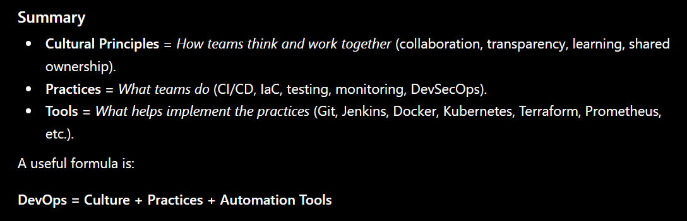

### End-to-End DevOps Lifecycle

| Stage   | Key Activities                   | Typical Tools              |
| ------- | -------------------------------- | -------------------------- |
| Plan    | Requirements, backlog management | Jira, Azure Boards         |
| Code    | Development and version control  | Git, GitHub, GitLab        |
| Build   | Compile and package applications | Maven, Gradle, npm         |
| Test    | Automated quality checks         | JUnit, Cypress, Playwright |
| Release | Prepare deployments              | Jenkins, GitHub Actions    |
| Deploy  | Deploy to environments           | Argo CD, Kubernetes        |
| Operate | Run and manage systems           | Kubernetes, AWS            |
| Monitor | Metrics, logs, tracing, alerts   | Prometheus, Grafana, ELK   |
| Improve | Postmortems and optimization     | Confluence, Jira           |

### Here's a structured table that maps DevOps cultural principles, practices, objectives, and common tools.

| Category                     | Principle / Practice             | Purpose                                         | Common Tools                                 |
| ---------------------------- | -------------------------------- | ----------------------------------------------- | -------------------------------------------- |
| **Culture**                  | Collaboration & Shared Ownership | Break down silos between Dev, Ops, QA, Security | Jira, Confluence, Slack, Microsoft Teams     |
| **Culture**                  | Blameless Postmortems            | Learn from incidents without assigning blame    | Confluence, Notion, Incident.io              |
| **Culture**                  | Continuous Learning              | Improve skills, processes, and systems          | Internal wikis, learning platforms           |
| **Culture**                  | Customer-Centric Development     | Deliver value faster based on user feedback     | Product analytics tools                      |
| **Culture**                  | Transparency & Visibility        | Share system status and progress openly         | Grafana, Jira dashboards                     |
| **Source Control**           | Version Control                  | Track and manage code changes                   | Git, GitHub, GitLab, Bitbucket               |
| **CI**                       | Continuous Integration           | Automatically build and test code changes       | Jenkins, GitHub Actions, GitLab CI, CircleCI |
| **CD**                       | Continuous Delivery              | Keep software release-ready                     | GitHub Actions, GitLab CI, Azure DevOps      |
| **CD**                       | Continuous Deployment            | Automatically deploy validated changes          | Argo CD, Flux CD, Spinnaker                  |
| **Testing**                  | Automated Unit Testing           | Verify individual components                    | JUnit, NUnit, pytest, Jest                   |
| **Testing**                  | Integration Testing              | Verify interactions between services            | Postman, Testcontainers                      |
| **Testing**                  | End-to-End Testing               | Validate complete user workflows                | Selenium, Cypress, Playwright                |
| **Build Management**         | Build Automation                 | Compile, package, and prepare releases          | Maven, Gradle, npm                           |
| **Artifact Management**      | Artifact Repository              | Store build outputs and dependencies            | Nexus, Artifactory                           |
| **Containerization**         | Application Packaging            | Ensure consistent runtime environments          | Docker, Podman                               |
| **Orchestration**            | Container Management             | Manage containers at scale                      | Kubernetes, OpenShift                        |
| **Infrastructure as Code**   | Infrastructure Provisioning      | Manage infrastructure through code              | Terraform, OpenTofu, CloudFormation          |
| **Configuration Management** | Server Configuration             | Ensure environment consistency                  | Ansible, Chef, Puppet                        |
| **Secrets Management**       | Secure Credentials               | Manage passwords, tokens, certificates          | Vault, AWS Secrets Manager                   |
| **Observability**            | Metrics Monitoring               | Measure system health                           | Prometheus, Datadog                          |
| **Observability**            | Visualization & Dashboards       | Visualize operational metrics                   | Grafana, Kibana                              |
| **Logging**                  | Centralized Logging              | Aggregate and analyze logs                      | ELK Stack, Loki, Splunk                      |
| **Observability**            | Distributed Tracing              | Track requests across services                  | Jaeger, Zipkin, OpenTelemetry                |
| **Alerting**                 | Incident Detection               | Notify teams of issues                          | PagerDuty, Opsgenie                          |
| **Incident Management**      | Incident Response                | Coordinate recovery activities                  | ServiceNow, Incident.io                      |
| **Security (DevSecOps)**     | Static Code Analysis             | Detect vulnerabilities in code                  | SonarQube, Checkmarx                         |
| **Security (DevSecOps)**     | Dependency Scanning              | Identify vulnerable libraries                   | Snyk, Dependabot                             |
| **Security (DevSecOps)**     | Container Scanning               | Scan container images                           | Trivy, Clair                                 |
| **Security (DevSecOps)**     | Compliance Automation            | Enforce policies automatically                  | Open Policy Agent (OPA), Kyverno             |
| **Cloud**                    | Infrastructure Hosting           | Run applications and services                   | AWS, Azure, Google Cloud                     |
| **SRE**                      | Service Level Objectives (SLOs)  | Define reliability targets                      | Prometheus, Grafana                          |
| **SRE**                      | Error Budgets                    | Balance reliability and feature delivery        | SRE processes and tooling                    |

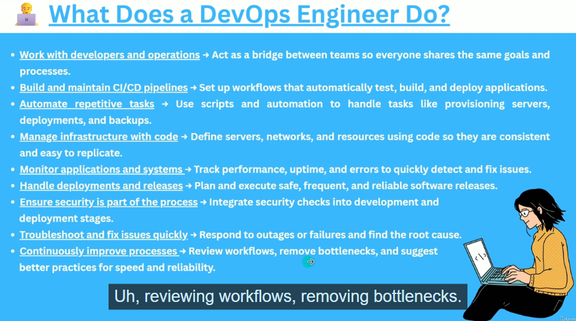

## AWS Networking

## VPC and Subnet (Azure : vNet and Subnet)

- Virtual Private Cloud (Isolated network in AWS)
- Subnets (Sub Networks within a VPC)
  - Public Subnet
    - For resources that need to be accessible from the Internet
  - Private Subnet
    - For resources that should stay hidden (like Databases)

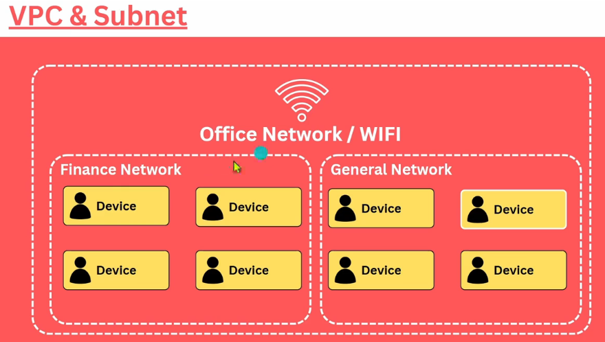

## IP Address and CIDR Block

| Private Network | CIDR Notation    | IP Range                        | Number of Addresses |
| --------------- | ---------------- | ------------------------------- | ------------------- |
| Class A Private | `10.0.0.0/8`     | `10.0.0.0 – 10.255.255.255`     | 16,777,216          |
| Class B Private | `172.16.0.0/12`  | `172.16.0.0 – 172.31.255.255`   | 1,048,576           |
| Class C Private | `192.168.0.0/16` | `192.168.0.0 – 192.168.255.255` | 65,536              |

### Examples

| Device           | Private IP    |
| ---------------- | ------------- |
| Home Router      | 192.168.1.1   |
| Laptop           | 192.168.1.100 |
| Corporate Server | 10.10.20.15   |
| Cloud VM         | 172.16.5.20   |

```
Laptop (192.168.1.100)
        ↓
Router/NAT (Public IP: 203.0.113.25)
        ↓
Internet
```

- Public Address are unique, but Private IP address are not
- Each device has an IP (like an Address), they use the IP to communicate to each other, privately using private IP and publically / via internet using Public IP

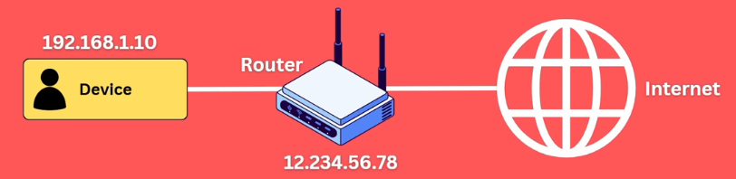

### CIDR Block = IP Address range

CIDR = 10.0.0.0/16
CIDR = 172.16.0.0/16
CIDR = 192.168.0.0/16

```
IP Address:   10.0.0.0
              ↓
Binary:       00001010.00000000.00000000.00000000
              └──── Network ────┘└──── Host ─────┘
                  16 bits            16 bits
```

| Item                | Value                     |
| ------------------- | ------------------------- |
| Network             | `10.0.0.0/16`             |
| Network bits        | 16                        |
| Host bits           | 16                        |
| Total addresses     | `2^16 = 65,536`           |
| Network address     | `10.0.0.0`                |
| Broadcast address   | `10.0.255.255`            |
| Usable host range\* | `10.0.0.1 – 10.0.255.254` |
| Subnet mask         | `255.255.0.0`             |

- 10.0.0.0/16 = 265536 Addresses
- 10.0.1.0/14 = 256 Addresses

## Route Table and Internet Gateway

|                        | **Route Table**                                                    | **Internet Gateway (IGW)**                             |
| ---------------------- | ------------------------------------------------------------------ | ------------------------------------------------------ |
| What is it?            | A set of routing rules                                             | A VPC component that connects to the Internet          |
| Main job               | **Decides where traffic goes**                                     | **Allows Internet connectivity**                       |
| Contains               | Destination + target                                               | Doesn't contain routing rules                          |
| Example                | `0.0.0.0/0 → igw-1234`                                             | `igw-1234`                                             |
| Associated with        | Subnet                                                             | VPC                                                    |
| Does it route traffic? | Yes, by selecting the next hop                                     | Acts as the Internet-facing gateway                    |
| Public subnet?         | A subnet becomes public when its route table has a route to an IGW | Required for IPv4 Internet access from a public subnet |
| Security filtering?    | No                                                                 | No                                                     |
| Example tool           | AWS Route Table                                                    | AWS Internet Gateway                                   |

Suppose you have:

```
VPC: 10.0.0.0/16

Public Subnet: 10.0.1.0/24

EC2:
10.0.1.10
```

Your route table might contain:

```
Destination       Target
--------------------------------
10.0.0.0/16       local (=local router)
0.0.0.0/0         igw-123456
```

So if your EC2 wants to access:

```
8.8.8.8
```

The route table checks:

```
8.8.8.8
   ↓
Does 10.0.0.0/16 match? ❌
   ↓
Does 0.0.0.0/0 match? ✅
   ↓
Send to Internet Gateway
```

Important: An IGW alone doesn't make a subnet public

You need the pieces together:

```
VPC
 │
 ├── Internet Gateway
 │
 └── Route Table
       │
       └── 0.0.0.0/0 → IGW
              │
              ▼
          Public Subnet
              │
              ▼
             EC2
```

For a typical public EC2 instance:

A public IP can't be used to access the Internet, so device must have a public IP

Public IP + Route Table route to IGW + Internet Gateway = Internet connectivity

### What if you only give EC2 a public IP?

```
EC2
  │
  ├── Private IP: 10.0.1.10
  └── Public IP: 54.x.x.x

Route table:
  10.0.0.0/16 → local
  ❌ No 0.0.0.0/0 → IGW
```

The EC2 has a public IP, but there is no route telling its subnet to send Internet traffic to the Internet Gateway.

So the public IP alone isn't enough.

To have public and private subnets in a VPC, we should have subnet level Route Table.

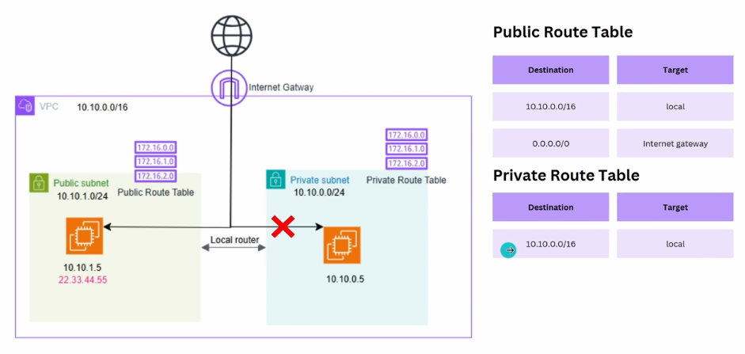

There are two common ways for a VM in a VPC to access the Internet:

| Method                      | VM Public IP? | Route                     | Gateway           |
| --------------------------- | ------------: | ------------------------- | ----------------- |
| **Direct Internet access**  |        ✅ Yes | `0.0.0.0/0 → IGW`         | Internet Gateway  |
| **Private outbound access** |         ❌ No | `0.0.0.0/0 → NAT Gateway` | NAT Gateway → IGW |

```
      VM
Private IP only
       │
       ▼
    Route Table
0.0.0.0/0 → NAT Gateway
       │
       ▼
  NAT Gateway
       │
       ▼
 Internet Gateway
       │
       ▼
    Internet
```

Easy rule to remember

```
Public subnet + Public IP + IGW → direct Internet access

Private subnet + Private IP + NAT Gateway + IGW → outbound Internet access
```

Once you create subnet specific route table, they dont follow the main route table

## Security Group (Azure - NSG)

A Security Group (SG) is a virtual firewall that controls network traffic to and from resources such as EC2 instances.

```
Security Group = Firewall for your EC2 instance
```

```
Internet
    │
    ▼
Internet Gateway
    │
    ▼
Route Table
    │
    ▼
Security Group
    │
    ▼
   EC2
```

The route table decides where traffic goes, while the security group decides whether the traffic is allowed.

| Feature                   | Security Group                        |
| ------------------------- | ------------------------------------- |
| Type                      | Virtual firewall                      |
| Applied to                | ENI/EC2 and other supported resources |
| Stateful?                 | ✅ Yes                                |
| Inbound rules             | ✅                                    |
| Outbound rules            | ✅                                    |
| Allow rules               | ✅ Only                               |
| Explicit deny rules       | ❌                                    |
| Default inbound           | Deny                                  |
| Default outbound          | Allow                                 |
| Can reference another SG? | ✅                                    |

|               | Route Table                  | Security Group                   |
| ------------- | ---------------------------- | -------------------------------- |
| Main question | **Where should traffic go?** | **Should traffic be allowed?**   |
| Example       | `0.0.0.0/0 → IGW`            | `TCP 443 → Allow`                |
| Works at      | Subnet level                 | Network interface/resource level |
| Firewall?     | ❌                           | ✅                               |
| Stateful?     | N/A                          | ✅                               |

For an EC2 to be accessible from the Internet, you generally need:

```
                Internet
                    │
                    ▼
            Internet Gateway
                    │
                    ▼
              Route Table
           0.0.0.0/0 → IGW
                    │
                    ▼
              Public Subnet
                    │
                    ▼
            Security Group
             TCP 80 → Allow
                    │
                    ▼
                  EC2
```

Public IP → identifies the VM on the Internet

Route Table → determines the path

Internet Gateway → connects VPC to Internet

Security Group → controls whether traffic is allowed

## NACL

| Feature                  | **Security Group (SG)**                              | **Network ACL (NACL)**          |
| ------------------------ | ---------------------------------------------------- | ------------------------------- |
| Full name                | Security Group                                       | Network Access Control List     |
| Works at                 | **Instance / Network Interface** level               | **Subnet** level                |
| Stateful?                | ✅ **Yes**                                           | ❌ **No — stateless**           |
| Rules                    | **Allow only**                                       | **Allow + Deny**                |
| Inbound rules            | ✅                                                   | ✅                              |
| Outbound rules           | ✅                                                   | ✅                              |
| Rule processing          | All applicable rules                                 | **Lowest rule number first**    |
| Default behavior         | Default SG allows outbound; inbound initially denied | Default NACL allows all traffic |
| Return traffic           | Automatically allowed                                | Must be explicitly allowed      |
| Can block a specific IP? | ❌ No explicit deny                                  | ✅ Yes                          |
| Common use               | Instance-level security                              | Subnet-level traffic filtering  |
| Association              | Attached to ENI/resource                             | Associated with subnet          |


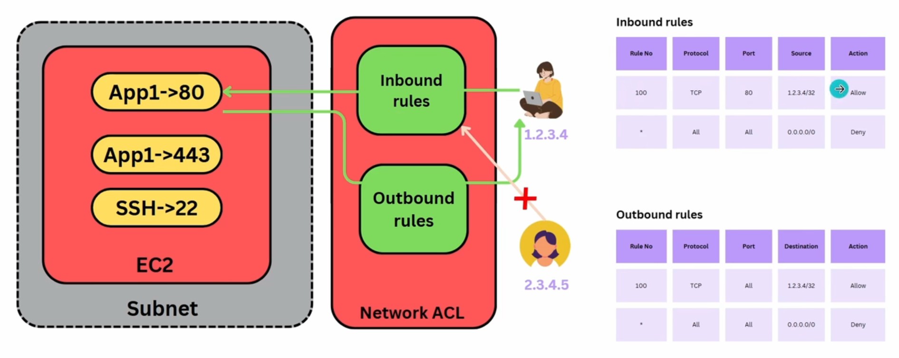

| AWS                      | Azure equivalent                 | Scope        | Purpose                          |
| ------------------------ | -------------------------------- | ------------ | -------------------------------- |
| **Security Group (SG)**  | **Network Security Group (NSG)** | NIC / Subnet | Allow/deny network traffic       |
| **NACL**                 | **No exact equivalent**          | —            | —                                |
| **AWS Network Firewall** | **Azure Firewall**               | Network/VNet | Advanced centralized firewalling |

## NAT Gateway

A NAT Gateway allows a private VM to initiate outbound Internet connections without giving the VM a public IP.

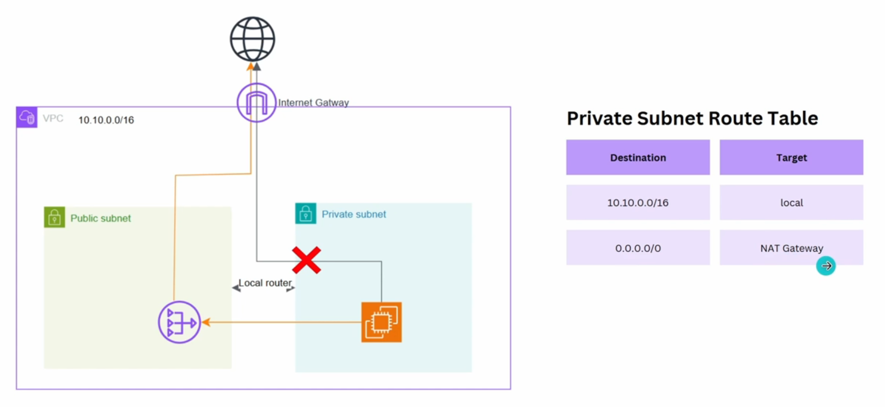

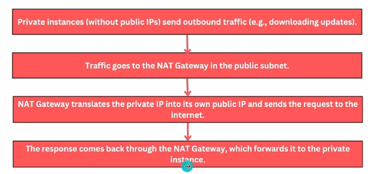

NAT Gateway need to be in the public Subnet

| Concept                                 | AWS                                | Azure                              |
| --------------------------------------- | ---------------------------------- | ---------------------------------- |
| Outbound Internet for private resources | **NAT Gateway**                    | **NAT Gateway**                    |
| Main purpose                            | Outbound Internet connectivity     | Outbound Internet connectivity     |
| Private VM needs public IP?             | ❌ No                              | ❌ No                              |
| Inbound Internet connections            | ❌ Not allowed through NAT Gateway | ❌ Not allowed through NAT Gateway |
| Works with                              | VPC subnet                         | VNet subnet                        |
| Public IP required                      | Yes                                | Yes                                |
| Stateful                                | ✅                                 | ✅                                 |

## AWS - Azure

| AWS              | Azure                                                                                             |
| ---------------- | ------------------------------------------------------------------------------------------------- |
| VPC              | VNet                                                                                              |
| Subnet           | Subnet                                                                                            |
| EC2              | Azure VM                                                                                          |
| Security Group   | NSG                                                                                               |
| NACL             | No direct equivalent                                                                              |
| Internet Gateway | No exact 1:1 equivalent; Azure VNet provides Internet connectivity through Azure's infrastructure |
| NAT Gateway      | **NAT Gateway**                                                                                   |
| Route Table      | Route Table / UDR                                                                                 |
| Elastic IP       | Public IP                                                                                         |
| IAM              | Microsoft Entra ID + Azure RBAC                                                                   |
| CloudWatch       | Azure Monitor                                                                                     |
| CloudFormation   | ARM/Bicep                                                                                         |
| ECS/EKS          | Azure Container Apps / AKS                                                                        |

## Create IAM User

User Types

- Root User
- IAM User
  - Name : AdminUser
  - Policy : `Administrator Access` (Root Access - (Account & Billing) related access)

| AWS                                 | Azure                                                                     |
| ----------------------------------- | ------------------------------------------------------------------------- |
| Organization                        | Management Group                                                          |
| Organizational Unit (OU)            | Management Group (or nested Management Groups)                            |
| AWS Account                         | Azure Subscription                                                        |
| VPC                                 | Virtual Network (VNet)                                                    |
| Subnet                              | Subnet                                                                    |
| Route Table                         | Route Table (UDR - User Defined Route)                                    |
| Internet Gateway                    | No direct 1:1 equivalent (Internet access is built into Azure networking) |
| NAT Gateway                         | NAT Gateway                                                               |
| Security Group                      | Network Security Group (NSG)                                              |
| NACL                                | No direct equivalent                                                      |
| EC2                                 | Virtual Machine (VM)                                                      |
| AMI                                 | VM Image                                                                  |
| Auto Scaling Group                  | Virtual Machine Scale Set (VMSS)                                          |
| Elastic Load Balancer (ELB/ALB/NLB) | Azure Load Balancer / Application Gateway                                 |
| EBS                                 | Managed Disk                                                              |
| S3                                  | Blob Storage                                                              |
| EFS                                 | Azure Files                                                               |
| RDS                                 | Azure SQL Database / Azure Database Services                              |
| DynamoDB                            | Cosmos DB                                                                 |
| Lambda                              | Azure Functions                                                           |
| IAM User/Role                       | Microsoft Entra ID User/Group/Service Principal                           |
| CloudWatch                          | Azure Monitor                                                             |
| CloudTrail                          | Azure Activity Log                                                        |
| Systems Manager (SSM)               | Azure Automation / Azure Arc                                              |
| CloudFormation                      | ARM Templates / Bicep                                                     |
| ECS / EKS                           | AKS (Azure Kubernetes Service)                                            |
| Secrets Manager                     | Azure Key Vault                                                           |
| AWS Account                         | Azure Subscription                                                        |
| Resource Groups (AWS service)       | Resource Group                                                            |

#### Note

- AWS Create a default VPC in all the regions

## When Choose a Region, consider

1. Target Audience
2. AWS Service Availability
3. Pricing
4. Legal Requirement - GDPR (Data reside inside Europe only)

### AWS and Azure Subnet Difference

| Feature                                         | AWS                                     | Azure                             |
| ----------------------------------------------- | --------------------------------------- | --------------------------------- |
| VPC/VNet spans multiple AZs?                    | ✅ Yes                                  | ✅ Yes                            |
| Subnet tied to a specific AZ?                   | ✅ Yes                                  | ❌ No                             |
| VM deployed into an AZ?                         | Through a subnet that exists in that AZ | Directly by specifying Zone 1/2/3 |
| Same subnet can contain VMs from different AZs? | ❌ No                                   | ✅ Yes                            |

### AWS

A subnet belongs to exactly one Availability Zone.

```
VPC
│
├── Subnet-A (AZ-a)
│     └── EC2
│
├── Subnet-B (AZ-b)
│     └── EC2
│
└── Subnet-C (AZ-c)
      └── EC2
```

When creating a subnet, you must choose an AZ.

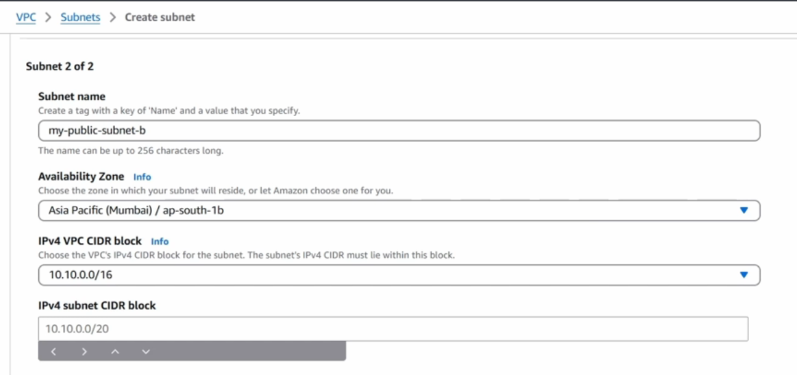

```
10.0.1.0/24 → eu-west-1a
10.0.2.0/24 → eu-west-1b
10.0.3.0/24 → eu-west-1c
```

### Azure

A subnet belongs to a VNet, not to a specific Availability Zone.

Example:

```
VNet
│
└── Subnet-1 (10.0.1.0/24)
      │
      ├── VM1 (Availability Zone 1)
      ├── VM2 (Availability Zone 2)
      └── VM3 (Availability Zone 3)
```

The subnet is regional and can host resources deployed into different zones.

### Why?

AWS networking was originally designed around AZ-specific subnets.

Azure networking is region-scoped, and zone placement is generally specified on the resource itself (VM, managed disk, etc.), not on the subnet.

## Availability Zone

A phycially separated data center withinn AWS region that is designed for High Availability..

### AWS

```
AWS Region
│
└── VPC
    │
    ├── Availability Zone A
    │   ├── Subnet A
    │   │   ├── EC2
    │   │   └── RDS
    │   │
    │   └── Subnet B
    │       └── Resources
    │
    └── Availability Zone B
        └── Subnet C
            └── Resources
```

### Azure

```
Azure Region
│
└── VNet
    │
    └── Subnet
        │
        ├── VM → Availability Zone 1
        ├── VM → Availability Zone 2
        └── VM → Availability Zone 3
```

## Main Route Table

When we create a VPC, a `main route table` is create

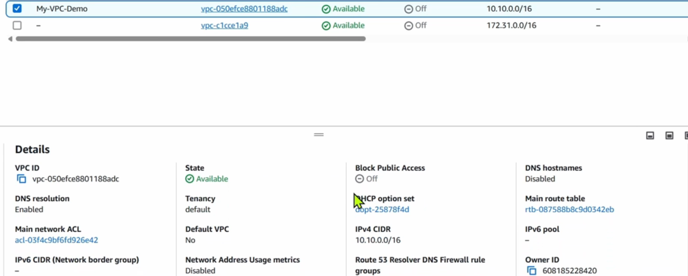

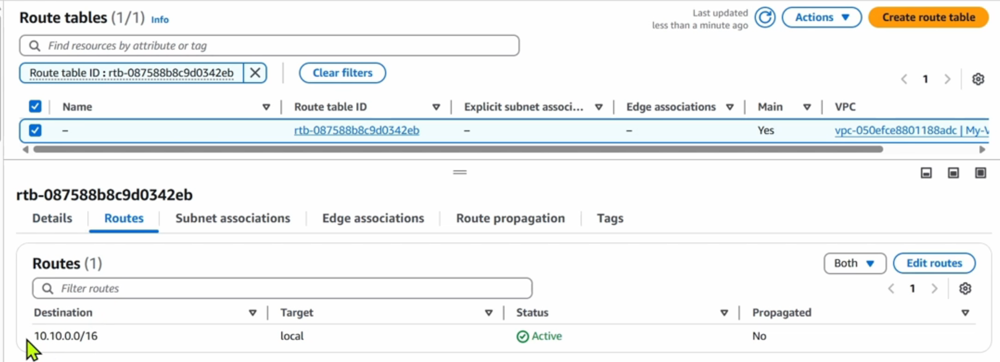

So By default, route table only has routing rule allow within VPC communication only

So by default, subnet is a not a public subnet, they are private subnet.

## How to create a public subnet

Here are the steps:

1. Create an `Internet Gateway` and attacht it to VPC
2. Update the `main route table` and add the `Routing rule` for `Internet Gateway`

   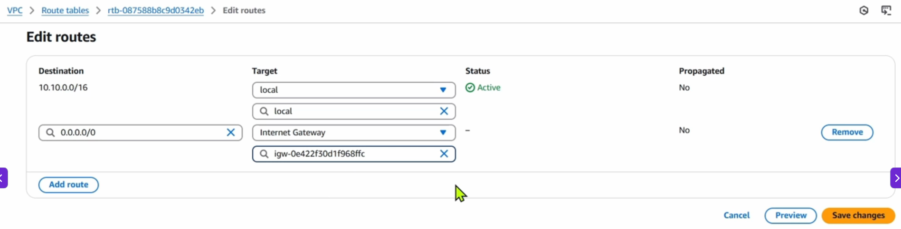

   Better Approach

   Create a new `Route table` and add `Routing rule` for `Internet Gateway`

   

3. Attach the `Routing table` to `Subnet` to make it a `Public Subnet`
4. Enable `Auto Assign Public IP` to resources

### AWS

```
VPC
 │
 ├── Internet Gateway
 │
 ├── Main Route Table
 │     └── 10.0.0.0/16 → local
 │
 ├── Private Subnet
 │     └── uses Main route table
 │
 └── Public Subnet
       └── New Route Table
             ├── 10.0.0.0/16 → local
             └── 0.0.0.0/0 → Internet Gateway
```

A subnet becomes public when its associated route table has a route to an Internet Gateway

### Azure

Azure does not have an AWS-style Internet Gateway that you create and attach to the VNet.

```
Azure Region
    │
    └── VNet
          │
          ├── Subnet-A
          │     └── VM
          │
          └── Subnet-B
                └── VM
```

```
VNet: 10.0.0.0/16

Subnet:
10.0.1.0/24
```

Azure automatically has system routes, including the VNet's own address space and Internet-related system routing.

### No (Internet Gateway) concept in Azure.

### For VM with public Internet access

```
Internet
   │
   ▼
Public IP
   │
   ▼
Azure VM
   │
   └── Subnet
         │
         └── VNet
```

A VM can have a Public IP associated with its network interface/IP configuration.

You don't create an Internet Gateway.

### For Private VM with outbound Internet access

### Azure

```
Private VM
   │
   ▼
Subnet
   │
   ▼
NAT Gateway
   │
   ▼
Public IP
   │
   ▼
Internet
```

### AWS

This is very similar to:

```
AWS:

Private EC2
    ↓
Private Subnet
    ↓
NAT Gateway
    ↓
Internet Gateway
    ↓
Internet
```

### What about Azure Route Tables?

Azure does have route tables.

They are commonly called Route Tables / UDRs (User Defined Routes).

You can create one and associate it with a subnet:

```
Route Table
     │
     └── Associate with Subnet
                 │
                 ├── VM1
                 └── VM2
```

But you don't normally add:

```
0.0.0.0/0 → Internet Gateway
```

Instead, Azure route tables are mainly used when you want to control or override routing, for example:

```
0.0.0.0/0 → Azure Firewall
```

OR

```
10.20.0.0/16 → Virtual Appliance
```
