## Overview

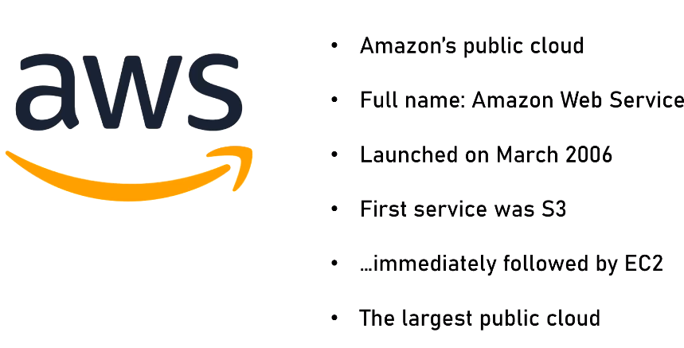

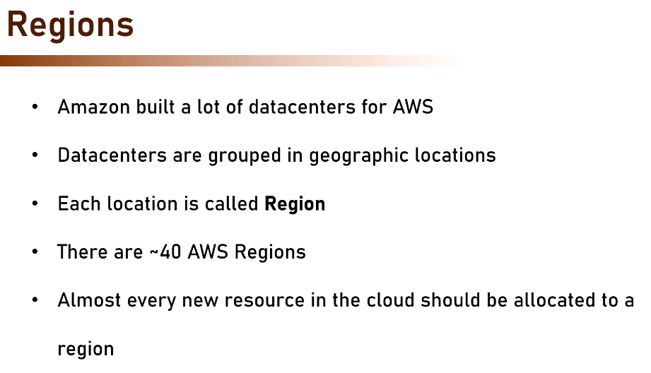

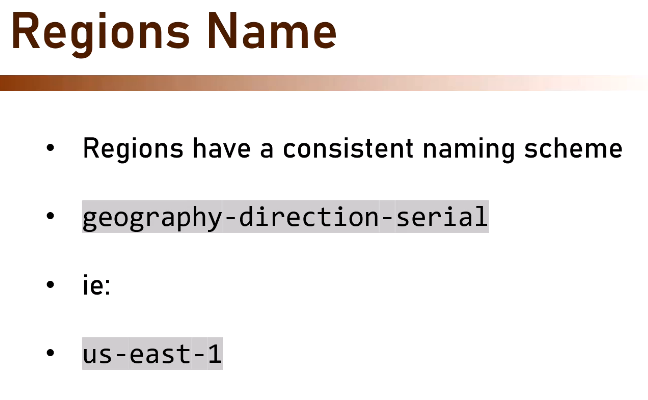

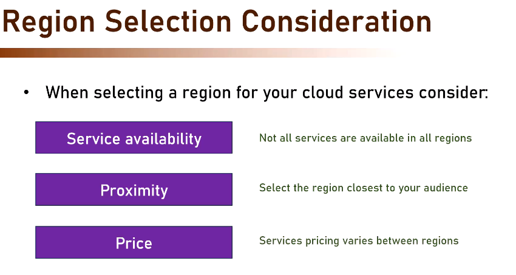

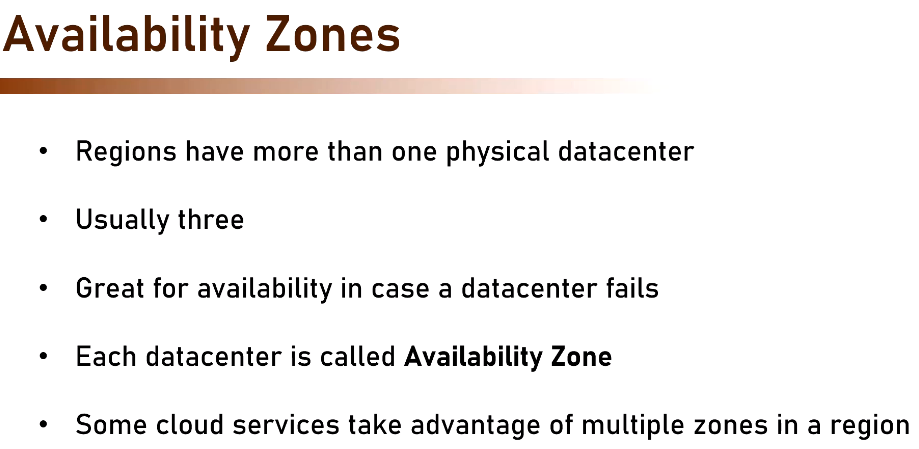

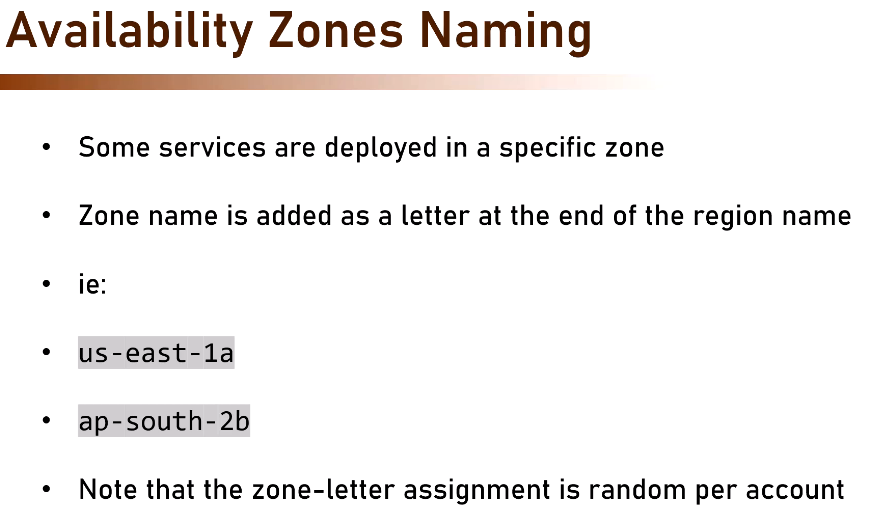

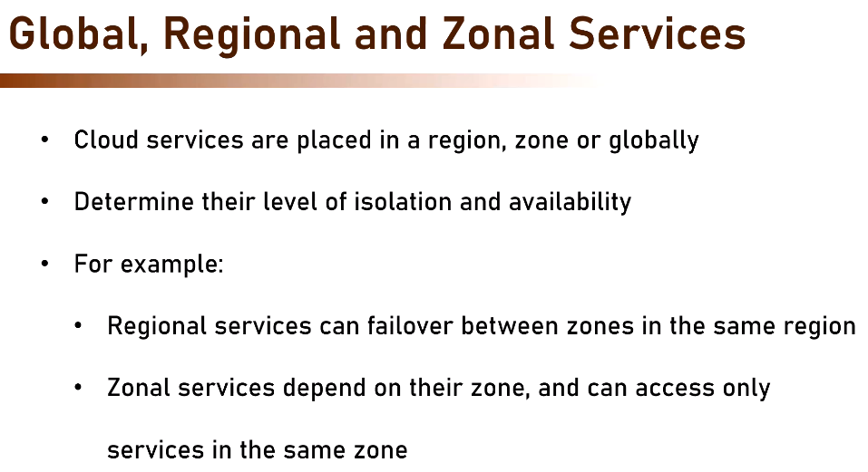

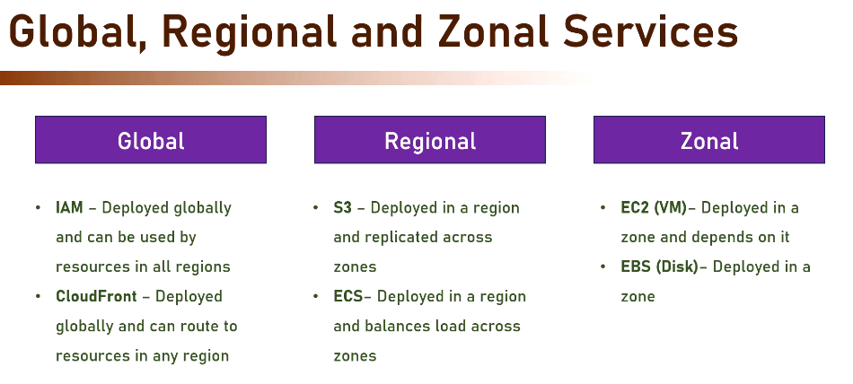

So always check while the service you deploying is global, regional or zonal, so accordingly you can plan
backups

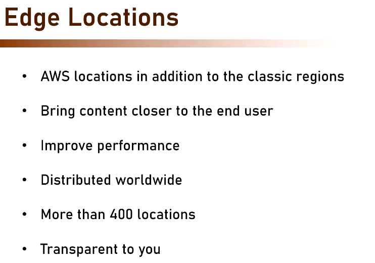

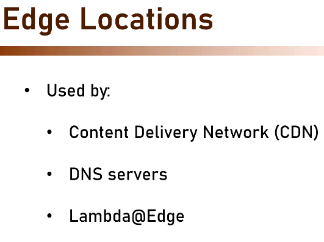

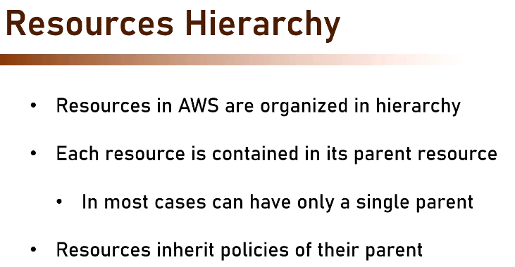

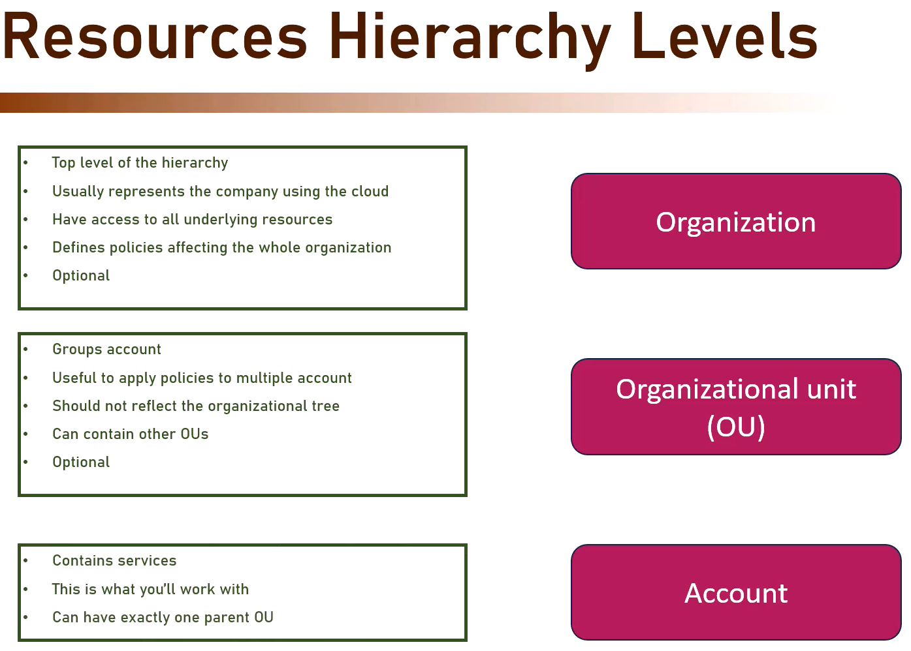

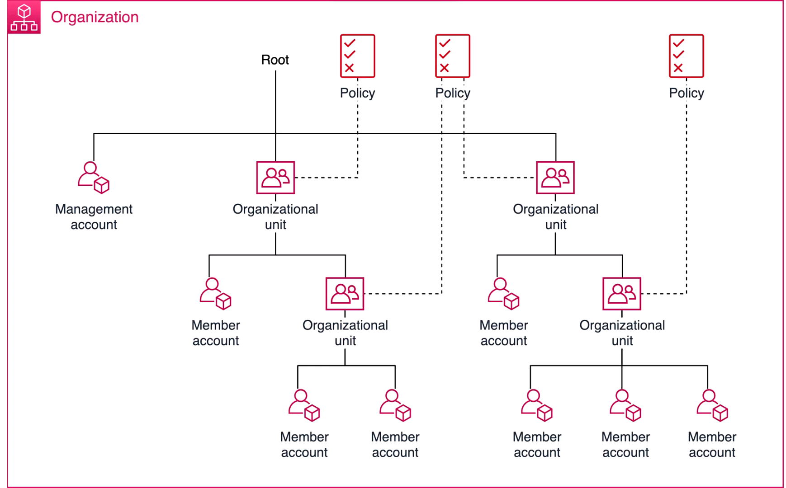

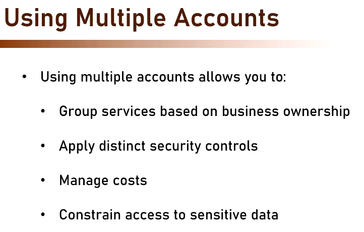

Each Account has it own Authentication and permissions

| AWS                                | Azure                                            | Purpose                                    |
| ---------------------------------- | ------------------------------------------------ | ------------------------------------------ |
| AWS Organization                   | Entra ID Tenant + Management Groups              | Top-level governance and identity          |
| AWS Account                        | Azure Subscription                               | Billing, quotas, and resource boundary     |
| IAM Identity Center / External IdP | Entra ID Tenant                                  | Users, groups, authentication              |
| OU (Organizational Unit)           | Management Group                                 | Organize and govern accounts/subscriptions |
| IAM Role                           | Service Principal / Managed Identity / RBAC Role | Access control                             |
| VPC                                | VNet                                             | Networking                                 |

**Azure Hierarchy**

```
Entra ID Tenant
└── Management Groups
    ├── Subscription (Prod)
    │   ├── Resource Group
    │   │   ├── VM
    │   │   └── Database
    │
    └── Subscription (Dev)
        └── Resource Group
            └── Resources
```

**AWS Hierarchy**

```
Organization
└── Account
    └── Resources
```

- A single Entra ID tenant can contain many subscriptions.
- A subscription belongs to exactly one Entra ID tenant at a time.

**Subscription is where my resources and billing live; Entra ID is where my users and identities live."**

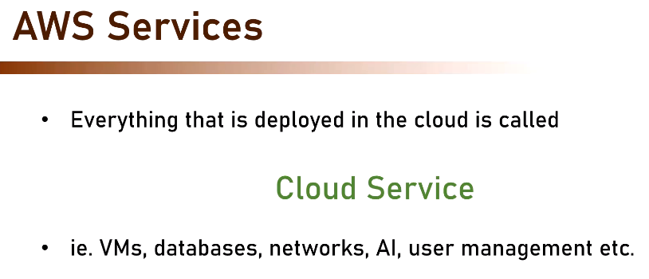

## AWS Account Type

| AWS       | Azure                                                       |
| --------- | ----------------------------------------------------------- |
| Root User | No direct equivalent                                        |
| IAM User  | Entra ID User                                               |
| IAM Role  | Managed Identity / Service Principal / RBAC Role Assignment |

**Biggest Difference**

**AWS**
Identity is often managed inside each AWS Account.

AWS Account A
├── IAM User Alice
└── IAM User Bob

AWS Account B
├── IAM User Alice
└── IAM User Bob

Historically, users could be duplicated across accounts.

**Azure**
Identity is centralized in the tenant.

Entra ID Tenant
├── Alice
├── Bob
└── Management Groups

        │
        ├── Subscription A
        └── Subscription B

Alice exists once in the tenant and can be granted access to many subscriptions.

```
"Alice is an IAM User in AWS Account Prod" = "Alice is an Entra ID User with Contributor/Owner access to the Production Subscription"


"Alice is Root User" = "Alice is Global Administrator or Subscription Owner"
```

But Azure deliberately avoids having a single all-powerful "root account" equivalent to AWS Root User.
