## API Gateway

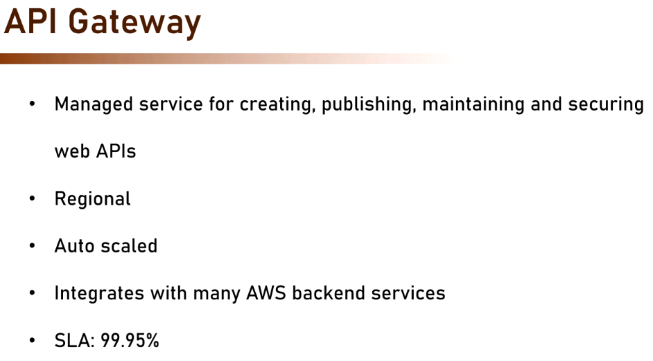

| AWS         | Azure                                          | Purpose                                   |
| ----------- | ---------------------------------------------- | ----------------------------------------- |
| API Gateway | **Azure API Management (APIM)**                | Publish, secure, monitor, and manage APIs |
| Lambda      | **Azure Functions**                            | Serverless compute                        |
| IAM         | **Microsoft Entra ID (Azure AD)**              | Authentication & authorization            |
| CloudWatch  | **Azure Monitor / Application Insights**       | Logging and monitoring                    |
| Cognito     | **Microsoft Entra External ID / Azure AD B2C** | User authentication                       |

## Why we need API Gateway

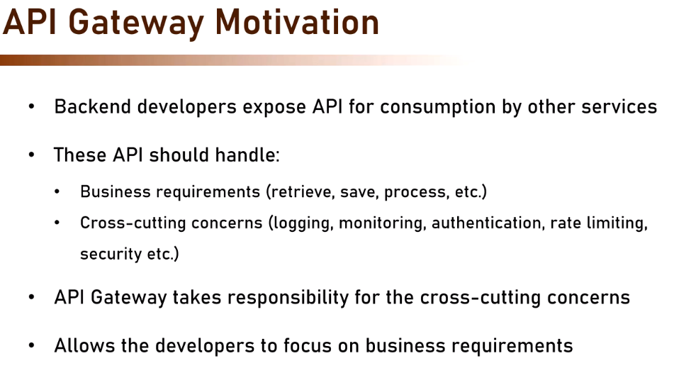

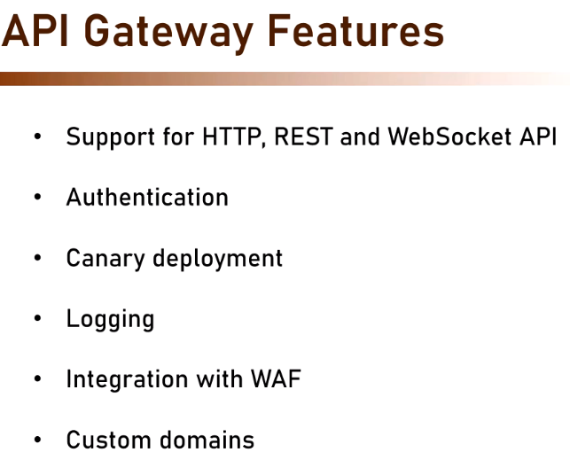

## Type of API Gateway

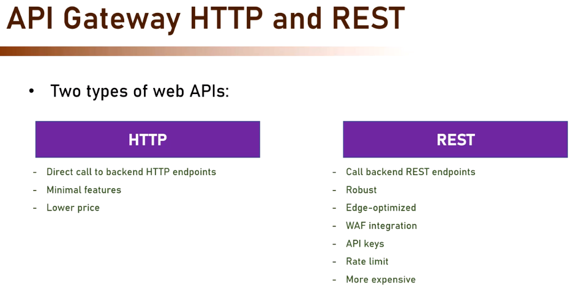

## API Gateway Architecture

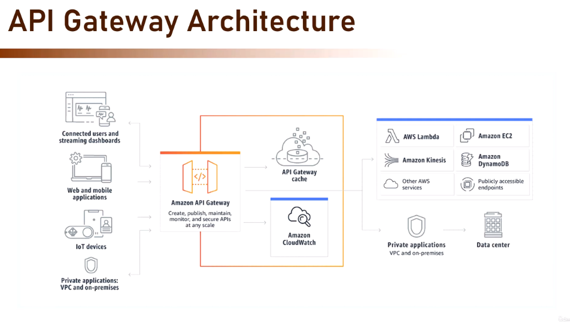

## Pricing

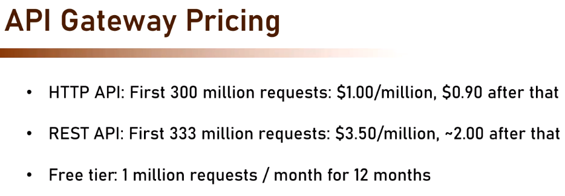

## Connecting AWS Lamdbda to API Gateway

1. Go to API Gateway
   
2. Choose Type of API
   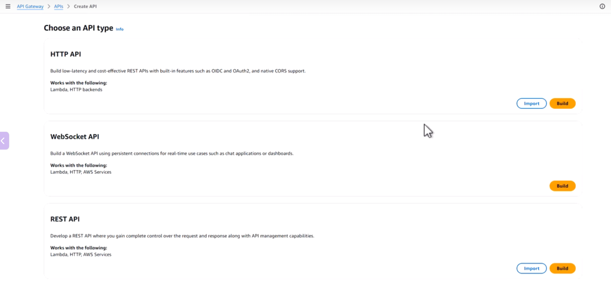
3. Configure API Type : HTTP
   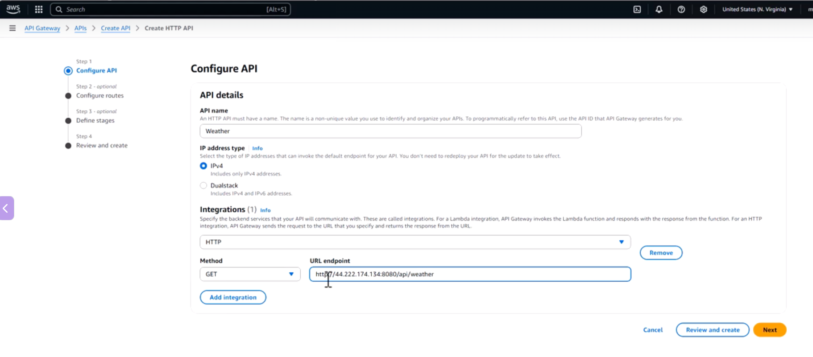
4. Create it and get the URL
   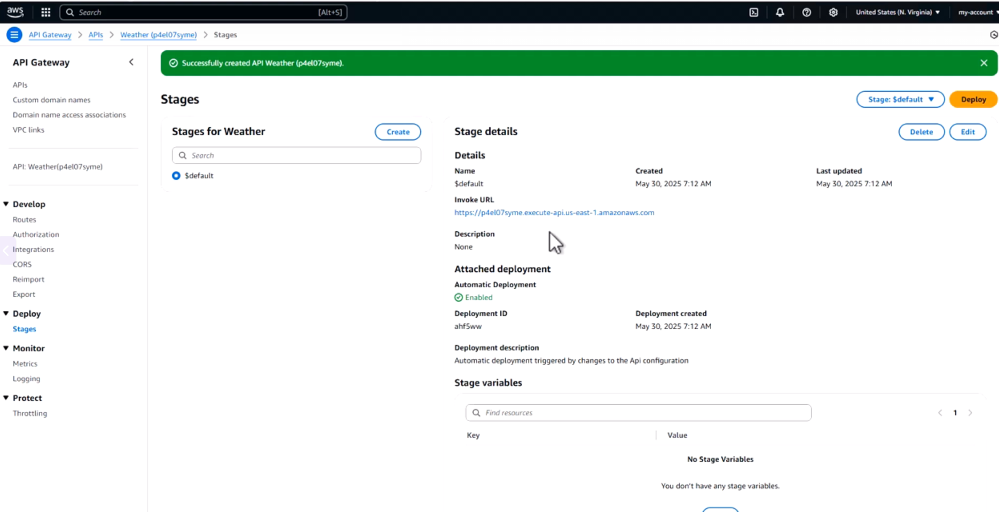
5. For Security, there are two options
   - Create Private Link
     - Most Secure
     - Complicated
   - Create Security Group
     - Only allowed access from the API Gateway IP Address or Security Group
6. Access the backend API using API Gateway URL
   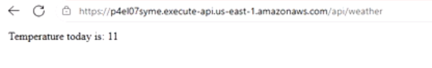

## API Gateway Intgrated to a Lambda Function

1. Go to API Gateway
   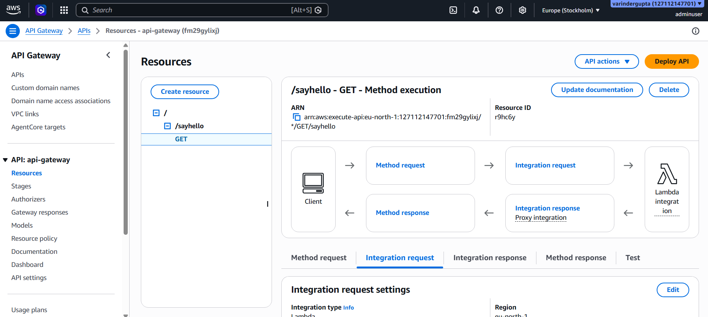

2. Click Integaration request, to check which lambda it is integrated to
   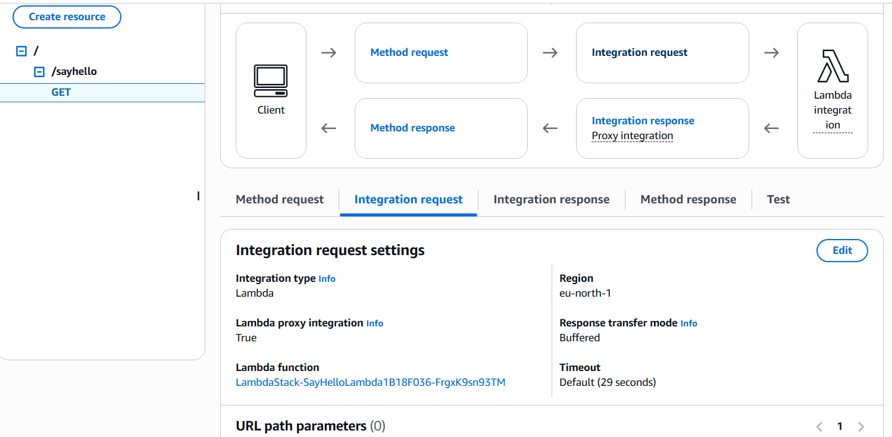

3. Test the API using VS Code (REST API Plugin)
   - Create a file with .http extension
   - Specify the API URL with Method
     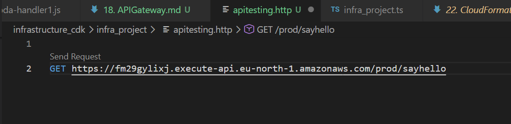
     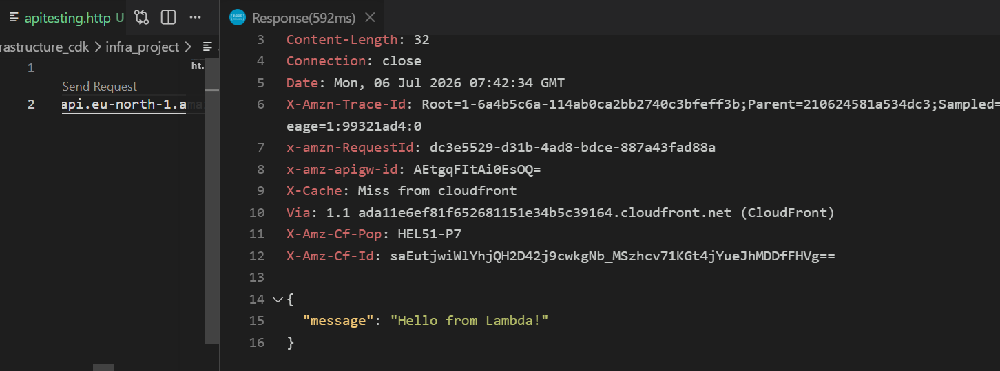
