## AWS Management Console

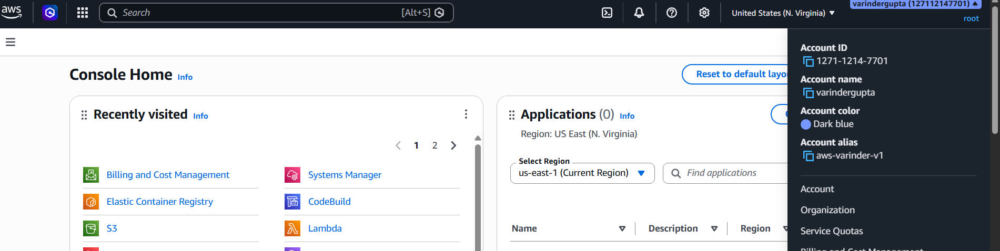

The Management Console - Home Page has

- Account Details
- Organization
  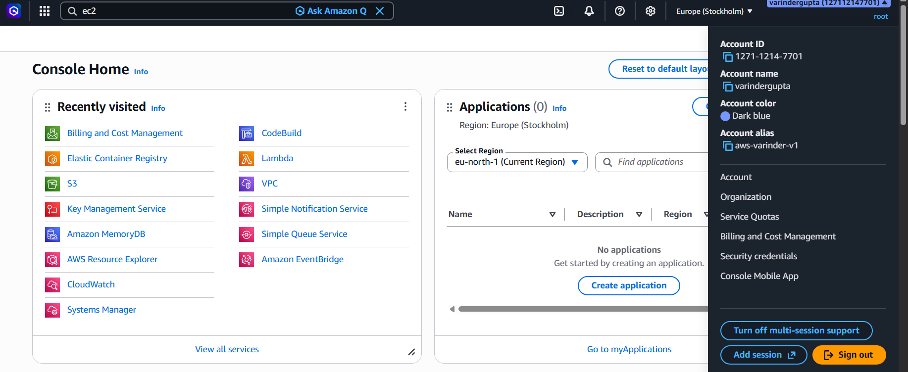
- Default Region
  - So if we create a service without specifying region, it will be created in this default region
- For Finland , the nearest is stockholms (eu-north-1)
  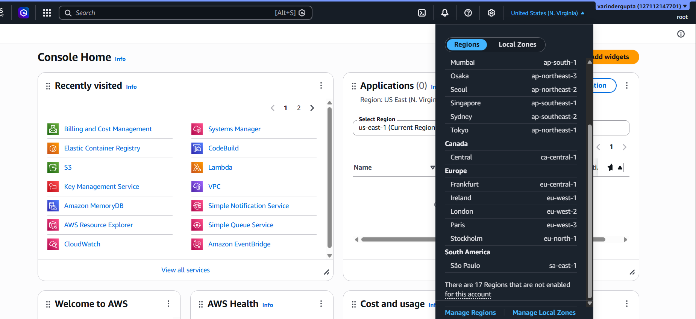
  - Make it default region
    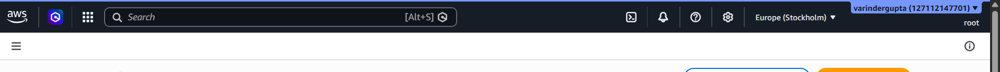
- Language and Color Theme change
  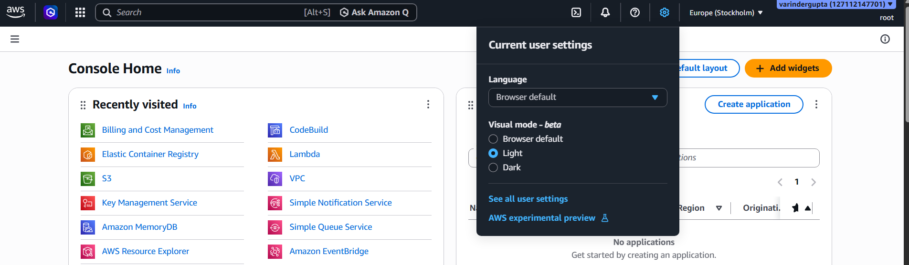
- Notifications : Nofity on any activity we perform.
  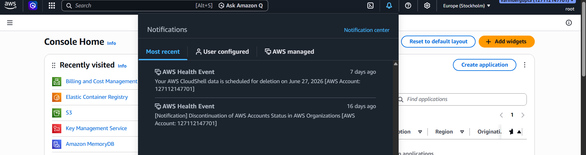
- Cloud Shell
  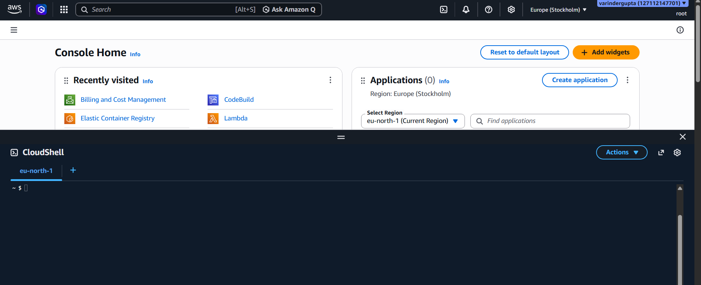
- Search bar
  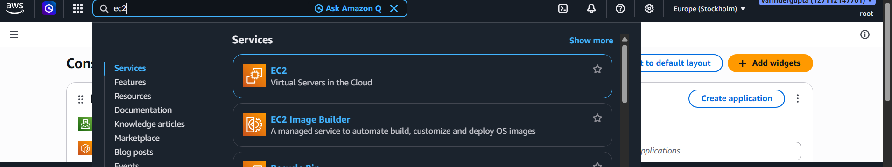
- Services : Offer full list of services
  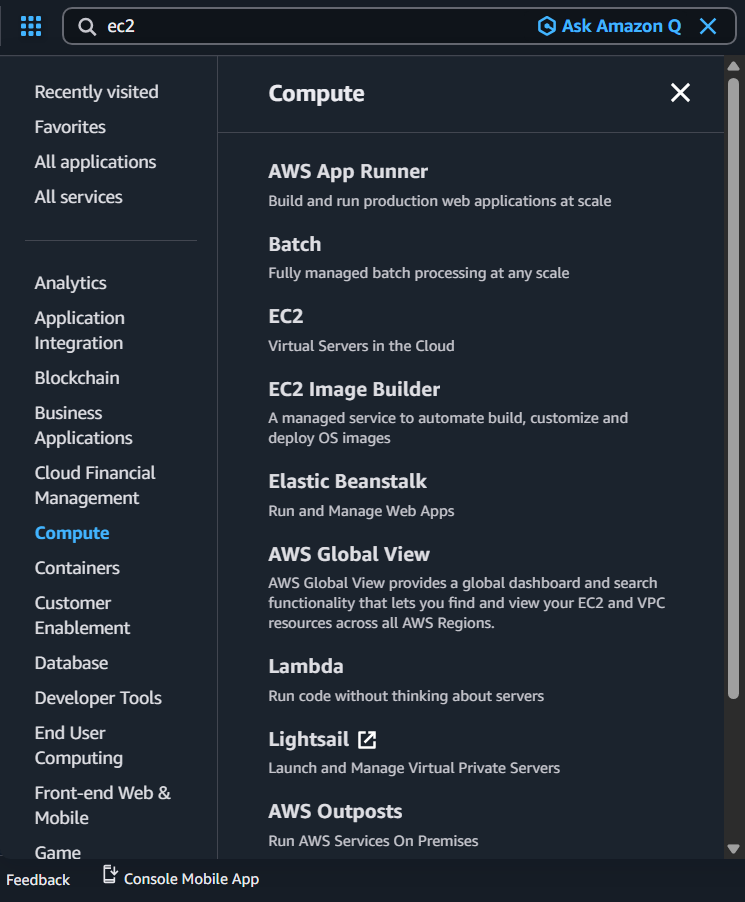
- Home Page : Customizable as per our need
  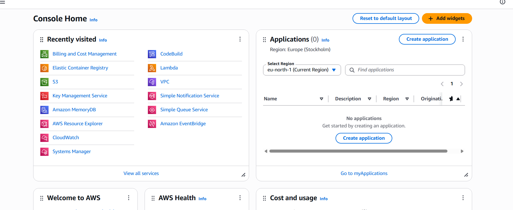
- URL : Note that this URL is using the region. If you're using a different region, change the URL accordingly.
  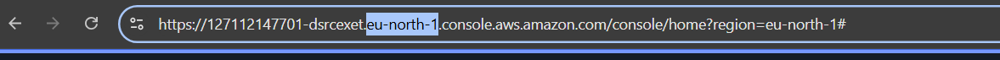

## ARN

- Amazon Resource Name
  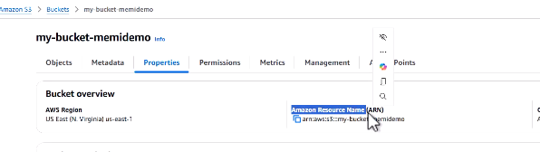

The closest equivalent to an AWS ARN (Amazon Resource Name) in Azure is a Resource ID.

| AWS ARN                          | Azure Resource ID                                         |
| -------------------------------- | --------------------------------------------------------- |
| Unique resource identifier       | Unique resource identifier                                |
| Contains Account ID              | Contains Subscription ID                                  |
| Contains Region                  | Region is stored in resource properties, not always in ID |
| Used in IAM policies             | Used in RBAC, Azure Policy, ARM/Bicep/Terraform           |
| String format starts with `arn:` | String format starts with `/subscriptions/...`            |

```
ARN

arn:aws:s3:::my-bucket
arn:aws:ec2:eu-west-1:123456789012:instance/i-1234567890abcdef

Resource ID

/subscriptions/12345678-1234-1234-1234-123456789abc
```

## How to go back to Management Console - Home Page

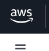
