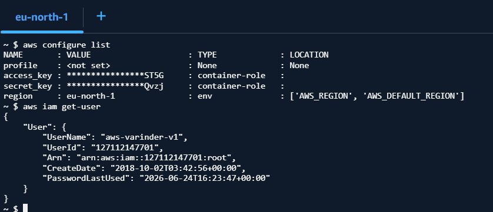

## Cloud Shell

- An integrated CLI ( Command Line Inteface) tool to work with the resources in the AWS Cloud
- It is preconfigured with
  - Git
  - Docker
  - AWS SDK
  - AWS CLI
    - To run "aws commands"
  - 1 GB Persistent Storage
- In the background it create as VM in the background, and configured to access services within the logged in account and 1 GB persistant storage is attached to it that is mapped to the account.
- To Open the cloud shell in a new tab, click

  

```
- aws configure list

# To get User ID, User Name , User ARN
- aws iam get-user
```



## AWS CLI

A tool to run "aws commands", you can download and install it on your machine, to execute "aws command" from local machine to interact with the Azure Account Resources
