## SLA of Service

- Service Level Agreement
- Uptime % of cloud Service
  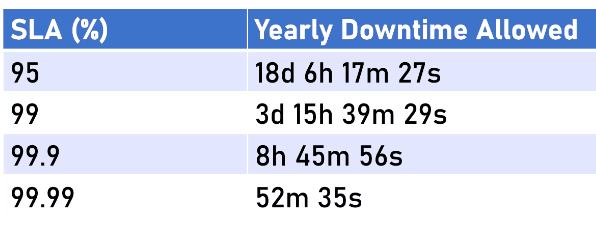
- So always check the service SLA before use
  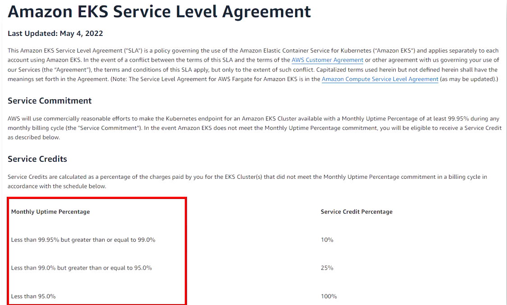
  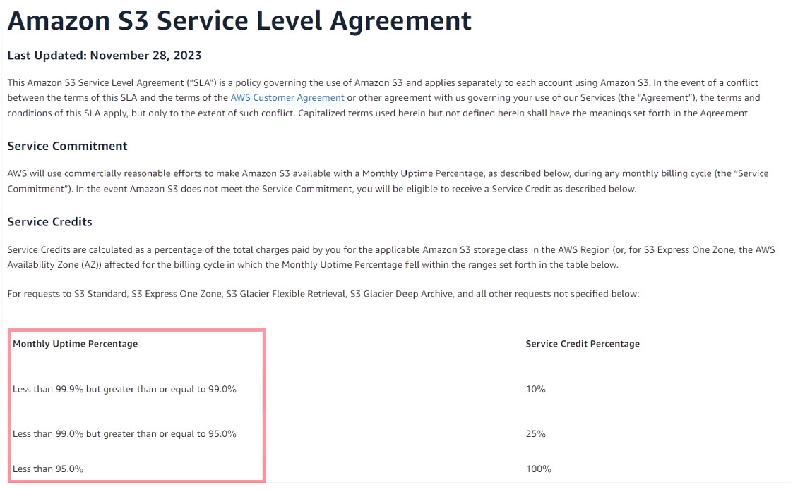

## SLA of Entire System

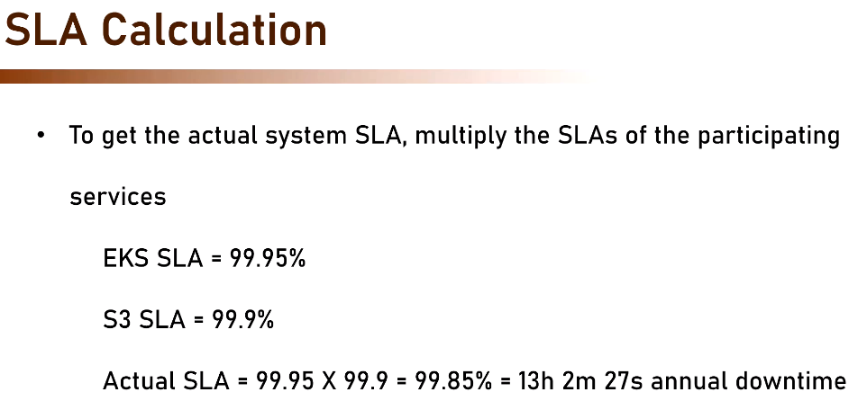

## SLA Calculator

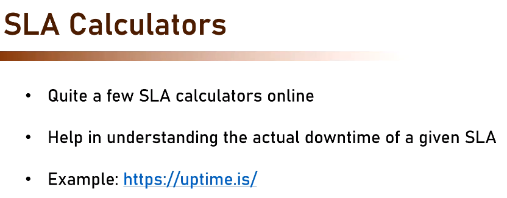

# Service Cost

## DIfferent Pricing Model

- Provisioned based
  - AWS EC2
- Consumption based
  - AWS Lembda
- Reservation - Pay upfront get discount

## AWS Pricing Calculator

Help you estimate the actual cost you gonna pay.

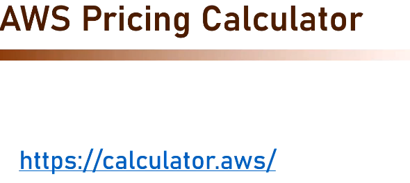

# Setting Budget

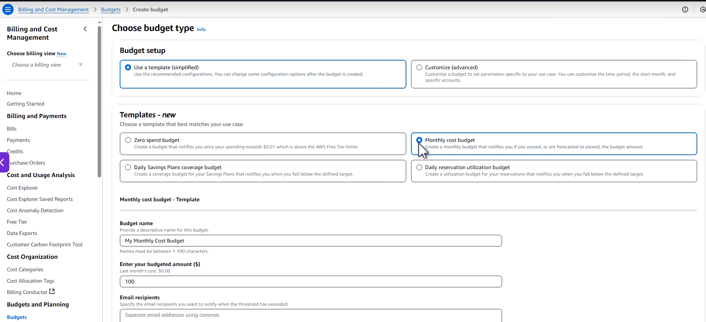
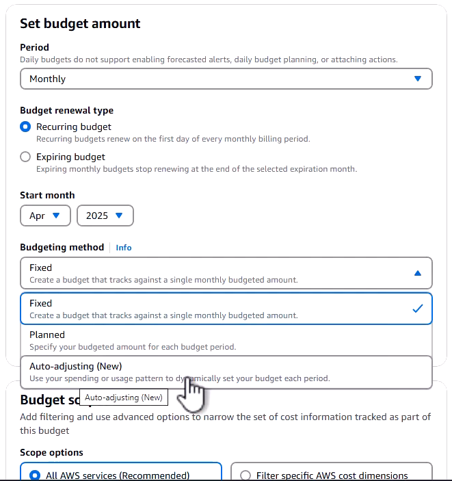
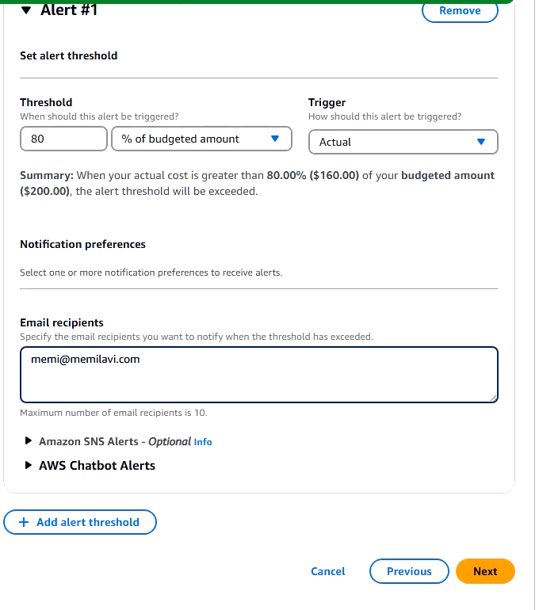

# Software Architect and Cloud

## Traditional Architecture includes

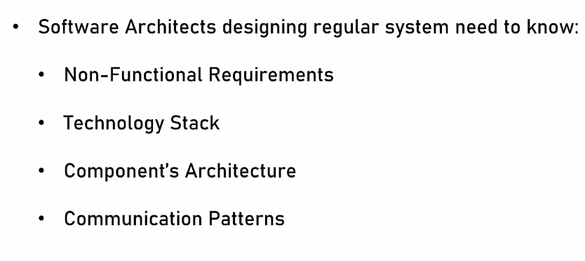

## Cloud based system also requires

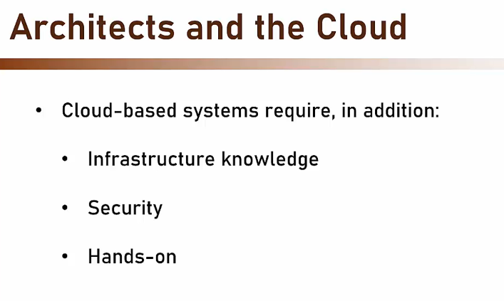
