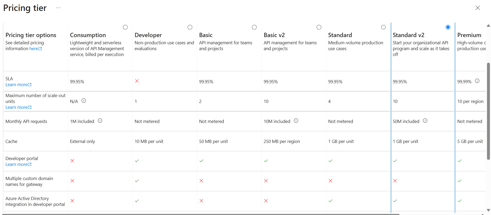

## API Management

- In case you have multiple APIs
  - Customer API (Port:8000)
  - User API (Port:9000)

## Azure API Manager vs Azure Application Gateway

| Feature                        | Azure API Management                           | Azure Application Gateway                      |
| ------------------------------ | ---------------------------------------------- | ---------------------------------------------- |
| Primary Purpose                | API lifecycle management                       | Layer 7 load balancing and web traffic routing |
| Target Audience                | API consumers and developers                   | Web applications and infrastructure teams      |
| Protocols                      | REST, SOAP, GraphQL, WebSocket                 | HTTP, HTTPS, WebSocket                         |
| API Security                   | OAuth, JWT validation, API keys, rate limiting | WAF, SSL termination, URL filtering            |
| Developer Portal               | Yes                                            | No                                             |
| API Versioning                 | Yes                                            | No                                             |
| API Transformation             | Yes (rewrite requests/responses)               | Limited URL/header rewrite                     |
| Analytics                      | Detailed API usage analytics                   | Traffic metrics and diagnostics                |
| Load Balancing                 | No (not primary purpose)                       | Yes                                            |
| Web Application Firewall (WAF) | No                                             | Yes                                            |
| Backend Routing                | Basic                                          | Advanced path-based routing                    |
| Monetization/Subscriptions     | Yes                                            | No                                             |

## When to Use Azure API Management

Use Azure API Management when:

- Exposing APIs to internal, partner, or external developers
- Enforcing API policies
- Managing API versions
- Applying rate limits and quotas
- Validating JWT tokens
- Transforming requests and responses
- Providing a developer portal

## Flow

UI(FrontEnd App) --> API Management --> APIs

Features

- Authenticate requests before they reach to APIs
- Rate Limit of requests
- Publish set of APIs as a Products to customers
  - Customer A can consume Product A (Customer API and Order API)
  - Custeomr B can consume Product B (Order API and Pricing API)

## Create Azure API Management

- Subscription
- Resource Group
- Region
- Organization Name
- Administrator Email
- Pricing Tier:
  - Developer (No SLA)
  - Basic (99.95% SLA)
  - Basic v2 (99.95% SLA)
  - Standard (99.95% SLA)
  - Standard v2 (99.95% SLA)
  - Premium (99.95% or 99.99% SLA)
  - Premium (99.95%)
  - Consumption (99.95% SLA)

    

Azure API Management Developer tier, the good news is that Microsoft currently lists the Developer tier deployment as free of charge.

### Monitor + Secure

- Log Analytics: Disabled (Default)
- Defender for APIs in MS Defender for Cloud : Disabled (Default)
- Application Insight : Disabled (Default)

### Networking

- Private Link : Disabled (Default)
- vNet Integration

### System Assigned Managed Identity

- Status : Disabled (Default)

### Tags

- Key : Value

## Defind APIs in Azure API Management

1. **Add API**

- APIs > APIs
  - Add API
    - gRPC API
    - Socket API
    - HTTP API (Choose)
      - Disply Name : **Order API**
      - Name : order.api
      - Web Service URL : https://< myapi >.azurewebsites.net
      - API Service Suffix : orders (Base URL : < api-management-url>/orders )
      - Products :

2. **Within Added API (Order API), add Operations**
   - Choose (**Order API**)
     - Add Operation
       - Disply Name : Get Orders
       - Name: get.orders
       - URL : GET | /api/orders
       - Description
     - Add Operation
       - Disply Name : Get Order By Id
       - Name: get.orders.id
       - URL : GET | /api/orders/{id}
       - Description
     - Add Operation
       - Disply Name : Add Orders
       - Name: add.orders
       - URL : POST | /api/orders
       - Description
       - Request
         - Add Representation : application/json
         - Sample: JSON example

## Allow Access Only via API Managerment

To access the Backend APIs via ApI managment, you need subscription key, that need to be passed as (Ocp-Apim-Subscription-Key) while making the call.

APIs > Subscription

- Primary Key
- Secondary Key

```
GET < API Management URL >/api/Orders
Key Name : Ocp-Apim-Subscription-Key
Key Value : < key value>
```

Restrict API access via Web App public URL,

1. Go to the Web App
2. Go to Networking
   - Public Network Access
     - Enabling access from all networks
     - Enabling access from selected vNets and Ips (**Enabled**)
     - None

   **Site Access and Rules**
   - Add Rule
     - Name : Allow APIM
     - Action : Allow
       - Allow
       - Deny
     - Priority
     - Description
     - Type : IPV4
     - Value : < **Public IP of APIM** >

## API Management Policy - IP Restriction

- Choose (**Order API**)

Policy can be applied at **API** level as well as **Operation** level

- Policy XML
  - Frontend Policy
  - InBound Policy
    - Add Caller-Filter Policy (Use Snippet)
      - Action : Allowed /Forbid
      - IP Range : _._._._ TO _._._._
  - Backend Policy
  - Output Policy
  - Onerror Policy

## API Management Policy - Rewrite URL

- Choose (**Order API**)

- Choose (**Order Operation**)

- Policy XML
  - Frontend Policy
  - InBound Policy
    - Add Custom Code here for pre-processing for re-write
  - Backend Policy
  - Output Policy
  - Onerror Policy

## API Management Policy - Rate-limit

- Choose (**Order API**)

- Policy XML
  - Frontend Policy
  - InBound Policy
    - Add rate-limit Policy (Use Snippet)
  - Backend Policy
  - Output Policy
  - Onerror Policy

## API Management Policy - Cache

- Choose (**Order API**)

- Policy XML
  - Frontend Policy
  - InBound Policy
    - Add cache-lookup Policy (Use Snippet)
      - Caching-Type : Internal
      - Downstread-caching-Type : None
      - Must-revalidate : True
  - Backend Policy
  - Output Policy
    - Add cache-store Policy (Use Snippet)
      - duration = 30
  - Onerror Policy

## APIM - Virtual Network Integration

UseCase : Backend Private API hosted on a VM within a virtual network
