## Overview

- A Network Resource
- Created inside a Subnet

## Difference between Azure LB and Azure Application Gateway

| Feature                  | Azure Load Balancer  | Azure Application Gateway          |
| ------------------------ | -------------------- | ---------------------------------- |
| OSI Layer                | Layer 4 (TCP/UDP)    | Layer 7 (HTTP/HTTPS/WebSocket)     |
| Traffic Awareness        | Doesn't inspect HTTP | Understands URLs, headers, cookies |
| SSL/TLS Termination      | No                   | Yes                                |
| URL-based Routing        | No                   | Yes                                |
| Host-based Routing       | No                   | Yes                                |
| Web Application Firewall | No                   | Yes (WAF SKU)                      |
| Session Affinity         | Limited              | Cookie-based affinity              |
| Best For                 | Any TCP/UDP workload | Web applications and APIs          |
| Cost                     | Lower                | Higher                             |

**URL Based Routing**

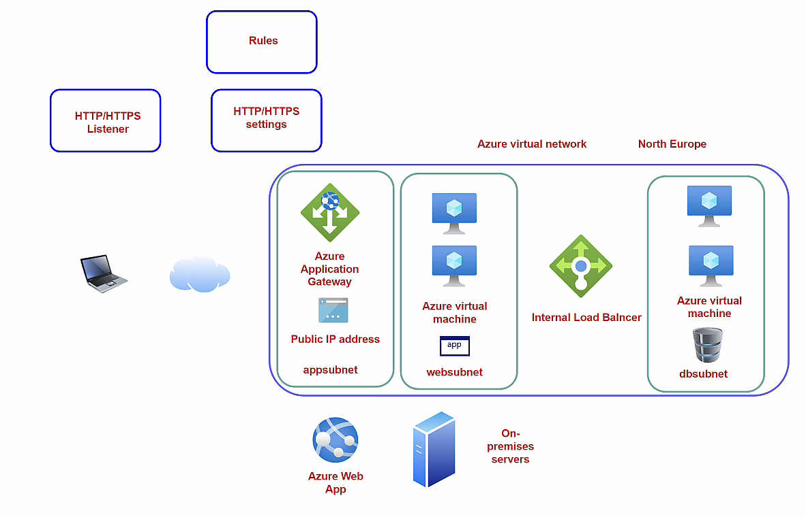

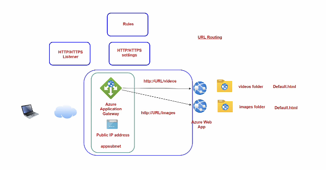

**Domain Based Routing**

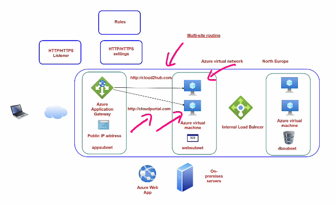

**Azure Public Load Balancer**

Use when you need to distribute network traffic: It only looks at IP addresses and ports.

Examples:

- RDP (3389)
- SSH (22)
- Custom TCP applications
- Game servers
- Database proxies

**Azure Application Gateway**

Use when you need intelligent web traffic routing:

```
Internet
    |
Application Gateway
    |
+----------------+
| URL Routing    |
+----------------+
   |         |
 /api      /shop
   |         |
Backend1  Backend2


/api   -> API Servers
/admin -> Admin Portal
/shop  -> E-commerce App
```

## How to create Azure Application Gateway

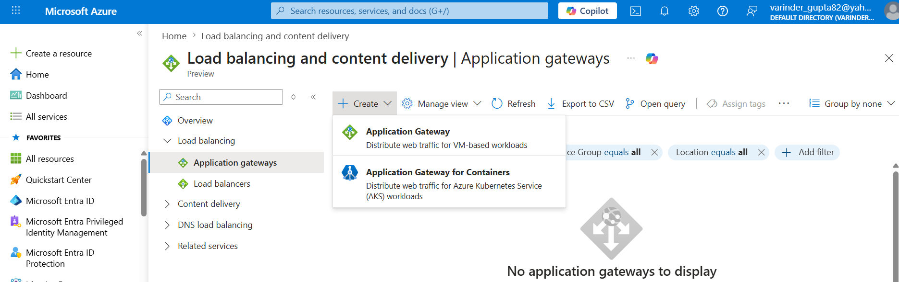

**Project details**

- Subscription:
  - Resource Group:

**Instance Details**

- Application gateway name :
- Region
- Tier : Standard (Default)
  - Basic
  - Standard V2
  - WAF V2

**Standard Tier Feature**

- Enable autoscaling : Enabled (Default)
  - Minimum instance count
  - Maximum instance count

**Configure virtual network**

- Virtual Network
  - Subnet

**Frontends**

- Frontend IP Address Type : Public (Default)
  - Public
    - IPV4 IP Address : < Choose >
      - SKU : Standard Only
      - Assignment : Static Only
      - Availablity : Zone Redundancy
  - Private
  - Both

**Backends**

- Backend Pool
  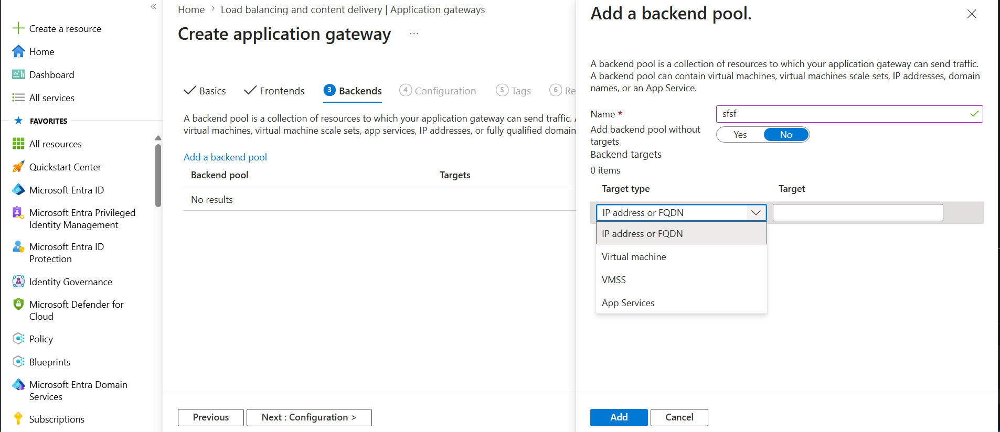

**Configuration**
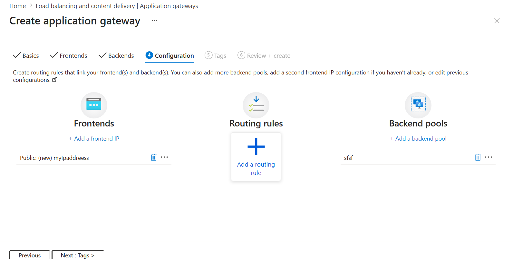

- Listener
  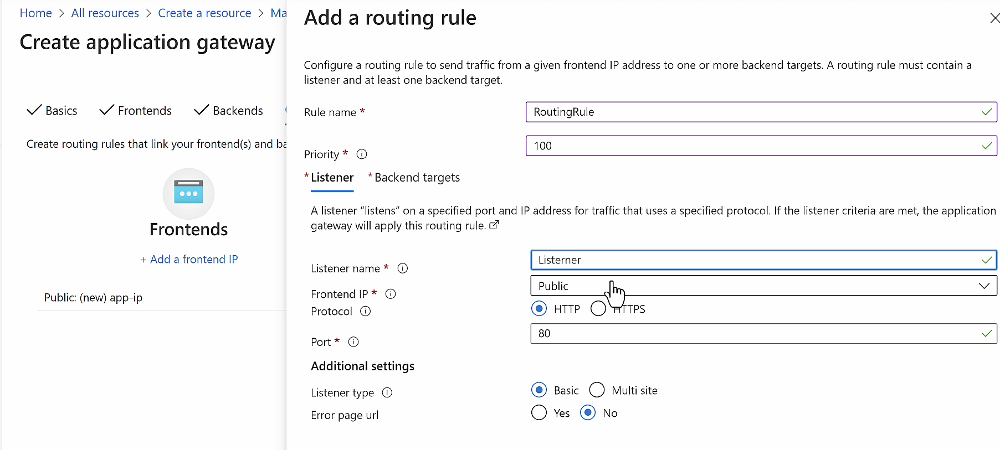

- Backend Targets
  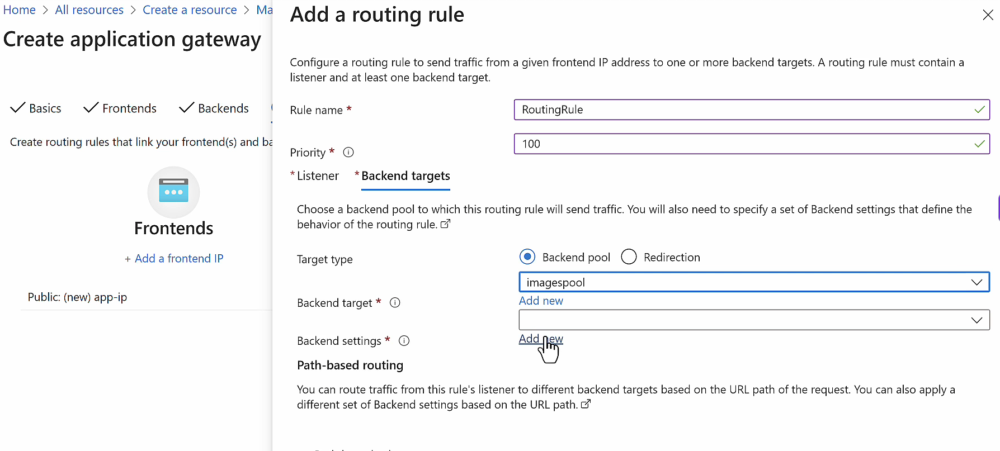
  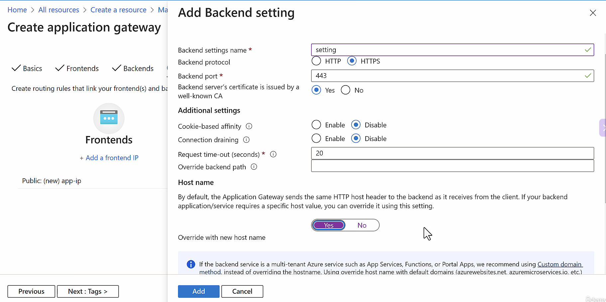
  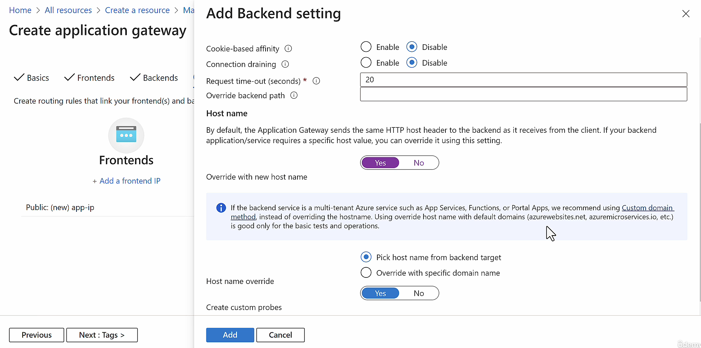

- Path Based Routing Rules

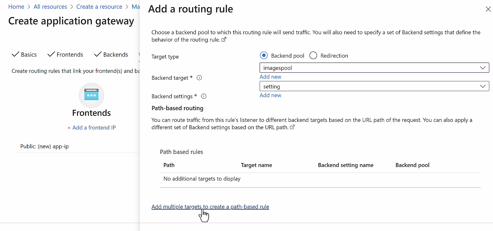
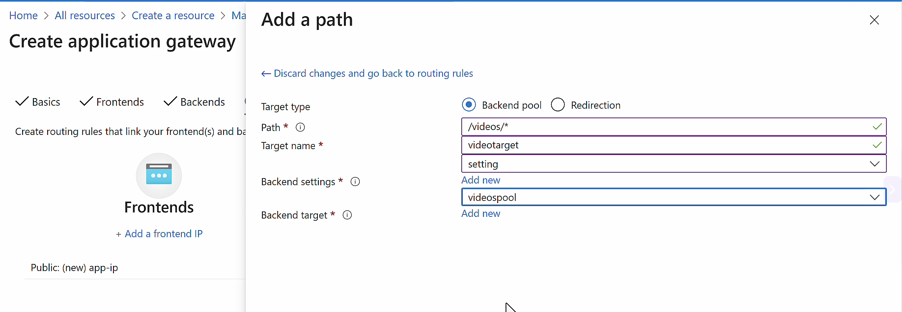
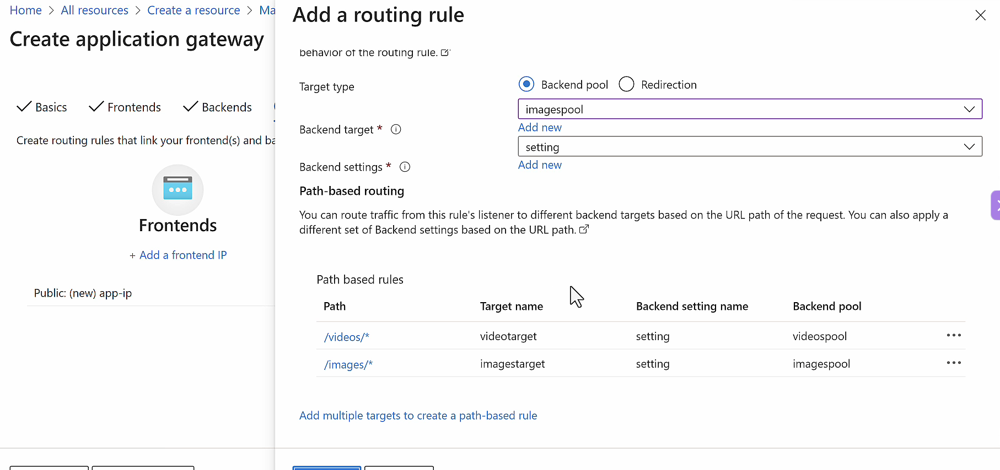

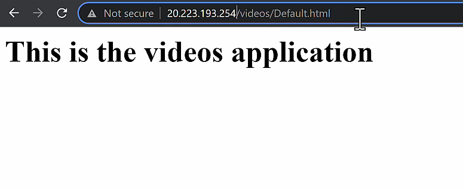

**Tags**

- Name/Value

## Azure Web Application Firewall

An additional feature available on Azure Application Gateway and Azure Frontdoor service
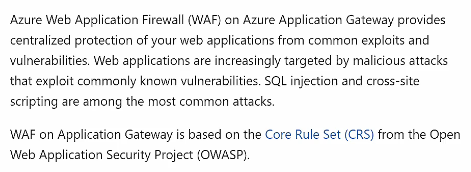

Protects against

- SQL Injection Attacks
- Cross Site Scripting Attacks

  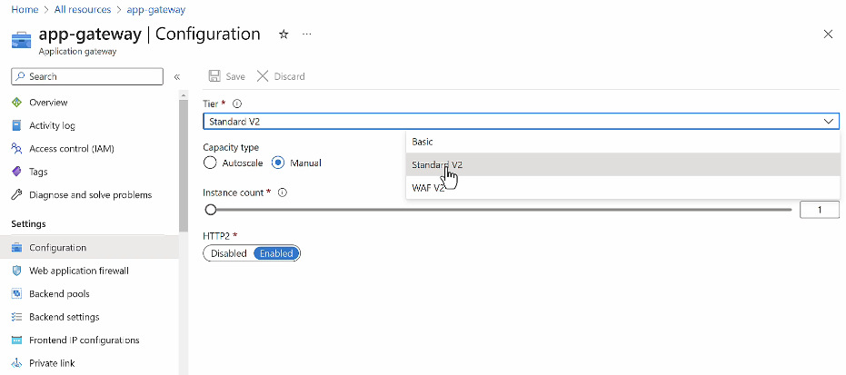

- After you upgrade to WAF Tier, just enable it
  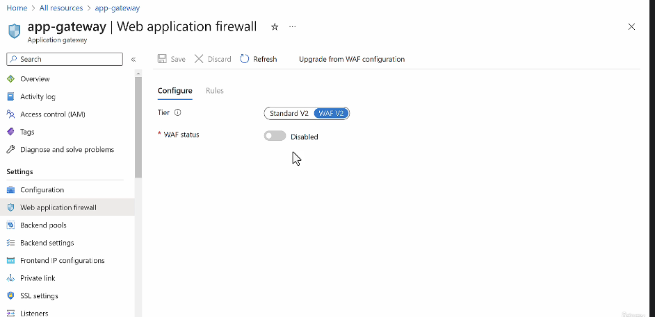
  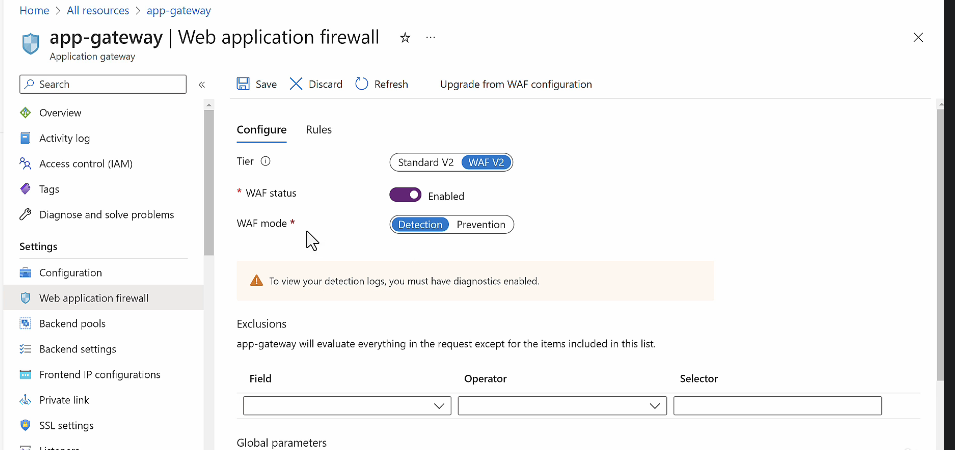

- WAF Mode
  - Detective (Default)
  - Preventive

    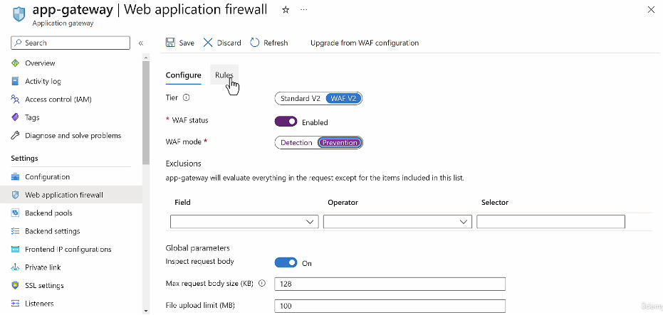

- Enable Rules
  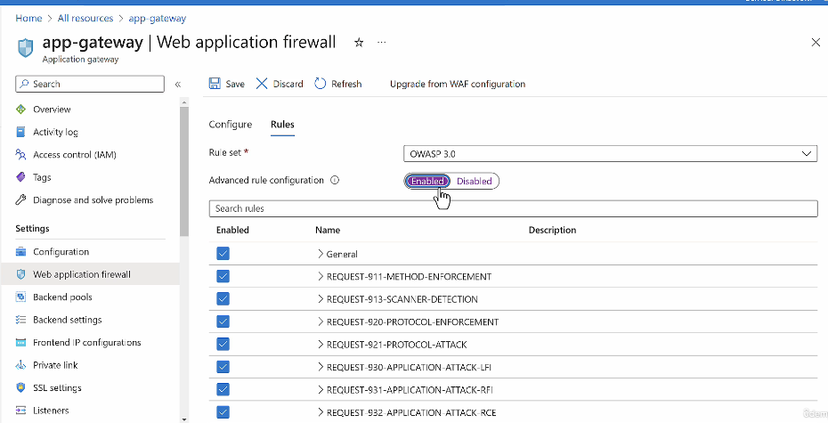
