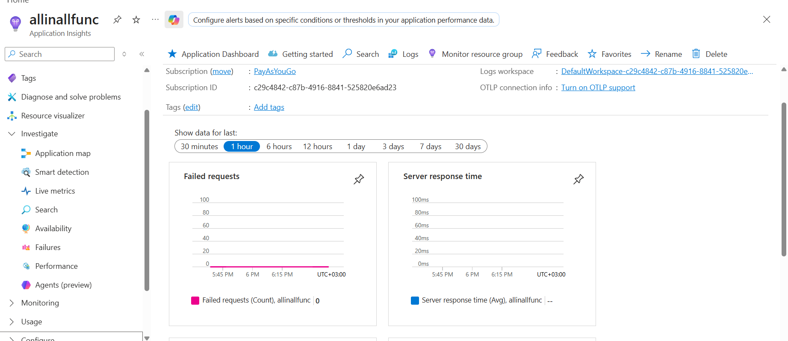
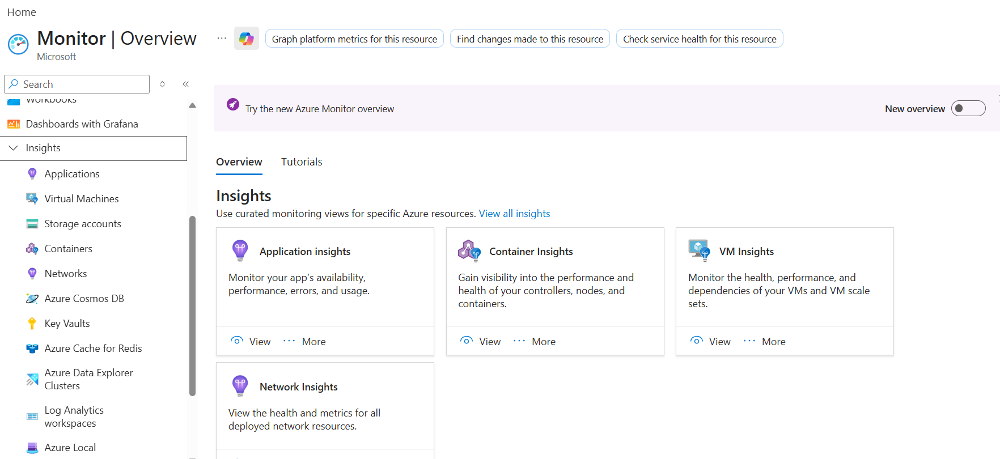

## Overview

Azure Application Insight is used for Application performance monitoring.

## How to create an Azure Application Insight Resource

**Project Details**

- Subscription
  - Resource Group

**Instance Details**

- Name
- Region

**Log Analytics Workspace**

- Log Analytics Workspace : < Choose LAW resource >

**Tags**

- Name/Value



## How to monitor a web application deployed on Azure Web App using Azure Application Insight

**Step 1:** Associate Azure Application Insight Resource with Azure Web App

- Go to Web App Resouce > Insight
- Application insight : Disabled (Default)
  - < Create / Choose Application Insight Resource >
  - Instrument your application
    - RunTime : .Net Core/Python/Java/NodeJS
    - SQL Command: Diabled (Default) ## Tip: Enable it for Query tracking

**Step 2** : Include code specific to Application Insight monitoring in application

- Right click project > Application Insight > Connect to Azure Application Insight Resource
- This will include the required code and libraries
- Package and deploy the application onto the Azure Web App

#

When you enable VM Insights on an Azure VM, Azure does not automatically create an Application Insights resource.

The architecture is different from Application Insights on App Services.

**VM Insights**

When you enable VM Insights, Azure typically configures:

```
Azure VM
   ↓
Azure Monitor Agent (AMA)
   ↓
Data Collection Rule (DCR)
   ↓
Log Analytics Workspace
   ↓
VM Insights Workbooks / Performance Views
```

**Resources involved:**

- Azure Monitor Agent (AMA)
- Data Collection Rule (DCR)
- Log Analytics Workspace
- VM Insights solution/workbooks

No Application Insights resource is required.

**Azure Web App Insights**

When you enable monitoring on an Azure Web App, Azure can create or connect to an:

```
Web App
   ↓
Application Insights
   ↓
Log Analytics Workspace (workspace-based mode)
```

**Resources involved:**

- Application Insights
- Log Analytics Workspace

**Application Insights focuses on:**

- HTTP requests
- Request rates
- Response times
- Exceptions
- Dependencies
- Distributed tracing
- User sessions : How user interact with your application
- Custom events

When is Application Insights used?

Application Insights is intended for application telemetry, such as:

- ASP.NET applications
- Java applications
- Node.js applications
- Azure Functions
- Web Apps
- Containerized applications

Application Insights work for applications hosted in Azure cloud as well as on-premises or other cloud platform to monitor performance issues.

| Feature          | VM Insights                  | Application Insights                    |
| ---------------- | ---------------------------- | --------------------------------------- |
| Resource Created | No Application Insights      | Application Insights resource           |
| Data Store       | Log Analytics Workspace      | Application Insights + Workspace        |
| Focus            | OS, VM, process, performance | Application code and transactions       |
| Agent            | Azure Monitor Agent          | App Insights SDK / Auto-instrumentation |

**A common pattern is:**

- VM Insights for infrastructure monitoring.
- Application Insights for application observability.
- Shared Log Analytics workspace for centralized querying and dashboards.

For Azure SQL Database Insights and Storage Insights, Azure generally follows the same pattern as VM Insights: it does not automatically create an Application Insights resource.

**Azure SQL Database Insights**
Monitoring for Azure SQL Database typically sends platform metrics and diagnostic logs to:

- A Log Analytics workspace
- Azure Monitor metrics

```
Azure SQL Database
    ↓
Diagnostic Settings / Azure Monitor
    ↓
Log Analytics Workspace
    ↓
Azure Monitor Workbooks / Insights
```

**Collected data includes:**

- DTU/vCore utilization
- CPU and storage usage
- Deadlocks
- Query performance metrics
- Connection statistics
- Wait statistics

**Azure Storage Insights**

Monitoring for Azure Storage Account also uses Azure Monitor and Log Analytics:

```
Storage Account
    ↓
Diagnostic Settings
    ↓
Log Analytics Workspace
    ↓
Storage Insights Workbook
```

**Collected data includes:**

- Transactions
- Latency
- Availability
- Capacity
- Egress/Ingress
- Request failures

When you enable Container Insights for an AKS cluster, Azure deploys monitoring components and configures data collection to a workspace, but it does not create Application Insights.

```
AKS Cluster
    ↓
Azure Monitor Agent (AMA)
    ↓
Data Collection Rule (DCR)
    ↓
Log Analytics Workspace
    ↓
Container Insights Workbooks
```

**Data collected includes:**

- Node CPU and memory
- Pod CPU and memory
- Container restarts
- Pod inventory
- Node inventory
- Kubernetes events
- Container stdout/stderr logs
- Network metrics

Like VM Insights, SQL Insights, Storage Insights, and Container Insights, Network Insights is an Azure Monitor solution that uses Azure Monitor data sources and Log Analytics workspaces.

```
Network Resources
(VNet, VPN Gateway, ExpressRoute, Load Balancer, NSG, Firewall, etc.)
        ↓
Azure Monitor Metrics + Diagnostic Logs
        ↓
Log Analytics Workspace
        ↓
Network Insights Workbooks
```

Data Sources Used

**Depending on what you're monitoring:**

- NSG Flow Logs
- Virtual Network metrics
- VPN Gateway metrics
- ExpressRoute metrics
- Load Balancer metrics
- Azure Firewall logs
- Connection Monitor data
- Network Watcher data
- Resources Created

We can find Insight section in Azure Monitor


Application Insights is not limited to App Service and Function Apps. It is part of Azure Monitor and can collect telemetry from many Azure and non-Azure workloads.

You can use Application Insights with:

- Azure App Service
  Azure Functions
- Azure Kubernetes Service (AKS)
- Azure Container Apps
- Virtual Machines
- On-premises applications
- .NET, Java, Node.js, Python applications running anywhere
- Containers running in Docker
- Background workers and console applications
- Microservices architectures
