## Overview

### Different Data Types

- Structured Data (Tables) : Azure SQL Database
- Semi-Structured Data (JSON) : Azure CosmosDB
- UnStructured Data (Images, Vidoes, Zip) : Azure Storage

### Azure SQL Database - Used For Strctured Data

- Use Tables (Rows and Columns)
- Tables with Fixed Schema
- Relational between Tables
- Good for Transactional Data (ACID Characteristics)

### Azure CosmosDB - Used For Unstrctured (JSON) Data

- No SQL, Relational and Vector Database
- No Fixed Schema (Data is in different forms)
- Much efficient in data storage and retrieval
- Examples
  - MongoDB (Open Source)
    - Database -> Container -> Documents (JSON)
  - CosmosDB (Azure Managed)
    - Database -> Container -> Documents (JSON)
- Support different APIs
  - NoSQL :
    - Data is stored as JSON
    - You can query using SQL
  - MongoDB
    - Data is stored as BSON
  - Table
    - Data is stored as key-value pair
  - Casandra
    - Data is stored as column-oriented schema
  - Gramlin
    - Graph based data

## Key Concepts

### Request Units

- In CosmosDB, you dont pay separately for Compute and Memory/IOPS, everything is bundled as a single Unit - RUs
- RU - represent cost of database operation
- when you fetch a single item with id and partition key
  - 1 KB read = 1 RU
- Free Tier support 1000 RU per second.
- So costing is in terms of RUs

### Partition Key

```
    - CosmosDB Account
        - Database
            -  ContainerA : Orders (Partition Key : OrderType)
                - Item (Item Id)
                - Item (Item Id)
                - Item (Item Id)
                - Item (Item Id)
                - Item (Item Id)
            - ContainerB : Complaints (Partition Key: ComplainType)
                - Item (Item Id)
                - Item (Item Id)
                - Item (Item Id)
                - Item (Item Id)
                - Item (Item Id)
```

- Container : Hold your JSON documents
- CosmosDB divide data into different partitions depends on the partition key, so choose wisely
- Partition Key : helps in quick search

### Item Id

- Each item in your cosmosDB get item ID within the partition
- Partition Key + Item Id (Unique)
- Item ID = Table Primary Key

\***\*Imp** : To CREATE and UPDATE an Item, we need to provide both Partition Key and ID, without any system properties like \_ts.

## Arrays with JSON Object

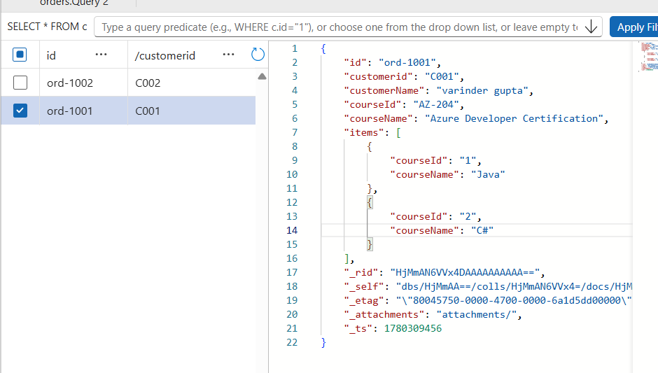

**Query** : By flattening the structure using JOIN

```
SELECT o.id,o.courseId as orderId , i.courseName,i.courseId as courseId
FROM Orders o Join i in o.items
WHERE i.courseName = 'C#'
```

## Objects with Objects


```
SELECT *
FROM Orders o
WHERE o.payment.transationid = 'tx-001'
```

### Physical Partitions

- managed by azure for scaling.

### Create Azure CosmosDB Account

**Project Details**

- API Type : No SQL (Default)
  - No SQL
  - MongoDB
  - Casandra
  - Table
  - Gramlin
- Workload Type : Learning (Default)
  - Learning
  - Development/Testing
  - Production
- Subscription
  - Resource Group

**Instance Details**

- Account Name : < Unique >
- Availability Zone : Disabled (Default)
- Region
- Capacity Throughput
  - Serverless
    - Used For Unpredictable workload
    - It is Billed only for consumed RUs
    - It Scales on-demand
  - Provisioned Throughput : Default
    - Preconfigured RUs
      - Manual
      - Autoscale (Min, Max)
    - Billed per hour
    - Guaranteed Thorughput
- Apply Free Tier Discount : Disabled (Default)
  - Only For provisioned Type
  - With Azure Cosmos DB free tier, you will get the first 1000 RU/s and 25 GB of storage for free in an account. You can enable free tier on up to one account per subscription. Estimated $64/month discount per account.

**Global Distribution**

Not supported with serverless capacity mode.

- Geo-Redundancy : Disabled
  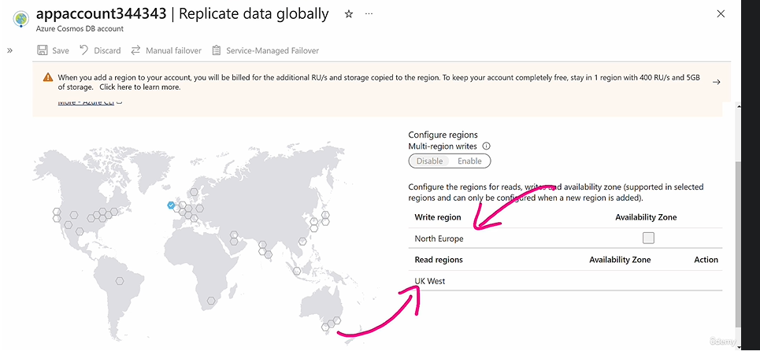
- Multi-region Writes : Disabled

**Network connectivity**

- Connectivity method :
  - All Networkds (Default)
  - Selected networks
  - Private Endpoint

- Minimum Transport Layer Security Protocol : TLS 1.2

**Backup policy**

- Backup policy
  - Periodic (Default)
    - Backup interval : X Min/Hour
    - Backup Retention : X Days
    - Copy of data retained : 2
  - Continuous 7 days : Provides backup window of 7 days / 168 hours and you can restore to any point of time within the window. This mode is available for free
  - Continuous 30 days : Provides backup window of 30 days / 720 hours and you can restore to any point of time within the window. This mode has cost impact.

**Security**

- Key-based Authentication : Enabled (Default)
  - Disabled
    - To forcing authentication through Microsoft Entra ID
    - After creation, you must assign a Cosmos DB data-plane role to your users, service principals, or managed identities, such as:
      - Cosmos DB Built-in Data Reader
      - Cosmos DB Built-in Data Contributor
- Data Encryption
  - Service Managed Key (Default)
  - Customer Managed Key (CMK)

**Tags**

- Name/Value

## How to create a Database within the CosmosDB Account

- Database ID : < DB Name>

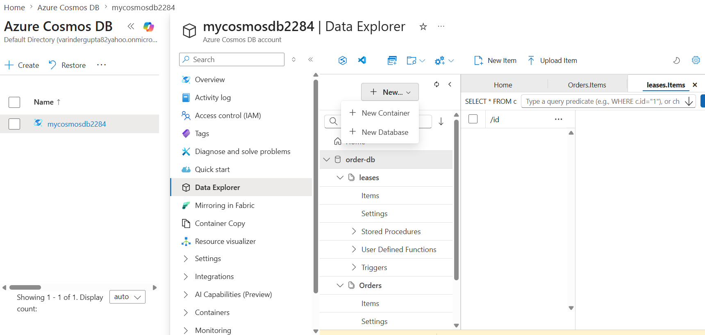
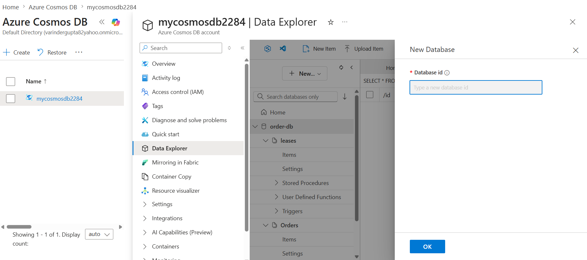

## How to create Container within the Database

- Database ID : < Choose Database ID >
- Container ID : < Container Name > (Eg: Orders)
- Partition Key : /< Partition Key > (/CustomerId)
- Container RU : Only visible for CosmosDB Account with Capacity Throughput : Provisioned Throughput, not for serverless

  **Serverless**
  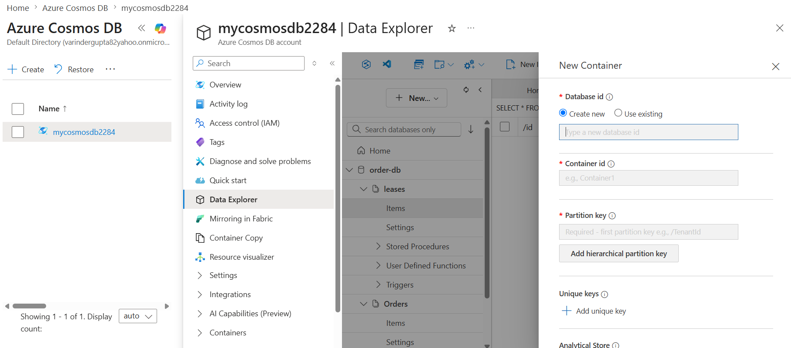

  **Provisioned**
  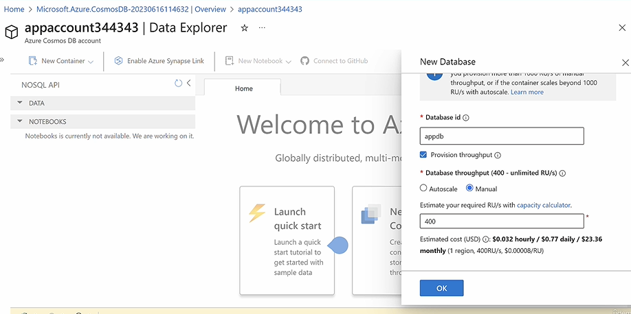

  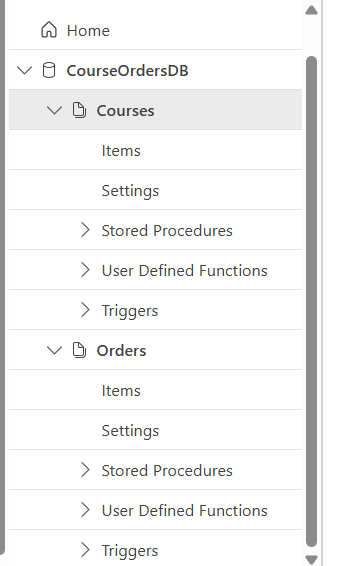

## How to create Container within a database

- **Input**
  We can skip id it will be autogenerated,like system properties
  

- **Output**
  

  So few system based properties are added with the item
  - \_rid
  - \_attachments
  - \_ts
  - \_etag
  - \_self

## Running Query Against Containers

```
SELECT * FROM c where c.id = "ord-1001" (c is selected container)

SELECT * FROM orders c where c.id = "ord-1001"

SELECT * FROM users c where  c.customerName = "varinder gupta"

SELECT * FROM users c where  c.customerName = "varinder gupta" AND c.rating > 3
```

## CosmosDB Query Types

- **In Partition Query** : If your query has partition key with equality filter (= only) specified, CosmosDB automatically optimizes the query, it routes the query to the physical partition

```
Select * from Orders o where o.CustomerId = "cus-101"
```

- **Cross Partition Query** :If your query has nopartition key specified,

```
Select * from Customer c where c.name = "cus-101"
```

## Costing

- RUs (Compute + RAM)
- Storage

## .Net 10

- Dotnet Libraries

```
dotnet new console -n cosmosdb.app

cd cosmosdb.app

dotnet add package Microsoft.Azure.Cosmos
dotnet add package Azure.Identity

Ref:
https://learn.microsoft.com/en-us/azure/cosmos-db/quickstart-dotnet
```

- Create Database and container

```
using Microsoft.Azure.Cosmos;
using Azure.Identity;

const string END_POINT = "https://mycosmosdb2284.documents.azure.com:443/";
const string ACCESS_KEY = "";

CosmosClient client = new CosmosClient(END_POINT, new DefaultAzureCredential());
// CosmosClient client = new CosmosClient(END_POINT, ACCESS_KEY);

static async Task CreateDBContainer(CosmosClient client)
{
    Database database = await client.CreateDatabaseIfNotExistsAsync("order-db");
    Container container = await database.CreateContainerIfNotExistsAsync("orders", "/customerId");

    Console.WriteLine("Database and container created successfully.");
}

await CreateDBContainer(client);
```

- Adding an Item into the container

## Pre-requisite of using DefaultAzureCredential()

**IMP** To use new DefaultAzureCredential(), instead of Access Key, Assign cosmosdb sql role "Cosmos DB Built-in Data Contributor" to the user
Note: This role can not create cosmosdb database and containers.

```
Azure CLI ✅
PowerShell ✅
ARM/Bicep ✅
Terraform ✅
Portal IAM ❌ usually not visible in your current UI
```

1. Assign cosmosdb sql role "Cosmos DB Built-in Data Contributor" to the user
   Note: This role can not create database and containers.

```
az cosmosdb sql role assignment create \
  --resource-group "dev" \
  --account-name "mycosmosdb2284" \
  --role-definition-name "Cosmos DB Built-in Data Contributor" \
  --principal-id "7b83bf86-8ca7-41d4-a300-cb53f61f773d" \
  --scope '//'
```

**principal-id** is Object ID of user logged in

2. Verify the role

```
$ az cosmosdb sql role assignment list --resource-group "dev" --account-name "mycosmosdb2284"


[
  {
    "id": "/subscriptions/c29c4842-c87b-4916-8841-525820e6ad23/resourceGroups/dev/providers/Microsoft.DocumentDB/databaseAccounts/mycosmosdb2284/sqlRoleAssignments/2e8c27bd-c2cf-4dfa-88cf-b3f456d76b1c",
    "name": "2e8c27bd-c2cf-4dfa-88cf-b3f456d76b1c",
    "principalId": "7b83bf86-8ca7-41d4-a300-cb53f61f773d",
    "resourceGroup": "dev",
    "roleDefinitionId": "/subscriptions/c29c4842-c87b-4916-8841-525820e6ad23/resourceGroups/dev/providers/Microsoft.DocumentDB/databaseAccounts/mycosmosdb2284/sqlRoleDefinitions/00000000-0000-0000-0000-000000000002",
    "scope": "/subscriptions/c29c4842-c87b-4916-8841-525820e6ad23/resourceGroups/dev/providers/Microsoft.DocumentDB/databaseAccounts/mycosmosdb2284",
    "type": "Microsoft.DocumentDB/databaseAccounts/sqlRoleAssignments"
  }
]
```

Terraform

```
resource "azurerm_cosmosdb_sql_role_assignment" "data_contributor" {
  resource_group_name = azurerm_resource_group.rg.name
  account_name        = azurerm_cosmosdb_account.cosmos.name

  role_definition_id = "${azurerm_cosmosdb_account.cosmos.id}/sqlRoleDefinitions/00000000-0000-0000-0000-000000000002"
  principal_id       = "<your-object-id>"
  scope              = azurerm_cosmosdb_account.cosmos.id
}
```

## Connect to cosmosDB

```
CosmosClient client = new CosmosClient(END_POINT, new DefaultAzureCredential());
```

## Single Objects - Add items

```
static async Task CreateItem(CosmosClient client)
{
    Container container = client.GetContainer("order-db", "orders");

    Order order = new Order(
        id: Guid.NewGuid().ToString(),
        customerId: "gear-surf-surfboards", // must match PartitionKey
        name: "Yamba Surfboard",
        quantity: 1,
        price: 450.00m,
        clearance: false
    );

    ItemResponse<Order> response = await container.UpsertItemAsync<Order>(
        order,new PartitionKey(order.customerId)
    );

    Console.WriteLine($"Item created with id: {response.Resource.id}");
}

await CreateItem(client);

```

## Arry of Objects - Add items

```
static async Task CreateItem(CosmosClient client)
{
    Container container = client.GetContainer("order-db", "Orders");
    Order[] orders = new Order[]
    {
        new Order
        {
            Id = Guid.NewGuid().ToString(),
            CustomerId = "gear-surf-surfboards",
            UserId = "user123",
            OrderDate = DateTime.UtcNow,
            CourseInfo = new CourseInfo
            {
                CourseId = "course123",
                CourseName = "Surfing 101",
                Price = 199.99m
            },
            PaymentInfo = new PaymentInfo
            {
                PaymentMethod = "Credit Card",
                PaymentStatus = "Completed"
            }
        },
        new Order
        {
            Id = Guid.NewGuid().ToString(),
            CustomerId = "mark",
            UserId = "user1",
            OrderDate = DateTime.UtcNow,
            CourseInfo = new CourseInfo
            {
                CourseId = "course1",
                CourseName = "Surfing 101",
                Price = 199.99m
            },
            PaymentInfo = new PaymentInfo
            {
                PaymentMethod = "Credit Card",
                PaymentStatus = "Completed"
            }
        },

    };

    foreach (var order in orders)
    {
        ItemResponse<Order> response = await container.CreateItemAsync<Order>(
            order, new PartitionKey(order.CustomerId)
        );

        Console.WriteLine($"Item created with id: {response.Resource.Id}, status code: {response.StatusCode}");
    }

}
```

```

public record Order(
    string id,
    string customerId,
    string name,
    int quantity,
    decimal price,
    bool clearance
);

```

## Using Data hierarchy

```
using Newtonsoft.Json;

public class Order
{
    [JsonProperty("id")]    // MUST MATCH THE CONTAINER ID
    public required string Id { get; set; }

    [JsonProperty("CustomerId")] // MUST MATCH THE CONTAINER PARTITON KEY
    public required string CustomerId { get; set; }

    [JsonProperty("userId")]
    public string UserId { get; set; } = default!;

    [JsonProperty("orderDate")]
    public DateTime OrderDate { get; set; }

    [JsonProperty("courseInfo")]
    public CourseInfo CourseInfo { get; set; } = default!;


    [JsonProperty("paymentInfo")]
    public PaymentInfo PaymentInfo { get; set; } = default!;
}

public class CourseInfo
{
    [JsonProperty("courseId")]
    public required string CourseId { get; set; }

    [JsonProperty("courseName")]
    public required string CourseName { get; set; }

    [JsonProperty("price")]
    public decimal Price { get; set; }
}

public class PaymentInfo
{
    [JsonProperty("paymentMethod")]
    public required string PaymentMethod { get; set; }

    [JsonProperty("paymentStatus")]
    public required string PaymentStatus { get; set; }
}
```

## Read Data - With hierarchy

```

static async Task ReadItem(CosmosClient client)
{
    Container container = client.GetContainer("order-db", "orders");
    string query = "SELECT * FROM orders o WHERE o.customerId = @customerId";

    var queryDefinition = new QueryDefinition(query)
      .WithParameter("@customerId", "gear-surf-surfboards");

    using FeedIterator<Order> order = container.GetItemQueryIterator<Order>(
        queryDefinition
    );

    Console.WriteLine("Reading items from the container...");

    while (order.HasMoreResults)
    {
        FeedResponse<Order> response = await order.ReadNextAsync();
        foreach (Order o in response)
        {
            Console.WriteLine($"Read item with id: {o.id} customer id : {o.customerId} name : {o.name} quantity : {o.quantity} price : {o.price} payment method : {o.payment.method}");
        }
    }

}

await ReadItem(client);

```

## Update Data

Best approach is

- Fetch the record
- Set the Updated value
- Update the record

```

static async Task UpdateItem(CosmosClient client)
{
    Container container = client.GetContainer("order-db", "orders");

    Order order = new Order(
        id: "3a1d5c03-6a97-42a4-ba44-ed6b19a1727d",
        customerId: "gear-surf-surfboards",
        name: "Yamba Surfboard 1.0",
        quantity: 2,
        price: 450.00m,
        clearance: false
    );

    ItemResponse<Order> response = await container.UpsertItemAsync<Order>(
        order, new PartitionKey(order.customerId)
    );

    Console.WriteLine($"Item updated with id: {response.Resource.id}");
}

```

## Delete the record

```

static async Task DeleteItem(CosmosClient client)
{
    Container container = client.GetContainer("order-db", "orders");

    string id = "3a1d5c03-6a97-42a4-ba44-ed6b19a1727d";
    string partitionKey = "gear-surf-surfboards";

    ItemResponse<Order> response = await container.DeleteItemAsync<Order>(
        id, new PartitionKey(partitionKey)
    );

    Console.WriteLine($"Item deleted with id: {id}");
}
//await CreateDBContainer(client);

//await CreateItem(client);

//await ReadItem(client);

//await UpdateItem(client);

await DeleteItem(client);
```

## Change Feed (Continuous stream of changes done within a container)

Azure Cosmos DB does not have an "event plane" concept like Event Grid or Event Hubs.

Cosmos DB has:

- Control Plane
  - Create/update/delete accounts, databases, containers
  - Managed through Azure Resource Manager (ARM)
- Data Plane
  - Read/write/query documents
  - Secured with Cosmos DB RBAC, Entra ID, keys, etc.
- Change Feed
  - An ordered stream of inserts and updates in a container
  - Used for event-driven processing, CQRS, projections, analytics, integration, etc.

When discussing authentication:

- Control Plane → Azure RBAC roles (Owner, Contributor, etc.)
- Data Plane → Cosmos DB Built-in Data Reader/Contributor roles
- Change Feed → Uses the same data-plane permissions as reading documents because it is part of the data plane.

A built-in feature in Azure CosmosDB, a persistant log record all changes occure within a container.
So you can have application that react to that changes like Azure functions.
So instead of pooling the cosmosDB, for changes. We can listen to the chagne feed.

Usecase:

- you want to send the change feed to another service like Azure Synapsis or Azure Data lake
- You want to notifiy or track or monitor changes to containers.

### Change Feed Processor - Key components

- Monitored Container
  - The container we are monitoring for changes
- Lease Container
  - Store the state
  - Checkpoint in place
- Host : Host machine run the change feed processor
- Delegate : Code of the change feed processor

### How to enable change feed feature in the cosmosDB

< CosmosDB Account > --> Features --> All change feed (Enable)

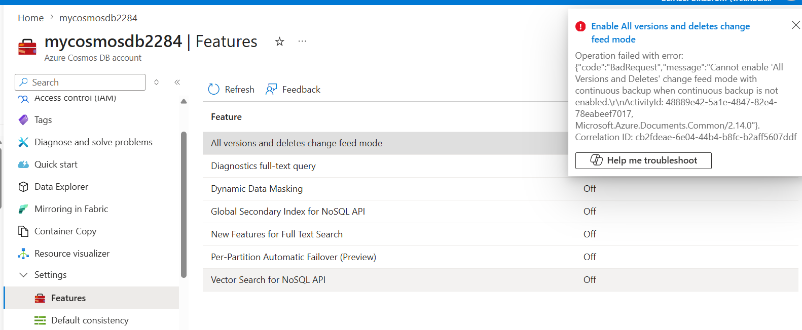

**Pre-requisite** : Enable Continuous backup.

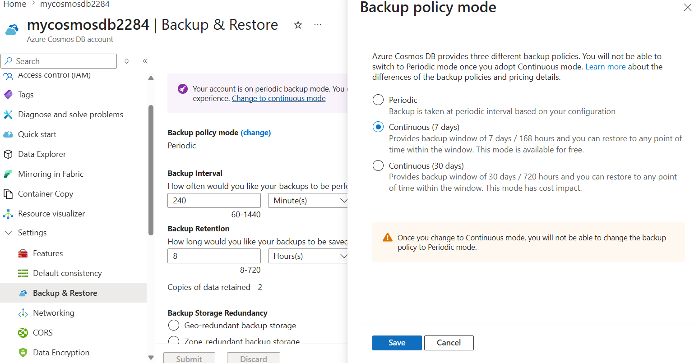

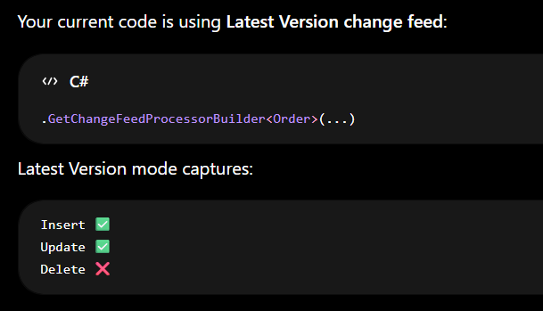

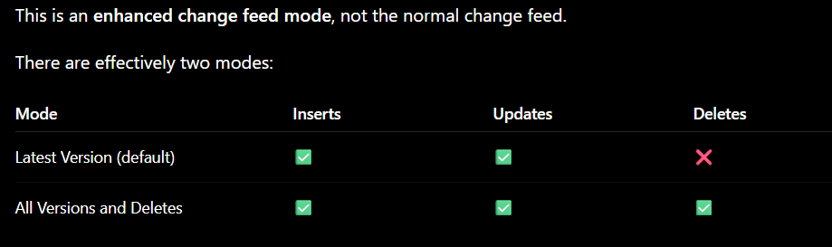

For Update Detection

```
foreach (var order in changes)
{
    if (order.CreatedAt == order.UpdatedAt)
    {
        Console.WriteLine($"INSERT: {order.Id}");
    }
    else
    {
        Console.WriteLine($"UPDATE: {order.Id}");
    }
}
```

For Delete Detection - Do soft delete

```
{
  "id": "3",
  "customerId": "Krishna",
  "isDeleted": true,
  "deletedAt": "2026-06-02T18:30:00Z"
}
```

By default azure function listening to cosmosDB database container is by defautl a changefeed processor (so only insert/update, not delete)

When you write

```
    [Function("CosmosTrigger1")]
    public void Run([CosmosDBTrigger(
        databaseName: "order-db",
        containerName: "Orders",
        Connection = "CosmosDBConnection",
        LeaseContainerName = "leases",
        CreateLeaseContainerIfNotExists = true)] IReadOnlyList<Order> input)
    {
        if (input != null && input.Count > 0)
        {
            _logger.LogInformation("Documents modified: " + input.Count);
            _logger.LogInformation("First document Id: " + input[0].Id);
        }
    }
```

Azure Functions automatically creates and runs a Change Feed Processor behind the scenes.

Conceptually, Azure is doing something similar to:
This approach issed in 3rd party backend applications

```
static Task HandleChanges(
    IReadOnlyCollection<Order> changes, CancellationToken token
)
{
    Console.WriteLine($"Received {changes.Count} changes.");
    foreach (var order in changes)
    {
        Console.WriteLine($"Order id: {order.Id}, CustomerId: {order.CustomerId}");
    }

    return Task.CompletedTask;
}

ChangeFeedProcessor processor =
    ordersContainer
        .GetChangeFeedProcessorBuilder<Order>(
            processorName: "CosmosTrigger1",
            onChangesDelegate: HandleChanges)
        .WithLeaseContainer(leasesContainer)
        .Build();

await processor.StartAsync();
```

## Time To Live

A Built-in feature in CosmosDB that automatically delete items after a specific amount of time

- TTL is in seconds
- Calculates from the time the item was last modified
- Usecase : you are storing state data in cosmosDB and don't want separate script to delete data
- TTL can be specified at
  - container level : Default value for all items
  - item level : Override the default container level value.
- 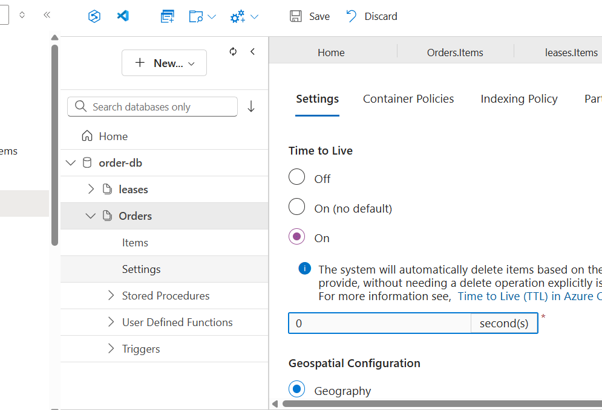

## Consistency Level :

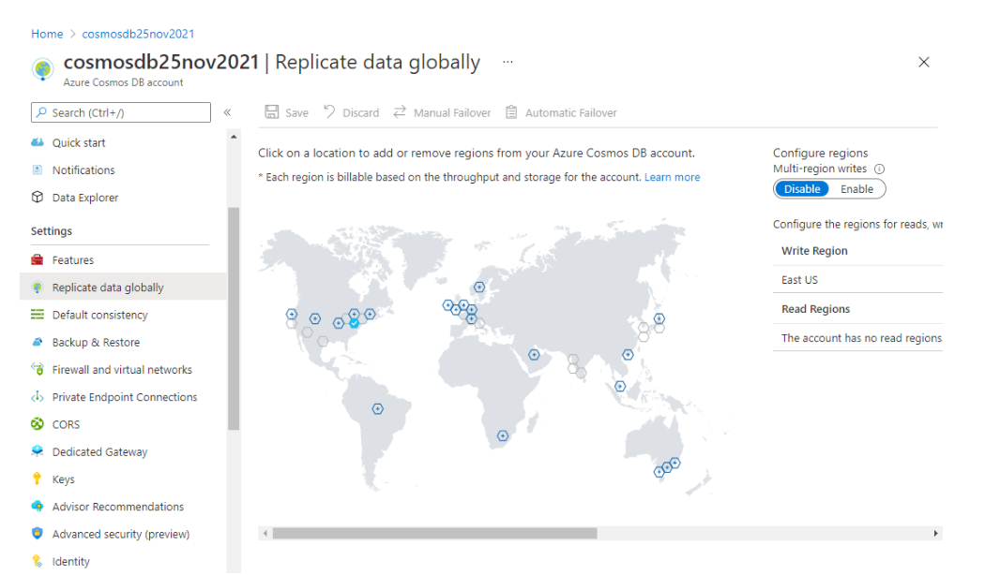

In cosmosDB , global distribution we can have

- Multi region read (so writes in primany region reflect in secondary regions, but writes in secondary region will not be synced to primary region)
- Multi region writes (So writes to secondary regions also synched to primary and other regions)

**Note** Globally distributed data feature, not available for serverless cosmosdb setup.

So when data is globally distributed, we have differnet consistency levels:

- **Strong** : linearizability guarantee, with highest read latency
  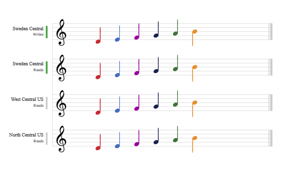
- **Bounded Staleness** : Reads are allowed to be stale with bounded staleness (X seconds or X operations), with order guarantees.
  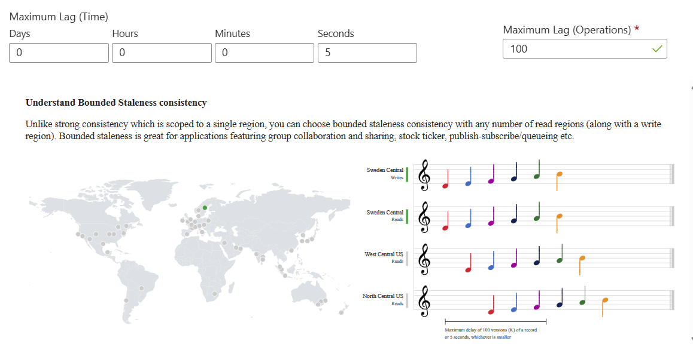
- **Session** : In session, guranteed to get latest data.
  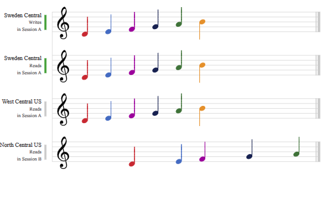
- Consistant Prefix

- **Eventual** : You dont mind reading stale data, but evetually data will be consistent.
  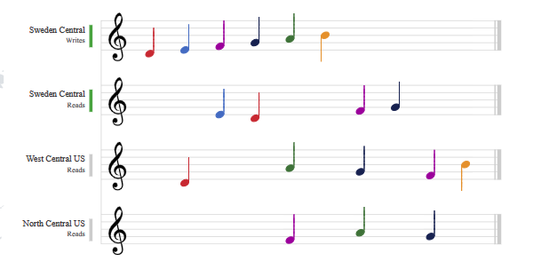

Note: Azure Cosmos DB Serverless accounts do not support Global Distribution (multi-region writes/reads) in the same way as provisioned-throughput accounts.

**Serverless limitations**

Serverless supports:

✅ Single region
✅ Automatic scaling (pay per request)
✅ Change Feed
✅ Continuous Backup

But has restrictions such as:

❌ Multi-region writes
❌ Traditional global distribution features
❌ Autoscale RU/s (because there are no provisioned RU/s)

## Synthetic Partition Key

Choose partitionKey in such a way that, data is evenly distributed.

In case you can't have any property that evently distribute data, you can add your own new property, that can distribute the data evenly. You can decide on the logic for they key (synthetic key) like by combining few properties/keys

## Azure function (with Blob Trigger) - Azure cosmosDB

```
using System.IO;
using System.Threading.Tasks;
using Microsoft.Azure.Cosmos;
using Microsoft.Azure.Functions.Worker;
using Microsoft.Extensions.Logging;
using Newtonsoft.Json;

namespace Company.Function;

public class BlobTrigger1
{
    private readonly ILogger<BlobTrigger1> _logger;
    private readonly CosmosClient _cosmosClient;

    public BlobTrigger1(ILogger<BlobTrigger1> logger)
    {
        _logger = logger;

        var connectionString = Environment.GetEnvironmentVariable("CosmosDBConnection");
        _cosmosClient = new CosmosClient(connectionString);
    }

    [Function(nameof(BlobTrigger1))]
    [CosmosDBOutput(databaseName: "order-db", containerName: "Orders", Connection = "CosmosDBConnection")]
    public async Task Run([BlobTrigger("samples-workitems/{name}", Connection = "promprequest2284_STORAGE")] Stream stream, string name)
    {
        using var blobStreamReader = new StreamReader(stream);
        var content = await blobStreamReader.ReadToEndAsync();
        _logger.LogInformation("C# Blob trigger function Processed blob\n Name: {name} \n Data: {content}", name, content);

        Order? order = System.Text.Json.JsonSerializer.Deserialize<Order>(content);
        if (order != null)
        {
            _logger.LogInformation("Order details: Id: {id}, Product: {product}, Quantity: {quantity}", order.Id, order.CustomerId, order.UserId);
        }
        else
        {
            _logger.LogError("Failed to deserialize the blob content into an Order object.");
        }

        _logger.LogInformation(JsonConvert.SerializeObject(order, Formatting.Indented));

        if (order != null)
        {
            var container = _cosmosClient.GetContainer("order-db", "Orders");

            await container.UpsertItemAsync(
                order,
                new PartitionKey(order.CustomerId));

            _logger.LogInformation(
                "Order inserted/upserted. Id: {id}, CustomerId: {customerId}, UserId: {userId}",
                order.Id,
                order.CustomerId,
                order.UserId);
        }
    }
}
```

## Stored Procdure

They are written in JavaScript, run inside Cosmos DB, and are transactional only within one logical partition key. For partitioned containers, you must pass the partition key when executing the stored procedure.

Use stored procedures only when you specifically need ACID transaction across multiple documents in the same partition in single container.

Suppose your container is

```
Orders
Partition Key = /CustomerId
```

Documents:

```
{
  "id": "********",
  "CustomerId": "cust123",
  "Type": "CustomerData",
  "name": "Harish"
}

{
  "id": "********",
  "CustomerId": "cust123",
  "Type": "PaymentData",
  "Mehod": "CreditCard",
  "status": "Pending"
}
```

- Server Side, set of sql
- Scoped only single partition
- Run by Database Engine
- Written in JavaScript

Everything with the same partition key value is physically colocated and can participate in a transaction.

**What enterprises usually do today**

In modern cloud architectures, most teams avoid Cosmos stored procedures and instead use:

```
- Application Service
- Azure Function
- Transaction Batch

Especially TransactionalBatch in .NET:

container.CreateTransactionalBatch(
    new PartitionKey("cust123"))
```

This gives the same ACID guarantee within a partition and is easier to maintain than JavaScript stored procedures.

For a Solution Architect, the rule of thumb is:

```
Need ACID within one partition?
→ TransactionalBatch (preferred)
→ Stored Procedure (legacy/special cases)

Need ACID across partitions or containers?
→ Use Saga/Event-driven pattern
→ Service Bus / Change Feed / Compensation
```

You should almost never design a Cosmos solution assuming transactions across containers. That's where patterns like Change Feed, Service Bus, and eventual consistency come in.

## Trigger

JavaScript function trigger pre/post of the item.

## In Cosmos DB, ACID is achieved only inside one logical partition, in one container.

**Best options**

TransactionalBatch — recommended in .NET

Use this when multiple documents share the same partition key.

```
var batch = container.CreateTransactionalBatch(
    new PartitionKey("cust123"));

batch.CreateItem(order);
batch.CreateItem(auditRecord);
batch.ReplaceItem(summary.Id, summary);

TransactionalBatchResponse response = await batch.ExecuteAsync();

if (!response.IsSuccessStatusCode)
{
    throw new Exception($"Batch failed: {response.StatusCode}");
}
```

If you want your cosmosdb data to be copied to other service as inserted/updated.

**Use** : Change Feed
