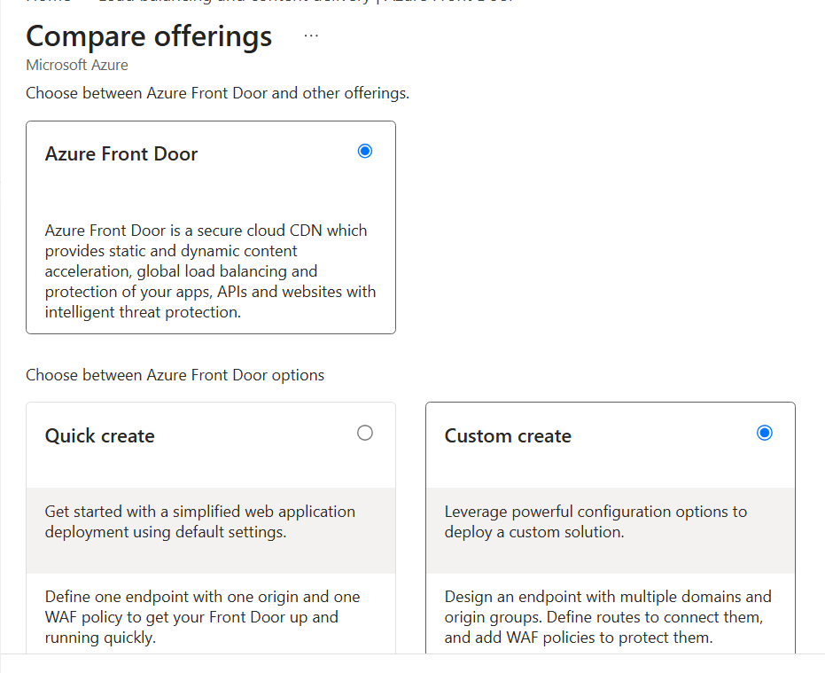
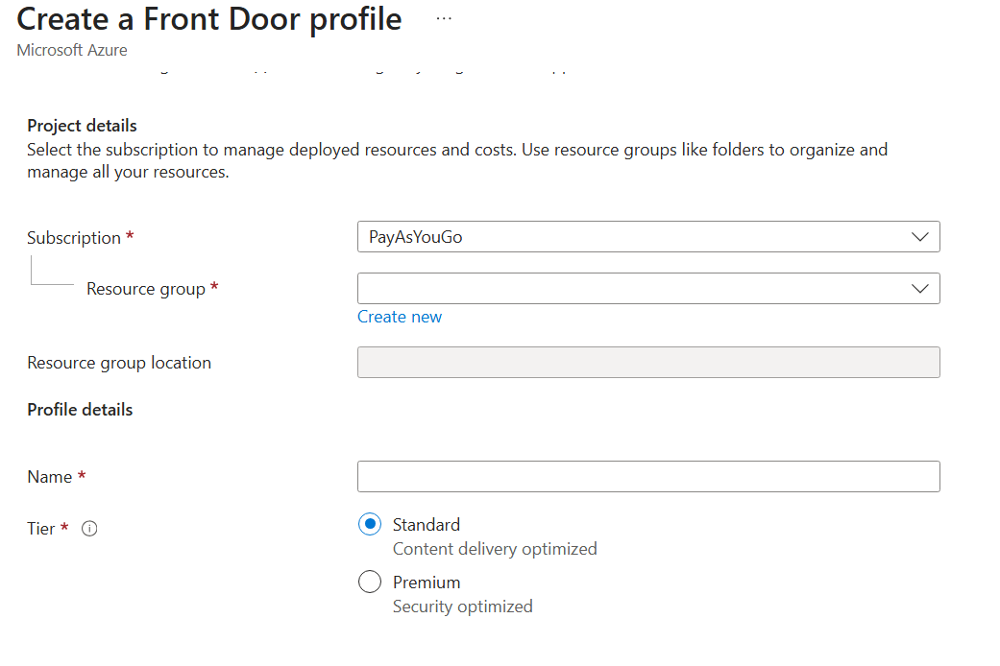
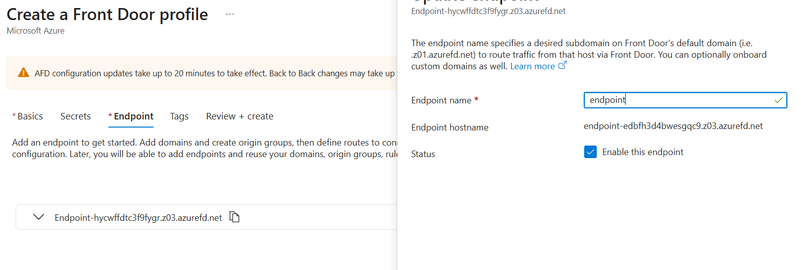
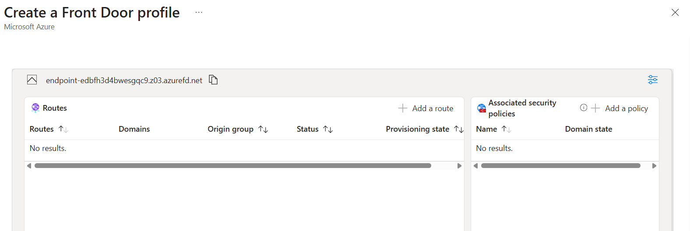
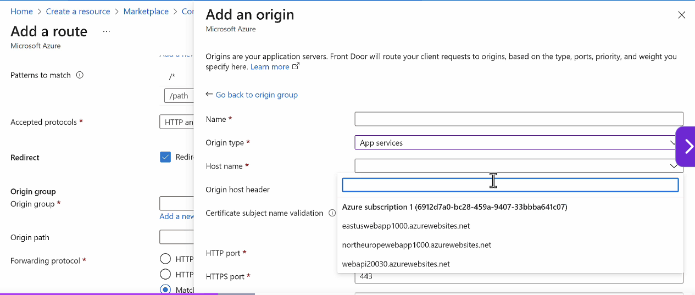
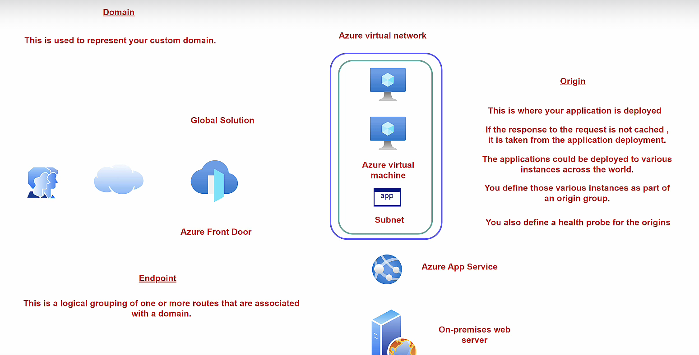

## Overview

A CDN (Content Delivery Network) solution on Azure.

- To provide fast access to your application globally
- Application can be static or dynamic
- A Global Service

| Feature                        | Azure Application Gateway                       | Azure Front Door                                           |
| ------------------------------ | ----------------------------------------------- | ---------------------------------------------------------- |
| Scope                          | Regional                                        | Global                                                     |
| Primary purpose                | Load balancing within a region                  | Global traffic routing and application acceleration        |
| Entry point                    | Virtual Network (VNet)                          | Microsoft's global edge network                            |
| Traffic routing                | Routes traffic to backend servers in one region | Routes users to the closest or healthiest regional backend |
| Web Application Firewall (WAF) | Yes                                             | Yes                                                        |
| SSL termination                | Yes                                             | Yes                                                        |
| Caching                        | No                                              | Yes (Standard/Premium)                                     |
| Private Link support           | Yes                                             | Yes (Premium)                                              |
| Best for                       | Internal or regional web applications           | Global internet-facing applications                        |

**Global Resources**

| Service                        | Scope                                      | Purpose                                 |
| ------------------------------ | ------------------------------------------ | --------------------------------------- |
| Azure Front Door               | Global                                     | Global Layer 7 load balancing and WAF   |
| Azure Traffic Manager          | Global                                     | DNS-based traffic routing               |
| Azure DNS                      | Global                                     | Public DNS hosting                      |
| Azure Content Delivery Network | Global                                     | Content caching at edge locations       |
| Microsoft Entra ID             | Global                                     | Identity and authentication             |
| Azure DNS Private Resolver     | Global control plane (regional deployment) | Centralized DNS resolution management\* |

**Regional Resources**
| Service | Layer | Notes |
| -------------------------------- | -------- | ------------------------------------------------------------- |
| Azure Application Gateway | L7 | Can be zone-redundant |
| Azure Load Balancer | L4 | Regional |
| Azure NAT Gateway | Network | Regional |
| Azure Firewall | Network | Regional |
| Azure Bastion | Network | Regional |
| Azure API Management | API | Regional (unless using multi-region) |
| Azure Virtual Network | Network | Regional |
| Azure App Service | Compute | Regional |
| Azure Kubernetes Service | Compute | Regional |
| Azure Container Apps | Compute | Regional |
| Azure Virtual Machine Scale Sets | Compute | Regional |
| Azure SQL Database | Database | Regional |
| Azure Cosmos DB | Database | Account is global, but data is replicated to selected regions |
| Azure Storage Account | Storage | Created in one region; redundancy options replicate data |

**Zonal Resources**
| Resource | Can be Zonal? | Notes |
| -------------------------------- | ------------- | ---------------------------------------------------------- |
| Azure Virtual Machine | ✅ | Created in Zone 1, 2, or 3 |
| Azure Managed Disk | ✅ | Must align with the VM's zone |
| Azure Public IP Address | ✅ | Standard SKU supports zonal or zone-redundant deployment |
| Azure Network Interface | ✅ | Associated with a zonal VM |
| Azure Virtual Machine Scale Sets | ✅ | Can distribute instances across zones |
| Azure Load Balancer | ✅ | Frontend IP can be zonal or zone-redundant |
| Azure Application Gateway | ⚠️ | Typically deployed as **zone-redundant** rather than zonal |
| Azure NAT Gateway | ✅ | Can be associated with a specific zone |
| Azure VPN Gateway | ✅ | Zone-redundant gateway SKUs are available |

## How to create Azure Frontdoor Profile

- Choose Frontdoor + Custom Create
  
  **Project Details**
  
  **Endpoint**
  
  
  - Add Origin into Origin Group
    

